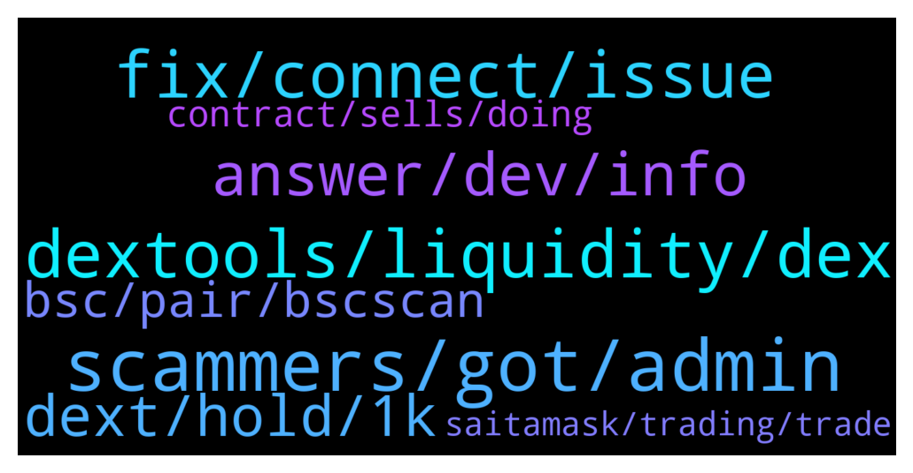

# **@DEXToolsCommunity**
 ## Analysis for **2022-01-09** - **2022-01-11**.

---

## 📊 **Basic Stats**

**n_messages_sent**: 264

---

---

## 🔝 **Top keywords and related messages**

1. **scammers, got, admin**

    @creatstep --- *Guys, there are so much scammers out there who trying to pretend you . My gosh 🤦‍♂️* **--->** [TG Discussion](https://t.me/DEXToolsCommunity/323599)

    @CryptoCrumbs --- *Got a few dms now from a couple people.* **--->** [TG Discussion](https://t.me/DEXToolsCommunity/323757)

    @duehzk_ndbb_Crejd --- *I’ve got heaps of admin messages* **--->** [TG Discussion](https://t.me/DEXToolsCommunity/323379)

    @FredericDEXT --- *Dm @guillermorodriguez78 he is in charge of ads.* **--->** [TG Discussion](https://t.me/DEXToolsCommunity/323594)

    @creatstep --- *Could you check DM? I hope its not too late :)* **--->** [TG Discussion](https://t.me/DEXToolsCommunity/323593)

    @tdm516 --- *@stanes are you a mod that can assist?* **--->** [TG Discussion](https://t.me/DEXToolsCommunity/323050)

2. **dextools, liquidity, dex**

    @creatstep --- *Who should I dm to get promoted on dextools?* **--->** [TG Discussion](https://t.me/DEXToolsCommunity/323568)

    @bonetky --- *Is there any issue in Dextools browser UI? Does not load for me* **--->** [TG Discussion](https://t.me/DEXToolsCommunity/323236)

    @bonetky --- *But Dextools runs very well always, todays was an exception* **--->** [TG Discussion](https://t.me/DEXToolsCommunity/323268)

    @bastardganpunk --- *For more info about the dextools functionality you can watch the video https://www.youtube.com/watch?v=WFQRJUnPwH8* **--->** [TG Discussion](https://t.me/DEXToolsCommunity/323788)

    @bastardganpunk --- *Check the video for learning how to use dextools 🙂 https://www.youtube.com/watch?v=WFQRJUnPwH8* **--->** [TG Discussion](https://t.me/DEXToolsCommunity/323497)

    @bastardganpunk --- *Thank you! If you want to learn more about how to use it, feel free to watch the video which explains the dextools app https://www.youtube.com/watch?v=WFQRJUnPwH8* **--->** [TG Discussion](https://t.me/DEXToolsCommunity/324088)

3. **fix, connect, issue**

    @bonetky --- *Okay the solution was clear cookies and site data* **--->** [TG Discussion](https://t.me/DEXToolsCommunity/323249)

    @bonetky --- *Okay, because does not load since a few hours. I can load the rest of webpages* **--->** [TG Discussion](https://t.me/DEXToolsCommunity/323246)

    @napascual --- *Nice, we're looking into that issue closely, we will be changing some cache policies soon to fix that* **--->** [TG Discussion](https://t.me/DEXToolsCommunity/323269)

    @napascual --- *First try hard refreshing, no need to clear site data (we don't use cookies). Its usually requested to browsers ignoring web worker updates, thus not forcing a resources refresh* **--->** [TG Discussion](https://t.me/DEXToolsCommunity/323254)

    @H0nKl3R --- *Just an FYI this issue where the info icons go away is back for me. It worked fine yesterday now they are gone again* **--->** [TG Discussion](https://t.me/DEXToolsCommunity/323002)

    @napascual --- *Could you try clearing cache 🙏* **--->** [TG Discussion](https://t.me/DEXToolsCommunity/323522)

4. **answer, dev, info**

    @Aloys_93 --- *I suggest making that more clearer on website though, if info is there, couldn't find it* **--->** [TG Discussion](https://t.me/DEXToolsCommunity/323200)

    @bonetky --- *Oh great, but I really don't know, perhaps it is only on my side* **--->** [TG Discussion](https://t.me/DEXToolsCommunity/323270)

    @cactusjimm --- *Hi, did the dev's come back on this one?* **--->** [TG Discussion](https://t.me/DEXToolsCommunity/323774)

    @FredericDEXT --- *Also in the main website https://www.dextools.io/#chooseyourplan* **--->** [TG Discussion](https://t.me/DEXToolsCommunity/323591)

    @CaesarCrypto --- *o, that was fast, thank you* **--->** [TG Discussion](https://t.me/DEXToolsCommunity/323096)

    @FredericDEXT --- *Thanks for the info, that helps a lot* **--->** [TG Discussion](https://t.me/DEXToolsCommunity/323291)

5. **dext, hold, 1k**

    @zhengshui1977 --- *I don't have to pay a monthly fee for holding 1000 dexts, does that mean? thanks* **--->** [TG Discussion](https://t.me/DEXToolsCommunity/323438)

    @zhengshui1977 --- *What are the requirements for a standard member now? The homepage says to pay $100 in DEXT/monthly subscription, -or -1,000 DEXT/hold. It says yes in the app 1. Hold 1.000 DEXT in the wallet 2 - Transfer 278 DEXT from your current wallet to 0x469d342e4f3d9ffbedca2e2ca8ab268a6fe973c3* **--->** [TG Discussion](https://t.me/DEXToolsCommunity/323436)

    @Aloys_93 --- *Do I need to hold 1000 DEXT on eth and bsc if I want to track my wallet on both chains ?* **--->** [TG Discussion](https://t.me/DEXToolsCommunity/323196)

    @zhengshui1977 --- *I already hold 1010 DEXT but I'm still on the free plan, what else do I need to do?* **--->** [TG Discussion](https://t.me/DEXToolsCommunity/323452)

    @zhengshui1977 --- *OK, thanks. This tool is pretty easy to use. If I only need to hold 1000, I am willing to buy it. I probably wouldn't consider it if it had to be paid monthly, thanks for the help* **--->** [TG Discussion](https://t.me/DEXToolsCommunity/323441)

    @AlinCZ --- *guys do i need to do something else beside holding more than 1k DEXT tokens in my wallet to get the benefits of the Standard tier?  because i have more than 1k in my wallet but i still have only 10 favorite pairs* **--->** [TG Discussion](https://t.me/DEXToolsCommunity/323316)

6. **bsc, pair, bscscan**

    @Dragonhunter9 --- *can someone tell me how to increase the 31pt sections to 99?* **--->** [TG Discussion](https://t.me/DEXToolsCommunity/323444)

    @bastardganpunk --- *You can check holders on etherscan and bscscan* **--->** [TG Discussion](https://t.me/DEXToolsCommunity/323728)

    @王多鱼 --- *It keeps coming up Pair not found* **--->** [TG Discussion](https://t.me/DEXToolsCommunity/323065)

    @gumbercules --- *Right now you can purchase for low fees on BSC* **--->** [TG Discussion](https://t.me/DEXToolsCommunity/324070)

    @napascual --- *Our bsc backend server has been restarted for maintenance and some pairs are updating* **--->** [TG Discussion](https://t.me/DEXToolsCommunity/323802)

    @Haski1988 --- *does that work even if we are not yet listed on cmc or cg? if so, can you give me a guide?  * **--->** [TG Discussion](https://t.me/DEXToolsCommunity/323814)

7. **contract, sells, doing**

    @mr_tapity_tap --- *Contract is doing 3 sells. A wallet initiated the sell. But the router or liquidity pool for rewards token is listed as maker.* **--->** [TG Discussion](https://t.me/DEXToolsCommunity/323678)

    @stanes --- *Same with this one, contract is doing 4 sells.* **--->** [TG Discussion](https://t.me/DEXToolsCommunity/323679)

    @stanes --- *Thanks, for so this one you can see that the contract is indeed doing 4 different sell for one tx.* **--->** [TG Discussion](https://t.me/DEXToolsCommunity/323676)

    @mr_tapity_tap --- *You need to check again. I've been involved in these for a while. I know how it works.  The number of transactions is fine. (Or the contracts issue not yours 😏)  But either showing contract at least or the right seller on one of those would be a great improvement to what seems to be slightly random at the minute!* **--->** [TG Discussion](https://t.me/DEXToolsCommunity/323682)

    @mr_tapity_tap --- *There are two with similar issue and similar contract* **--->** [TG Discussion](https://t.me/DEXToolsCommunity/323677)

    @JoeyDieleman --- *Please keep in mind to set the PAIR contract and not the token contract, 90% of the mistake* **--->** [TG Discussion](https://t.me/DEXToolsCommunity/323069)

