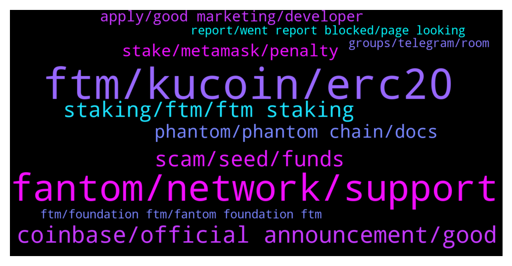

# **@Fantom_English**
 ## Analysis for **2022-01-10** - **2022-01-11**.

---

## 📊 **Basic Stats**

**n_messages_sent**: 232

---

---

## 🔝 **Top keywords and related messages**

1. **ftm, kucoin, erc20**

    @htm_phuog --- *I joined to receive FTM's airdrop but why didn't I receive the token* **--->** [TG Discussion](https://t.me/Fantom_English/627224)

    @Janevietani --- *you wanna withdraw from kucoin or wanna send from fwallet to kucoin/* **--->** [TG Discussion](https://t.me/Fantom_English/627045)

    @Crypto --- *Which platform has the best daily ROI for FTM? Or FTM-TOMB LP?* **--->** [TG Discussion](https://t.me/Fantom_English/627083)

    @Stockaddict --- *Ha guys I am trying to send ftm to kucoin but when choosing the eutherium network the button doesn't work. Anyone know why* **--->** [TG Discussion](https://t.me/Fantom_English/627011)

    @To_Dare_Is_To_Do --- *Hi , where can i find the roadmap of FTM?* **--->** [TG Discussion](https://t.me/Fantom_English/627204)

    @FRANKaround --- *question .   on kucoin when whithdraw to metamask  . they ask wich network ( ftm / erc20)  just to make sure its erc20 ?* **--->** [TG Discussion](https://t.me/Fantom_English/627420)

2. **fantom, network, support**

    @pajamasfreak --- *Not, it is the main network name of fantom* **--->** [TG Discussion](https://t.me/Fantom_English/627713)

    @Sleepycloud71 --- *Where do I buy Fantom for Fantom Network? Ethereum sucks.* **--->** [TG Discussion](https://t.me/Fantom_English/627629)

    @Janevietani --- *this is the place to use UST Fantom https://beets.fi/#/* **--->** [TG Discussion](https://t.me/Fantom_English/627958)

    @Stockaddict --- *????? That's the reason why I can't send my fantom to anywhere on eutherium???* **--->** [TG Discussion](https://t.me/Fantom_English/627019)

    @Math --- *The fantom network is slow for the moment ? Transaction take long time..* **--->** [TG Discussion](https://t.me/Fantom_English/627462)

    @Sleepycloud71 --- *I'm killing it there bro. It's a solid project. HEC is the reserve currency for the Fantom Network. I can't believe how fast it accrues. I'm finally earning two sHEC every day. Soon it will be a full token on every rebase.* **--->** [TG Discussion](https://t.me/Fantom_English/627653)

3. **coinbase, official announcement, good**

    @pastapeppe --- *As warned early we are driving south for a long time ...* **--->** [TG Discussion](https://t.me/Fantom_English/627336)

    @ardabb --- *coming soon coinbase or big news 🍀💰🔥* **--->** [TG Discussion](https://t.me/Fantom_English/627211)

    @pajamasfreak --- *you can follow our official announcement channel for latest updates* **--->** [TG Discussion](https://t.me/Fantom_English/627219)

    @Eli --- *No it’s not but just feel stupid about it* **--->** [TG Discussion](https://t.me/Fantom_English/627524)

    @Eli --- *Ohw man I feel so stupid 🤦‍♂️* **--->** [TG Discussion](https://t.me/Fantom_English/627484)

    @acryptosx --- *just curious when was it down? looks like at least 2-3 weeks?* **--->** [TG Discussion](https://t.me/Fantom_English/627116)

4. **staking, ftm, ftm staking**

    @topie22 --- *hey guys, just bridged to fantom and was thinking whats the best options for single asset FTM staking currently? thank u in advance 😊* **--->** [TG Discussion](https://t.me/Fantom_English/627412)

    @radityawaliulu --- *I looking for rules staking mint and comisions about them  I planned to staking 500ftm. any pdf should I read.* **--->** [TG Discussion](https://t.me/Fantom_English/627121)

    @retiredcoin --- *I wonder if "Current APR" is the best rate we can get out of FTM staking right now? On https://fantom.foundation/ftm-staking/ it's displaying 14.15%* **--->** [TG Discussion](https://t.me/Fantom_English/627433)

    @retiredcoin --- *any single sided yield farming available?* **--->** [TG Discussion](https://t.me/Fantom_English/627139)

    @radityawaliulu --- *any information about minimal ftm staking?* **--->** [TG Discussion](https://t.me/Fantom_English/627119)

    @pajamasfreak --- *10 is minimum, but you need some spare ftm to claim rewards and delegations.* **--->** [TG Discussion](https://t.me/Fantom_English/627120)

5. **scam, seed, funds**

    @Mcjig --- *[Forwarded from Mcjigs(will never dm first)] Common sense rules to help protect your crypto 1. Never ever share your seed phrase( thats like giving your password to access your funds) 2. Admins or support will never private message you first If you receive a private message with offers to help 99% of the time its a scam 3. Best security is to use a cold wallet(ledger,trezor) 4. There is no such thing as visiting a website to resync or validate your wallet 5. 100% of the time. Issues can be fixed. Seed phrase is never required 6. Always write down your seed phrase and store in a safe place and download your keystore If you dont have either of those. Then you will never be able to access your funds 7. There are NO Airdrops. If your asked to send funds with a promise of more funds in return* **--->** [TG Discussion](https://t.me/Fantom_English/627456)

    @Sleepycloud71 --- *This group is LOADED with scammers. It's the worst I've seen. So far, just today... 23 of them have contacted me* **--->** [TG Discussion](https://t.me/Fantom_English/627801)

    @J92AF --- *I like the dedication with which the scammers work. They have alt IDs here and msg with customer care ID whenever some guy asks for help here 😂 it's like a full day job monitoring messages here* **--->** [TG Discussion](https://t.me/Fantom_English/627437)

    @FRANKaround --- *have you got a customer service tg  that contact members to help  ?  seems that a famtom tg is trying to help or scam me !:)* **--->** [TG Discussion](https://t.me/Fantom_English/627404)

    @ourmaninamsterdam --- *Sorry to hear it, was also tempted because it all looked pretty legit, lots of normal discussions, 80K members, very active… Pretty sophisticated scam!* **--->** [TG Discussion](https://t.me/Fantom_English/627527)

    @J92AF --- *A lot of new users fall for it and give up their seed or private key* **--->** [TG Discussion](https://t.me/Fantom_English/627440)

6. **phantom, phantom chain, docs**

    @Drowsy17 --- *Be aware paint swap on phantom chain may have been compromised LP tokens are going missing all of mine have been stolen my whole entire list of coins has been drained to zero everything on the phantom chain is gone out of my meta mask so everybody be aware* **--->** [TG Discussion](https://t.me/Fantom_English/627146)

    @delete0000000000 --- *and of course there's zero information anywhere on how to correctly merge the snapshot with geth, or "opera" but i've done that before.  docs are enough if you've done this before but new people are gonna have to read the ETH docs or something to even have a clue* **--->** [TG Discussion](https://t.me/Fantom_English/626926)

    @Drowsy17 --- *Yes I've been doing this for years and I'm pretty experienced it was there on the 9th I went to bed and when I woke up this morning everything was gone and zeroed out on the phantom chain in my metamask wallet I went to paint swap farm and all of the LPs were cashed out and everything was exchanged for FTM and sent off* **--->** [TG Discussion](https://t.me/Fantom_English/627166)

    @Drowsy17 --- *All my stuff on the phantom chain was stolen I don't know how I've tracked it down but still don't know how it was done* **--->** [TG Discussion](https://t.me/Fantom_English/627161)

    @Drowsy17 --- *I got all the screenshots of the transactions from the blockchain* **--->** [TG Discussion](https://t.me/Fantom_English/627167)

    @delete0000000000 --- *the way the docs flow you skip right over that and on to "Run a read-only node" which then just abruptly stops instruction wise at download snapshot* **--->** [TG Discussion](https://t.me/Fantom_English/626925)

7. **stake, metamask, penalty**

    @Johnnyfantom --- *You can stake in the node through the fWallet or you can use Metamask in the ecosystem* **--->** [TG Discussion](https://t.me/Fantom_English/627419)

    @pajamasfreak --- *Yes it is. If you stake on that, you have options to let it still until you complete your stake period to avoid penalty or undelegate with penalty and restake to other node* **--->** [TG Discussion](https://t.me/Fantom_English/627109)

    @topie22 --- *thanks. and can i stake thru metamask?* **--->** [TG Discussion](https://t.me/Fantom_English/627418)

    @Chucky --- *Ok thank you. What's the site to stake?* **--->** [TG Discussion](https://t.me/Fantom_English/627706)

    @Johnnyfantom --- *You could single stake with one of the nodes or you could enter the ecosystem, please see both above* **--->** [TG Discussion](https://t.me/Fantom_English/627417)

    @FRANKaround --- *i would love to find a way to stake direct from kucoin ..;sucks that they dont offer it ...than moving the tokens on metamask ....but apparently there no other way* **--->** [TG Discussion](https://t.me/Fantom_English/627393)

8. **apply, good marketing, developer**

    @Janevietani --- *https://www.fantom.foundation/careers/ you can apply at here* **--->** [TG Discussion](https://t.me/Fantom_English/627406)

    @Janevietani --- *If you are good at marketing you can apply and help us* **--->** [TG Discussion](https://t.me/Fantom_English/627364)

    @King_Reginald --- *Are you guys need help with interface design? I'm experienced product designer* **--->** [TG Discussion](https://t.me/Fantom_English/627403)

    @King_Reginald --- *Thank you Jane. It's a good opportunity. I'll fill out a form* **--->** [TG Discussion](https://t.me/Fantom_English/627474)

    @plymak3r --- *I'm also interested and I will apply!* **--->** [TG Discussion](https://t.me/Fantom_English/627378)

    @BornEvilDope --- *Okay i apply but im inexperience so i wont be charging a penny 😇* **--->** [TG Discussion](https://t.me/Fantom_English/627370)

9. **ftm, foundation ftm, fantom foundation ftm**

    @ourmaninamsterdam --- *Is Fantom Foundation FTM Official🌠 a scam group? They have 80K+ members but they are supposedly offering a promotion where you send BNB and get back FTM with a bonus, seems very fishy!* **--->** [TG Discussion](https://t.me/Fantom_English/627497)

    @Eli --- *Guys there is ftm promo sale in  another ftm group. Do someone know is that true? It’s a scam or ?* **--->** [TG Discussion](https://t.me/Fantom_English/627449)

    @ardabb --- *He published a phenomenon with high followers for ftm, let's support him* **--->** [TG Discussion](https://t.me/Fantom_English/627988)

    @Catalin --- *Hi guys! Is this the official FTM crypto group?* **--->** [TG Discussion](https://t.me/Fantom_English/627551)

    @Eli --- *It’s caked Fantom Foundation FTM in telegram group ?* **--->** [TG Discussion](https://t.me/Fantom_English/627452)

10. **report, went report blocked, page looking**

    @ourmaninamsterdam --- *Interesting, I went back to report and they had already blocked me. Must be monitoring this group somehow!* **--->** [TG Discussion](https://t.me/Fantom_English/627502)

    @GelatoCakey --- *Perhaps you should mention to turn of the TG settings where people can add you to group chats etc* **--->** [TG Discussion](https://t.me/Fantom_English/627465)

    @JULIANYMR --- *Someone give me the page I've been looking for hours but here inside the group please I'm interested.* **--->** [TG Discussion](https://t.me/Fantom_English/627545)

    @SorbaTown --- *I tried to post something and it automatically removed it. I then left the group 😄* **--->** [TG Discussion](https://t.me/Fantom_English/627525)

    @ZarkNC --- *click the group info and report?* **--->** [TG Discussion](https://t.me/Fantom_English/627673)

