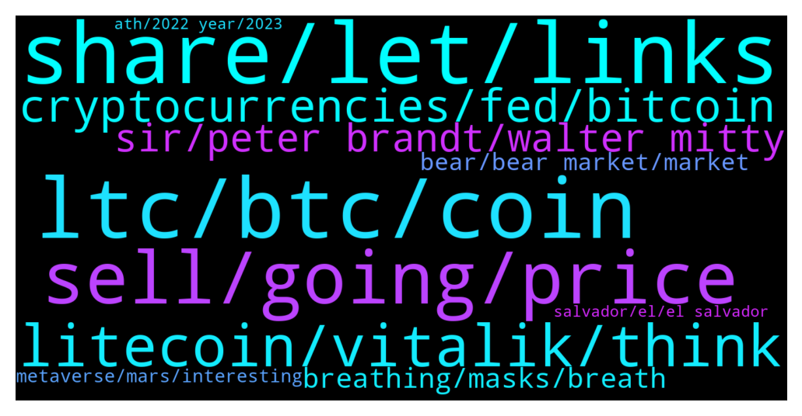

# **@Litecoin**
 ## Analysis for **2022-01-10** - **2022-01-11**.

---

## 📊 **Basic Stats**

**n_messages_sent**: 273

---

---

## 🔝 **Top keywords and related messages**

1. **share, let, links**

    @Bigbulz --- *Hello dear !!! am Maya 30 years old i was born in japan and moved to live in Italy nice to see you in this group . could i make a friend with you.Hope your reply for your time thanks* **--->** [TG Discussion](https://t.me/Litecoin/2044059)

    @WeaponSecs --- *Yeah, probably good we cant share links otherwise there would be all sorts of shit here* **--->** [TG Discussion](https://t.me/Litecoin/2044477)

    @WeaponSecs --- *You share what you want. I hold no power here* **--->** [TG Discussion](https://t.me/Litecoin/2044472)

    @RorschachTesst --- *Do you want my private keys?* **--->** [TG Discussion](https://t.me/Litecoin/2044538)

    @RorschachTesst --- *Farewell and see you in tomorrow's covid death statistic* **--->** [TG Discussion](https://t.me/Litecoin/2044422)

    @Forexjunkie --- *If my girl ever leave me then I'm taking yours* **--->** [TG Discussion](https://t.me/Litecoin/2043795)

2. **ltc, btc, coin**

    @jrx486 --- *1. Taproot  2. MWEB  3. Cycle lows LTCBTC pair 4. USD pair near 4 year support 5. Omnitlite Stable coin/ NFTs 6. El Salvador surprise  7. L7 miners* **--->** [TG Discussion](https://t.me/Litecoin/2043962)

    @Alberth29 --- *Ltc has not proyect like solana, eth, btc, or even some sh!tcoins tho* **--->** [TG Discussion](https://t.me/Litecoin/2044557)

    @John --- *LTC I can't believe it went that far down lol* **--->** [TG Discussion](https://t.me/Litecoin/2043905)

    @🔺ᬼ⃝ℝ🔺 --- *Hello friends why LTC always is cheap. While it's a oldest coin?  Many coins are expensive but not LTC* **--->** [TG Discussion](https://t.me/Litecoin/2044525)

    @moonsie --- *The only catalyst LTC had for a run along with other coins just didn't happen.* **--->** [TG Discussion](https://t.me/Litecoin/2044118)

    @RorschachTesst --- *Also there's too much selling pressure on ltc from miners. Even my granny makes decent money off her l3+* **--->** [TG Discussion](https://t.me/Litecoin/2044568)

3. **sell, going, price**

    @moonsie --- *you confident we will ever see $400 again ?* **--->** [TG Discussion](https://t.me/Litecoin/2044235)

    @RorschachTesst --- *126$ happy new year! Foolish crap. We will forever oscillate between 100 and 180. Apart from being a payment medium we have no other utility. Newer chains for NFTs are being spawned all the time. Once enough L7s saturate the market even hobby miners won't be interested in holding this coin anymore. In short we are finished* **--->** [TG Discussion](https://t.me/Litecoin/2044045)

    @ck42069 --- *Sell it while u can they will increase interest rates 3 times this year* **--->** [TG Discussion](https://t.me/Litecoin/2043950)

    @Bigcfidolla --- *The red balls mean get ready to sell* **--->** [TG Discussion](https://t.me/Litecoin/2043761)

    @mike_m12 --- *Maybe devs can do something to make price go up* **--->** [TG Discussion](https://t.me/Litecoin/2043838)

    @ken_xmas --- *Can push price above $1000 for ever* **--->** [TG Discussion](https://t.me/Litecoin/2043964)

4. **litecoin, vitalik, think**

    @jw418 --- *Oh wow this group has 11K members  That’s less than some 500K market cap shitcoins I know about  Litecoin needs a developer’s newsfeed to say what they’re working on* **--->** [TG Discussion](https://t.me/Litecoin/2044071)

    @bake_Crypto --- *2021:  The Year of #Litecoin ATH! (suspended account » pic.twitter.com/Si2CUyCbmg )  — 𝐉𝐨𝐡𝐧𝐊𝐢𝐦𝐎𝐟𝐟𝐢𝐜𝐢𝐚𝐥 (@johnkim77) November 26, 2020  “I think 2021 will really be the year where I prove everybody wrong and I'll be humble about it, but I’ll make sure my kids are taken care of for the rest of their lives,’ he said. “I made my promise to the local community, the Litecoin investors, that I will not stop until we get back to an all-time high and Charlie is exonerated and then I may just disappear.”* **--->** [TG Discussion](https://t.me/Litecoin/2044190)

    @JohnTheApostle --- *Rich billionaire shorting Litecoin since 2017 and probably paying people to come fud here 🤡* **--->** [TG Discussion](https://t.me/Litecoin/2044561)

    @jrx486 --- *The actual reason is censored :(* **--->** [TG Discussion](https://t.me/Litecoin/2044124)

    @Macro5674 --- *Doge switching to POS soon think as they nowdays are vitalik puppies !* **--->** [TG Discussion](https://t.me/Litecoin/2044179)

    @jrx486 --- *There is no reason for Litecoin to stop existing. It’s one of the most adopted altcoins.* **--->** [TG Discussion](https://t.me/Litecoin/2044145)

5. **cryptocurrencies, fed, bitcoin**

    @gilyan1984 --- *Risk assets, including cryptocurrencies, will be more vulnerable if the Fed becomes more aggressive* **--->** [TG Discussion](https://t.me/Litecoin/2044078)

    @jrx486 --- *You must be new to crypto* **--->** [TG Discussion](https://t.me/Litecoin/2044347)

    @Jim --- *Tell me why bitcoin falls again?* **--->** [TG Discussion](https://t.me/Litecoin/2044074)

    @RorschachTesst --- *Look at companies versus crapto. Plenty of trillion $ companies. But in crypto the difference is shocking 1T then 500B then 100B and then 40B.* **--->** [TG Discussion](https://t.me/Litecoin/2044567)

    @K_arlso_n --- *Shitcoin ))) Not needed for crypto market...* **--->** [TG Discussion](https://t.me/Litecoin/2044096)

    @gilyan1984 --- *But even with volatile prices, the fundamentals of cryptocurrencies are stronger than ever, and in the long run, fundamentals will win.* **--->** [TG Discussion](https://t.me/Litecoin/2044087)

6. **sir, peter brandt, walter mitty**

    @ck42069 --- *Sir you were dumping with peter brandt* **--->** [TG Discussion](https://t.me/Litecoin/2044237)

    @ryanswright --- *Was I? Must have too drunk to remember* **--->** [TG Discussion](https://t.me/Litecoin/2044244)

    @moonsie --- *how do you know? i cant find his account anymore* **--->** [TG Discussion](https://t.me/Litecoin/2044121)

    @ryanswright --- *no, in reference to uncle charlie* **--->** [TG Discussion](https://t.me/Litecoin/2044006)

    @WeaponSecs --- *Just looked up Walter Mitty. Gotcha, I agree $129% with you* **--->** [TG Discussion](https://t.me/Litecoin/2044464)

    @JT0086 --- *He sounds like a Walter Mitty* **--->** [TG Discussion](https://t.me/Litecoin/2044442)

7. **breathing, masks, breath**

    @Dr --- *i am fitter than you yet i can still not breath.  what you are breathing is just your exhaled carbon dioxide. which is why your brain is smooth lol* **--->** [TG Discussion](https://t.me/Litecoin/2044366)

    @WeaponSecs --- *Lose some weight, breathing will be a breeze under a mask.* **--->** [TG Discussion](https://t.me/Litecoin/2044361)

    @Forexjunkie --- *I don't want to go outside. I feel so close to the edge that I might take a nose dive* **--->** [TG Discussion](https://t.me/Litecoin/2043800)

    @Momoja --- *if masks didnt restrict the movement of air* **--->** [TG Discussion](https://t.me/Litecoin/2044368)

    @RorschachTesst --- *And why exactly are you wearing them all day long? Are you homeless? If people died breathing c02, cpr would kill rather than save lives* **--->** [TG Discussion](https://t.me/Litecoin/2044411)

    @RorschachTesst --- *You moron, you just said breathing using a mask causes you to breathe in c02* **--->** [TG Discussion](https://t.me/Litecoin/2044414)

8. **bear, bear market, market**

    @ck42069 --- *Its going to actual 0 as the supply dynamics are invalidated* **--->** [TG Discussion](https://t.me/Litecoin/2044345)

    @schaapje --- *yes but only once maybe twice as a retest and then only up, maybe 400 as a bottem in next bear market.* **--->** [TG Discussion](https://t.me/Litecoin/2044243)

    @ck42069 --- *its going dowwwwnnnn only it went from 300s to 6bucks today* **--->** [TG Discussion](https://t.me/Litecoin/2044140)

    @RorschachTesst --- *Forget the bear market, every coin is affected. I'm talking about BTCs run upto 67k, we were struggling because all the miners were cashing out. Now they're gonna just sit on their bags* **--->** [TG Discussion](https://t.me/Litecoin/2044571)

    @gilyan1984 --- *A decline across the asset class could be the start of a "mini bear market." New investors may exit and long-term holders will become major holders.* **--->** [TG Discussion](https://t.me/Litecoin/2044231)

    @Therealkeysopendoors --- *Stock to flow model was wrong* **--->** [TG Discussion](https://t.me/Litecoin/2043923)

9. **metaverse, mars, interesting**

    @Dr --- *and you will all be jerking off in metaverse with your googles on* **--->** [TG Discussion](https://t.me/Litecoin/2044395)

    @Momoja --- *its ok we have the metaverse to degenerate into* **--->** [TG Discussion](https://t.me/Litecoin/2044379)

    @moonsie --- *like arent we tortured enough? what are they waiting for* **--->** [TG Discussion](https://t.me/Litecoin/2044129)

    @mauri_maurizio --- *then it's a much more interesting place than the moon, believe me because there are really interesting and rebellious beings down there* **--->** [TG Discussion](https://t.me/Litecoin/2044103)

    @ryanswright --- *Me and Moonsie have some catching up to do* **--->** [TG Discussion](https://t.me/Litecoin/2044230)

    @Dr --- *sheep and the cattle need to obey faster so they can get on with their metaverse and ai controlled world* **--->** [TG Discussion](https://t.me/Litecoin/2044387)

10. **salvador, el, el salvador**

    @RabbitL0v3r --- *1. No one cares about technology 2. Cf 1 3. It can break both side 4. Support can break too 5. Very late to the party  6. El salvador is just a dictatorship who's stealing plebs btc and is also in red with their hodlin, paid with tax money 7. Expensive miners makin it even more harder to plebs entering the mining competition and concentrate the hashrate to very few hands* **--->** [TG Discussion](https://t.me/Litecoin/2043965)

    @runjune001 --- *is there going to be a communication from the foundation on what was being done in El Salvador?* **--->** [TG Discussion](https://t.me/Litecoin/2043791)

    @jrx486 --- *And John Kim is more bullish than ever on LTC because of whatever is happening in El Salvador* **--->** [TG Discussion](https://t.me/Litecoin/2044120)

    @Macro5674 --- *Atleast LTC foundation having fun . John Kim interviews @alangaustin director at @LTCFoundation about the big question of "WHY" was the team in El Salvador. 🤔🧐 https://t.co/23F54S4KTT* **--->** [TG Discussion](https://t.me/Litecoin/2044089)

    @jrx486 --- *he's still here, right in this room. and recently went to el salvador to save our asses. and buys ltc to pay for development.* **--->** [TG Discussion](https://t.me/Litecoin/2044305)

    @jrx486 --- *Could be a plane provided by El Salvador* **--->** [TG Discussion](https://t.me/Litecoin/2044131)

