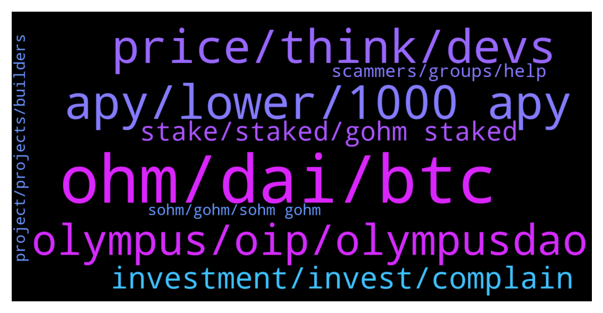

# **@OlympusTG**
 ## Analysis for **2022-01-10** - **2022-01-11**.

---

## 📊 **Basic Stats**

**n_messages_sent**: 1169

---

---

## 🔝 **Top keywords and related messages**

1. **ohm, dai, btc**

    @R --- *Fair question. I'm not an OHM expert by any means. From what I can gather OHM was created by some very smart people and has a decent shot at success. One big factor that I'm not sure about is the community. I don't see people building network/ youtube followings around OHM the way I do around some other successful projects. OHM could really benefit from that as it's future success depends on onboarding new users.* **--->** [TG Discussion](https://t.me/OlympusTG/147738)

    @jianghong --- *It can be increased to 2dai or higher. But everything needs to change* **--->** [TG Discussion](https://t.me/OlympusTG/146965)

    @Shane (4,4) (🍉,🍉) --- *OHM is down I think around 80% since November 1st....that is what bothers me* **--->** [TG Discussion](https://t.me/OlympusTG/145909)

    @StockyP --- *Been in ohm for 6 months but I'm pulling the plug today. The amount in gas fees I had to suck up just to migrate unstake and sell is testament to how much of a failure this is 😂 sorry lads* **--->** [TG Discussion](https://t.me/OlympusTG/147415)

    @mario_99990 --- *For example If btc raised by 40 %  Ohm will raise by 75%   Is it right or iam mistaken?* **--->** [TG Discussion](https://t.me/OlympusTG/145765)

    @Julian --- *The whole concept was to hold ohm and increase bag size but due to price dropping so fast holding has resulted in many holders funds getting wiped out by 70 - 80%* **--->** [TG Discussion](https://t.me/OlympusTG/146576)

2. **apy, lower, 1000 apy**

    @Ap0l1o --- *With the vote of OIP 18 and 63, it has been determined that in order to have longevity, after a certain amount of staked tokens, the APY will reduce to a certain level - at this moment, we are headed towards the 1k APY zone, but if a lot of people unstake, the APY will increase* **--->** [TG Discussion](https://t.me/OlympusTG/146560)

    @crypto_7an --- *OHM tanking like a sack of shi****t. Is the APY adjustment causing sell off?* **--->** [TG Discussion](https://t.me/OlympusTG/147283)

    @Ap0l1o --- *if a lot of Ohm is unstaked, the APY will increase, since the reward will be split to fewer accounts* **--->** [TG Discussion](https://t.me/OlympusTG/146554)

    @Freedom_Now1 --- *I see, so that’s still true then. I was concerned because I heard that that isn’t true anymore and that %APY will just continue to drop now. I don’t agree with that and that would also lessen people’s incentive to stake* **--->** [TG Discussion](https://t.me/OlympusTG/146557)

    @Ap0l1o --- *the idea is to make this project to go with as high apy as possible for as long as possible, without causing inflation... lowering apy is good for the price, which many here are so worried about* **--->** [TG Discussion](https://t.me/OlympusTG/146586)

    @vdt153 --- *well it was also said that the more people that unstake, the higher the apy. but it looks like that mechanism doesnt really protect so far. its all experimental* **--->** [TG Discussion](https://t.me/OlympusTG/146590)

3. **price, think, devs**

    @Great fudder --- *ok I need PRICE TO GO UP. I cant take this anymore. every day I am checking price and its dipping. every day, check price, bad price. I cant take this anymore, I have over invested, by a lot. it is what it is. but I need price to GO UP ALREADY. can devs DO SOMETHING* **--->** [TG Discussion](https://t.me/OlympusTG/146405)

    @Zhang --- *No , I just to say why they don’t adopt some methods to stop the price descending.* **--->** [TG Discussion](https://t.me/OlympusTG/145513)

    @Zhang --- *But a lot of things have no effect on price* **--->** [TG Discussion](https://t.me/OlympusTG/145519)

    @js11440 --- *whats going on with price? anything strange happened??? why such dump?* **--->** [TG Discussion](https://t.me/OlympusTG/146206)

    @CHOUChiehLUN --- *Why I saw the price decrease dramatically?* **--->** [TG Discussion](https://t.me/OlympusTG/145643)

    @volkanyilmaz400 --- *Do you think the price drop is just because of people with liq?* **--->** [TG Discussion](https://t.me/OlympusTG/146549)

4. **olympus, oip, olympusdao**

    @Lisa1000000 --- *Does it makes sense to start with Olympus now as the price is down? (I am new...)* **--->** [TG Discussion](https://t.me/OlympusTG/147107)

    @Freedom_Now1 --- *The focus should be on longevity of the protocol, not your short term greed. Olympus Dao has the potential to be great, we don’t want it endangered just because of your greed. There are greedy people everywhere, but not a lot of Olympus DAOs everwhere* **--->** [TG Discussion](https://t.me/OlympusTG/147015)

    @Winter_Chemistry --- *Can’t disagree. With Olympus u will win for sure.  Don’t bet against Olympus lol* **--->** [TG Discussion](https://t.me/OlympusTG/146035)

    @Bryan --- *I bought Olympus on my trust wallet, I don’t see the balance!* **--->** [TG Discussion](https://t.me/OlympusTG/147681)

    @God_bless_1 --- *Sir, where can I check out olympus investors? I didn't see anything on the website.* **--->** [TG Discussion](https://t.me/OlympusTG/146328)

    @Franck --- *95% vote for it but I am 3 week new on Olympus and without incisive of APY I want to understand why the price is Down 80% and people find it wise to lower APY in the meantime .* **--->** [TG Discussion](https://t.me/OlympusTG/145466)

5. **investment, invest, complain**

    @mikhail --- *😂😂😂😂😂😂😂😂😂😂😂😂😂 thank God not that we need investors that don’t understand the concept or the cycle* **--->** [TG Discussion](https://t.me/OlympusTG/146168)

    @Zhang --- *A lot of investors feel sad* **--->** [TG Discussion](https://t.me/OlympusTG/145520)

    @PeterPi22 --- *Well, it was always a high risk investment guys. We gambled, we lost.* **--->** [TG Discussion](https://t.me/OlympusTG/146147)

    @The_Headmaster --- *Funny his bio says “investment is an art of knowledge” clearly lacks the knowledge part* **--->** [TG Discussion](https://t.me/OlympusTG/147151)

    @nfwaple --- *Did u not know risk and return?* **--->** [TG Discussion](https://t.me/OlympusTG/147166)

    @MrwanSamir --- *how i can invest 1000$ and how much i get in month* **--->** [TG Discussion](https://t.me/OlympusTG/145506)

6. **stake, staked, gohm staked**

    @Ap0l1o --- *You can stake it to gOhm, save on fees when you want to sell it, bridge it to other network* **--->** [TG Discussion](https://t.me/OlympusTG/146300)

    @Thomas --- *Most still use eth so then get confused by staking and then wrapping. So that's unattractive also for new buyers. Or can you just stake directly to gohm now on eth?* **--->** [TG Discussion](https://t.me/OlympusTG/147409)

    @theMagicUnicorn --- *the actual website(https://www.olympusdao.finance/), not the staking page* **--->** [TG Discussion](https://t.me/OlympusTG/145552)

    @Eli --- *Can someone tell if we can stake and bond at the same time using same coins? Comment sense says no you can't but crypto surprises so thought I'd ask* **--->** [TG Discussion](https://t.me/OlympusTG/145605)

    @nfwaple --- *Ohm v2 and stake on the website, or buy gohm directly. Gohm is already staked* **--->** [TG Discussion](https://t.me/OlympusTG/147162)

    @cdp279 --- *Hey mo. If you purchase gohm you will not need to stake it. It’s a wrapped staked version of ohm which you can also use to vote on proposals. It can also be bridged to other networks.* **--->** [TG Discussion](https://t.me/OlympusTG/145446)

7. **scammers, groups, help**

    @Ap0l1o --- *Hi, what can I help you with? Those in your DM’s are scammers btw.* **--->** [TG Discussion](https://t.me/OlympusTG/146329)

    @𝐩𝐫𝐨𝐦𝐨𝐭𝐞𝐫 bOy😼👿 --- *I'm a promoter.....i will provide you.members for your group,channel amd aubsc for your youtube and twitter....if you need dm me* **--->** [TG Discussion](https://t.me/OlympusTG/145595)

    @bhaddreamchaser --- *Admins should be active here to help right?* **--->** [TG Discussion](https://t.me/OlympusTG/146722)

    @JKSuleyman --- *🙏🙏 I'll send you DM please. I'm marketing director of a project from Japan.* **--->** [TG Discussion](https://t.me/OlympusTG/147670)

    @Ninihills --- *Sorry can you private DM me ti help ?* **--->** [TG Discussion](https://t.me/OlympusTG/146452)

    @Crypto --- *So if I meet troubles , who should I contact* **--->** [TG Discussion](https://t.me/OlympusTG/147261)

8. **sohm, gohm, sohm gohm**

    @crypto1Q --- *Got you, just trying to figure out which one is better. I’ll go for gOHM, thanks once again* **--->** [TG Discussion](https://t.me/OlympusTG/147620)

    @mario_99990 --- *What is ath of gohm ?* **--->** [TG Discussion](https://t.me/OlympusTG/145751)

    @Alex --- *ok, is the value of my sohm = gohm?* **--->** [TG Discussion](https://t.me/OlympusTG/147382)

    @Ap0l1o --- *It depends, but yeah, gOhm is sOhm on steroids. You can bridge it to other chains but also vote with it.* **--->** [TG Discussion](https://t.me/OlympusTG/146297)

    @JKSuleyman --- *v2, and I hold my gOHM* **--->** [TG Discussion](https://t.me/OlympusTG/147640)

    @Ap0l1o --- *Nope, gOhm is ready to go* **--->** [TG Discussion](https://t.me/OlympusTG/146268)

