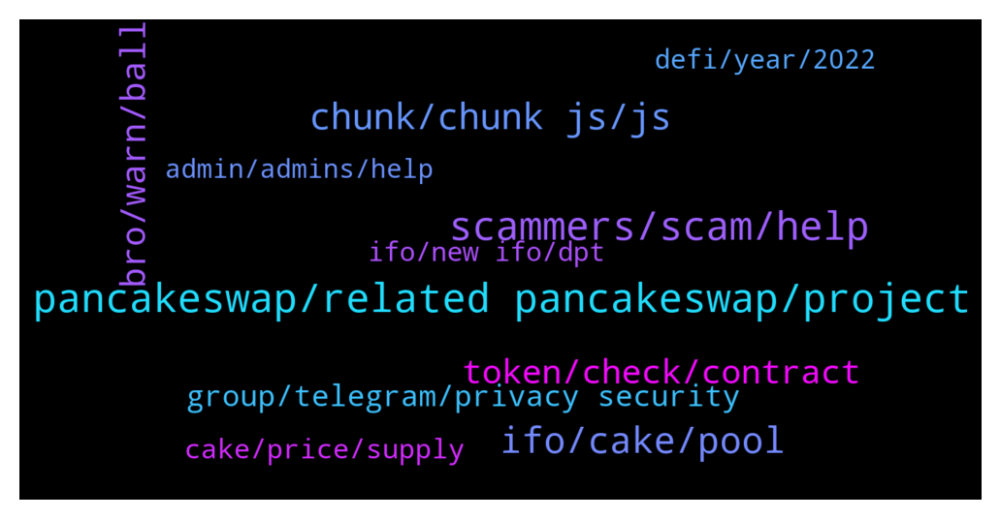

# **@PancakeSwap**
 ## Analysis for **2022-01-10** - **2022-01-11**.

---

## 📊 **Basic Stats**

**n_messages_sent**: 1311

---

---

## 🔝 **Top keywords and related messages**

1. **pancakeswap, related pancakeswap, project**

    @w17843 --- *can some of you guys go to pancakeswap(dot)finance/prediction and report what you see* **--->** [TG Discussion](https://t.me/PancakeSwap/2261367)

    @CakeCompounder --- *So you scammed and you are trying to blame PancakeSwap?* **--->** [TG Discussion](https://t.me/PancakeSwap/2261730)

    @REVFINANCE --- *We mistakenly sent one of our tokens to PancakeSwap. Now buying and selling tokens is like a robot. How can I stop this?* **--->** [TG Discussion](https://t.me/PancakeSwap/2263206)

    @ManBlyat --- *same answer, the token dev say i need ask pancakeswap 🥲🤣* **--->** [TG Discussion](https://t.me/PancakeSwap/2262181)

    @CakeCompounder --- *Pancakeswap isn’t the place to be asking for tips/advice on other platforms.   You need to do that research outside of this group.   You wouldn’t walk into Lamborghini and ask the sales person which BMW you should buy 😉* **--->** [TG Discussion](https://t.me/PancakeSwap/2258964)

    @mohsen --- *Maybe developers are preparing Pancakeswap for Limit orders for next couple of days... 😁🔥* **--->** [TG Discussion](https://t.me/PancakeSwap/2259024)

2. **scammers, scam, help**

    @Astralbaby --- *Any admins? Need help with a transaction (scammers don’t respond)* **--->** [TG Discussion](https://t.me/PancakeSwap/2263701)

    @TOOLSCUBE --- *Pakistan’s Investigation Agency Contacts Binance About $100M Scam https://www.coindesk.com/policy/2022/01/10/pakistans-investigation-agency-contacts-binance-about-100m-scam/* **--->** [TG Discussion](https://t.me/PancakeSwap/2262563)

    @VCharLess --- *Dude people getting scammed as of right now..jeeez* **--->** [TG Discussion](https://t.me/PancakeSwap/2264049)

    @daviBrandaoo --- *"I got scammed by a lady today, can someone please help me getting things easier"* **--->** [TG Discussion](https://t.me/PancakeSwap/2262116)

    @Dockters --- *send me smart contract, i hope its not scam tokeb* **--->** [TG Discussion](https://t.me/PancakeSwap/2261632)

    @Slavi --- *Can someone help me with scam* **--->** [TG Discussion](https://t.me/PancakeSwap/2260624)

3. **ifo, cake, pool**

    @Frankjankjink --- *Chefs pls It's high time you make the requirements for IFO very strict, in order to reduce the number of participants. So that we can also have a meaningful IFO that is worth it.  1. Anyone without up to 1000points won't be able to participate in the IFO 2. You have to stake your cake for atleast 30days to be able to partake in the IFO 3. You must have atleast 3NFTs in your wallet to participate in the IFO. ETC.  These are samples on how to make the IFO strict. And It  definitely increase the price of cake* **--->** [TG Discussion](https://t.me/PancakeSwap/2260225)

    @Kunyayo --- *Guys I still can't stake my cake for the IFO I'm almost crying* **--->** [TG Discussion](https://t.me/PancakeSwap/2264099)

    @locodanny --- *Humm I never took cake from the ifo pool. I believe they are not counting the rewards, which is unfair since it's a new count* **--->** [TG Discussion](https://t.me/PancakeSwap/2263251)

    @Amiroo_93 --- *I wanted to know that if I take a 5-year cake deposit, I can withdraw it whenever I want or on a monthly basis?* **--->** [TG Discussion](https://t.me/PancakeSwap/2261744)

    @Frankjankjink --- *New participants can try and meet the requirements if they really want to partake in the IFO and become cake family* **--->** [TG Discussion](https://t.me/PancakeSwap/2260243)

    @TomorrowlandForLife --- *those are differents things You can have your CAKE in IFO Pool and create your profile You need to have 1,5 CAKE IN your wallet to pay for it* **--->** [TG Discussion](https://t.me/PancakeSwap/2258568)

4. **chunk, chunk js, js**

    @Ceddi200 --- *Clear cache and cookies and try again* **--->** [TG Discussion](https://t.me/PancakeSwap/2259144)

    @QV_zz --- *works fine, try clearing your cache/restarting* **--->** [TG Discussion](https://t.me/PancakeSwap/2260382)

    @gugoguy --- *Please fix your web page. Each time I open my laptop the pcs site is frozen. Not even a refresh is working. Have to close whole tab and reopen again. Very bad user experience.* **--->** [TG Discussion](https://t.me/PancakeSwap/2261137)

    @Kryptoknight69 --- *Hi i still can't make a profile on the last step. I cleared the cache and im using Firefox with metamask but still getting error. I appreciate any help as I've used a lot of bnb re trying the process* **--->** [TG Discussion](https://t.me/PancakeSwap/2260305)

    @Ceddi200 --- *Try clear cache and cookies and try again or change your browser* **--->** [TG Discussion](https://t.me/PancakeSwap/2260871)

    @HAITIENLK --- *clear cache and try again mate,* **--->** [TG Discussion](https://t.me/PancakeSwap/2260398)

5. **bro, warn, ball**

    @CakeCompounder --- *Please bro. You have written this 3 or 4 times today.* **--->** [TG Discussion](https://t.me/PancakeSwap/2260959)

    @TomorrowlandForLife --- *I know you're not complainig We're just having a conversation* **--->** [TG Discussion](https://t.me/PancakeSwap/2259355)

    @Ahlawat_AJ --- *I know, i message here to make everyone warn about it. I am not complaining to you.* **--->** [TG Discussion](https://t.me/PancakeSwap/2259354)

    @FutureStocks --- *@CryptoJack2018 can you please answer this?* **--->** [TG Discussion](https://t.me/PancakeSwap/2261409)

    @TomorrowlandForLife --- *is not possible to know since we don't have the magic ball* **--->** [TG Discussion](https://t.me/PancakeSwap/2261459)

    @najjaka --- *man i feel so sorry for you. I think you dont deserve it to happen to you* **--->** [TG Discussion](https://t.me/PancakeSwap/2261855)

6. **token, check, contract**

    @Ceddi200 --- *Here you can check whether the token you bought is a scam. Paste the smart contract address! 👇👇👇👇👇 https://honeypot.rugdoc.io/* **--->** [TG Discussion](https://t.me/PancakeSwap/2262725)

    @Ceddi200 --- *1. check contract, source code  2. check function 3. check Tax, fee 4. check website, social media, Group etc make sure they're Legit 5. check Dev / owner wallet History. 6 Check LP lock  buy smaller amount then try sell  And more. This can give you some ideas.  Here you can check whether the token you bought is a scam. Paste the smart contract address! 👇👇👇👇👇 https://honeypot.rugdoc.io/* **--->** [TG Discussion](https://t.me/PancakeSwap/2262510)

    @SecuestPcs --- *Here you can check whether the token you bought is a scam. Paste the smart contract address! 👇👇👇👇👇 https://honeypot.rugdoc.io/* **--->** [TG Discussion](https://t.me/PancakeSwap/2263850)

    @shoanaoahoan --- *Hello, do not be bored, I bought 100,000,000 million shibaprint tokens, and the money was deducted from my account, but the tokens were not in my wallet.* **--->** [TG Discussion](https://t.me/PancakeSwap/2259439)

    @HAITIENLK --- *you can provide 3 contract of token for us, to check.* **--->** [TG Discussion](https://t.me/PancakeSwap/2262763)

    @HAITIENLK --- *ask project of that token/ ask who told you buy that token bro.* **--->** [TG Discussion](https://t.me/PancakeSwap/2259966)

7. **group, telegram, privacy security**

    @CakeCompounder --- *What group is that? Because it isn’t this one!!* **--->** [TG Discussion](https://t.me/PancakeSwap/2261842)

    @Dimka070 --- *earlier there were more than 89k left on the telegram group of 100k* **--->** [TG Discussion](https://t.me/PancakeSwap/2259592)

    @Aosh1ma --- *How to protect your self against spam chat:   ❗️ Read Me So You Can Keep Safe❗️  📌 Please do the following in your Telegram app 📱  1️⃣ Go to: Settings 2️⃣ Select: Privacy and Security -> Groups 3️⃣ Select: Who can add me to group chats? -> My Contacts  🔓 This will protect you from scammers adding you to FAKE groups/chats 🔓  1️⃣ Go to: Settings 2️⃣ Privacy And Security 3️⃣ Phone Number : Nobody 4️⃣ Forwarded Message : Nobody 5️⃣ CALLS : Nobody  Thank you. Stay #SAFU.* **--->** [TG Discussion](https://t.me/PancakeSwap/2262327)

    @SecuestPcs --- *How to protect your self against spam chat:   ❗️ Read Me So You Can Keep Safe❗️  📌 Please do the following in your Telegram app 📱  1️⃣ Go to: Settings 2️⃣ Select: Privacy and Security -> Groups 3️⃣ Select: Who can add me to group chats? -> My Contacts  🔓 This will protect you from scammers adding you to FAKE groups/chats 🔓  1️⃣ Go to: Settings 2️⃣ Privacy And Security 3️⃣ Phone Number : Nobody 4️⃣ Forwarded Message : Nobody 5️⃣ CALLS : Nobody  Thank you. Stay #SAFU.* **--->** [TG Discussion](https://t.me/PancakeSwap/2263972)

    @vladpronin --- *You should create a personal telegram ID* **--->** [TG Discussion](https://t.me/PancakeSwap/2263706)

    @Ceddi200 --- *How to protect your self against spam chat:   ❗️ Read Me So You Can Keep Safe❗️  📌 Please do the following in your Telegram app 📱  1️⃣ Go to: Settings 2️⃣ Select: Privacy and Security -> Groups 3️⃣ Select: Who can add me to group chats? -> My Contacts  🔓 This will protect you from scammers adding you to FAKE groups/chats 🔓  1️⃣ Go to: Settings 2️⃣ Privacy And Security 3️⃣ Phone Number : Nobody 4️⃣ Forwarded Message : Nobody 5️⃣ CALLS : Nobody  Thank you. Stay #SAFU.* **--->** [TG Discussion](https://t.me/PancakeSwap/2262780)

8. **cake, price, supply**

    @TapaTapppp --- *Yes i just created my first metamask wallet. And someone said that cake is going to 100 dollars. I dont know if it is true or whether this project is legit or a scam. So i came to telegram to ask* **--->** [TG Discussion](https://t.me/PancakeSwap/2261778)

    @jimmy0099 --- *Yeah bro but when the whole market was up,Cake was stuck at 20$,now down to 10…… ath is 43/44$* **--->** [TG Discussion](https://t.me/PancakeSwap/2259397)

    @dksbd --- *Cakes value going to down day by day* **--->** [TG Discussion](https://t.me/PancakeSwap/2259752)

    @baby_planb --- *Every week around 10m cake supply more and they burn 6.5m and no more money coming to the cake so price slow go down down down like this they should bure more or add somthing to the exchange to money flw more to cake* **--->** [TG Discussion](https://t.me/PancakeSwap/2260411)

    @Salman --- *CAKE price is around 10.90$ and current total circulating supply is 257 Million. One  year ago when the price was around 40$ it had  total circulating supply of around 92 million CAKE.   The total circulating supply of CAKE has increased from around 92 m to 257m in roughly one year time frame. I also noticed that devs of pancake are constantly selling CAKE( which you can check on BSC scan that the top wallets are selling continuously) If the circulating supply was still same as of last year which was 92m then (current market cap 2.8 divided by total circulating supply 92m 2,800,000,000/92,000,000 = 30.43$ . In short if they wouldn’t had increased the circulating supply then the price would still be around 30$ today.   Good projects always burn the supply instead of increasing it and selling it.* **--->** [TG Discussion](https://t.me/PancakeSwap/2261686)

    @crytsy --- *What cake price, next btc 80k* **--->** [TG Discussion](https://t.me/PancakeSwap/2260984)

9. **defi, year, 2022**

    @BiasGoose --- *Those complaining about price action don’t get DeFi in 2022* **--->** [TG Discussion](https://t.me/PancakeSwap/2259403)

    @TomorrowlandForLife --- *People have to DYOR before buying and on DeFi you don't have where or Whom to claim* **--->** [TG Discussion](https://t.me/PancakeSwap/2259352)

    @WK19000 --- *No regulation so far as I know. I just wonder how it would affect Defi in general. I guess we have to wait until it comes* **--->** [TG Discussion](https://t.me/PancakeSwap/2259424)

    @WK19000 --- *Admin, one question. How are you preparing for future Defi regulation (in case it comes of course)?* **--->** [TG Discussion](https://t.me/PancakeSwap/2259417)

    @BiasGoose --- *Yup too obvious. DeFi will explode. It’s still so little in the market.* **--->** [TG Discussion](https://t.me/PancakeSwap/2259420)

    @vladpronin --- *Learn more about DeFi and DEX, and you’ll understand why u can’t get your funds back* **--->** [TG Discussion](https://t.me/PancakeSwap/2263987)

10. **ifo, new ifo, dpt**

    @yorusa12 --- *Why ifo not same in binance launchpad? 🥺* **--->** [TG Discussion](https://t.me/PancakeSwap/2263039)

    @KaGeRT --- *Why I see the IFO of DPT?* **--->** [TG Discussion](https://t.me/PancakeSwap/2263438)

    @vladpronin --- *All information about current IFO you can find here:  https://pancakeswap.finance/voting/proposal/QmVqxPQyAS5Spe3ab8kJPBaax6bGqjxtrxnsPQHE44HiAR* **--->** [TG Discussion](https://t.me/PancakeSwap/2263999)

    @TNrafi2109 --- *Any specific date, the ifo end?* **--->** [TG Discussion](https://t.me/PancakeSwap/2260378)

    @yohana4 --- *From the problem of non-transaction that existed in the previous ifo, I hope there is no for this ifo* **--->** [TG Discussion](https://t.me/PancakeSwap/2260405)

    @tissafissa --- *when will there be a new iFO* **--->** [TG Discussion](https://t.me/PancakeSwap/2261534)

