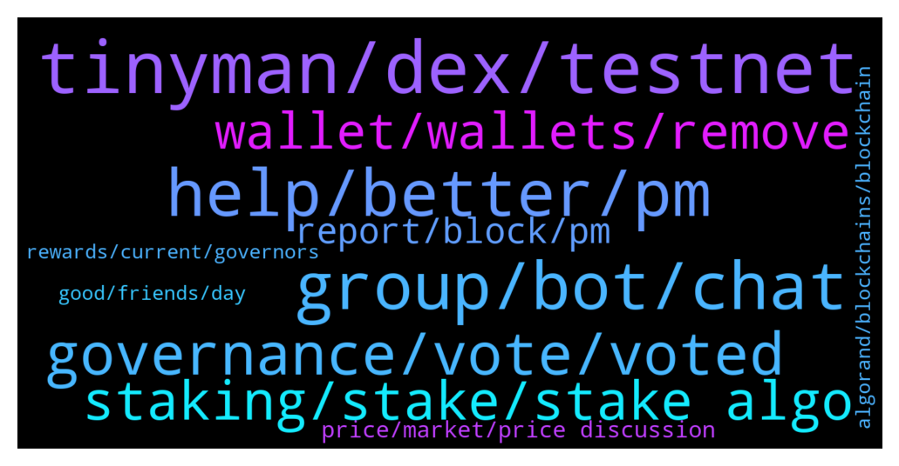

# **@algorand**
 ## Analysis for **2022-01-10** - **2022-01-11**.

---

## 📊 **Basic Stats**

**n_messages_sent**: 251

---

---

## 🔝 **Top keywords and related messages**

1. **tinyman, dex, testnet**

    @iamaturtle123 --- *Tinyman should be back up with new pools before the end of the month* **--->** [TG Discussion](https://t.me/algorand/331320)

    @Cryptoprofesional1 --- *Since Tinyman is hack, which other platform can I tread Algo* **--->** [TG Discussion](https://t.me/algorand/331298)

    @ragnaroks157 --- *tinyman has been compromise . hence, im looking for alternative DEX to trade . thanks* **--->** [TG Discussion](https://t.me/algorand/331318)

    @MackDenver --- *Hi there, There is already tinyman DEX and other DEXes will be available soon.* **--->** [TG Discussion](https://t.me/algorand/331602)

    @abovyanv --- *when? can you give me any links about it* **--->** [TG Discussion](https://t.me/algorand/331587)

    @Annonymousme --- *Please since tinyman has issues, where can i swap algorand asa* **--->** [TG Discussion](https://t.me/algorand/331567)

2. **group, bot, chat**

    @Todd_cr --- *Cos the site I started using is down* **--->** [TG Discussion](https://t.me/algorand/331410)

    @khunpon --- *They had bot, you need said something when bot ask to* **--->** [TG Discussion](https://t.me/algorand/331257)

    @ProjectZ66 --- *Got kicked out but joined like for 1min* **--->** [TG Discussion](https://t.me/algorand/331247)

    @littlemix55 --- *maybe the admin set it to invite only?* **--->** [TG Discussion](https://t.me/algorand/331565)

    @Shane --- *That chat is no longer accessible  message pops up when we click the link.* **--->** [TG Discussion](https://t.me/algorand/331558)

    @MackDenver --- *Hello Fidèle, You should head over to our Discord.* **--->** [TG Discussion](https://t.me/algorand/331385)

3. **help, better, pm**

    @NightAlgorand --- *Hi there, you can go here @algorand_price to have that discussion 🙂* **--->** [TG Discussion](https://t.me/algorand/331556)

    @NightAlgorand --- *Hi there, I didn't received any message from you yet 🙂* **--->** [TG Discussion](https://t.me/algorand/331288)

    @nadya12042001 --- *I’m having a problem messaging first, if you don’t mind please just text me then I’ll be able to reply* **--->** [TG Discussion](https://t.me/algorand/331233)

    @NightAlgorand --- *Hi there 🙂 Here you go https://t.me/AlgorandFoundationCN* **--->** [TG Discussion](https://t.me/algorand/331548)

    @nadya12042001 --- *Hi there, I want to speak something in private,* **--->** [TG Discussion](https://t.me/algorand/331230)

    @NightAlgorand --- *I understand now, you can try https://algorand.foundation/contact for better assistance* **--->** [TG Discussion](https://t.me/algorand/331450)

4. **governance, vote, voted**

    @MackDenver --- *You didn't but others voted for it.* **--->** [TG Discussion](https://t.me/algorand/331586)

    @Pablo_cast --- *Anyways first vote was a kind of test and I expect to more complex votes next rounds* **--->** [TG Discussion](https://t.me/algorand/331763)

    @Crypt0Playa --- *When I log into my wallet and go to governance all I see is a count down for voting session starts in.... 21 days blah blah. Nothing about what needs to be voted on* **--->** [TG Discussion](https://t.me/algorand/331495)

    @MackDenver --- *You can vote by committing your ALGO during the governance period, currently second governance period is ongoing.* **--->** [TG Discussion](https://t.me/algorand/331582)

    @abovyanv --- *I know, but what about this new governance changes... - i didn't vote about it* **--->** [TG Discussion](https://t.me/algorand/331583)

    @abovyanv --- *this is huge changes about emission and in decentralised systems every participant should vote. I see that no one voted about it. Governance just started* **--->** [TG Discussion](https://t.me/algorand/331777)

5. **staking, stake, stake algo**

    @mikamika1987 --- *Hi, where can we stake Algo for best rewards* **--->** [TG Discussion](https://t.me/algorand/331588)

    @alicancelik88 --- *GM guys, may i kindly ask, whats the best possible way to stake algo? Im doing it currently at Binance, but APYs are pretty low..* **--->** [TG Discussion](https://t.me/algorand/331554)

    @Hyuck_j --- *Now I open my algo wallet. Where can I stake algo?* **--->** [TG Discussion](https://t.me/algorand/331478)

    @KasyWillss --- *Just hold your algo in supported wallets like Atomicwallet. You will receive your staking rewards!  Algorand features an auto-stake mechanism IMO* **--->** [TG Discussion](https://t.me/algorand/331633)

    @MackDenver --- *Hi Mika, You don't have to stake it anywhere. Just hold it in official ALGO wallet, you will get staking rewards.* **--->** [TG Discussion](https://t.me/algorand/331591)

    @walkerranger --- *Hey is there a bridge from ERC20-Algo?* **--->** [TG Discussion](https://t.me/algorand/331638)

6. **wallet, wallets, remove**

    @KENVO749 --- *Here is my wallet address: VYYBORB7TB6RZV2C2XAL2LOZN3QLZBSEFAAVRO7GD7LGCF5SXXDCWTSEU4 I choose Option B* **--->** [TG Discussion](https://t.me/algorand/331668)

    @Happy --- *How to buy micro tesla in algo wallet?* **--->** [TG Discussion](https://t.me/algorand/331512)

    @la_c0sa_n0stra --- *How to setup and Roland wallet* **--->** [TG Discussion](https://t.me/algorand/331476)

    @mioumitsou --- *What other wallets are supported and have a web app?* **--->** [TG Discussion](https://t.me/algorand/331634)

    @Discretionn --- *Be vigilant people "algorand official support" DM'ing advising synchronization of your wallet, delete and report asap* **--->** [TG Discussion](https://t.me/algorand/331490)

    @NightAlgorand --- *You just need to leave it in your wallet* **--->** [TG Discussion](https://t.me/algorand/331479)

7. **report, block, pm**

    @A_Striker2k20 --- *i send u the ss . dam he wants to scam me* **--->** [TG Discussion](https://t.me/algorand/331347)

    @ProjectZ66 --- *Oh I'm not allowed to send my bad* **--->** [TG Discussion](https://t.me/algorand/331293)

    @E --- *If someone writes "sir" or "mam", you should immediately report spam and block it :)* **--->** [TG Discussion](https://t.me/algorand/331542)

    @MackDenver --- *Yes, please report and block him.* **--->** [TG Discussion](https://t.me/algorand/331348)

    @khunpon --- *you can PM @NightAlgorand to report scammer in this group* **--->** [TG Discussion](https://t.me/algorand/331294)

    @NightAlgorand --- *Our support will never PM you first, please block and report if he did 🙂* **--->** [TG Discussion](https://t.me/algorand/331266)

8. **price, market, price discussion**

    @Great fudder --- *ok I need PRICE TO GO UP. I cant take this anymore. every day I am checking price and its dipping. every day, check price, bad price. I cant take this anymore, I have over invested, by a lot. it is what it is. but I need price to GO UP ALREADY. can devs DO SOMETHING* **--->** [TG Discussion](https://t.me/algorand/331216)

    @KAPIBAYSIDE --- *Who else prices compare if you don't mind me asking?* **--->** [TG Discussion](https://t.me/algorand/331483)

    @Althea --- *Bitcoin market is not good these days, will you continue to buy?* **--->** [TG Discussion](https://t.me/algorand/331674)

    @Live10101 --- *I think the market is unstable right now and trading is not recommended. I choose to buy and hold tokens to get a steady income every day. It is safer* **--->** [TG Discussion](https://t.me/algorand/331417)

    @Tanuj --- *Friends,  I have recently bought 3100 Algo. What should be the realistic price prediction if keeping long term like 2025* **--->** [TG Discussion](https://t.me/algorand/331613)

    @MackDenver --- *Hi Daniella,  Please join our price chat for price discussion:  @algorand_price* **--->** [TG Discussion](https://t.me/algorand/331571)

9. **algorand, blockchains, blockchain**

    @mcmaxims --- *If you have read all the papers about algorand you would know what is coming, I think* **--->** [TG Discussion](https://t.me/algorand/331775)

    @callq --- *So what can ALGO do for me that other blockchains can't?* **--->** [TG Discussion](https://t.me/algorand/331371)

    @Micstans --- *?? you didnt have algorand from what i can see* **--->** [TG Discussion](https://t.me/algorand/331670)

    @MackDenver --- *Please visit http://algorand.com/ to learn more about Algorand.* **--->** [TG Discussion](https://t.me/algorand/331411)

    @Luuk --- *There is an option C, sell your algorand.* **--->** [TG Discussion](https://t.me/algorand/331778)

    @teknomachine --- *Algorand would make a lot of sense when combined with the Proof of Identity protocol* **--->** [TG Discussion](https://t.me/algorand/331798)

10. **rewards, current, governors**

    @MackDenver --- *Hello Vladimir, Everything about the governance and governance related information is available in our website. Here is the details about the governance rewards system: https://algorand.foundation/news/algorand-governance-rewards-period-2* **--->** [TG Discussion](https://t.me/algorand/331577)

    @abovyanv --- *are there any links regarding community voting on the new reward system?* **--->** [TG Discussion](https://t.me/algorand/331581)

    @abovyanv --- *has a new kind of governance reward been adopted by online voting?* **--->** [TG Discussion](https://t.me/algorand/331575)

    @NightAlgorand --- *May I clarify what problem are you referring to? you can find details on governance rewards here https://algorand.foundation/news/algorand-governance-rewards-period-2* **--->** [TG Discussion](https://t.me/algorand/331434)

    @abovyanv --- *he rewards are distributed among the governors who vote and maintain the committed Algos in their wallet for the entire quarterly period  current system was without voting and holding quarterly* **--->** [TG Discussion](https://t.me/algorand/331770)

    @abovyanv --- *Option A: Keeping the current system. The Governance rewards amount for 2022 will be 282M Algos (70.5M per quarter) while maintaining the current simple locking mechanism: the rewards are distributed among the governors who vote and maintain the committed Algos in their wallet for the entire quarterly period. Governors failing to do so will lose their rewards, but will incur no further penalties.* **--->** [TG Discussion](https://t.me/algorand/331768)

