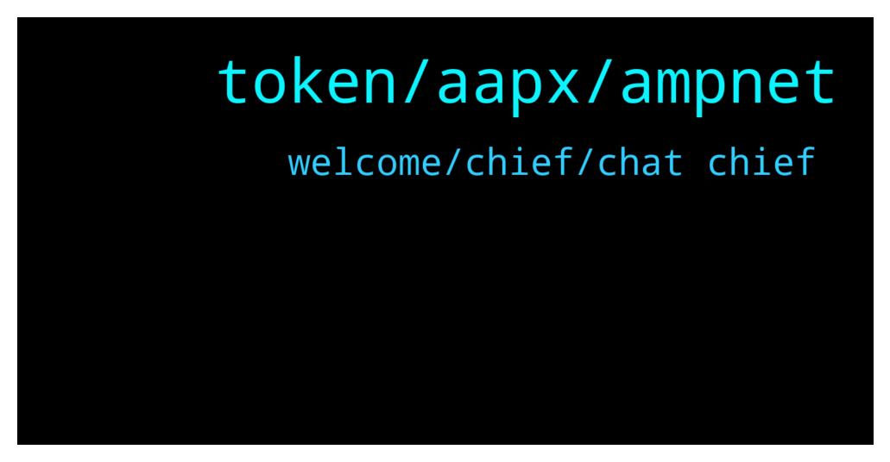

# **@ampnetapxchat**
 ## Analysis for **2022-01-06** - **2022-01-11**.

---

## 📊 **Basic Stats**

**n_messages_sent**: 171

---

---

## 🔝 **Top keywords and related messages**

1. **token, aapx, ampnet**

    @<UNK> --- *This is due to the fact that AAPX unlocks linearly and sites like CMC or CoinGecko have "unlock date" which we cannot use, cuz appx is unlocking every moment instead of a set date  But anyone can check circ. supply/max supply here -  https://claim.ampnet.io/app/dist/index.html* **--->** [TG Discussion](https://t.me/ampnetapxchat/36149)

    @North --- *I really hope so. There are no details on how it benefits AAPX holders yet though which is unfortunate, but at least we have a great partner and some exposure now* **--->** [TG Discussion](https://t.me/ampnetapxchat/36339)

    @E_Don --- *We need more pairs on Matic. Eth gas fee is crazy  Matic/AAPX. Eth/AAPX* **--->** [TG Discussion](https://t.me/ampnetapxchat/36085)

    @matejmz --- *I am wondering how you can become a main sponsor of a club with such a large following while being only a small start up with rather bad start. 🤔* **--->** [TG Discussion](https://t.me/ampnetapxchat/36078)

    @Bob_Fosse --- *That was basically a very long winded statement that reads, “ampnet did nothing wrong, it’s everyone else’s fault”. Just awful (and not surprising).* **--->** [TG Discussion](https://t.me/ampnetapxchat/36017)

    @<UNK> --- *Here is the aapx network address  https://polygonscan.com/token/0x3fc8bd9b0d8054cbdc174c4ed4b41a95d3c6a427* **--->** [TG Discussion](https://t.me/ampnetapxchat/36087)

2. **welcome, chief, chat chief**

    @Troop --- *Hi @jakovtradingmentor! Thanks for taking care of us! Welcome! 😊* **--->** [TG Discussion](https://t.me/ampnetapxchat/36423)

    @matejmz --- *@IncogSen you might like this too 😆* **--->** [TG Discussion](https://t.me/ampnetapxchat/36219)

    @tradingjo98 --- *Maybe you wanna tell us some things about you?* **--->** [TG Discussion](https://t.me/ampnetapxchat/36422)

    @mislavjavor --- *Yes - details still being panned out, don’t want to rush with announcement* **--->** [TG Discussion](https://t.me/ampnetapxchat/36388)

    @PFCBLic --- *Chat chief can you get some answers regarding this suggestions? They all seem to be valid* **--->** [TG Discussion](https://t.me/ampnetapxchat/36167)

    @AvanaLu --- *Very nice. Looks like things are really taking shape now. If the Vatreni project is a success many others will easily follow* **--->** [TG Discussion](https://t.me/ampnetapxchat/36445)

