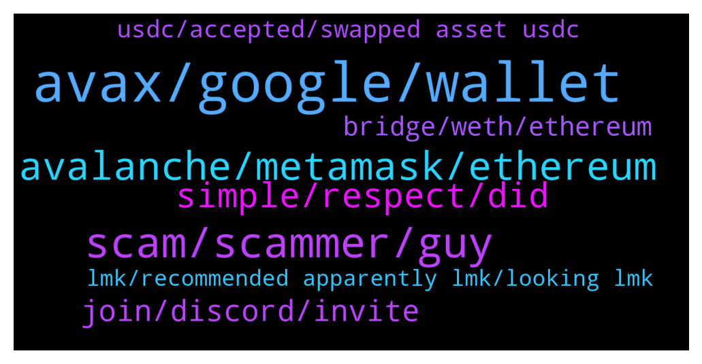

# **@avalancheavax**
 ## Analysis for **2022-01-10** - **2022-01-11**.

---

## 📊 **Basic Stats**

**n_messages_sent**: 162

---

---

## 🔝 **Top keywords and related messages**

1. **avax, google, wallet**

    @PatrickSutton --- *Ava Labs' John Wu joining CNBC at 2:40 p.m. ET (~1:25 from now) to talk crypto markets, development in the space, and what to watch for:  https://twitter.com/John1wu/status/1480603287841869825?s=20* **--->** [TG Discussion](https://t.me/avalancheavax/321451)

    @Alp --- *When you search as "Avax Wallet" on Google evrytime different scammer web pages appearing with Google Advertisement at the first line. They are imitating the official avax wallet page. If you enter the page, they are stealing your 24 mnemomic phase key.  How they can give the Google ads? Why dont the Avalance team talk with Google to prevent scamming from there. Lots of people are losing the keys and funds. Please be careful.* **--->** [TG Discussion](https://t.me/avalancheavax/321452)

    @Talux --- *Make sure you are on wallet.avax.network. Make sure the words you entered appear one per field in the fields above the text entry form field* **--->** [TG Discussion](https://t.me/avalancheavax/321202)

    @juancisneros1 --- *Is it normal to receive messages from AVAX support team? Or is it scam? I’m new here* **--->** [TG Discussion](https://t.me/avalancheavax/321593)

    @X_Sanx --- *What's the fastest way to flip my money on avax* **--->** [TG Discussion](https://t.me/avalancheavax/321469)

    @M --- *Whats the next project on Avalaunch?* **--->** [TG Discussion](https://t.me/avalancheavax/321564)

2. **scam, scammer, guy**

    @santaaaaaaaaaaaaaaaaaaaa --- *oh my god why so many scammers, please dont try to scam me in dm, im already broke and in debt! why did i receive 7 scammy dm in 3 minutes* **--->** [TG Discussion](https://t.me/avalancheavax/321624)

    @diov0 --- *anyone programs in solidity? i have a code that aparently is a bot, and i wondering what it really does, since feels like a scam* **--->** [TG Discussion](https://t.me/avalancheavax/321493)

    @Bullseyefomo77 --- *So many scammers contacted me lol* **--->** [TG Discussion](https://t.me/avalancheavax/321669)

    @leonliu888 --- *Who is the guy keeps asking people to DM him? He doesn’t have a role in this group* **--->** [TG Discussion](https://t.me/avalancheavax/321422)

    @huygvd --- *Some fool trying to act as support* **--->** [TG Discussion](https://t.me/avalancheavax/321606)

    @pupmkin_l --- *I don’t even understand admin do you ?* **--->** [TG Discussion](https://t.me/avalancheavax/321639)

3. **avalanche, metamask, ethereum**

    @Andy_oi1 --- *What's the average processing time for an ethereum token to be deployed on Avalanche? @don_wonton @Nicolilas_A  Seeing as Avalanche controls the bridge* **--->** [TG Discussion](https://t.me/avalancheavax/321228)

    @Andy_oi1 --- *Not that. I mean if there's a project on Ethereum, and you want to get it listed on Avalanche, you need the bridge and whitelisting from the Avalanche team because you guys control that process. How long does that usually take?* **--->** [TG Discussion](https://t.me/avalancheavax/321230)

    @wanderellaco --- *lol so many fake avalanche mods just messaged me* **--->** [TG Discussion](https://t.me/avalancheavax/321254)

    @oathtobarbatos --- *The Ethereum transaction should take 10 - 15 minutes. The Avalanche transaction takes a few seconds* **--->** [TG Discussion](https://t.me/avalancheavax/321229)

    @PatrickSutton --- *Video of John's segment on CNBC TV available here. A lot of Avalanche talk in this one:  https://www.cnbc.com/video/2022/01/10/inflow-of-cash-into-crypto-will-not-change-says-ava-labs-president.html* **--->** [TG Discussion](https://t.me/avalancheavax/321463)

    @oathtobarbatos --- *It cannot have any name of the Avalanche's employees by the way* **--->** [TG Discussion](https://t.me/avalancheavax/321266)

4. **simple, respect, did**

    @huygvd --- *Why don’t you just try it* **--->** [TG Discussion](https://t.me/avalancheavax/321641)

    @oathtobarbatos --- *Yeah, I did and, it's okay 😄* **--->** [TG Discussion](https://t.me/avalancheavax/321660)

    @oathtobarbatos --- *Please respect other people, it's okay to ask simple questions* **--->** [TG Discussion](https://t.me/avalancheavax/321654)

    @oathtobarbatos --- *Maybe helping other people here, you know* **--->** [TG Discussion](https://t.me/avalancheavax/321486)

    @jimmyjomlia --- *can u answer simple question ?* **--->** [TG Discussion](https://t.me/avalancheavax/321647)

    @huygvd --- *I respect him  But did you even read what he wrote* **--->** [TG Discussion](https://t.me/avalancheavax/321658)

5. **join, discord, invite**

    @wanderellaco --- *but PC works too. The official invite link doesn't work for me* **--->** [TG Discussion](https://t.me/avalancheavax/321250)

    @Nicolas_A --- *Try to logout and login again perhaps* **--->** [TG Discussion](https://t.me/avalancheavax/321675)

    @wanderellaco --- *It let me join once but it was on slow mode or something and I couldn't see anything in the server. Now can't join again, can't find it in my discord either* **--->** [TG Discussion](https://t.me/avalancheavax/321267)

    @wanderellaco --- *The official invite link says “invalid or expired”* **--->** [TG Discussion](https://t.me/avalancheavax/321243)

    @smtrmn --- *Solved dude thanks. Worked on mobile. So weird not open on chrome desktop but can open on mobile 😅* **--->** [TG Discussion](https://t.me/avalancheavax/321203)

    @oathtobarbatos --- *Are you trying to join using your phone or just your PC?* **--->** [TG Discussion](https://t.me/avalancheavax/321247)

6. **bridge, weth, ethereum**

    @Nicolas_A --- *Yes bridge.avax.network you will receive WETH* **--->** [TG Discussion](https://t.me/avalancheavax/321648)

    @jimmyjomlia --- *i mean bridge back to ethereum newtowtk* **--->** [TG Discussion](https://t.me/avalancheavax/321637)

    @jimmyjomlia --- *whats not clear..I want to bridge my weth.e from avlanche to ethereum. Is that possible?* **--->** [TG Discussion](https://t.me/avalancheavax/321640)

    @jimmyjomlia --- *can i bridge weth.e to ethereum?* **--->** [TG Discussion](https://t.me/avalancheavax/321635)

    @CRinvF --- *Hey, im new to Avax. What is the best/ cheapest way to get liquidity to the avax chain? I could bridge from erc, bsc or Polygon* **--->** [TG Discussion](https://t.me/avalancheavax/321206)

    @oathtobarbatos --- *Yeah, you can transfer the wrapped version of ETH (WETH) across the bridge, I guess* **--->** [TG Discussion](https://t.me/avalancheavax/321650)

7. **usdc, accepted, swapped asset usdc**

    @KLCrypto --- *Why would Avax introduce a native USDC that is not usable, and not even considered as USDC by CEX* **--->** [TG Discussion](https://t.me/avalancheavax/321592)

    @tibgram --- *Hello do you know if binance will support usdc.e?* **--->** [TG Discussion](https://t.me/avalancheavax/321390)

    @Nicolas_A --- *Crypto com uses USDC. It’s still quite new* **--->** [TG Discussion](https://t.me/avalancheavax/321597)

    @KLCrypto --- *I accidentally screwed by TraderJoe, swapped another asset to USDC and found it is not accepted anywhere, 🙁* **--->** [TG Discussion](https://t.me/avalancheavax/321591)

    @Nicolas_A --- *The integration with Circle / Tether was announced. Some exchange already support them* **--->** [TG Discussion](https://t.me/avalancheavax/321547)

    @KLCrypto --- *Hi Admin, @Nicolas_A how to convert USDC to USDC.e in Avalanche ?* **--->** [TG Discussion](https://t.me/avalancheavax/321588)

8. **lmk, recommended apparently lmk, looking lmk**

    @Nicolas_A --- *You can find them here https://t.me/avalancheavax/321541* **--->** [TG Discussion](https://t.me/avalancheavax/321554)

    @Talux --- *The first one is not to be recommended apparently: https://twitter.com/akivamcohen/status/1480023246825209857?s=21* **--->** [TG Discussion](https://t.me/avalancheavax/321521)

    @don_wonton --- *If you find someone LMK because I know so many people looking for one lol* **--->** [TG Discussion](https://t.me/avalancheavax/321498)

    @oathtobarbatos --- *If you need anything else, LmK* **--->** [TG Discussion](https://t.me/avalancheavax/321233)

    @oathtobarbatos --- *There is a popular one right now, it's called chikn or something like that* **--->** [TG Discussion](https://t.me/avalancheavax/321216)

