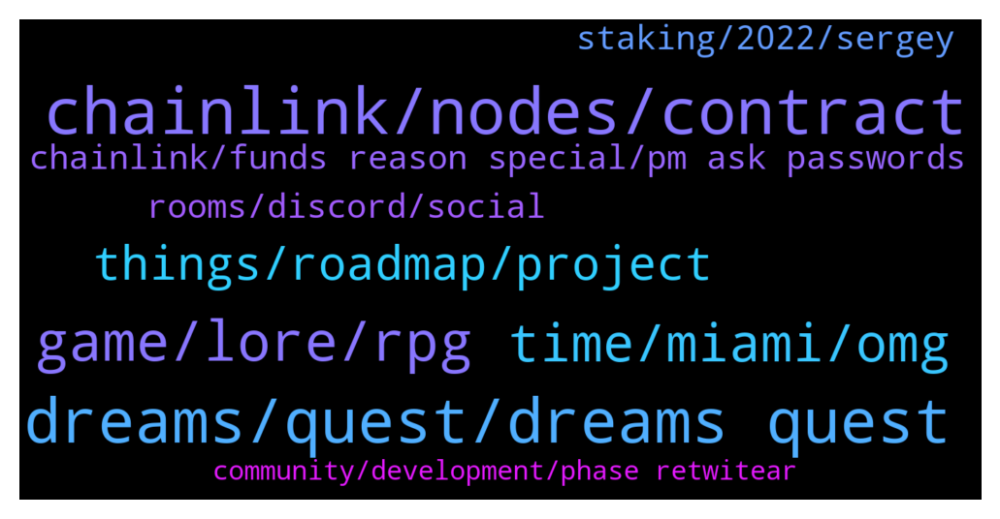

# **@chainlinkofficial**
 ## Analysis for **2022-01-10** - **2022-01-11**.

---

## 📊 **Basic Stats**

**n_messages_sent**: 162

---

---

## 🔝 **Top keywords and related messages**

1. **chainlink, nodes, contract**

    @RomainSwitzerland --- *Hi Lotto, You can find all official updates from Chainlink here* **--->** [TG Discussion](https://t.me/chainlinkofficial/362680)

    @r0derik --- *hi all, I'm trying to have a local setup for a contract that uses a chainlink price oracle. I can make it work using hardhat mainnet forking. But at the same time I want to have blocks to automine every 2 seconds, for The Graph integrations. Those two conflict. I would like to try my contract without mainnet forking. But i would need to check some way in my contract if the pricefeed address is not a contract, to use a fixed value. Any idea how I can set this up?* **--->** [TG Discussion](https://t.me/chainlinkofficial/362261)

    @prince99721 --- *Hey!  I am a dev looking to use Chainlink vrf. I am looking at the docs and the major chains are showing like fantom, arbitrum, harmony, etc   Will chainlink vrf work on Métis ?* **--->** [TG Discussion](https://t.me/chainlinkofficial/362334)

    @hexlotto --- *Hi people nice to meet you all, is there any official updates for Chainlink support for PulseChain?* **--->** [TG Discussion](https://t.me/chainlinkofficial/362675)

    @JuneOvat --- *Hello everyone, any clues on where I can get data on chainlink nodes presently running on Solana, or price feeds on Solana?* **--->** [TG Discussion](https://t.me/chainlinkofficial/362732)

    @Sylvarantt --- *They are indeed a separate entity from Chainlink Labs. LinkPool is a team of node operators and Chainlink ecosystem developers* **--->** [TG Discussion](https://t.me/chainlinkofficial/362651)

2. **dreams, quest, dreams quest**

    @SteveGoodCEO --- *and that the dreamsverse is our version of those dreams. You will see characters and ideas youve seen in your dreams. things are gonna look really familiar to you* **--->** [TG Discussion](https://t.me/chainlinkofficial/362862)

    @marcromeron --- *it was very interesting to know more about Dreams Quest.* **--->** [TG Discussion](https://t.me/chainlinkofficial/362921)

    @SteveGoodCEO --- *and the more you play, the more it will awaken you and you will start to remember things. its always ashame when we wake up from a dream and cant remember. but now you will start to remember as you are in the dreams verse, really a multi-verse of many cool places to explore and experience things you should know but cant remember* **--->** [TG Discussion](https://t.me/chainlinkofficial/362865)

    @marcromeron --- *Dreams Quest✨ OFFICIAL-LINKS: 🌐 Website: https://dreams.quest/  🟨 BinanceNFT Marketplace: https://www.binance.com/en/nft/shopWindow?reSale=&tradeType=&currency=&amountFrom=&amountTo=&keyword=&orderBy=list_time&orderType=-1&isBack=1&uid=11966331&order=list_time%40-1  🎞 Cinematic Teaser: https://www.youtube.com/watch?v=4pg_ukd_gDk  🐦 Twitter: https://twitter.com/DreamsQuestNFT  💬 TG Discussions: https://t.me/dreamsquesttavern  📢 TG Announcements: https://t.me/dreamsquestnftann  📺 Youtube: https://www.youtube.com/c/DreamsQuestOfficial/  📚 Facebook: https://www.facebook.com/DreamsQuestNFT  📸 Instagram: https://www.instagram.com/dreamsquestnft/  👽 Reddit: https://www.reddit.com/r/dreamsquestnft/  👾 Discord: https://discord.gg/dreamsquest  🗞 Medium: https://dreamsquestnft.medium.com/  🗂 Linkedin: https://www.linkedin.com/company/dreamsquest/  📜 LitePaper: https://overview.dreams.quest/  ✅ Audit: https://audits.solidgrp.io/dreams-quest/  Dreams Quest✨ LP-LINK:   :1781_knight: Dreams Quest Loyalty Program: https://dreams.quest/loyalty-program   Dreams Quest✨ MARKETS-LINKS:   🧤KuCoin: https://trade.kucoin.com/DREAMS-USDT   🥞 PanCake Swap: https://pancakeswap.finance/swap?outputCurrency=0x54523d5fb56803bac758e8b10b321748a77ae9e9* **--->** [TG Discussion](https://t.me/chainlinkofficial/362895)

    @marcromeron --- *Another one... What is the best way for someone watching today to get started with Dreams Quest?* **--->** [TG Discussion](https://t.me/chainlinkofficial/362820)

    @marcromeron --- *Could you explain in more detail what is DreamsVerse?* **--->** [TG Discussion](https://t.me/chainlinkofficial/362859)

3. **game, lore, rpg**

    @SteveGoodCEO --- *The lore (or all of the backstory and history and mythology) is just so exciting that I cant wait until we start releasing some of it* **--->** [TG Discussion](https://t.me/chainlinkofficial/362787)

    @SteveGoodCEO --- *And of course the main game is all in development too but this is a much longer process which is why mini games and lore are important* **--->** [TG Discussion](https://t.me/chainlinkofficial/362855)

    @SteveGoodCEO --- *First off we are building a mini-game right now which is part of that RPG video that we will share in a min* **--->** [TG Discussion](https://t.me/chainlinkofficial/362838)

    @SteveGoodCEO --- *so we will be pushing out all sorts of content over the next few months as the lore takes shape and really tells the whole story about the game, the artefacts, the magic etc* **--->** [TG Discussion](https://t.me/chainlinkofficial/362853)

    @SteveGoodCEO --- *and as you can imagine, building an RPG game in 3D is pretty intense* **--->** [TG Discussion](https://t.me/chainlinkofficial/362781)

    @SteveGoodCEO --- *and meanwhile we are also developing the game Lore. We have just brought 2 Hollywood producers onto our team. Yes the real deal* **--->** [TG Discussion](https://t.me/chainlinkofficial/362849)

4. **time, miami, omg**

    @SteveGoodCEO --- *OMG seriously its a pleasure. my time is best spent when i can speak to the community* **--->** [TG Discussion](https://t.me/chainlinkofficial/362922)

    @SteveGoodCEO --- *OMG me too! I am as anxious as our community!* **--->** [TG Discussion](https://t.me/chainlinkofficial/362792)

    @marcromeron --- *Since 2016! You're a real crypto OG!!* **--->** [TG Discussion](https://t.me/chainlinkofficial/362765)

    @SteveGoodCEO --- *Ive been in crypto since 2016. Before that I was working in Fintech in sales and marketing. Mostly working with the big banks. Honestly got boring after some time and realised that there had to be a better way to make things work in finance* **--->** [TG Discussion](https://t.me/chainlinkofficial/362764)

    @SteveGoodCEO --- *I want to say more about this other stuff but my CMO wouldnt be happy with me hahaha* **--->** [TG Discussion](https://t.me/chainlinkofficial/362909)

    @jamie_weintraub --- *Hey everyone, if you are in the Miami area come check out our meetup tomorrow with our developer advocate, Zak Ayesh! Great opportunity to connect with the local community!  https://www.eventbrite.com/e/what-is-chainlink-a-deep-dive-into-oracle-technology-tickets-235618269587?ref=estw* **--->** [TG Discussion](https://t.me/chainlinkofficial/362422)

5. **things, roadmap, project**

    @SteveGoodCEO --- *long roadmap, just have to deliver top quality. thats the aim* **--->** [TG Discussion](https://t.me/chainlinkofficial/362914)

    @SteveGoodCEO --- *Well that a great question about the roadmap. we have a bunch of things going on* **--->** [TG Discussion](https://t.me/chainlinkofficial/362835)

    @SteveGoodCEO --- *or our project which has just under 100K followers now* **--->** [TG Discussion](https://t.me/chainlinkofficial/362884)

    @marcromeron --- *What’s next on your project’s roadmap?* **--->** [TG Discussion](https://t.me/chainlinkofficial/362833)

    @marcromeron --- *As always, we’re interested on what makes your project special?* **--->** [TG Discussion](https://t.me/chainlinkofficial/362795)

    @marcromeron --- *Tell us about your project, how does it work?* **--->** [TG Discussion](https://t.me/chainlinkofficial/362779)

6. **chainlink, funds reason special, pm ask passwords**

    @Borosniper77 --- *Hi all gonna start looking into CL  anyone recommend the cheapest exchange for this and the best hardware wallet for CL.  Whats the cheapest network to send CL from off the exchange.* **--->** [TG Discussion](https://t.me/chainlinkofficial/362456)

    @nicoleadams11 --- *I need help with coins to buy* **--->** [TG Discussion](https://t.me/chainlinkofficial/361971)

    @Sylvarantt --- *‼️Remember: We will not PM you first. We will never ask for your passwords, keys, or funds for any reason. We don’t have special deals to offer you and there is not now nor will there ever be a Chainlink airdrop. See this article to learn how to avoid the most common scams.* **--->** [TG Discussion](https://t.me/chainlinkofficial/362273)

    @marcromeron --- *Welcome new members to the Official Chainlink Telegram Community!  Please review the pinned post for our community rules and resources.   Be aware that price/trading discussion is strictly prohibited.  New to Chainlink? Check out these resources:  - What is Chainlink? - Chainlink 2.0 Whitepaper Overview - The Community Factsheet - Explicit Staking in Chainlink 2.0  - 77 Smart Contract Use Cases Enabled By Chainlink  - The Ultimate Chainlink Deep Dive: Completing The God Protocols: A Comprehensive Overview of Chainlink in 2021   ‼️Remember: We will not PM you first. We will never ask for your passwords, keys, or funds for any reason. We don’t have special deals to offer you and there is not now nor will there ever be a Chainlink airdrop. See this article to learn how to avoid the most common scams.* **--->** [TG Discussion](https://t.me/chainlinkofficial/362233)

    @marcromeron --- *No price/market discussion is allowed here. Please read the pinned message for more info and rules. Be aware of scammers.* **--->** [TG Discussion](https://t.me/chainlinkofficial/361980)

    @Hadarii --- *Listing on a few voluminous crypto exchanges before the president minigame that would be good for us,one exchange is not enough. Gate ,mexc,bybit, gemini..  Thank you #Dreams💎* **--->** [TG Discussion](https://t.me/chainlinkofficial/362968)

7. **staking, 2022, sergey**

    @Eve --- *So you are saying to buy linkpool before staking happens* **--->** [TG Discussion](https://t.me/chainlinkofficial/362669)

    @Eve --- *So does that have anything to do with staking* **--->** [TG Discussion](https://t.me/chainlinkofficial/362667)

    @Nmadhan1234 --- *Where can we find staking reward details of chain link and when it is coming . Anyone* **--->** [TG Discussion](https://t.me/chainlinkofficial/362427)

    @aminpm --- *Hello when staking ?  I hold on ledger* **--->** [TG Discussion](https://t.me/chainlinkofficial/362436)

    @Both --- *Hi gUys, can someone please explain : I 'd like to farm Link on AAVE but it says APY 0% ..??? Could you please enlight me ? thanks* **--->** [TG Discussion](https://t.me/chainlinkofficial/362706)

    @Sylvarantt --- *Staking is not yet live. This article provides an overview of explicit staking from the Chainlink 2.0 Whitepaper. This presentation by Sergey discusses staking and the difference between implicit and explicit staking, while in this other presentation Sergey announced the team is planning to implement some form of staking in 2022.  As a rule the team doesn’t offer timelines for development targets. You can follow development progress via github.  Discusssion of yield farming is out of scope for this channel.* **--->** [TG Discussion](https://t.me/chainlinkofficial/362987)

8. **rooms, discord, social**

    @PolivodaTatiana --- *This channel is for focused techno discussion only* **--->** [TG Discussion](https://t.me/chainlinkofficial/362707)

    @奔跑吧 --- *Hello, is there any Chinese social group* **--->** [TG Discussion](https://t.me/chainlinkofficial/362267)

    @hailey_z --- *The AMA with DQ will be VC or text?* **--->** [TG Discussion](https://t.me/chainlinkofficial/362723)

    @Sylvarantt --- *China has a telegram group, it’s called @chainlinkfans (unofficial) and please also feel free to check out our Chinese communities (official) here:  https://blog.chain.link/chainlink-chinese-communities/* **--->** [TG Discussion](https://t.me/chainlinkofficial/362268)

    @Sylvarantt --- *Hi there, I highly recommend our Discord for deep technical questions https://chain.link/discord* **--->** [TG Discussion](https://t.me/chainlinkofficial/362265)

    @SteveGoodCEO --- *so help us break the 100K followers on twitter :)* **--->** [TG Discussion](https://t.me/chainlinkofficial/362885)

9. **community, development, phase retwitear**

    @marcromeron --- *https://twitter.com/marcromerona/status/1480486095141883904?s=20 Y retwitear este desde el Community* **--->** [TG Discussion](https://t.me/chainlinkofficial/362230)

    @marcromeron --- *I agree. Community is the most important part of a project.* **--->** [TG Discussion](https://t.me/chainlinkofficial/362926)

    @SteveGoodCEO --- *because without you there is no fun* **--->** [TG Discussion](https://t.me/chainlinkofficial/362923)

    @SteveGoodCEO --- *its early so we are trying to be as open with community as we can so people see our development progress* **--->** [TG Discussion](https://t.me/chainlinkofficial/362842)

    @SteveGoodCEO --- *Well we are still in the development phase* **--->** [TG Discussion](https://t.me/chainlinkofficial/362780)

    @SteveGoodCEO --- *transparency for all like to document our journey in public with everyone* **--->** [TG Discussion](https://t.me/chainlinkofficial/362844)

