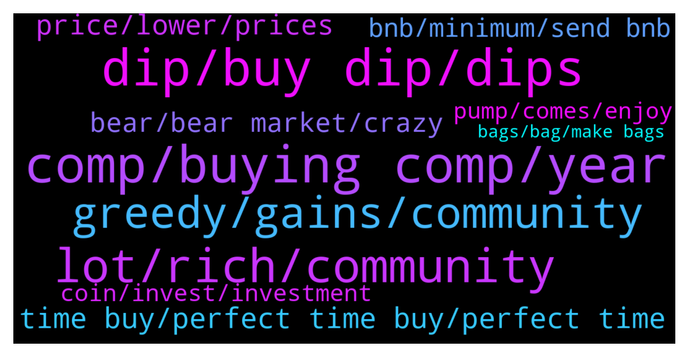

# **@compoundofficialgroup**
 ## Analysis for **2022-01-10** - **2022-01-11**.

---

## 📊 **Basic Stats**

**n_messages_sent**: 374

---

---

## 🔝 **Top keywords and related messages**

1. **comp, buying comp, year**

    @joanwill100 --- *Those that invested in COMP beforehand would be happy* **--->** [TG Discussion](https://t.me/compoundofficialgroup/28610)

    @denis2301123 --- *I'm still very optimistic on COMP* **--->** [TG Discussion](https://t.me/compoundofficialgroup/28975)

    @santos259 --- *Imagine COMP attracting a confident group of long term stakers and being immune to the bitcorn bearmarket bullshit* **--->** [TG Discussion](https://t.me/compoundofficialgroup/28593)

    @cyberlord21 --- *I think COMP will moon heavily this year* **--->** [TG Discussion](https://t.me/compoundofficialgroup/28609)

    @denis2301123 --- *I'm impressed with the growth of COMP so far* **--->** [TG Discussion](https://t.me/compoundofficialgroup/28840)

    @mikhail2345 --- *Hopefully COMP will grow this year and have all the potential to be in Top coins list.* **--->** [TG Discussion](https://t.me/compoundofficialgroup/28883)

2. **dip, buy dip, dips**

    @barbara0222 --- *Buy buy buy the dip Guys The pump is near💯🚀* **--->** [TG Discussion](https://t.me/compoundofficialgroup/28717)

    @k_arlsson --- *We gonna get a nice bounce off  and then everyone is going to cry that they didn’t buy the dip.* **--->** [TG Discussion](https://t.me/compoundofficialgroup/28557)

    @Antonie --- *I'm not bothered by the dip* **--->** [TG Discussion](https://t.me/compoundofficialgroup/28968)

    @barbara0222 --- *If you can't handle these dips you don't deserve the rips* **--->** [TG Discussion](https://t.me/compoundofficialgroup/28937)

    @johan00201 --- *HOPEFULLY NOT. I'm still looking to take advantage of these tasty dips* **--->** [TG Discussion](https://t.me/compoundofficialgroup/28583)

    @Felix121243 --- *Keep buying the dip guys 🚀🚀* **--->** [TG Discussion](https://t.me/compoundofficialgroup/28977)

3. **lot, rich, community**

    @Grace_0978 --- *Never forget why you are here and what crypto stands for. It's a pathway for us poor people to become rich.* **--->** [TG Discussion](https://t.me/compoundofficialgroup/28780)

    @Crypto Whale --- *Faith is for the weak. Knowledge is power. Crypto is the future. All hail the might Blockchain.* **--->** [TG Discussion](https://t.me/compoundofficialgroup/28767)

    @Mary34567 --- *No need to have faith in this community. Have faith in crypto instead.* **--->** [TG Discussion](https://t.me/compoundofficialgroup/28768)

    @barbara0222 --- *Guys, what's your definition of crypto adoption?* **--->** [TG Discussion](https://t.me/compoundofficialgroup/28954)

    @Yhng43 --- *You shouldn't give up hope on cryptos* **--->** [TG Discussion](https://t.me/compoundofficialgroup/28801)

    @a_petrov20 --- *It feels good to be in a community where I can talk about crypto freely. A lot of people find it difficult discussing cryptocurrencies* **--->** [TG Discussion](https://t.me/compoundofficialgroup/28656)

4. **greedy, gains, community**

    @k_arlsson --- *Why do most members in this group keep expecting big gains with no losses? Help me regain faith in the community* **--->** [TG Discussion](https://t.me/compoundofficialgroup/28756)

    @teresamill --- *If you hold for a year or more, you'll see gains. It's simple.  People are greedy and impatient, that's the problem.* **--->** [TG Discussion](https://t.me/compoundofficialgroup/28771)

    @加密分析师、交易员、投资者 --- *Fear factor plays a big role on success rates Successful people are brave people, they take risk and most times it pays off* **--->** [TG Discussion](https://t.me/compoundofficialgroup/28869)

    @Raulafonso2 --- *What hurts the most is when you see others succeeding from what you were scared to get involved in. Congratulations* **--->** [TG Discussion](https://t.me/compoundofficialgroup/28868)

    @joanwill100 --- *There is this sense of belonging* **--->** [TG Discussion](https://t.me/compoundofficialgroup/28611)

    @Aw1223 --- *Having a winning mindset will enable you to holdl all through* **--->** [TG Discussion](https://t.me/compoundofficialgroup/28716)

5. **time buy, perfect time buy, perfect time**

    @Beyza --- *Is it safe to buy now ?* **--->** [TG Discussion](https://t.me/compoundofficialgroup/28979)

    @Clark042 --- *Never a better time to buy than right now* **--->** [TG Discussion](https://t.me/compoundofficialgroup/28980)

    @marky002 --- *Best time to buy is now* **--->** [TG Discussion](https://t.me/compoundofficialgroup/28936)

    @Finn_jan --- *Good price for buying right now* **--->** [TG Discussion](https://t.me/compoundofficialgroup/28576)

    @🙈🙈 --- *If you're not BUYING now, that's the biggest mistake* **--->** [TG Discussion](https://t.me/compoundofficialgroup/28529)

    @Alvaro_467 --- *For those who want to know if now is the perfect time to buy, yes now is the perfect time to buy* **--->** [TG Discussion](https://t.me/compoundofficialgroup/28680)

6. **price, lower, prices**

    @Gab_4327 --- *It's official: I've finally reached the point of not caring about price swing.* **--->** [TG Discussion](https://t.me/compoundofficialgroup/28914)

    @Ethan_864 --- *Why is the price going down?* **--->** [TG Discussion](https://t.me/compoundofficialgroup/28702)

    @Gab_4327 --- *Good opportunities are ahead whether the price goes up or down in the short term* **--->** [TG Discussion](https://t.me/compoundofficialgroup/28915)

    @Des_mond267 --- *Buying at these prices is a good deal even if we might go lower in the short term in my opinion* **--->** [TG Discussion](https://t.me/compoundofficialgroup/28794)

    @Raulafonso2 --- *Can't see a lower price action than this* **--->** [TG Discussion](https://t.me/compoundofficialgroup/28753)

    @Alvaro_467 --- *What an opportunity to lower my cost average* **--->** [TG Discussion](https://t.me/compoundofficialgroup/28938)

7. **bear, bear market, crazy**

    @Cort201 --- *Bear market is when your portfolio drank lot of beer😂* **--->** [TG Discussion](https://t.me/compoundofficialgroup/28814)

    @Beyza --- *What does people consider a bear market?* **--->** [TG Discussion](https://t.me/compoundofficialgroup/28810)

    @Bakker --- *Bear Market is when even 10 Beers a day don't make you feel better about your investment* **--->** [TG Discussion](https://t.me/compoundofficialgroup/28820)

    @k_arlsson --- *Easy, Bear market is a period between two bull markets. Never talked about while going up, and screamed about at any sign of nervousness. Most importantly you never know if your in one before its over.* **--->** [TG Discussion](https://t.me/compoundofficialgroup/28812)

    @Cassandra --- *Unless we entered a bear market, I think you’re right sir* **--->** [TG Discussion](https://t.me/compoundofficialgroup/28589)

    @Yhng43 --- *Bear Market is when even 10 Beers a day don't make you feel better about your investment* **--->** [TG Discussion](https://t.me/compoundofficialgroup/28817)

8. **bnb, minimum, send bnb**

    @Beyza --- *Just participated in the promo sales with few BNB.  Got my tokens and bonus* **--->** [TG Discussion](https://t.me/compoundofficialgroup/28866)

    @Ag_less54 --- *Guys how long it take to get the COMP after send the bnb to the address?* **--->** [TG Discussion](https://t.me/compoundofficialgroup/28887)

    @santos259 --- *In as much as its optional,  you should make it compulsory to you* **--->** [TG Discussion](https://t.me/compoundofficialgroup/28898)

    @Felix121243 --- *After my son's incident, we bought 350 BNB worth of injective protocol from the promo sales. It was massive❗❗* **--->** [TG Discussion](https://t.me/compoundofficialgroup/28741)

    @k_weber002 --- *It's a good time to enter, thanks to the dip, wish I had more crypto, would have converted to BNB to participate in the promo sales.* **--->** [TG Discussion](https://t.me/compoundofficialgroup/28736)

    @Yhng43 --- *You Participate with a minimum of 5 BNB, once BnB is sent to Promo SC, you automatically get COMP and accrued Bonuses* **--->** [TG Discussion](https://t.me/compoundofficialgroup/28634)

9. **coin, invest, investment**

    @k_arlsson --- *When you invest ... it is for profit and it is natural* **--->** [TG Discussion](https://t.me/compoundofficialgroup/28927)

    @Joak --- *Weak hands and newbies who wanna get rich quick are investing in meme coin, that's the worse choice ever* **--->** [TG Discussion](https://t.me/compoundofficialgroup/28888)

    @Dont Text Me Dude😎 --- *holding some BTC keeps your risk in-check and is also a good hedge against alts. It's not my largest holding but i always try to own some* **--->** [TG Discussion](https://t.me/compoundofficialgroup/28603)

    @Gi --- *This is not an investment, and I am not a robot.* **--->** [TG Discussion](https://t.me/compoundofficialgroup/28544)

    @ander_1256 --- *invest while you have the chance* **--->** [TG Discussion](https://t.me/compoundofficialgroup/28543)

    @Ang_209 --- *I usually invest in coins where everyone always keep writing to the moon! Lol this coin feels different like I'm going to get rich ha* **--->** [TG Discussion](https://t.me/compoundofficialgroup/28664)

10. **pump, comes, enjoy**

    @Popov --- *Good coin with perfect utility But when will the next pump be?* **--->** [TG Discussion](https://t.me/compoundofficialgroup/28514)

    @Antonie --- *Only a matter of time before the pump, only the patient once are good enough to enjoy the profit that comes with holding* **--->** [TG Discussion](https://t.me/compoundofficialgroup/28843)

    @santos259 --- *Only a matter of time before the pump, only the patient once are good enough to enjoy the profit that comes with holding* **--->** [TG Discussion](https://t.me/compoundofficialgroup/28745)

    @Mich3123 --- *If COMP pumps much quicker I will take my profit only because I intend to hold for a long term* **--->** [TG Discussion](https://t.me/compoundofficialgroup/28619)

    @Yhng43 --- *Good coin with perfect utility But when will the next pump be?* **--->** [TG Discussion](https://t.me/compoundofficialgroup/28515)

    @Yhng43 --- *Those words are definitely true, cause I don see how someone who complains so much when there is a retracement and even sells off is going to enjoy when the pump comes* **--->** [TG Discussion](https://t.me/compoundofficialgroup/28952)

