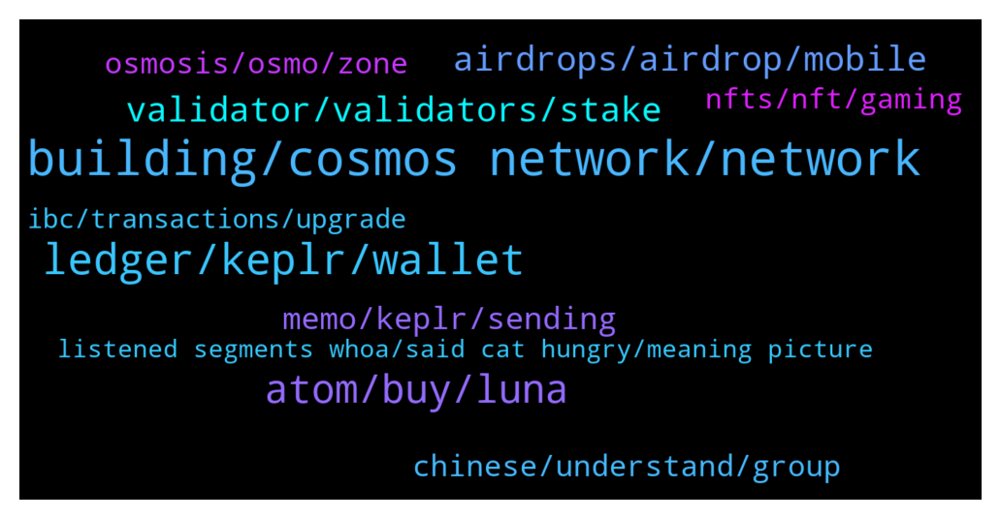

# **@cosmosproject**
 ## Analysis for **2022-01-10** - **2022-01-11**.

---

## 📊 **Basic Stats**

**n_messages_sent**: 301

---

---

## 🔝 **Top keywords and related messages**

1. **building, cosmos network, network**

    @👑AmirMohammad👑 --- *Hello How may I application for Modrating cosmos Persian community ?* **--->** [TG Discussion](https://t.me/cosmosproject/471937)

    @ZoltanAtom --- *There are 15+ entities employing over 300 core devs behind Cosmos and Cosmos Hub specifically with over 2000 devs in the broader ecosystem.  There is no such website which shows all the list of teams,core developers and others.  When you will start to spend some time with Cosmos and keep in touch with community, you get your all answers.* **--->** [TG Discussion](https://t.me/cosmosproject/472462)

    @winstonminiver --- *Hello here, I'm a journalist and I would like to ask some technical questions about Cosmos. Can someone help me ?* **--->** [TG Discussion](https://t.me/cosmosproject/472430)

    @P --- *Ok do cosmos give stacking rewards ?* **--->** [TG Discussion](https://t.me/cosmosproject/472211)

    @SamueleCioni --- *Is there a list of official cosmos network telegram channels?* **--->** [TG Discussion](https://t.me/cosmosproject/472514)

    @waynefong --- *Hi everyone,  the latest weekly ⚛ Cosmos ⚛ stats is here. 👇  🌎 https://twitter.com/kysenpool/status/1480668932474241028?s=21* **--->** [TG Discussion](https://t.me/cosmosproject/472083)

2. **ledger, keplr, wallet**

    @mill189 --- *@AtomJazz , i have atom staked on my local keplr wallet. Can i migrate them to ledger kepler wallet without unstaki g them ?* **--->** [TG Discussion](https://t.me/cosmosproject/471896)

    @RobertTHEwhale --- *Ok so I tried again. And now it shows up in keplr too!! Great stuff  Still doesn't show up on ledger live though so I can send it out to an exchange to sell some* **--->** [TG Discussion](https://t.me/cosmosproject/472304)

    @JCFishing --- *I tried to connect my ledger to kepler but it asked me to setup new username and password.  From my experience, I don't need to enter these info if using ledger.  thanks!* **--->** [TG Discussion](https://t.me/cosmosproject/471561)

    @RobertTHEwhale --- *This is interesting. The money is in my wallet on here  But not showing up on ledger* **--->** [TG Discussion](https://t.me/cosmosproject/472299)

    @NegoMalter --- *It's a wallet login. Like metamask. After that you use the ledger for all transactions* **--->** [TG Discussion](https://t.me/cosmosproject/471572)

    @TicoJohnny --- *Yeah, Ledger is the only one that works in Keplr* **--->** [TG Discussion](https://t.me/cosmosproject/471565)

3. **atom, buy, luna**

    @xbv1587 --- *What is easiest way to buy small number of atom? like 1$ or so.* **--->** [TG Discussion](https://t.me/cosmosproject/472398)

    @Hele_beger --- *The launch of Evmos has made Atom unfazed by the broader market correction* **--->** [TG Discussion](https://t.me/cosmosproject/472347)

    @rMalakaib --- *Finding ATOM's true value - Ending discourse on ATOM value accrual - Fundamental Analysis  YouTube: https://youtu.be/z661r9XzVQo Document: https://docsend.com/view/683z3s53wubmzxdi  Welcome to the Elitists!   These Papers will discuss why and how ATOM and the Cosmos Blockchain extract value from the Cosmos Ecosystem.  Enjoy!* **--->** [TG Discussion](https://t.me/cosmosproject/471521)

    @Chalo --- *Why cant you buy merch with atom/crypto? :/* **--->** [TG Discussion](https://t.me/cosmosproject/472033)

    @Jah --- *What's the better exchange plateforme to buy Atom?* **--->** [TG Discussion](https://t.me/cosmosproject/472318)

    @Pergir --- *Yes, but on a future with Atom can I change for example BTC to another coin?* **--->** [TG Discussion](https://t.me/cosmosproject/472127)

4. **validator, validators, stake**

    @AtomJazz --- *I recommend restaking to another validator* **--->** [TG Discussion](https://t.me/cosmosproject/472414)

    @GoldenRain9 --- *Well it's a top validator so what do you think lol* **--->** [TG Discussion](https://t.me/cosmosproject/471586)

    @Jaztin --- *Do you have recommended specific validator that which better?* **--->** [TG Discussion](https://t.me/cosmosproject/472417)

    @GoldenRain9 --- *You want to help decentralize the staking % so one validator doesn't get too much control, am I wrong?* **--->** [TG Discussion](https://t.me/cosmosproject/471588)

    @Cordtus --- *No keplr is for ibc tokens in this system only so far.   For staking generally don't pick a centralized exchange or a 100% or 0% commission validator. It's wise to split your stake amongst a few also. It's also suggested to stay away from the top bunch just to maintain decentralization.  Many validators are present and active on these tg channels too, and if you want more detailed stats you can see them all on mintscan.io for nearly all IBC chains. Some (like Terra) have their own block explorer.  Unstaking there is a wait period during which you do not receive rewards. Unlock period ranges per network I've seen anywhere from 8 to 28 days. Redelegating existing stake to a different validator is instant but can only be done once per (however long the unlock period on that network is).   And last but not least 99.9% of DMs on telegram are scam bots. There are also full blown scam groups. Be aware of that.* **--->** [TG Discussion](https://t.me/cosmosproject/471551)

    @JCFishing --- *just setup ledger and kepler wallet.....next step to link them.  new to the eco-system and familiar with polkadot, elrond, Ada....DoI use keplr app to stake?  anything i should watch for?  how many validators do I need to choose, recommendation is welcome since I'm new.  last question, can I reassign validators in the future or is there a cool off period like elrond?* **--->** [TG Discussion](https://t.me/cosmosproject/471549)

5. **airdrops, airdrop, mobile**

    @AtomJazz --- *Every airdrop is different, but in some recent airdrops 0% commission validators have been excluded correct. You'll find all details regarding airdrops in https://t.me/CosmosAirdrops* **--->** [TG Discussion](https://t.me/cosmosproject/471786)

    @AtomJazz --- *Would have probably make more money with airdrops than with scamming people* **--->** [TG Discussion](https://t.me/cosmosproject/471864)

    @Cordtus --- *You will get the airdrop as long as you are eligible as per the check tool but you won't be able to see it unless you use an ibc compatible wallet - keplr and cosmostation are the only 2 currently.  Oh also its not currently available to claim anyway.* **--->** [TG Discussion](https://t.me/cosmosproject/471510)

    @JCFishing --- *I just realized I can delegate directly from my ledger live.  Will I still qualify for future airdrops?  will research how to get them.  Do I need to save some atom for fees?* **--->** [TG Discussion](https://t.me/cosmosproject/471556)

    @AtomJazz --- *Hey John, join our airdrop channel https://t.me/CosmosAirdrops* **--->** [TG Discussion](https://t.me/cosmosproject/472378)

    @AtomJazz --- *Keep in mind that exchange validators like Coinbase, Kraken or Binance are often excluded for airdrops* **--->** [TG Discussion](https://t.me/cosmosproject/472413)

6. **memo, keplr, sending**

    @FredericoPletz --- *Hi, I would like to withdrawn atom from binance to the keplr wallet, but binance requests the MEMO. What should I fill in?* **--->** [TG Discussion](https://t.me/cosmosproject/471524)

    @Silky --- *Hey Guys, got a q, I want to withdraw my $Atom from Gate.io to Keplr Wallet and then pool at Sifchain. Do I need a ‘memo’?😊* **--->** [TG Discussion](https://t.me/cosmosproject/471660)

    @Cordtus --- *They'll give you a memo along with the address. If you don't put the memo it will still send to binances wallet but the won't know who to allocate that transaction to* **--->** [TG Discussion](https://t.me/cosmosproject/471923)

    @nqt416 --- *You don't need a memo for sending atom to kepler.   When in doubt always send a small test transaction* **--->** [TG Discussion](https://t.me/cosmosproject/471722)

    @mathieumae --- *Only use a memo when sending to an exchange* **--->** [TG Discussion](https://t.me/cosmosproject/471533)

    @Silky --- *Hi Guys, anyone has experience with sending $Atom from Gate.io to Keplr?☺️ It’s giving me quite a headache..* **--->** [TG Discussion](https://t.me/cosmosproject/471689)

7. **chinese, understand, group**

    @Isbyb --- *Добрый день,   русско- говорящие люди присутствуют* **--->** [TG Discussion](https://t.me/cosmosproject/472350)

    @H77_ZSD --- *Hello Zoltan, I don't understand your question 😊* **--->** [TG Discussion](https://t.me/cosmosproject/472225)

    @AtomJazz --- *Hey, sorry but I don't understand a word you just said. This is English group only 😁* **--->** [TG Discussion](https://t.me/cosmosproject/472352)

    @JCFishing --- *Not sure if you understand my question......* **--->** [TG Discussion](https://t.me/cosmosproject/471587)

    @JLiBercrypto --- *Please @zakimanian can you unban me on https://t.me/getsomm official Sommelier community ? and please check my dm when you can 🙏* **--->** [TG Discussion](https://t.me/cosmosproject/471503)

    @badcapitan02 --- *hello dear.  i am iranian!* **--->** [TG Discussion](https://t.me/cosmosproject/471940)

8. **osmosis, osmo, zone**

    @Zlatanragnar --- *hi! which is the best pool on osmosis? maybe the one that not soffer impermanent loss?* **--->** [TG Discussion](https://t.me/cosmosproject/472332)

    @Cordtus --- *For sure. I didn't actually know for a while that osmosis is hosted on Akash.* **--->** [TG Discussion](https://t.me/cosmosproject/472058)

    @RobertTHEwhale --- *Send it while i was ok osmosis.zone* **--->** [TG Discussion](https://t.me/cosmosproject/472285)

    @Cordtus --- *Osmosis Lab $OSMO [ADMINS NEVER DM] Osmosis $OSMO Fundamental Discussion and Price Speculation chat. app.osmosis.zone $ION t.me/IONGovernanceWorkingGroup https://t.me/osmosis_chat* **--->** [TG Discussion](https://t.me/cosmosproject/471486)

    @Jund0 --- *Why am I banned from Osmos tg I never even said a word there* **--->** [TG Discussion](https://t.me/cosmosproject/472310)

    @WeTrustLife --- *Try on rango bridge swap osmo for zero tx fee and on osmosis swap osmo x atom* **--->** [TG Discussion](https://t.me/cosmosproject/472407)

9. **nfts, nft, gaming**

    @cronoscontinuum --- *What is the best marketplace to sell NFTs currently? I like Uptick but are there others that are fullt developed?* **--->** [TG Discussion](https://t.me/cosmosproject/471951)

    @Cordtus --- *I think it has a long long way to go before the majority of gamers are willing to try it is all. But yeah for art and other IP use it will be big* **--->** [TG Discussion](https://t.me/cosmosproject/472044)

    @Cordtus --- *Crypto has its uses in many areas but I feel like gaming is not one of them. It makes no sense.  Then again you can buy multiple hundred or thousand dollar skins for $20 games....* **--->** [TG Discussion](https://t.me/cosmosproject/472038)

    @TicoJohnny --- *https://t.me/AtomPrice is a good place to scope the price spec scene* **--->** [TG Discussion](https://t.me/cosmosproject/471676)

    @ZoltanAtom --- *Please share such post related with Nfts at Cosmos nfts community group;  https://t.me/CosmosNFTs* **--->** [TG Discussion](https://t.me/cosmosproject/472171)

    @tmpchg --- *A thought that I had related to NFT’s and even though I didn’t specify it in the thread, the thought why I had it was introducing ingame items life. Imagine a unique armor set you found in Diablo or something else ageing with your player 😂* **--->** [TG Discussion](https://t.me/cosmosproject/472064)

10. **ibc, transactions, upgrade**

    @AtomJazz --- *No IBC functionalities, limited validator set, no governance* **--->** [TG Discussion](https://t.me/cosmosproject/471493)

    @ZoltanAtom --- *Hello, great news. Will you implement to #IBC directly at mainnet or later ?* **--->** [TG Discussion](https://t.me/cosmosproject/472224)

    @peacej42 --- *Could a kind soul answer: in the "# of transactions" chart on https://cosmoscan.net/cosmos/network-charts , what kind of transactions are those? Is it mostly IBC usage and staking/unstaking ATOM? What could explain the big dip in mid-December? Thanks~* **--->** [TG Discussion](https://t.me/cosmosproject/471691)

    @AtomJazz --- *With IBC which is the most exciting part* **--->** [TG Discussion](https://t.me/cosmosproject/472270)

    @AtomJazz --- *Chains have to upgrade to IBC manually. There's no forcing them or whatever.* **--->** [TG Discussion](https://t.me/cosmosproject/471874)

    @AtomJazz --- *You mean how long IBC tx takes?* **--->** [TG Discussion](https://t.me/cosmosproject/472280)

