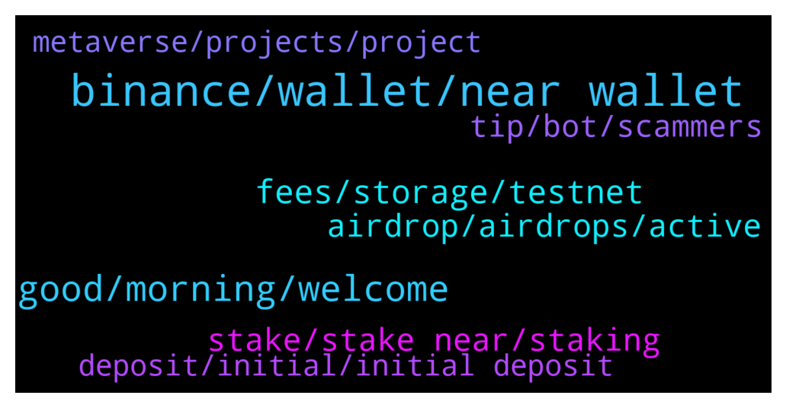

# **@cryptonear**
 ## Analysis for **2022-01-10** - **2022-01-11**.

---

## 📊 **Basic Stats**

**n_messages_sent**: 455

---

---

## 🔝 **Top keywords and related messages**

1. **binance, wallet, near wallet**

    @hey --- *Yes from the near wallet to binance* **--->** [TG Discussion](https://t.me/cryptonear/282178)

    @PlatypusPunk --- *Now Near is suspended on Binance why* **--->** [TG Discussion](https://t.me/cryptonear/282295)

    @hey --- *So i lost 0.08 near for a transaction? But binance fee was 0.01 near* **--->** [TG Discussion](https://t.me/cryptonear/282188)

    @PlatypusPunk --- *I thought it was an hour delay but it isn't, it arrived because of the report what happened to binance 🥺* **--->** [TG Discussion](https://t.me/cryptonear/281748)

    @Anhcules12 --- *now can i sent near in near wallet to binance?pl* **--->** [TG Discussion](https://t.me/cryptonear/281648)

    @hey --- *Ok found lol i was wrong website. Other question... I send us a test 0.2 near from binance to near. Wallet to. Activate my wallet but now i have only 0.13 near in my wallet* **--->** [TG Discussion](https://t.me/cryptonear/282183)

2. **good, morning, welcome**

    @thanano46 --- *I guess it's morning in Vietnam right now* **--->** [TG Discussion](https://t.me/cryptonear/281124)

    @FritzWagner --- *Good morning chief, just passing by. ✌* **--->** [TG Discussion](https://t.me/cryptonear/281616)

    @TheGo1denBull --- *Good night guys. Time to get more rest to fight this virus* **--->** [TG Discussion](https://t.me/cryptonear/281160)

    @thanano46 --- *Just going to bed now 😴😴😴🥱🥱 time for me to sleep.* **--->** [TG Discussion](https://t.me/cryptonear/281122)

    @larry_lang --- *monday on my side as well^^* **--->** [TG Discussion](https://t.me/cryptonear/281254)

    @FritzWagner --- *Have a good night my friend* **--->** [TG Discussion](https://t.me/cryptonear/281161)

3. **fees, storage, testnet**

    @Taurus990 --- *So it’s gonna be deducted from my account ? And wdym storage ?* **--->** [TG Discussion](https://t.me/cryptonear/281078)

    @NathanHhHe --- *I have a doubt, whether this is the case only on the testnet.* **--->** [TG Discussion](https://t.me/cryptonear/282226)

    @larry_lang --- *I think he meant he got 1.12 Near or smt but he didnt remembered the correct digit, so 1.xx Near* **--->** [TG Discussion](https://t.me/cryptonear/281116)

    @TheGo1denBull --- *That's the amount you get when you opened up the wallet* **--->** [TG Discussion](https://t.me/cryptonear/281129)

    @TheGo1denBull --- *If you never gave up .25 for storage fees it's a one time event* **--->** [TG Discussion](https://t.me/cryptonear/281080)

    @NEARverse_xd --- *Some portion of your NEAR used to cover the storage fees. Dont worry its already in your wallet* **--->** [TG Discussion](https://t.me/cryptonear/282185)

4. **airdrop, airdrops, active**

    @jeditobe --- *could you tell me pleas are the any real or active airdrops of NEAR?* **--->** [TG Discussion](https://t.me/cryptonear/281009)

    @Kripto_Raptor --- *Airdrops are often not announced forehand 😃* **--->** [TG Discussion](https://t.me/cryptonear/281014)

    @Kripto_Raptor --- *Just with staking some Nears and being an active user i got several airdrops* **--->** [TG Discussion](https://t.me/cryptonear/281022)

    @bailey_12 --- *that's is such a crazy airdrop* **--->** [TG Discussion](https://t.me/cryptonear/282204)

    @Kripto_Raptor --- *- ref finance airdrop (for ref users) - shroom game project airdrop (for active Near wallets) - paras airdrop (for the ones who've used Paras NFT market) - empyrean fi airdrop (for Aurora trisolaris users)* **--->** [TG Discussion](https://t.me/cryptonear/281026)

    @TheGo1denBull --- *There have been in the past and will occur in the future. I believe every Blockchain will offer airdrops* **--->** [TG Discussion](https://t.me/cryptonear/281891)

5. **stake, stake near, staking**

    @leoma98 --- *Hello NEAR Community, we are holding a AMA on our Discord channel at 2pm UTC, we want to share our proposal to launch the OCT<> stNEAR farm on Ref Finance on January 24th, and to respond all of your questions around it, make sure to join us here!   https://discord.gg/gy8UAGTt?event=929103676746911754  https://gov.ref.finance/t/farm-oct-stnear-proposal/387* **--->** [TG Discussion](https://t.me/cryptonear/282145)

    @Mehdislyy --- *If i stake 1 near can i buy 15near jumbo?* **--->** [TG Discussion](https://t.me/cryptonear/282433)

    @kv9990 --- *https://twitter.com/BalaNft/status/1480507583156744194  A noice starter's guide for Ref Finance and NEAR Wallet for new frensss 👀🌝* **--->** [TG Discussion](https://t.me/cryptonear/282160)

    @HODL_R --- *Do they pay as much as staking via NEAR wallet though* **--->** [TG Discussion](https://t.me/cryptonear/282388)

    @D --- *I’m chuffed with my tri that’s staked* **--->** [TG Discussion](https://t.me/cryptonear/281564)

    @iamruark --- *Aweh!  New NEAR user here. Got my first small bag last night and was blown away at how fast the transaction was.  Quick question: With Staking, is it a stake and forget kinda thing, or is the recommendation to constantly switch and swap staking pools as the reward changes?* **--->** [TG Discussion](https://t.me/cryptonear/281450)

6. **tip, bot, scammers**

    @larry_lang --- *lol he just messing around=))) to make it work u have to deposit some fund in the tipbot site=)))* **--->** [TG Discussion](https://t.me/cryptonear/281210)

    @butola_ravi --- *Then u can start tipping people who u love like whatever* **--->** [TG Discussion](https://t.me/cryptonear/281214)

    @larry_lang --- *+1 giving him chances to explain himself, doesnt seem to work* **--->** [TG Discussion](https://t.me/cryptonear/281284)

    @Kripto_Raptor --- *We NEVER DM you first. Dm all idiot scammers pretending to help you!* **--->** [TG Discussion](https://t.me/cryptonear/282077)

    @larry_lang --- *if u happen to give out the seeds of your account while interacting with that bot, i suggest you move out your fund to another account* **--->** [TG Discussion](https://t.me/cryptonear/281496)

    @NEARverse_xd --- *You have to reply his msg if you wanna send him tip* **--->** [TG Discussion](https://t.me/cryptonear/281344)

7. **metaverse, projects, project**

    @SMuratt --- *Hi, is near in metaverse universe? Will we be able to get metaverse fields like in the future?* **--->** [TG Discussion](https://t.me/cryptonear/281577)

    @TheeCritic --- *So, what is the next project delivery you guys are excited about?* **--->** [TG Discussion](https://t.me/cryptonear/282513)

    @xerophyte --- *??? actually its projects like metaverse (RIDE)  .. looks like near seems has lots of project adopting .. i guess near better .. i don't know much about sharding* **--->** [TG Discussion](https://t.me/cryptonear/281369)

    @iamkemoo --- *Do you know about https://awesomenear.com/categories/nft/? You can check most of the project launched on NEAR there. As I said, I think Gaming/Metaverse will be a huge sector on Near.* **--->** [TG Discussion](https://t.me/cryptonear/282522)

    @iamkemoo --- *to many projects TBH.. but i think metaverse will be huge on NEAR. check out what these guys are doing https://www.mtvrs.app/* **--->** [TG Discussion](https://t.me/cryptonear/282506)

    @TheeCritic --- *I have been researching NEAR and it seems pretty awesome. Thought I would join your community and see what is happening?* **--->** [TG Discussion](https://t.me/cryptonear/282499)

