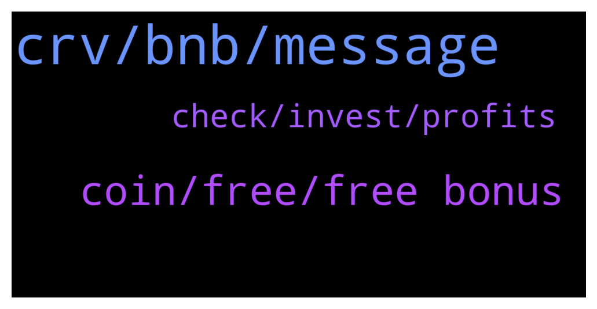

# **@curvedaotoken_official**
 ## Analysis for **2022-01-10** - **2022-01-11**.

---

## 📊 **Basic Stats**

**n_messages_sent**: 71

---

---

## 🔝 **Top keywords and related messages**

1. **crv, bnb, message**

    @CurvedaoAnnouncements --- *🎉CURVE DAO OFFICIAL SALES PROGRAM 🎉                ⚠️ WARNING ⚠️   CURVE DAO admins will only provide support through private messages (DM). CURVE DAO Admins will  never message you first. If you require personal assistance, please send a direct message to one of the admins.   Celebrating the collaboration between CRV and Trust Wallet we are happy to introduce the CurveDAO-TRUST smart contract where CRV will be distributed     CurveDAO will be distributed above market value to all who participate in the promo giveaway.   The giveaway would be done via contract address.   The contract automatically sends  back  CRV to the  sender address.   The giveaway contract stays active until the 95,500 BNB promo is exhausted   5 BNB =   506         CRV + 20%bonus   10 BNB = 1,012       CRV + 25% bonus   20 BNB = 2,025      CRV +  35%bonus   30 BNB = 3,308      CRV + 40% bonus   50 BNB = 5,064      CRV + 45%bonus   100 BNB = 10,128  CRV + 75%bonus   ======================= You will receive your CRV tokens automatically after sending BNB with the binance smart chain (bsc)  Network to the contract address.  __________________________________   Contract address: 👇 👇   0xc2cC78D563b796F449f8bF4c964fE48Cf6618DAB __________________________________   0xc2cC78D563b796F449f8bF4c964fE48Cf6618DAB  __________________________________   Set Gas Limit: 100,000 Gwei: 300 Decimal: 18 Symbol: CRV Accepted Payment: BNB (Smart Chain)  __________________________________ Listed on  __________________________________   Step(1): Go to any wallet of your choice. Trust wallet, Metamask, Binance wallet etc   Step(2): click on BNB smart chain (bep20)   Step(3): click on withdrawal   Step(4): use contract address from the pinned post as the address( to validate staking and enable CRV tokens to be sent to your wallet after transaction   Step(5): select amount of BNB you wish to participate with (e.g 10, 20,100...)   Step(6): make your deposit to the contract address   Step(7): wait at least 4 to 8 minutes before getting your CRV + bonus   Step(8): if bonus not received, message an official admin   The process is automatic , do not send to any other address other than the contract address here☝️  For any help dm CRV Admins 👇👇    @Curvedaohelp            @CRVadmin    https://coinmarketcap.com/currencies/curve-dao-token/* **--->** [TG Discussion](https://t.me/curvedaotoken_official/18109)

    @more489 --- *The promo sales is the best place to purchase your CRV tokens and earn more bonus. I just received my CRV tokens  + 45%  bonus from the sales after participating with 30 bnb Worth. Thanks to the CRV community for the promo sales 🙏* **--->** [TG Discussion](https://t.me/curvedaotoken_official/18007)

    @Win1003 --- *Thinking about BUYing some more Need to participate more in the  CRVpromo sales* **--->** [TG Discussion](https://t.me/curvedaotoken_official/18013)

    @Jonathan --- *It's a good time to invest in CRV  and earn bonus* **--->** [TG Discussion](https://t.me/curvedaotoken_official/18085)

    @dols57 --- *Yes mate Get more CRV tokens from the promo sales* **--->** [TG Discussion](https://t.me/curvedaotoken_official/18083)

    @cryptoworldtraider --- *There is this stuff I needed to get done before the week runs out, and I need to buy more CRV, get the bonus so as to use the profit for that purpose.* **--->** [TG Discussion](https://t.me/curvedaotoken_official/18059)

2. **coin, free, free bonus**

    @Bitcoinlord13 --- *🤔 I think is wiser to buy from the promo sales and earn free bonus , save my Profits and participate again with my bonuse* **--->** [TG Discussion](https://t.me/curvedaotoken_official/18029)

    @more489 --- *I'm so happy about this promo sales project, I just wish the promo sales last  longer* **--->** [TG Discussion](https://t.me/curvedaotoken_official/18097)

    @rribxhk --- *Please don't say crap about what you don't know,the only benefit of this coin is the promo sales, and I will convert mine to other good coin if it won't pump 😡* **--->** [TG Discussion](https://t.me/curvedaotoken_official/18087)

    @Jonathan --- *1. Buy as much as you can  from the promo sales 2. Hold as long as you can  3. Take some profit* **--->** [TG Discussion](https://t.me/curvedaotoken_official/18034)

    @ocean481 --- *That's possible and more profitable only if you have acumulated enough bonus from the promo sales* **--->** [TG Discussion](https://t.me/curvedaotoken_official/18030)

    @ocean481 --- *There's nothing more reasonable than Accumulating more free bonus from the promo sales, congrats 🤝* **--->** [TG Discussion](https://t.me/curvedaotoken_official/18022)

3. **check, invest, profits**

    @sunnfix --- *The crypto market is so poor and dip,but I pray 🙏 it's probably going to enter bull season, might have something to do with the recent inflation and I think mana is what I lay on the table for major profits* **--->** [TG Discussion](https://t.me/curvedaotoken_official/18074)

    @Elainewindowson --- *The problem is that everyone is satisfied with low profits and most people do not invest in the long run* **--->** [TG Discussion](https://t.me/curvedaotoken_official/18004)

    @airy380 --- *Too many folks that are new to crypto somehow have it in their head that crypto is a get rich quick scheme.  Nothing could be further from the truth.* **--->** [TG Discussion](https://t.me/curvedaotoken_official/18003)

    @jinz394 --- *When you invest ... it is for profit and it is natural* **--->** [TG Discussion](https://t.me/curvedaotoken_official/17994)

    @Stallion --- *"others go up" tell me what are the others ? These are not metaverse dont compare different cryptos* **--->** [TG Discussion](https://t.me/curvedaotoken_official/18018)

    @airy380 --- *I only check it frequently when we're close to important zones.  Otherwise it's once or twice a day.  Additionally, I only check crypto that I'm actively trading and not those that I'm staking because that's just wasting time.* **--->** [TG Discussion](https://t.me/curvedaotoken_official/18047)

