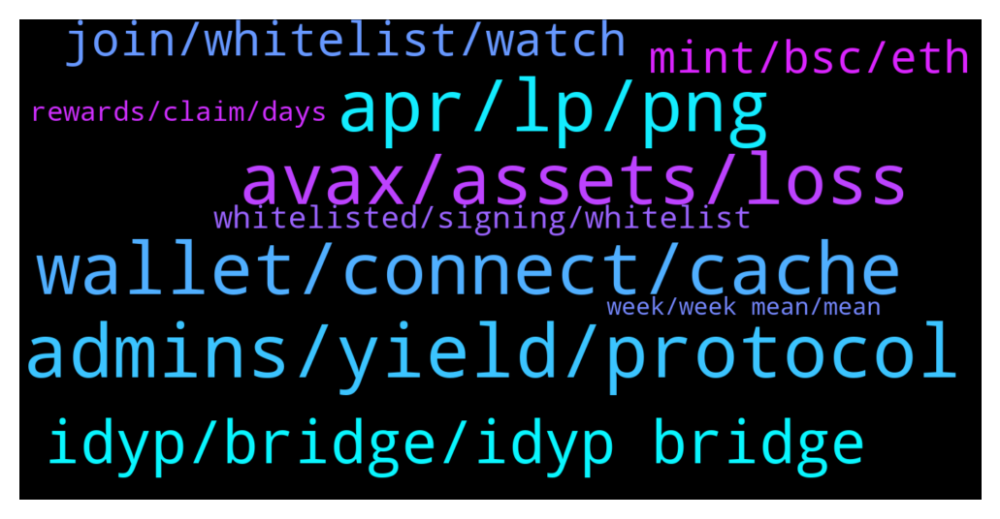

# **@dypfinance**
 ## Analysis for **2022-01-10** - **2022-01-11**.

---

## 📊 **Basic Stats**

**n_messages_sent**: 156

---

---

## 🔝 **Top keywords and related messages**

1. **admins, yield, protocol**

    @dimasdep --- *Hi, Defi Yield Protocol Team! Anyway, who is the admin in this group? Or anyone can introduce me to the admin/pic for listing business?* **--->** [TG Discussion](https://t.me/dypfinance/238385)

    @timdyp --- *Please block and report! Again, our admins will never DM!* **--->** [TG Discussion](https://t.me/dypfinance/238707)

    @JaySea99 --- *Better not reveal that you are new....invitation for scammers to target you* **--->** [TG Discussion](https://t.me/dypfinance/238460)

    @timdyp --- *@bogdantzr this is a scammer!  DEFI YIELD PROTOCOL ADMINS WILL NEVER DM YOU FIRST, NOR WILL THEY ASK YOU FOR MONEY. PLEASE BEWARE OF SCAMS, AND BLOCK/REPORT SUSPICIOUS ACCOUNTS.* **--->** [TG Discussion](https://t.me/dypfinance/238698)

    @DhoniMSD516 --- *Whoever message you first with admin name or profile photo are scammers* **--->** [TG Discussion](https://t.me/dypfinance/238718)

    @DhoniMSD516 --- *Yes he/she is scammer impersonating one of our admins, we admins will NEVER DM you first* **--->** [TG Discussion](https://t.me/dypfinance/238714)

2. **apr, lp, png**

    @Paulus --- *In farming, the % share just base on the asset we farm or include Dyp.* **--->** [TG Discussion](https://t.me/dypfinance/238469)

    @Paulus --- *Yes and it auto switch about 25% to DYP. i mean what if we withdraw the DYP, does it affect the share* **--->** [TG Discussion](https://t.me/dypfinance/238471)

    @Paulus --- *I know but what the APR for DYP? equal with LP* **--->** [TG Discussion](https://t.me/dypfinance/238477)

    @Paulus --- *So it may lower than the LP APR then it may not attracting investors, we just wait till the lock time done then move as much as we can from DYP back to LP and keep DYP at minimum. Sound not so good for DYP right?* **--->** [TG Discussion](https://t.me/dypfinance/238479)

    @bhartipark --- *thia lp not show dyp account* **--->** [TG Discussion](https://t.me/dypfinance/238692)

    @Paulus --- *So the profit base on 75% of what we deposit?* **--->** [TG Discussion](https://t.me/dypfinance/238473)

3. **wallet, connect, cache**

    @mc4da --- *did you get any answer? mine is locked too* **--->** [TG Discussion](https://t.me/dypfinance/238559)

    @timdyp --- *Clear your cookie & cache and try again.* **--->** [TG Discussion](https://t.me/dypfinance/238534)

    @bogdantzr --- *Is asking me to log in in certain link* **--->** [TG Discussion](https://t.me/dypfinance/238704)

    @Snakedancer --- *Connect wallet does not work for me* **--->** [TG Discussion](https://t.me/dypfinance/238525)

    @bogdantzr --- *The connect wallet button from the website is not working ?* **--->** [TG Discussion](https://t.me/dypfinance/238677)

    @bogdantzr --- *She was asking me to deposit 0.5 eth in the wallet in order for the wallet to connect* **--->** [TG Discussion](https://t.me/dypfinance/238710)

4. **avax, assets, loss**

    @Craig --- *I understand that and the loss is not the reason for my post. I'm simply trying to learn more about IL and what market indicators I'm looking for to gauge it's impact.* **--->** [TG Discussion](https://t.me/dypfinance/238628)

    @Cryptomommi --- *Not spreading FUD. But I entered with $5000 WBNB pool Nov 26th and now my entire position is only worth $1,200....significant Impermanent Loss but that's the risk you take with DeFi liquidity protocols.* **--->** [TG Discussion](https://t.me/dypfinance/238606)

    @Craig --- *The AVAX price has dropped 25% since i provided my LP which equates to 1/4 of 1x. Reading your numbers I could expect to lose 25% of my assets in a year with a 5x UP or DOWN, and yet I've lost 18% in a month with only 1/4 of 1x drop in asset value. I don't follow.* **--->** [TG Discussion](https://t.me/dypfinance/238584)

    @WatermelonNoia --- *I dont think it will ever catch based on the AVAX component alone, as when you join the LP your AVAX stake is split up to purchase some DYP. You'll need DYP to increase to offset the IL you have experienced and comparing it to purely AVAX alone.  Please consider the payouts you get, as they close the gap between your initial investment, and any IL.  Profit or loss (@ a point in time) = initial capital - IL + payouts received.* **--->** [TG Discussion](https://t.me/dypfinance/238639)

    @Craig --- *I’ve been reading up on impermanent loss and have the gist of it. I do have a question though that I’m hoping someone can explain in layman’s terms. I’m going to use an actual DYP pool I’m in for this question. The pool is on the AVAX chain and I provided 57 AVAX for liquidity, a month ago, locked for three days.  Since that time the value of my LP, DYP and rewards is worth 12% less than if I just held the AVAX independent of the pool. I used today’s market price comparing the 57 AVAX versus adding up my LP, DYP and rewards. I’m not if mistaken the LP is 75% AVAX and 25% DYP. So here’s the question; in order for me to recoup the 12% loss, the market/assets need to improve, but if they’re improving in the pool, it also means the assets are improving outside of it. So how does that make up for the loss? That’s the part I can’t figure out so any help would be greatly appreciated* **--->** [TG Discussion](https://t.me/dypfinance/238570)

    @Craig --- *I'm using the total value of all assets from the stats page. The total value is $4235. The value of my 57.477 AVAX on today's market would be $4832. So the total value of my liquidity is 12% less than the value of the 57.477 AVAX (today's pricing. Not the price when I began) at this point after one month and a 25% drop of the AVAX price. Trying to understand how those numbers work.* **--->** [TG Discussion](https://t.me/dypfinance/238589)

5. **idyp, bridge, idyp bridge**

    @Disguy125 --- *Can't ready for a IDYP pump on the BSC chain boy buy now for a 5x pump with the bridge!!!!!! Coming this week!!!!!!* **--->** [TG Discussion](https://t.me/dypfinance/238355)

    @trader_broi --- *Yeah these people are now back of idyp... If there was no idyp then we see the pump only in dyp token* **--->** [TG Discussion](https://t.me/dypfinance/238370)

    @tamtamkanto --- *Is there a limit to how much idyp can bridge?* **--->** [TG Discussion](https://t.me/dypfinance/238780)

    @Nji_jalen --- *Dont forget about dyp too. Lol* **--->** [TG Discussion](https://t.me/dypfinance/238366)

    @trader_broi --- *Dyp should coduct a meme contest in Twitter... So it will be also a promo* **--->** [TG Discussion](https://t.me/dypfinance/238758)

    @Eugej --- *My same story...sighing...investment is awesome with dyp right...5k>1.3k* **--->** [TG Discussion](https://t.me/dypfinance/238783)

6. **join, whitelist, watch**

    @timdyp --- *🔥Join Cats and Watches Society #NFTs Whitelist 🎉One Brand New Rolex Daytona Ceramic 116500LN worth $40k Giveaway  To win the watch: ✅Join dyp.finance/whitelist ✅Mint one #NFT once available ✅Like & Retweet this post ✅Join discord.gg/dypcaws ✅Tag 3 friends  👉https://twitter.com/dypfinance/status/1480623073208549380* **--->** [TG Discussion](https://t.me/dypfinance/238523)

    @timdyp --- *The watch is ready to be shipped! 🔥👀* **--->** [TG Discussion](https://t.me/dypfinance/238530)

    @DhoniMSD516 --- *🔥Join Cats and Watches Society #NFTs Whitelist 🎉One Brand New Rolex Daytona Ceramic 116500LN worth $40k Giveaway  To win the watch: ✅Join dyp.finance/whitelist ✅Mint one #NFT once available ✅Like & Retweet this post ✅Join discord.gg/dypcaws ✅Tag 3 friends  👉https://twitter.com/dypfinance/status/1480623073208549380* **--->** [TG Discussion](https://t.me/dypfinance/238725)

    @iamJubi --- *🔥Join Cats and Watches Society #NFTs Whitelist 🎉One Brand New Rolex Daytona Ceramic 116500LN worth $40k Giveaway  To win the watch: ✅Join dyp.finance/whitelist ✅Mint one #NFT once available ✅Like & Retweet this post ✅Join discord.gg/dypcaws ✅Tag 3 friends  👉https://twitter.com/dypfinance/status/1480623073208549380* **--->** [TG Discussion](https://t.me/dypfinance/238643)

    @timdyp --- *Good morning #DYPians😼  Don't forget to join the whitelist for our upcoming #NFTs collection https://dyp.finance/whitelist  👉https://twitter.com/dypfinance/status/1480822527354101760* **--->** [TG Discussion](https://t.me/dypfinance/238688)

    @timdyp --- *And don't forget to join our giveaway for the Rolex Daytona https://twitter.com/dypfinance/status/1480623073208549380?s=20* **--->** [TG Discussion](https://t.me/dypfinance/238565)

7. **mint, bsc, eth**

    @Tem9o9 --- *My question is if I need to mint, can I mint NFT on BSC although my DYP balance is on erc20* **--->** [TG Discussion](https://t.me/dypfinance/238794)

    @Richcal --- *if i sign my address and then i forgot to mint it or cant mint on these day, what will happen?* **--->** [TG Discussion](https://t.me/dypfinance/238622)

    @Richcal --- *why to mint cat nfts we must be registered our address first? and what sign means?* **--->** [TG Discussion](https://t.me/dypfinance/238619)

    @timdyp --- *You need to be on ETH, BSC, or Avalanche.* **--->** [TG Discussion](https://t.me/dypfinance/238793)

    @Snakedancer --- *On BSC and still not working* **--->** [TG Discussion](https://t.me/dypfinance/238533)

    @Snakedancer --- *Now, lets win this watch, haha and mint starts on 17th?* **--->** [TG Discussion](https://t.me/dypfinance/238542)

8. **whitelisted, signing, whitelist**

    @jc6868 --- *Hi! Not so clear what need to be done . It mentioned to be whitelisted and not sure where to do this. Pls advise . Thanks* **--->** [TG Discussion](https://t.me/dypfinance/238487)

    @herbie1996 --- *my dyp is locked do I need to buy more to just place in my wallet* **--->** [TG Discussion](https://t.me/dypfinance/238529)

    @Tem9o9 --- *Hey, if I want to connect my wallet for the new whitelist, do I have to be on a specific mainnet like ether or polygon or so?* **--->** [TG Discussion](https://t.me/dypfinance/238792)

    @WatermelonNoia --- *Did you find out if our DYP held in contract (instead of in a wallet) will suffice getting whitelisted?* **--->** [TG Discussion](https://t.me/dypfinance/238748)

    @WatermelonNoia --- *Does signing the message with one address gets you whitelisted across all chains that address exists on?* **--->** [TG Discussion](https://t.me/dypfinance/238743)

    @timdyp --- *Hey, you don't need to hold DYP. Just join the whitelist by signing a message https://dyp.finance/whitelist* **--->** [TG Discussion](https://t.me/dypfinance/238564)

9. **rewards, claim, days**

    @Bodo --- *hi all. have a question pls. why the withdraw for my idyp allocation is still saying "you recently staked, you can unstake in 3 months"?... I did the stake 2 months ago after the allocation and since then I just did reinvest the rewards.* **--->** [TG Discussion](https://t.me/dypfinance/238729)

    @Muhammad --- *Hello there! Hope you all doing well.  I haven’t received any reward from last 7 days. Hi* **--->** [TG Discussion](https://t.me/dypfinance/238662)

    @DhoniMSD516 --- *The last claim trigger was 6 days ago, you can execute the claim now you get all 6 days rewards else you can wait if not in hurry, as ETH fees are high no one triggered claim* **--->** [TG Discussion](https://t.me/dypfinance/238666)

    @JohnnyQuest21 --- *i have the exact same problems, i am at a loss including rewards, and my share is constantly going down, rewards are 10% of what they were initially* **--->** [TG Discussion](https://t.me/dypfinance/238437)

    @jc6868 --- *Regarding farming , if I don’t claim the rewards, will my rewards continue to accumulate?* **--->** [TG Discussion](https://t.me/dypfinance/238799)

    @chunshern90 --- *if i dont claim, the rewards will decrease?* **--->** [TG Discussion](https://t.me/dypfinance/238452)

10. **week, week mean, mean**

    @Bodo --- *Thanks.. so it says 3 months but in fact, will release in 1 month pls?* **--->** [TG Discussion](https://t.me/dypfinance/238735)

    @tamtamkanto --- *By next week, do you mean the 16th-22nd?* **--->** [TG Discussion](https://t.me/dypfinance/238378)

    @hemanrock --- *Soon we will be announcing the date.* **--->** [TG Discussion](https://t.me/dypfinance/238543)

    @DhoniMSD516 --- *As said above details will be released soon :)* **--->** [TG Discussion](https://t.me/dypfinance/238492)

    @DhoniMSD516 --- *This announcement made yesterday so next week he mean this week* **--->** [TG Discussion](https://t.me/dypfinance/238379)

    @Disguy125 --- *This will happen between now and Friday.* **--->** [TG Discussion](https://t.me/dypfinance/238358)

