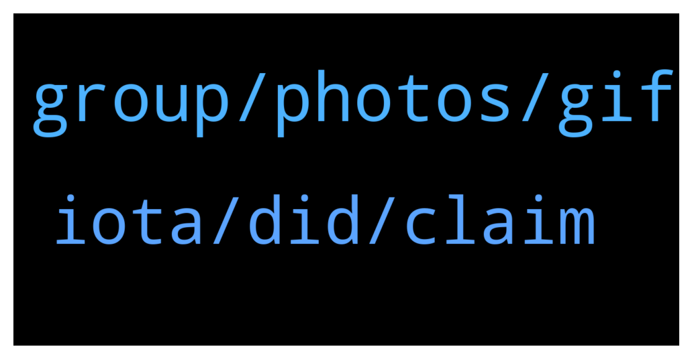

# **@iotatangle**
 ## Analysis for **2022-01-10** - **2022-01-11**.

---

## 📊 **Basic Stats**

**n_messages_sent**: 37

---

---

## 🔝 **Top keywords and related messages**

1. **group, photos, gif**

    @Marie --- *So this is not the real group?* **--->** [TG Discussion](https://t.me/iotatangle/306497)

    @蛋蛋 --- *Is there a Chinese exchange group?* **--->** [TG Discussion](https://t.me/iotatangle/306493)

    @Fold11 --- *Can u get some shit by clicking just photos some user sent u?* **--->** [TG Discussion](https://t.me/iotatangle/306473)

    @Basti --- *All tg channels are community driven.* **--->** [TG Discussion](https://t.me/iotatangle/306500)

    @Basti --- *It is. But there is no Telegram group which is managed by the IF.* **--->** [TG Discussion](https://t.me/iotatangle/306498)

    @N1ghtBl00d --- *this is a community group sir. not official💪🏽* **--->** [TG Discussion](https://t.me/iotatangle/306494)

2. **iota, did, claim**

    @danieltapa --- *i don't think *prefer to continue trading* is a case.. all exchanges that support iota did the migration process, right?* **--->** [TG Discussion](https://t.me/iotatangle/306427)

    @⠠⠵ Lucas! --- *NOT STAKING funds are an heterogeneous mix of cases. People who ... * don't believe new tokens will have value * their value don't compensate the mess of completing the process necessary to participate * do not actively follow the project or its news feeds * are still procrastinating * prefer to continue trading * still has to migrate * lost access to their funds * Etcetera* **--->** [TG Discussion](https://t.me/iotatangle/306414)

    @mohsen --- *After prolong time about 11% didn't migrate, maby They're lost... something such as burning* **--->** [TG Discussion](https://t.me/iotatangle/306411)

    @Warrior_Sakdalista_PH --- *What does the currency of that number, is it IOTA?* **--->** [TG Discussion](https://t.me/iotatangle/306511)

    @Basti --- *bennnni.web3 (@bennnni_web3) Tweeted: @mozilla Have a look at #IOTA please! Being a DAG and not a blockchain if offers feeless transactions without mining! It's the future of green and sustainable DLT developed by a German non-profit organization (@iota) 💚 Check the following thread: https://t.co/ugYDCEKIH9 https://twitter.com/bennnni_web3/status/1479208193343606794?s=20* **--->** [TG Discussion](https://t.me/iotatangle/306469)

    @antonionardella --- *A friend of mine still has to migrate 🤷* **--->** [TG Discussion](https://t.me/iotatangle/306431)

