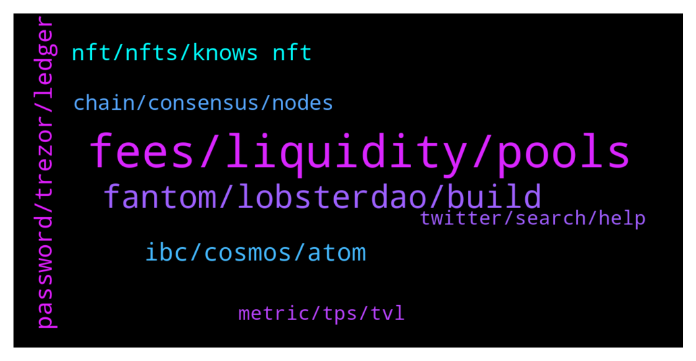

# **@lobsters_chat**
 ## Analysis for **2022-01-10** - **2022-01-11**.

---

## 📊 **Basic Stats**

**n_messages_sent**: 340

---

---

## 🔝 **Top keywords and related messages**

1. **fees, liquidity, pools**

    @kapur_sanat --- *so simple but so cool - elegantly helps mitigate the CRV problem where pools like FRAX earn $100k in fees but $3.6mn in emissions vs pools like 3pool which generate $450k in fees but only get $450k in emissions* **--->** [TG Discussion](https://t.me/lobsters_chat/314208)

    @kapur_sanat --- *yeah, i think you are mostly correct -> for right now this ratio is too skewed in CRV ecosystem, but eventually would help  also helps at the margins e.g. right now, i doubt a pool like 3pool on CRV would benefit from this, but could help in a battle like mim pool vs frax pool (both heavily incentivized, but mim pool does a lot more volume than frax and generates a lot more fees since mim leverage generates trading; however, frax owns way more CVX so gets lots more emissions)* **--->** [TG Discussion](https://t.me/lobsters_chat/314215)

    @tesslerc --- *Going over the explanation for ouroboros by @andrecronje . Why even have people vote and not let the system automatically adjust incentives?  If it's an AMM provide rewards based on a "weighed time weighed average volume".  If the goal is lending, incentivize based on the borrow APY or similar.* **--->** [TG Discussion](https://t.me/lobsters_chat/314260)

    @ivangbi --- *-> Emissions will promote the highest fee earning pools, which will increase liquidity on those pools to allow for better rates.  Correct me if I am wrong, but if the fees in notional USD are smaller than emissions (and there is like what, a 10x more markup on that across the board now) it doesn’t change it much? I would still vote for lw utilization pools?* **--->** [TG Discussion](https://t.me/lobsters_chat/314214)

    @vPEPO --- *they rugged their old product wtf* **--->** [TG Discussion](https://t.me/lobsters_chat/314474)

    @ivangbi --- *you looking at your portfolio now* **--->** [TG Discussion](https://t.me/lobsters_chat/314325)

2. **fantom, lobsterdao, build**

    @nutz3r123 --- *@andrecronje I have a question. Please dont feel offended by it, I am just curious: Why you build on fantom? Why not build something on L2 or eth itself? Or substrate, cosmos?  Because the fantom people are your friends? Or you really see some positive things there? Isnt it at the end a more centralized eth copy?* **--->** [TG Discussion](https://t.me/lobsters_chat/314636)

    @nickbtts --- *Are those projects actually ‘DAOs’ though, or is it going to just be random devs deciding what to do with their veDRE* **--->** [TG Discussion](https://t.me/lobsters_chat/314360)

    @Clint_Ma --- *Do any of you build the dApps with wordpress? I think that probably won't be the best alternative* **--->** [TG Discussion](https://t.me/lobsters_chat/314193)

    @ivangbi --- *It shifts it to DAOs which (I agree, makes sense, paying tribute to those who set up on Fantom) but then… are those teams public or all by the same cartel?* **--->** [TG Discussion](https://t.me/lobsters_chat/314350)

    @ivangbi --- *Idk anything about that ecosystem or devs, except that lobsters r still yet to get $* **--->** [TG Discussion](https://t.me/lobsters_chat/314361)

    @KeyedDepartment --- *i can set up a github so people can submit PRs if that would interest you* **--->** [TG Discussion](https://t.me/lobsters_chat/314611)

3. **ibc, cosmos, atom**

    @sir_integra_hellsing --- *UST is Terra. Terra doesn't use IBC, just uses the Cosmos SDK. Kinda like how Binance Chain works (not BSC, the one before that, the BEP2 one)* **--->** [TG Discussion](https://t.me/lobsters_chat/314539)

    @Siimmoonn --- *ATOM can currently be used for governance + staking with validators. New zones in cosmos can incentivize current validators of the Cosmos HUB to also secure their chain/zone. This could have an impact on the price of ATOM but in general the ATOM token is isolated from things happening on zones like secret network or sifchain. Please correct me if I  have missed any new development on ATOM utility* **--->** [TG Discussion](https://t.me/lobsters_chat/314553)

    @Siimmoonn --- *Also to split a few hairs: IBC is part of Cosmos SDK.* **--->** [TG Discussion](https://t.me/lobsters_chat/314543)

    @Cat_Graphy --- *How does ATOM have any relations to IBC when it’s a Cosmos SDK. They are using the SDK, doesn’t imply adoption of IBC will affect ATOM anyway right?* **--->** [TG Discussion](https://t.me/lobsters_chat/314550)

    @goeth121 --- *Using IBC, target address is target chain's address and source address is source chain's address* **--->** [TG Discussion](https://t.me/lobsters_chat/314117)

    @Siimmoonn --- *ATOM as the token can be send via IBC to other chains (or zones as they are called in cosmos). IBC itself doesn't do anything for the ATOM price (i guess that was your question)* **--->** [TG Discussion](https://t.me/lobsters_chat/314552)

4. **password, trezor, ledger**

    @San4ouzz --- *looks doesnt work with trezor so far, don't waste your gas until it's fixed* **--->** [TG Discussion](https://t.me/lobsters_chat/314244)

    @freshaspect --- *What doesn't work? Works fine with Ledger (so far)* **--->** [TG Discussion](https://t.me/lobsters_chat/314245)

    @anisopteran --- *imagine if learning your password to one site was learning your password to all sites, with no recovery option or even a way to change your password* **--->** [TG Discussion](https://t.me/lobsters_chat/314186)

    @San4ouzz --- *looks like Ledger is much better than trezor, ser. Doesn't work signing the transaction for listing an item on the marketplace* **--->** [TG Discussion](https://t.me/lobsters_chat/314246)

    @etartakovsky --- *trezor has problems with ERC721 support, among other things. Ledger had problems with working with metamask in general for a long while. I wasn't able to mint with Trezor because of the ERC721 problem, minted with plain metamask instead, bad opsec.* **--->** [TG Discussion](https://t.me/lobsters_chat/314405)

    @vincentrinot --- *Was anyone able to claim looksrare on trezor? I went as far as loading my seed into a fresh ledger but the password on trezor (which isnt a password... and i never set it up that way, fuckign annoying) isnt letting me find my accounts on the ledger* **--->** [TG Discussion](https://t.me/lobsters_chat/314386)

5. **nft, nfts, knows nft**

    @tatai_007 --- *Hey, anyone knows of how these NFT projects generate 10000 unique looking art? Because I was seeing some of the mutant apes NFTs and they look incredibly detailed.* **--->** [TG Discussion](https://t.me/lobsters_chat/314313)

    @alekseipu --- *There is a nice book about NFTs from CG  https://landing.coingecko.com/how-to-nft/  (but WTF I can't buy it as an NFT???)* **--->** [TG Discussion](https://t.me/lobsters_chat/314549)

    @tatai_007 --- *I am just curious what the process looks like for generating art for a series like that.* **--->** [TG Discussion](https://t.me/lobsters_chat/314314)

    @Don_Luv --- *Basically layering of images which break all the components into different images so they can be combined. I used Python pillow library for this, but you could use whatever alternative. Some image processing  might be involved depending on the project, 2 I’ve been on used natron (open source tool) for some effect (refraction through glasses).  Beside that, just creating exclusions for certain combinations of traits based on the obvious one which won’t work together, and/or testing.* **--->** [TG Discussion](https://t.me/lobsters_chat/314318)

    @Cody_123 --- *although i think we are going to nfts just being defi with a bow on top of it* **--->** [TG Discussion](https://t.me/lobsters_chat/314484)

    @Cody_123 --- *addressable market for nfts > defi IMO* **--->** [TG Discussion](https://t.me/lobsters_chat/314483)

6. **chain, consensus, nodes**

    @anisopteran --- *Well, this is true but it would have to be by a social consensus mechanism. The question is basically “If someone has 66% of the chain, can they double spend?” And the answer, just like with 51% in PoW/Nakamoto consensus, is “yes”. The difference is in the power of the social consensus mechanism to recover.   In PoW, there is no way for the chain to slash your hashrate, i.e. it cannot reach through the internet and burn your rigs to the ground. But in PoS, your influence on the chain comes from your staked tokens, which a community consensus based hard fork could simply delete from existence.* **--->** [TG Discussion](https://t.me/lobsters_chat/314123)

    @juju1234534 --- *I don’t think you need social consensus. It’s simply part of the Casper ruleset in the sense that if somebody proposes two different blocks for the same parent, everyone can submit a fraud proof and the bad actor gets slashed automatically.* **--->** [TG Discussion](https://t.me/lobsters_chat/314148)

    @denis3034 --- *I wonder why there's still no way to compere farm APYs for certain asset across chains. For example if I have SUSHI where do I get highest APY for SUSHI/USDT? On Avalanche/Polygon?* **--->** [TG Discussion](https://t.me/lobsters_chat/314248)

    @anisopteran --- *I suppose eventually the honest chain will leak the attackers below 33%, that can work without social consensus, but that would take weeks without finality on Ethereum* **--->** [TG Discussion](https://t.me/lobsters_chat/314165)

    @anisopteran --- *You need a live chain to finalize that slashing though. In this case attackers control 66% of validators and thus just won’t include / finalize blocks that slash them.* **--->** [TG Discussion](https://t.me/lobsters_chat/314164)

    @anisopteran --- *Newly synced nodes would take the attacker chain more of the time than the honest chain, but on the honest fork, finality would stop until some outside action by the community was taken.* **--->** [TG Discussion](https://t.me/lobsters_chat/314126)

7. **metric, tps, tvl**

    @t1mur --- *When we compare performance of blockchains, the main metric is max transactions per second, right? But exactly what type of transactions is meant and do blockchain developers tend to mean the same thing?* **--->** [TG Discussion](https://t.me/lobsters_chat/314289)

    @andrecronje --- *TVL is a more commonly accepted metric I believe, but I'm a defillama fanboy, so I'm bias* **--->** [TG Discussion](https://t.me/lobsters_chat/314290)

    @andrecronje --- *There was never agreement on TPS as a metric, as it can be interpreted too easily* **--->** [TG Discussion](https://t.me/lobsters_chat/314292)

    @dmihal --- *All metrics have their weaknesses, but TPS is especially used as a "shill" metric.  I like to compare it to "number of items sold in a store". If you used that metric for stores, then you'd probably put dollar stores or candy stores at the top of the list, and car/computer stores at the bottom.* **--->** [TG Discussion](https://t.me/lobsters_chat/314301)

    @tesslerc --- *Currently impossible to truly compare DLTs.  TPS for simple sends isn't the same as for smart contracts.  Scaling using many non communicating chains isn't the same as a fully composable ledger (like ftm, sol, eth).  Speed might be achieved by compromising security or decentralization. And TPS doesn't take into consideration finality time which is also an important metric.* **--->** [TG Discussion](https://t.me/lobsters_chat/314296)

    @alxdc --- *Well TPS is a tech metric, while TVL shows adoption. Hard to compare imho.* **--->** [TG Discussion](https://t.me/lobsters_chat/314295)

