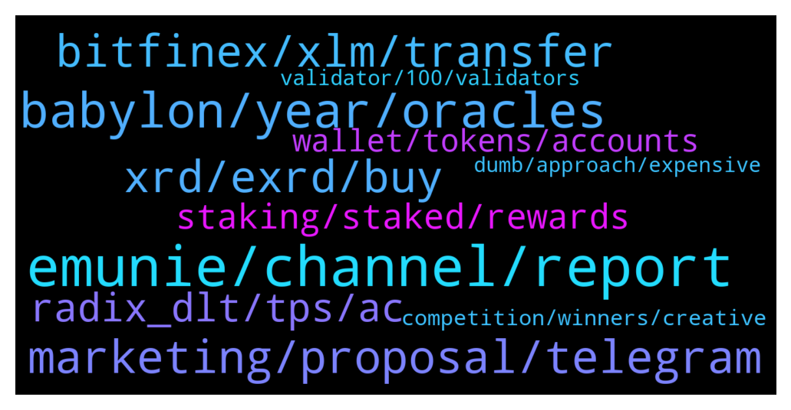

# **@radix_dlt**
 ## Analysis for **2022-01-10** - **2022-01-11**.

---

## 📊 **Basic Stats**

**n_messages_sent**: 537

---

---

## 🔝 **Top keywords and related messages**

1. **emunie, channel, report**

    @daxter889 --- *This channel has a list of radix projects https://t.me/RadixBox* **--->** [TG Discussion](https://t.me/radix_dlt/337089)

    @해븐 --- *How many dapps are there on radix ?* **--->** [TG Discussion](https://t.me/radix_dlt/337147)

    @DavidGr03 --- *Who runs RadixBox? They say to DM them with other projects, but there is no one to DM and you can’t write in their channel 🤷‍♂️* **--->** [TG Discussion](https://t.me/radix_dlt/337118)

    @CaptainMooseInc --- *Yep, agreed. And we plan to build out full set of tracking tools for the Radix ecosystem. (:* **--->** [TG Discussion](https://t.me/radix_dlt/337458)

    @RadixMonk --- *I cant figure out if Peter is a radix bull or bear* **--->** [TG Discussion](https://t.me/radix_dlt/337667)

    @RadixMonk --- *I just left it, he claims to prefer white papers over infographics but i dont think he understood radix white paper* **--->** [TG Discussion](https://t.me/radix_dlt/337677)

2. **babylon, year, oracles**

    @Orbitalz --- *why do you think Babylon wont be available until towards the end of the year, why not earlier?* **--->** [TG Discussion](https://t.me/radix_dlt/337857)

    @dpawk --- *Hi guys. What is an ETA for Babylon? Q2? Q3?* **--->** [TG Discussion](https://t.me/radix_dlt/337496)

    @Magal36 --- *There are community devs  making one. The team has other priorities until Babylon release.* **--->** [TG Discussion](https://t.me/radix_dlt/337318)

    @JuelzCrypto --- *hi is there a roadmap for 2022* **--->** [TG Discussion](https://t.me/radix_dlt/337849)

    @DefiYields --- *If Babylon is delayed until 2023 imma dump all ☹️🤬* **--->** [TG Discussion](https://t.me/radix_dlt/337866)

    @Magal36 --- *watch the November roundtable. Matt has said to expect more towards eoy, but they will give a more exact timeline this quarter* **--->** [TG Discussion](https://t.me/radix_dlt/337858)

3. **marketing, proposal, telegram**

    @PeterFATAss --- *Can we please ban this nonsense memcoin bullshit. It doesn't really help us to attract serious people* **--->** [TG Discussion](https://t.me/radix_dlt/337640)

    @bonafideplug --- *So… Radish, the meme coin with utility is now making wave on Twitter & Telegram. Make sure to join our telegram to stay up to date with the release of our token and all its technicality.   https://t.me/radishroot* **--->** [TG Discussion](https://t.me/radix_dlt/337117)

    @M2rwn --- *Who do I contact about marketing?  I prefer to be a telegram account* **--->** [TG Discussion](https://t.me/radix_dlt/337514)

    @Rools1 --- *Hey whatsup guys, this project is awesome! Who is the best person to talk to regarding listing your project on our exchange ?🤙* **--->** [TG Discussion](https://t.me/radix_dlt/337810)

    @Alfred_Dulaire --- *@Dogecube the first Radix memecoin  We are now LIVE on CoinGecko  www.coingecko.com/en/coins/dogecube* **--->** [TG Discussion](https://t.me/radix_dlt/337271)

    @danich51 --- *It has to be a spam bot bro :))* **--->** [TG Discussion](https://t.me/radix_dlt/337306)

4. **xrd, exrd, buy**

    @lwtel --- *waiting multiple hours for them to credit my deposit so I can buy xrd* **--->** [TG Discussion](https://t.me/radix_dlt/337050)

    @Gaboulos --- *So, what's the deal with the required KYC for bridging eXRD to XRD? This goes against everything in DeFi and is quite offputting.* **--->** [TG Discussion](https://t.me/radix_dlt/337288)

    @Magal36 --- *not yet unfortunately. You need a desktop to hold/stake XRD. Your choice now is to buy eXRD and hold in any ethereum wallet then* **--->** [TG Discussion](https://t.me/radix_dlt/337901)

    @Magal36 --- *yes, but only with the native token XRD* **--->** [TG Discussion](https://t.me/radix_dlt/337305)

    @Cpt_Charles --- *He simply read out the marketcap and fully diluted marketcap of exrd, which is 1:1 swappable with XRD. The marketcap is 2bn and not 100m as he said 🙃* **--->** [TG Discussion](https://t.me/radix_dlt/337809)

    @Mik3ology --- *Thanx Jacob. Just one question. If I use my xrd address linked to my insta-pass, would this auto clear me for the KYC?* **--->** [TG Discussion](https://t.me/radix_dlt/337220)

5. **bitfinex, xlm, transfer**

    @Davor --- *The tx is completed but still not on Bitfinex* **--->** [TG Discussion](https://t.me/radix_dlt/337241)

    @ledtdg --- *Ti avoid to spend too much money in commissions i buy on binance and then transfer on Bitfinex* **--->** [TG Discussion](https://t.me/radix_dlt/337904)

    @Davor --- *Anyone having issues with bitfinex deposit today? I did as usual, buying XLM and sending to Bitfinex so I could buy XRD but XLM still didn't arrive.. It is almost 5h since then.. usually everything goes in matters of minutes..* **--->** [TG Discussion](https://t.me/radix_dlt/337234)

    @Taswegian --- *Contact bitfinex support, had that happen with XLM once and they had it sorted within about 2-3 days from memory.* **--->** [TG Discussion](https://t.me/radix_dlt/337244)

    @Davor --- *Thanks, already done it. I was afraid it will be a few days. Hope that XLM doesn't drop to much :'(* **--->** [TG Discussion](https://t.me/radix_dlt/337245)

    @Davor --- *Any more bulletproof method besides XLM with low fees? One that doesn't hang maybe..* **--->** [TG Discussion](https://t.me/radix_dlt/337246)

6. **radix_dlt, tps, ac**

    @Cebcorp --- *Hi! I have questions. I think Radix is a good project, because is different, but is it very very disruptive? I mean there are billions of $ in DeFi now. How much value implies the use of Radix? Appears it is true is more quickly to build DeFi with Radix, but it doesnt appear more secure nowdays (fundamental for DeFi). And with the incentives/Royalties for developers will be enough for atract more developers?? I dont want hurt but resolve my doubts.* **--->** [TG Discussion](https://t.me/radix_dlt/337523)

    @mx471 --- *Direct Radix Competitors / DeFi Networks 3/3  & Layer 2 Networks  Abbreviations: CS = Cross Shard AC =  Atomic Composability SC = Smart Contract TPS = Transactions per second PoW = Proof of Work PoS = Proof of Stake dPoS = Delegated Proof of Stake BC = Blockchain DLT = Distributed Ledger Technology  Harmony (#ONE): t.me/radix_dlt/169677 28.03. No AC, shards like different chains t.me/radix_dlt/188317 07.05. + Avalanche, no cross-shard AC t.me/radix_dlt/273272 16.10. Plans for AC, massive increase in development complexity  EOS (#EOS): t.me/radix_dlt/130451 16.01. Centralized network t.me/radix_dlt/297625 13.11. Governance  Flow (#FLOW): t.me/radix_dlt/137774 28.01. Single sharded DLT  Zilliqa (#ZIL): t.me/radix_dlt/173897 11.04. Shards but no state-sharing & no CS-Transactions t.me/radix_dlt/173937 Sharding of smart contracts t.me/radix_dlt/196680 25.05. No CS-AC  #Phantasma (#SOUL): t.me/radix_dlt/336116 08.01.  No rank:  Aleph Zero (#AZERO): t.me/radix_dlt/199496 03.06. Unsharded, 100K TPS selfclaimed t.me/radix_dlt/294325 11.11. + Trias, DAG  Layer 2 Networks:  Polygon (#MATIC): t.me/radix_dlt/188748 08.05. Not able to provide CS-AC t.me/radix_dlt/294159 11.11. Average TPS t.me/radix_dlt/334929 06.01.2022 Good Discussion about (Polygon 2D NFT Game) network congestion  #Plasma: t.me/radix_dlt/140795 03.02. Layer 2, how Plasma works & what it is for, no AC  #ManaFlow: t.me/radix_dlt/187514 06.05. Unsharded Layer 2 for Ethereum, no CS-AC* **--->** [TG Discussion](https://t.me/radix_dlt/336972)

    @mx471 --- *Radix information, analysis & discussions  Abbreviations: CS = Cross Shard AC =  Atomic Composability SC = Smart Contract TPS = Transactions per second PoW = Proof of Work PoS = Proof of Stake dPoS = Delegated Proof of Stake BC = Blockchain DLT = Distributed Ledger Technology  Radix (#XRD):  Pre-Mainnet: t.me/radix_dlt/112912 04.12.2020 asynchronous / synchronous cross-shard transactions t.me/radix_dlt/113014 05.12.2020 RPN-1 to RPN-3 t.me/radix_dlt/113972 08.12.2020 RPN-3 = no technical need for banks anymore t.me/radix_dlt/123666 08.01. Radix maximum shards limit t.me/radix_dlt/124618 09.01. Radix vs. other projects t.me/radix_dlt/127707 13.01. Radix can't be forked yet t.me/radix_dlt/135485 24.01. RDX Works doesn't control the network, open-source code t.me/radix_dlt/142312 06.02. Radix partnership with REN t.me/radix_dlt/143721 09.02. Radix Shards + more t.me/radix_dlt/149042 40 year cliff problem t.me/radix_dlt/151107 17.02. Radix 1 Shard 3000 TPS t.me/radix_dlt/151268 18.02. Shard at the application level, Florians Antwort auf Radix FUD t.me/radix_dlt/156801 27.02. Answers about Radix t.me/radix_dlt/156878 Radix on the fly transaction grouping in an atomic way t.me/radix_dlt/156894 Questions about Radix t.me/radix_dlt/156905 Cassandra Deployment & crypto industry problems t.me/radix_dlt/159249 03.03. Peachy's metapher about TPS t.me/radix_dlt/159698 04.03. Answers about Radix t.me/radix_dlt/163836 13.03. why Radix isnt sharded yet t.me/radix_dlt/165627 17.03. Radix competitors & description t.me/radix_dlt/170398 29.03. Radix CS-AC by default, every transaction is cross-shard t.me/RadixDevelopers/4954 30.03. Radix Tornado Cash t.me/radix_dlt/174659 13.04. Radix Ethereum Fees Congestion t.me/radix_dlt/176238 16.04. Radix L1 Konkurrenten Comparisons t.me/radix_dlt/183451 30.04. Radix is not late, Notoros Solidity smart-contracts t.me/radix_dlt/185226 02.05. Radix has no scalability bottleneck t.me/radix_dlt/189267 09.05. Radix becoming the next bed for DeFi t.me/radix_dlt/206027 21.06. Radix Governance t.me/radix_dlt/211339 07.07. Matt Step-by-Step Rollout  Olympia: t.me/radix_dlt/221952 30.07. Radix TPS Increase / Fees Fixed t.me/radix_dlt/236659 19.08. Radix plan t.me/RadixDevelopers/11040 04.09. Matt about substates on Radix t.me/radix_dlt/246293 05.09. Radix the biggest innovation to come to crypto since BC itself and SC t.me/radix_dlt/249523 09.09. Radix Olympia Performance t.me/radix_dlt/249608 he limitation is about 50 TPS (max) until Xi'an, 1 round per second t.me/radix_dlt/250079 10.09. Radix Deflation Turning Point t.me/radix_dlt/250082 Deflation/Emission Explanation t.me/radix_dlt/251117 12.09. Radix takes some time and dont release half baked tech like Cardano t.me/radix_dlt/251707 13.09. Radix is a staged rollout, huge information asymmetry t.me/radix_dlt/252399 14.09. Radix description & comparison with Cardano t.me/radix_dlt/252627 Radix has taken the time to do proper research & comparison with Cardano t.me/radix_dlt/265322 29.09. Advantages of Radix (& History)  t.me/radix_dlt/294337 11.11. Radix designed from the ground to be sharded t.me/radix_dlt/302676 18.11. Radix dPoS, better than pure PoS t.me/radix_dlt/305025 21.11. Abstract of Radix t.me/radix_dlt/305064 DLT/Blockchain Abstract t.me/radix_dlt/305581 (Short) Consensus Synchronization t.me/radix_dlt/305825 22.11. Radix Sharding t.me/radix_dlt/312417 30.11. Olympia TPS t.me/radix_dlt/312453 Good Discussion about Radix, Cassandra, CS-AC & Scrypto t.me/radix_dlt/312528 Discussion End t.me/radix_dlt/314479 03.12. Scrypto t.me/radix_dlt/318517 10.12. Reddit Radix FUD t.me/radix_dlt/318773 Dan's answer  Alexandria: To be filled* **--->** [TG Discussion](https://t.me/radix_dlt/336969)

    @mx471 --- *Direct Radix Competitors / DeFi Networks 1/3  Abbreviations: CS = Cross Shard AC =  Atomic Composability SC = Smart Contract TPS = Transactions per second PoW = Proof of Work PoS = Proof of Stake dPoS = Delegated Proof of Stake BC = Blockchain DLT = Distributed Ledger Technology  Ethereum (#ETH) / Ethereum 2: t.me/radix_dlt/148412 14.02. ETH2 sharding / L2 scaling + impact t.me/radix_dlt/155132 23.02. t.me/radix_dlt/156565 Ethereum Finite State Machines t.me/radix_dlt/164493 14.03. t.me/radix_dlt/173950 11.04. ETH 2 = AWS of blockchains t.me/radix_dlt/175938 16.04. zkRollup zkPorter t.me/radix_dlt/204757 17.06. zkPorter, Sharding t.me/radix_dlt/211955 09.07. Vitalik Buterin about Rollups t.me/radix_dlt/223329 03.08. ERC20 Token Uniswap Transfer Right t.me/radix_dlt/271380 13.10. No built in support for tokens t.me/radix_dlt/285453 + t.me/radix_dlt/285482 04.11. Cytonic t.me/radix_dlt/287792 06.11. Layer2 t.me/radix_dlt/304344 ETH2 / Layer 2 Collection t.me/radix_dlt/311278 28.11. zkRollup  BinanceSmartChain (#BSC #BNB): t.me/radix_dlt/152649 19.02. Unsharded Ethereum Fork, PoS & only 21 nodes t.me/radix_dlt/153497 20.02. 21 Nodes, "Proof-of-Authority" t.me/radix_dlt/249548 09.09. BSC 300 TPS  Cardano (#ADA): t.me/radix_dlt/124948 09.01. Scaling efforts are a joke t.me/radix_dlt/130445 16.01. Going for L2 solutions t.me/radix_dlt/137760 28.01. Not better than Ethereum t.me/radix_dlt/138451 29.01. Top 10, no scaling without AC, no dApps & SC t.me/radix_dlt/138463 Going for L2 breaking AC t.me/radix_dlt/157469 28.02. Cardano turing complete, more prone to errors than Radix t.me/radix_dlt/158162 02.03. Reddit discussions about Cardano mainchain t.me/radix_dlt/174854 13.04. Cardano far from being future-proof twitter.com/IOHK_Charles/status/1465089315340488704 Funny tweet to the link above t.me/radix_dlt/184613 01.05. Unsharded layer 1 & IOTA unsharded t.me/RadixDevelopers/7382 02.05. Cardano account-oriented Scrypto asset-oriented t.me/RadixDevelopers/7385 Unsharded L1 with 200 to maybe 1000 TPS, scaling via L2 t.me/radix_dlt/184941 Scaling with layer 2 instances (Hydra heads) t.me/radix_dlt/191073 Cardano excuses, keep business as usual for few years   t.me/radix_dlt/242447 30.08. Cardano terrible bear market t.me/RadixDevelopers/10980 04.09. Matt about Cardano & EUTXO t.me/RadixDevelopers/11022 Matt about Cardano UTXO problems t.me/RadixDevelopers/11048 Matt about Cardano not thinking about UTXO t.me/RadixDevelopers/11087 Matt about UTXO t.me/RadixDevelopers/11141 05.09. Matt about Cardano problems t.me/RadixDevelopers/11158 Matt about Cardano UTXO t.me/radix_dlt/245679 05.09. Complaints about UTXO t.me/radix_dlt/245816 Cardano 0.05 SC TPS t.me/radix_dlt/246460 Cardano 7 TPS Token Transfers t.me/radix_dlt/247541 07.09. SundaeSwap Cardano DEX UTXO t.me/radix_dlt/249531 09.09. Cardano smart contracts with 0.05 TPS per SC t.me/radix_dlt/251081 12.09. Cardano did a lot of damage to crypto t.me/radix_dlt/251255 Alonzo vs. Babylon t.me/radix_dlt/256917 17.09. Reward penalty doesnt work and is broken on Cardano t.me/radix_dlt/264252 27.09. Cardano fundamental problem t.me/radix_dlt/276006 21.10. L2 Hydra (each running up to 100 TPS), Cardano is a bubble t.me/RadixDevelopers/13522 22.10. 0.4 complex 6.5 simple TPS t.me/RadixDevelopers/13524 Cardano Block Capacity t.me/radix_dlt/277885 24.10. 0.4 complex 6.5 simple TPS  t.me/radix_dlt/317341 08.12. Cardano 1tx/s to 6tx/s with rather centralized L2 t.me/radix_dlt/317339 SundaeSwap "you can scale a system by building trust into the protocol" t.me/radix_dlt/324818 20.12. Good Discussion about Cardano, Radix & Crypto industry* **--->** [TG Discussion](https://t.me/radix_dlt/336970)

    @mx471 --- *Direct Radix Competitors / DeFi Networks 2/3  Abbreviations: CS = Cross Shard AC =  Atomic Composability SC = Smart Contract TPS = Transactions per second PoW = Proof of Work PoS = Proof of Stake dPoS = Delegated Proof of Stake BC = Blockchain DLT = Distributed Ledger Technology  Solana (#SOL): t.me/radix_dlt/27319 02.08.2019 t.me/radix_dlt/126733 12.01. Solana Moore's Law t.me/radix_dlt/195431 20.05. Solana's huge RAM usage t.me/radix_dlt/248108 07.09. Sharding problems t.me/radix_dlt/248637 08.09. Solana TPS t.me/radix_dlt/249195 09.09. Arweave to store transaction history t.me/radix_dlt/251393 12.09. Unsharded, Fake TPS t.me/radix_dlt/256761 17.09.  t.me/radix_dlt/286776 05.11. Solana AC t.me/radix_dlt/306842 23.11. Ledger state size problem t.me/radix_dlt/312808 30.11. TPS & plans  Kadena (#KDA): t.me/radix_dlt/173842 11.04. Kadena sharding, zero composability t.me/radix_dlt/210733 06.07. PACT insufficient workarounds for missing CS-AC t.me/radix_dlt/211027 06.07. Will Martino about Radix 1 t.me/radix_dlt/211028 06.07. Dan's answer to Will t.me/radix_dlt/211045 06.07. Dan's answer continued t.me/radix_dlt/294239 05.07. Will Martino about Radix 2 t.me/radix_dlt/210802 06.07. Kadena Whitepaper long finality t.me/radix_dlt/210736 Small network comparison with Radix t.me/radix_dlt/249202 09.09. Sharded, no AC t.me/radix_dlt/279176 25.10. Kadenas TPS & L2 Kuro t.me/radix_dlt/281357 29.10. Florian's answer to Will t.me/radix_dlt/281494 Will Martino calling Radix a 'Scam' t.me/radix_dlt/302688 18.11. 20 TPS per chain, 2 min finality t.me/radix_dlt/320165 13.12. Signing API  Polkadot (#DOT): t.me/radix_dlt/130892 16.01. + Elrond, using Metachains to trick with AC t.me/radix_dlt/137676 27.01. + ETH2  Terra (#LUNA): t.me/radix_dlt/314575 03.12. + Cosmos, Unsharded  Avalanche (#AVAX): t.me/radix_dlt/132413 19.01. No AC & Centralized Subnets t.me/radix_dlt/148413 14.02. No sharding, confirmed double spends t.me/radix_dlt/294103 11.11. Avalanche TPS t.me/radix_dlt/305671 21.11. Avalanche real TPS t.me/radix_dlt/305682 22.11. Avalanche chains  Algorand (#ALGO): t.me/radix_dlt/125945 11.01. No sharding, only 1000 TPS t.me/radix_dlt/209296 01.07. Improved troughput, even bigger state increase problem  Near (#NEAR): t.me/radix_dlt/160669 06.03. Scales with demand t.me/radix_dlt/246820 06.09. Scaling, AC workaround t.me/radix_dlt/304214 19.11. sharded, no AC  Tron (#TRX): t.me/radix_dlt/164556 14.03. Spam transactions for stats  Fantom (#FTM): t.me/radix_dlt/137221 27.01.2021 Huge comment, no sharding, similar TPS potential & problems as Solana t.me/radix_dlt/207589 26.06. + Solana & Avalanche, Unsharded  Hedera (#HBAR): t.me/radix_dlt/184850 02.05. Hedera Discussion Begin t.me/radix_dlt/312786 30.11. Unsharded, 10 SC TPS, centralized t.me/radix_dlt/312847 Hedera permissioned & not scalable t.me/radix_dlt/312851 Permissioned & Council Governance  Elrond (#EGLD): t.me/radix_dlt/139391 31.01. Metachain Bottlenecks 1 t.me/radix_dlt/139792 01.02. No AC t.me/radix_dlt/146408 12.02. Indexing blocks t.me/radix_dlt/149787 16.02. Metachain Bottlenecks 2 t.me/radix_dlt/165724 17.03. Breaking CS-AC, high latency t.me/radix_dlt/264239 27.09. Whitepaper composing procedure t.me/radix_dlt/267783 05.10. Elrond flash loans, limited composability cross-shards & problems t.me/radix_dlt/304360 20.11. Florian about Elrond t.me/radix_dlt/311939 29.11. Good Discussion about Elrond t.me/radix_dlt/312452 30.11. Discussion End t.me/radix_dlt/317291 08.12. Elrond TPS Shard 1 t.me/radix_dlt/317294 Elronds capacity shard 1 85% load* **--->** [TG Discussion](https://t.me/radix_dlt/336971)

    @mx471 --- *Interesting random stuff  Abbreviations: CS = Cross Shard AC =  Atomic Composability SC = Smart Contract TPS = Transactions per second PoW = Proof of Work PoS = Proof of Stake dPoS = Delegated Proof of Stake BC = Blockchain DLT = Distributed Ledger Technology  t.me/radix_dlt/112679 Competing with ETH  t.me/radix_dlt/113993 dont need the trust of a bank anymore t.me/radix_dlt/114234 Further scaling, shard at smart contract level  t.me/radix_dlt/124006 All other projects sacrifice AC t.me/radix_dlt/120007 every dapp platform is ethereum competitor t.me/radix_dlt/124320 All shards = all atoms in the universe t.me/radix_dlt/124968 AC crucial for ETH ecosystem, others sacrifice AC t.me/radix_dlt/124969 Sybil Protection t.me/radix_dlt/126676 New architecture for scalability and atomic composability  t.me/radix_dlt/134429 Scaling, Horizontal, Vertical t.me/radix_dlt/134818 Unsharded state size increase / Hedera Discussion t.me/radix_dlt/137546 Governance & network security & wealth = power = corrupts t.me/radix_dlt/139396 Asynchonous communication still breaks AC  t.me/radix_dlt/143974 Olympia Drop 2 Demo t.me/radix_dlt/145191 Send messages to other nodes synchronization time t.me/radix_dlt/145318 Constant Time t.me/radix_dlt/146331 AC explanation t.me/radix_dlt/148995 Research Questions t.me/radix_dlt/149814 Layer 2 nearly always has trade offs  t.me/radix_dlt/155750 25.02. Comparison about projects (really low mcap) t.me/radix_dlt/157365 VRF & Shards t.me/radix_dlt/157489 Shards Validators current shard state t.me/radix_dlt/159286 Adding scalability without breaking AC is hard  t.me/radix_dlt/169825 Quantum Computing 1  t.me/radix_dlt/172353 Liquidity mining t.me/radix_dlt/176393 Asset, Balance, Token, Model t.me/radix_dlt/176849 DeFi Definition t.me/radix_dlt/179736 Classic Blockchain issues  t.me/radix_dlt/185239 Arbitrage Opportunity t.me/radix_dlt/187068 Notoros presentation t.me/radix_dlt/187806 Piers about L1 competitors t.me/radix_dlt/188788 Architecture change after launch  t.me/radix_dlt/190133 Mathematical concepts of Turing completeness t.me/radix_dlt/191109 Goal isn't Ethereum or Cardano, goal is global DeFi t.me/radix_dlt/191129 Current crypto/DeFi space is a blip in the ocean of finance t.me/radix_dlt/192129 DLT Problems t.me/radix_dlt/192993 ELI5, Scalability, Sharding t.me/radix_dlt/195432 Moore's Law  t.me/radix_dlt/200858 Quantum Computing 2 t.me/radix_dlt/200884 Quantum Computing 3 t.me/radix_dlt/205615 + t.me/radix_dlt/205751 Staking, Delegation t.me/radix_dlt/210842 Sybil Behaviour t.me/radix_dlt/211326 Component Fees t.me/radix_dlt/213893 CS Communication works t.me/radix_dlt/220719 Ledger Sideloading t.me/radix_dlt/223072 Matt about Foundation Stake Emissions t.me/radix_dlt/223282 RenVM Bridge t.me/radix_dlt/232764 Adam about Mainnet Launch Problems t.me/radix_dlt/246284 05.09. Projects mcap t.me/radix_dlt/250079 Deflationary, Token Burn t.me/radix_dlt/277881 Dan about finality time (ETH 20s) t.me/radix_dlt/286757 No AC effects t.me/radix_dlt/286777 Unsharded Networks AC t.me/radix_dlt/288478  t.me/radix_dlt/305825 Sharding on a trustless ledger t.me/radix_dlt/310357 Radix ethos of allowing discussions t.me/radix_dlt/318782 Good Discussion about Shard TPS t.me/radix_dlt/318828 End t.me/radix_dlt/319196 Good Discussion about Deterministic/Probabilistic t.me/radix_dlt/319522 Key is the architecture supporting linear scalability with cross-shard composability by design t.me/radix_dlt/320462 Dan about shard space & collisions t.me/radix_dlt/332525 The idea behind Crypto t.me/radix_dlt/334950 Research needs time & can't be accelered with just more manpower t.me/radix_dlt/335655 33% global stake needed to attack one shard t.me/radix_dlt/337019 Risk of staking delegation* **--->** [TG Discussion](https://t.me/radix_dlt/336974)

7. **staking, staked, rewards**

    @JohnSmith006 --- *so I can't do staking until 2023?* **--->** [TG Discussion](https://t.me/radix_dlt/337482)

    @JuelzCrypto --- *hello how frequently are the staking rewards distributed?* **--->** [TG Discussion](https://t.me/radix_dlt/337548)

    @JohnSmith006 --- *Can anyone tell me if staking is active?* **--->** [TG Discussion](https://t.me/radix_dlt/337471)

    @Goldencross --- *hello. is there any calculator for staking? or where can i find the formula?* **--->** [TG Discussion](https://t.me/radix_dlt/337236)

    @Radstakes --- *Yes of course you can. If you unstake now, you can stake again in 2 weeks* **--->** [TG Discussion](https://t.me/radix_dlt/337483)

    @aus87 --- *staking rewards are not a guarentee of future profit.  They are rewards for successfully completing a certain task.  If you dont complete the task and honestly you dont get them and may even be slashes in the future whenever that process is put in place.* **--->** [TG Discussion](https://t.me/radix_dlt/337751)

8. **wallet, tokens, accounts**

    @RadixMonk --- *An erc20 token is a balance on a smart contract. Where as one ETH is directly linked to your Ethereum wallet* **--->** [TG Discussion](https://t.me/radix_dlt/337714)

    @aj4269 --- *Because everything is staked :D the token unlock has artificially inflated the market cap* **--->** [TG Discussion](https://t.me/radix_dlt/337774)

    @DefiYields --- *Nothing, because you would have followed the instructions to keep your seed phrase backed up in a secure physical location 🙂* **--->** [TG Discussion](https://t.me/radix_dlt/337105)

    @daxter889 --- *Check your Radix wallet and you will see all the tokens sent to you* **--->** [TG Discussion](https://t.me/radix_dlt/337086)

    @RadixMonk --- *Didnt even understand that an erc20 token isnt even a token* **--->** [TG Discussion](https://t.me/radix_dlt/337688)

    @erbseyer --- *I see, i thought our tokens are in our laptop or pc.* **--->** [TG Discussion](https://t.me/radix_dlt/337106)

9. **competition, winners, creative**

    @Jazzer9F --- *New Competition has just launched!🚀  Memes, poems, paintings, or stage plays. The choices are endless.  Let's see what you can do!  Full Details: https://www.radixdlt.com/post/alexandria-launch-creative-competition* **--->** [TG Discussion](https://t.me/radix_dlt/337198)

    @AjiRajor --- *https://twitter.com/ganiat_54/status/1478749062874611713?s=21  Why me not winners meme contest sir* **--->** [TG Discussion](https://t.me/radix_dlt/337326)

    @Avaunt --- *Indeed. Quite a few 5 🌟 beauties  https://radstrike.com/scorpions/info/?number=0304* **--->** [TG Discussion](https://t.me/radix_dlt/337357)

    @Jacob_XRD --- *Keep those ideas bubbling, the response to this contest was great will def do again!* **--->** [TG Discussion](https://t.me/radix_dlt/337214)

    @Jacob_XRD --- *The competition has ended, winners announced shortly!  But keep watching, we will do more in the future :}* **--->** [TG Discussion](https://t.me/radix_dlt/337205)

    @Amit_K1 --- *Oooh. Creative competition results today, I think? Not expecting to make the top 10, but man would that be nice haha* **--->** [TG Discussion](https://t.me/radix_dlt/337051)

10. **validator, 100, validators**

    @CaptainMooseInc --- *There it is everyone! We have officially overtaken the Hashfield Technology validator node and climbed back into the Top 100! Give us a few days and we’ll be in the high 70s! We are earning reward emissions again! Big thanks everyone!  https://twitter.com/xrdscan/status/1480641863296114699?s=21* **--->** [TG Discussion](https://t.me/radix_dlt/337451)

    @AT --- *Well, I'll take a look at the stability of the validator for half a year, and maybe if one of the almost 30 validators that I'm currently using will brake, then I'll think about changing it :) In the meantime, the current validators are working, I see no reason to change them (passing again 2 weeks of the unstake cycle).* **--->** [TG Discussion](https://t.me/radix_dlt/337459)

    @Magal36 --- *Not in the PoW sense but analogous. Validator nodes and Stakers earn network emissions. Olympia network cones with a 100 validator limit, X'ian release will not have this limit. All you need to know is here: https://learn.radixdlt.com/categories/staking-on-radix* **--->** [TG Discussion](https://t.me/radix_dlt/337323)

    @Tronn | CaviarNine.com --- *I just posted this extremely hacky graph on sensible validators that might help https://twitter.com/CaviarNine/status/1480464012290629635?s=20* **--->** [TG Discussion](https://t.me/radix_dlt/337154)

    @CaptainMooseInc --- *Fully understand. We love the other validators and their data. We also understand it’s difficult for people to want to give up their staking rewards by moving validators once they’ve settled in. We created our utility token to be able to “subscribe” to our services with either holding the token OR staking with us, so everyone gets an opportunity to join in regardless of their preferred method.   But I will say that anyone who needs to be able to track their gained emissions for tax reporting purposes will really want to check out our export feature for emissions tracking on their wallets. You will need to be Elite level for that, but even if you don’t want to do that now, you can register and verify your address with our tracker and we will collect the data regardless until you decide later whether or not you want to use it. Check us out: https://xrdscan.medium.com/* **--->** [TG Discussion](https://t.me/radix_dlt/337464)

    @Radstakes --- *Yes, only the top 100 take part in consensus and earn emissions* **--->** [TG Discussion](https://t.me/radix_dlt/337478)

