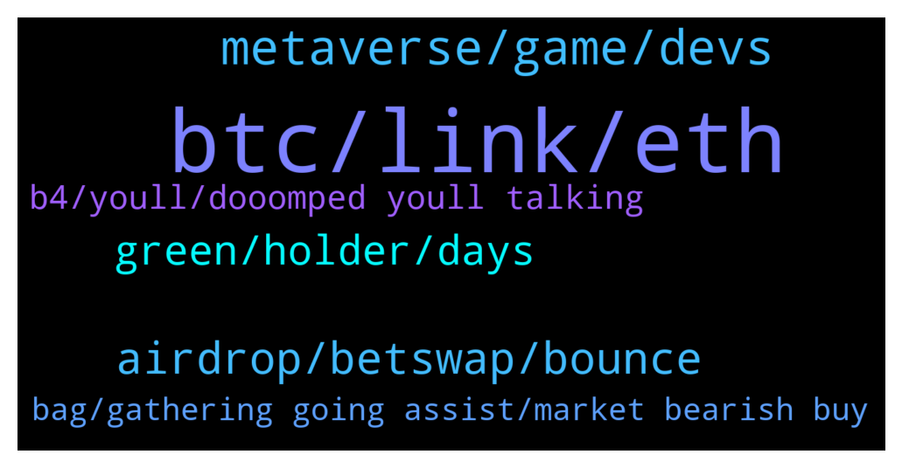

# **@shitpool**
 ## Analysis for **2022-01-10** - **2022-01-11**.

---

## 📊 **Basic Stats**

**n_messages_sent**: 222

---

---

## 🔝 **Top keywords and related messages**

1. **btc, link, eth**

    @BeAMightyKing --- *Here's how I'd play Chainlink today, as I'd found much more consistent levels on the BTC pair back when I'd traded it from its mainnet (April 2019) thru late 2020. It might see trouble around the 0.618 fib retracement from ATH in sats, ~0.0012. That's around $51 - $52 according to BTC's current price, coincidentally at prior USD ATH @brendanplayford   LINK-BTC:  https://www.tradingview.com/x/YQa455vt/* **--->** [TG Discussion](https://t.me/shitpool/715473)

    @wojackdegreate --- *We need a brutal bear market to flush out the plebs who think ADA is going to $200* **--->** [TG Discussion](https://t.me/shitpool/715591)

    @goldencatpat --- *lmao u think cobie has 1000 btc* **--->** [TG Discussion](https://t.me/shitpool/715750)

    @yesbutalsono --- *Pervys picks: BTC ETH CEL TIME SPELL LINK rDPX* **--->** [TG Discussion](https://t.me/shitpool/715802)

    @MoneroPal --- *These uneducated clueless clowns blathering how crypto is some sort of messah that will topple world governments and the financial system just don’t get it...* **--->** [TG Discussion](https://t.me/shitpool/715587)

    @da0man --- *there are at least 5 people with 100+ mil here that talk to you sometimes* **--->** [TG Discussion](https://t.me/shitpool/715676)

2. **metaverse, game, devs**

    @MoneroPal --- *Can someone explain how variosu cities around the world are being added to the metaverse, what is stopping another project using another chain from just recreating those said cities in their own metaverse or version of it? It seems extremely stupid at this point...* **--->** [TG Discussion](https://t.me/shitpool/715489)

    @Blazmeen --- *Tbh I'm surprised ppl don't generally consider the market audience for metaverses. Assuming we're talking about gamers - are they really going to dole out $100k-$2.5M to buy land off an investor? Or $XXX to rent it?* **--->** [TG Discussion](https://t.me/shitpool/715527)

    @MoneroPal --- *So it’s a good play to buy and rent out the metaverse to players?* **--->** [TG Discussion](https://t.me/shitpool/715529)

    @wojackdegreate --- *I think metaverse plays are running on borrowed time… but who knows* **--->** [TG Discussion](https://t.me/shitpool/715532)

    @pizza_dog --- *Imagine going to someone and saying “I own your home in the metaverse”* **--->** [TG Discussion](https://t.me/shitpool/715498)

    @OxZilla --- *I heard from a new source Sidus some new metaverse game might be getting a t1 exchange listing this month* **--->** [TG Discussion](https://t.me/shitpool/715898)

3. **airdrop, betswap, bounce**

    @yesbutalsono --- *Time airdrop for betswap happened 2 hours ago* **--->** [TG Discussion](https://t.me/shitpool/715780)

    @AsianFever --- *https://docs.looksrare.org/guides/faqs/what-is-the-looks-airdrop another airdrop for opensea users, was about 500 usd for me only :( probably most of you nft degens got at least a few k* **--->** [TG Discussion](https://t.me/shitpool/715879)

    @pizza_dog --- *Looks like the time airdrop thing is happening this week* **--->** [TG Discussion](https://t.me/shitpool/715766)

    @MoneroPal --- *Is the airdrop legit? Yes, it’s been announced Jan 6th. It will take place next week.* **--->** [TG Discussion](https://t.me/shitpool/715635)

    @HasanKashif --- *Airdrops work decently even in bearish sentiments even if it was ICX or OMG.* **--->** [TG Discussion](https://t.me/shitpool/715522)

    @HasanKashif --- *XLM might see some upward movement for 15th of January snapshot of Aqua airdrop. It has been performing okayish against BTC from some time.* **--->** [TG Discussion](https://t.me/shitpool/715521)

4. **green, holder, days**

    @kentkadewell --- *TIME still have a skitz apy probably why* **--->** [TG Discussion](https://t.me/shitpool/715819)

    @pizza_dog --- *like if you bought just now, the extra time wouldnt factor in* **--->** [TG Discussion](https://t.me/shitpool/715783)

    @pizza_dog --- *i dont think it happened. i think that's just like the date at which they calculate how much you're going to get based on how much time you have then* **--->** [TG Discussion](https://t.me/shitpool/715782)

    @Amar'e --- *No, because they timestamp, so you can skip the ads* **--->** [TG Discussion](https://t.me/shitpool/715733)

    @MoneroPal --- *If you’re a TIME, MEMO, or wMEMO holder it wil be automatic* **--->** [TG Discussion](https://t.me/shitpool/715638)

    @thelostwolf69 --- *TIME doing good work these days* **--->** [TG Discussion](https://t.me/shitpool/715848)

5. **b4, youll, dooomped youll talking**

    @Horselorde --- *You got rekt just say it* **--->** [TG Discussion](https://t.me/shitpool/715629)

    @yesbutalsono --- *yeh quite the doubled edged sword* **--->** [TG Discussion](https://t.me/shitpool/715821)

    @yesbutalsono --- *or b4 we get dooomped on* **--->** [TG Discussion](https://t.me/shitpool/715800)

    @yesbutalsono --- *Youll see us talking about shit before it goes typically* **--->** [TG Discussion](https://t.me/shitpool/715799)

    @Horselorde --- *That’s how it is when everything is rekt lol* **--->** [TG Discussion](https://t.me/shitpool/715721)

    @wanker007 --- *Or we rekt this Fri again lol* **--->** [TG Discussion](https://t.me/shitpool/715525)

6. **bag, gathering going assist, market bearish buy**

    @MoneroPal --- *amazing volume ser, certaintly so much opportunity to cash out big bag* **--->** [TG Discussion](https://t.me/shitpool/715970)

    @Gregoranus --- *CZ Owes me a bag of this, but put it back about two months. Gutted.* **--->** [TG Discussion](https://t.me/shitpool/715967)

    @onchainjoe --- *oh i get it now, it was for me. not holding this piece of trash lol sorry* **--->** [TG Discussion](https://t.me/shitpool/715960)

    @thelostwolf69 --- *Please don't buy, I don't want it to dump* **--->** [TG Discussion](https://t.me/shitpool/715849)

    @BeAMightyKing --- *for ex: I had Solana overextend on fib extensions & sold way too early ($100), when I instead could've just waited for corn weakness* **--->** [TG Discussion](https://t.me/shitpool/715463)

    @ginnyyto --- *Anyway, how was your bag going? Seems the market is still on bearish* **--->** [TG Discussion](https://t.me/shitpool/715874)

