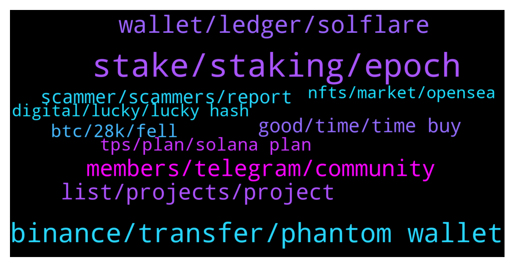

# **@solana**
 ## Analysis for **2022-01-10** - **2022-01-11**.

---

## 📊 **Basic Stats**

**n_messages_sent**: 409

---

---

## 🔝 **Top keywords and related messages**

1. **stake, staking, epoch**

    @callq --- *When do I see when the next epoch ends (and I get my mSOL marinade rewards)? Also how/where will rewards be paid out to mSOL holders, how does that work?* **--->** [TG Discussion](https://t.me/solana/897787)

    @Iamdeadlyz --- *Perhaps you are referring to "staking/delegating"?  If you want to earn 1 SOL per day you have to stake at least 6180 SOL. You can try the calculator on stakingrewards com.* **--->** [TG Discussion](https://t.me/solana/898244)

    @JimmyGg --- *how can i move or swap or stake wsSOL..i have it stuck in terra station rn* **--->** [TG Discussion](https://t.me/solana/899557)

    @callq --- *Well I think at least epoch timing is pretty simple.* **--->** [TG Discussion](https://t.me/solana/897795)

    @I_Vysh --- *Nope. When you swap via Jup or other you pay swap fee.  If you stake directly on Marinade site - there are no any fee* **--->** [TG Discussion](https://t.me/solana/897809)

    @callq --- *explorer . solana tells us we have 1 day and 6 hours in the current epoch. But how mSOL rewards are paid, I have no idea yet.* **--->** [TG Discussion](https://t.me/solana/897802)

2. **binance, transfer, phantom wallet**

    @Derick --- *Oh yeah im not downloading binance for that but thank you* **--->** [TG Discussion](https://t.me/solana/898241)

    @Alyy85 --- *My coins got stuck and i didn't know msol is not listed on binance* **--->** [TG Discussion](https://t.me/solana/898322)

    @Alyy85 --- *Admin any info about Msol will list on binance* **--->** [TG Discussion](https://t.me/solana/898320)

    @RealPrinceOla --- *Solana network is not congested, wait for your coin. You will receive it soon.* **--->** [TG Discussion](https://t.me/solana/898843)

    @sasmoj --- *Like 10 people wrote me in dm lol, but on binance it says that is congested, yesterday i try and it came back, so if now i try to send to my phantom wallet it should arrive in like 5 min correct?* **--->** [TG Discussion](https://t.me/solana/898845)

    @WhoisKaymind --- *can anyone help me to transfer my solana from binance to phantom wallet? is that possible?* **--->** [TG Discussion](https://t.me/solana/898781)

3. **wallet, ledger, solflare**

    @mahib45 --- *Check it out link below on how you can buy SOL here - https://coinmarketcap.com/currencies/solana/markets/  Or https://www.coingecko.com/en/coins/solana#markets  You can also buy on DEXs by connecting your wallet with DEXs. For DEXs - https://t.me/solana/481292   Please note that our admins won't DM you first* **--->** [TG Discussion](https://t.me/solana/898731)

    @Innervision0021 --- *Not sure about their dex sorry man, but the coin is worth looking into* **--->** [TG Discussion](https://t.me/solana/897756)

    @Jordan --- *Different ecosystem tho right? I do have some FTM tho. Is there a DEX you recommend?* **--->** [TG Discussion](https://t.me/solana/897723)

    @mahib45 --- *○ There are ten 🔟 options to stake your SOL token ! 📒 https://docs.solana.com/staking 1️⃣ Phantom App  https://phantom.app/blog/solana-staking-in-just-3-clicks Tutorial: https://twitter.com/stakefish/status/1428924822424363015   2️⃣ SOLFLARE  》Stake SOL token on solflare without ledger:   🎦 Video guide : https://www.youtube.com/watch?v=5Tf0os-JRcs  📝 Article guide: https://medium.com/@stakingfac/how-to-stake-on-solana-with-solflare-a-keystore-file-9f7cd5fba169  Staking SOL with Solflare Crypto-Wallet” by Víctor | melea:  https://link.medium.com/q872cfJqLab  》 Stake SOL token using solflare and ledger Nano S:  🎦 Video guide: https://www.youtube.com/watch?v=EAWJ12Y4v_M  📝 Article guide : https://medium.com/@stakingfac/how-to-stake-on-solana-with-solflare-a-ledger-nano-s-bdcc90d769c7  Website: https://solflare.com Telegram: @SolFlare_Wallet  ➖➖➖➖➖➖➖➖➖➖➖➖➖➖➖➖➖➖➖➖➖  3️⃣ ON LEDGER  》Stake SOL token using Command Line Interface (CLI) and Ledger Nano S  🎦 Video Guide : https://youtu.be/jg2WQcfAXHo  📝 Article Guide: (On ledger Nano X & S) https://link.medium.com/duLh90X9pab  📋https://docs.solana.com/cli/delegate-stake  📖  More tutorials are available :   https://stake2earn.com/how-to-stake-solana-with-ledger-nano-x.html   https://stake2earn.com/how-to-stake-solana-with-keystore-file.html ➖➖➖➖➖➖➖➖➖➖➖➖➖➖➖  4️⃣ Moonlet  https://bit.ly/2MV4muZ  5️⃣  FTX http://ftx.com/staking  6️⃣ Binance  https://www.binance.com/en/support/announcement/a5c507485f7843d8b3a3800fee3c1f84  7️⃣ Exodus https://www.exodus.com/blog/how-to-stake-solana-on-exodus/  8️⃣ Atomic wallet  https://atomicwallet.io/solana-staking 9️⃣ Kraken  https://www.kraken.com/u/funding/staking  🔟 OKex  https://www.okex.com/earn/announce* **--->** [TG Discussion](https://t.me/solana/898661)

    @Franck_Lab --- *Hello, I wanted to know if it's possible to transfer stacked slrs from my solflare wallet to a new solflare wallet. I posted a more detailed version of this question on Reddit Solana but no one respond since yesterday, that's why I'm asking here, if it's the right place to... Thank you :)* **--->** [TG Discussion](https://t.me/solana/899433)

    @Futurelife2 --- *Hi admin please can I create a token with tax tokenomics on Solana* **--->** [TG Discussion](https://t.me/solana/899427)

4. **members, telegram, community**

    @Rosal133 --- *@cryptolover1987 Is there solana support to report? scammer address,  C2JoNvhfh4WYLUzDDE4YFeqsMQT3UrexJKfARA1JYYmw* **--->** [TG Discussion](https://t.me/solana/899339)

    @Rosal133 --- *Hi, in solana's network there was an nft project making fraud, almost 9000 solana went into her pocket, how can we report this to solana?* **--->** [TG Discussion](https://t.me/solana/899332)

    @thepeoplesdegen --- *admin can i post giveaway link here? giving away $150 in sol on twitter rn* **--->** [TG Discussion](https://t.me/solana/898446)

    @mahib45 --- *Hello to all the newcomers! 👋    Welcome to Solana official community! As you just entered in #Solana, in case you have a question about what is #Solana?  Solana is a fast, secure, and censorship-resistant blockchain providing the open infrastructure required for crypto to scale to global adoption.   To read more about Solana please visit  Website: www.solana.com Document: https://docs.solana.com/introduction  ⚠️ Please be aware of fraudulent actors posing as Solana team members on Telegram. If you do receive suspicious messages, do not respond, click on links or follow any instructions. ✅ We recommend changing your telegram privacy settings to avoid being added to scam groups. ❗️There is no Solana airdrop or free giveaway!* **--->** [TG Discussion](https://t.me/solana/898986)

    @mahib45 --- *Hello  👋    Welcome to Solana official community! As you just entered in #Solana, in case you have a question about what is #Solana?  Solana is a fast, secure, and censorship-resistant blockchain providing the open infrastructure required for crypto to scale to global adoption.   To read more about Solana please visit  Website: www.solana.com Document: https://docs.solana.com/introduction  ⚠️ Please be aware of fraudulent actors posing as Solana team members on Telegram. If you do receive suspicious messages, do not respond, click on links or follow any instructions. ✅ We recommend changing your telegram privacy settings to avoid being added to scam groups. ❗️There is no Solana airdrop or free giveaway!* **--->** [TG Discussion](https://t.me/solana/898533)

    @Monterrey_Rice --- *Please DYOR. Here are some good resources to start!  Welcome to Solana's Official Telegram Group 🚀🚀 ➖➖➖➖➖➖➖ ℹ️ OVERVIEW Solana is a high-speed single-layer blockchain, currently supporting peak capacity of 65k transactions per second and 400ms block times in a globally distributed network with more than 900 nodes. It's explicitly built to scale transaction throughput with Moore's Law (doubling GPU core count every ~2 years). There is NO SHARDING required to achieve this throughput. ➖➖➖➖➖➖➖ 🧐 RESOURCES Website: https://solana.com Newsletter: https://solana.com/newsletter Medium: https://medium.com/solana-labs GitHub: https://github.com/solana-labs Reddit: https://www.reddit.com/r/solana/ Twitter: https://twitter.com/solana Podcast: https://solana.com/podcast ➖➖➖➖➖➖➖ 💻 TECHNICAL Network Stats: https://solanabeach.io Docs: https://docs.solana.com/ Discord: https://discord.gg/solana Whitepaper: https://solana.com/solana-whitepaper.pdf Tokenomics: https://solana.com/tokens ➖➖➖➖➖➖➖ ⚠️  Community Rules  ⚠️  ☀️We are a friendly community - please treat each other with respect. ☀️Personal attacks, harassment, racism, bigotry, doxing and harmful slurs of any kind will not be tolerated. ☀️No spam, shilling advertising or referral links ☀️To maintain the integrity of this group, posts that are repetitive, irrelevant or for personal gain will be deleted. ☀️Please write only in English -  check out our international communities for a Solana group in your region! ☀️Buying and selling, OTC discussion between community members is not allowed. ☀️Members who post short statements about price or volume without any context or reasoning will be given a warning; if you continue, you will be banned.  ☀️Admins are happy to help, so don't hesitate to ask. ⚠️Please be aware of scammers. Admin will send you direct messages first nor ask you to send funds. Be sure to check the admin tag before you send a DM to any of the admins. ⚠️The safety of the community is a top priority for Solana. With this in mind, please do not use the Solana logo in your account profile or otherwise impersonate Solana or Solana team members. Any infringement of this nature may result in the removal of your account from this group, without notice. ➖➖➖➖➖➖➖ ✅ Join @solanaannouncements to stay up to date on the latest major news and announcements ➖➖➖➖➖➖➖ 🗃 Wallets:  ⁃ Phantom  ⁃ TrustWallet  ⁃ Coin98  ⁃ SolFlare  ⁃ Sollet  ⁃ MathWallet  https://docs.solana.com/wallet-guide ➖➖➖➖➖➖➖ 🛡INSTRUCTIONS:  Staking on Solana: https://docs.solana.com/staking  Start Building on Solana: https://docs.solana.com/developing/programming-model/overview  Run a Validator Node: https://docs.solana.com/running-validator  Create an SPL Token: https://spl.solana.com/token  Integrate an Exchange: https://docs.solana.com/integrations/exchange  Learn How Solana Works: https://docs.solana.com/cluster/overview ➖➖➖➖➖➖➖ 🧮 RANKING AND INFORMATION SERVICES  https://coinmarketcap.com/currencies/solana/ https://messari.io/asset/solana/profile* **--->** [TG Discussion](https://t.me/solana/898573)

5. **list, projects, project**

    @Raven_Claws --- *Where can I find a list of Solana projects* **--->** [TG Discussion](https://t.me/solana/899074)

    @molahnelson --- *Where can I get all the list of all the Protocols build on Solana* **--->** [TG Discussion](https://t.me/solana/898457)

    @amisgur --- *Hi. Does anyone has any idea of Solpad team? Are they part of Sol team or not?* **--->** [TG Discussion](https://t.me/solana/899173)

    @andersonet --- *Hello, does anyone know what Solana's contract for the BEP20 network is?* **--->** [TG Discussion](https://t.me/solana/898695)

    @cryptolover1987 --- *Hello!  Check this out👇🏻  1️⃣ Solana Ecosystem  https://solana.com/ecosystem  2️⃣ New projects detail https://twitter.com/Solana_Mates   3️⃣ Tokens on Solana chain  https://solscan.io/tokens* **--->** [TG Discussion](https://t.me/solana/899121)

    @mahib45 --- *Hello 👋  You can  explore the run-through of core innovations around Solana.  https://medium.com/solana-labs/7-innovations-that-make-solana-the-first-web-scale-blockchain-ddc50b1defda* **--->** [TG Discussion](https://t.me/solana/897524)

6. **good, time, time buy**

    @S W --- *Hi, Any one can pls advise on the strong support and resistance ? Good time to buy Sol ?* **--->** [TG Discussion](https://t.me/solana/898184)

    @VSiDV177 --- *Depends on your target. From my point of view, Solana is fine for 30-35% gains in mid-long term.* **--->** [TG Discussion](https://t.me/solana/899086)

    @Avinash --- *Hi Guys, I’m new to solana. All I can see is a dip right now. I know it’s impossible to guess right time in market. But solana at 150$ would be a good purchase?* **--->** [TG Discussion](https://t.me/solana/899082)

    @Niklas --- *Its always time to buy solana if u believe in it* **--->** [TG Discussion](https://t.me/solana/898068)

    @Shahid --- *Is it good time to purchase SOL* **--->** [TG Discussion](https://t.me/solana/899011)

    @manojsolanki --- *Any suggestions on solana ?  At what price would be a good entey now* **--->** [TG Discussion](https://t.me/solana/898445)

7. **scammer, scammers, report**

    @crptix --- *Scammers ask you to sync your wallet with their fake website and ask you to provide your recovery phrase or private key, so that they can steal your funds* **--->** [TG Discussion](https://t.me/solana/897371)

    @kiteBs --- *howa work you with the scamer* **--->** [TG Discussion](https://t.me/solana/899508)

    @IAMNAEGLE --- *Already got a dm from a scammer* **--->** [TG Discussion](https://t.me/solana/898411)

    @Iamdeadlyz --- *aha, impersonator deleted his/her message  @mahib45 here's the details of the scammer: Id: 5020394357 First: Mahib Last: (Never PM for money and DM first)* **--->** [TG Discussion](https://t.me/solana/898102)

    @Nawaab_saab --- *One more scammer, just joined to help us* **--->** [TG Discussion](https://t.me/solana/897364)

    @C --- *Lmfao, please gtfo scammer @cryptolover1987 scammer report* **--->** [TG Discussion](https://t.me/solana/897330)

8. **btc, 28k, fell**

    @BertSanti --- *BTC is down, they go hand in hand most of the time. But both are going up a bit* **--->** [TG Discussion](https://t.me/solana/898384)

    @C --- *BTC is at a support of 40k, if it breaks the support of 40K the next support is 28K, in my opinion this is bearmarkt signs, but again a cycle like that never happened that it fell to 3rd. Don’t take this as financial advice but aslong as BTC floats between 40K+ you’re safe* **--->** [TG Discussion](https://t.me/solana/898200)

    @n999110 --- *I would rather sell it before btc crashes* **--->** [TG Discussion](https://t.me/solana/899274)

    @katrin646 --- *The reason for the increase in btc prices during this period, in my opinion, is the purchase of whales that are filling their bags* **--->** [TG Discussion](https://t.me/solana/898456)

    @Benn2550 --- *Wait for btc 28k to buy anything* **--->** [TG Discussion](https://t.me/solana/898223)

    @jugador654 --- *Which one? I just want to know why btc will drop to 28k I think it’s a lot* **--->** [TG Discussion](https://t.me/solana/898339)

9. **tps, plan, solana plan**

    @sophia_marti --- *Solana will be faster and bigger in terms of projects on the network in the next 1 year.* **--->** [TG Discussion](https://t.me/solana/897952)

    @Frenkie2020 --- *When is the official mainnet out ?* **--->** [TG Discussion](https://t.me/solana/898785)

    @sasmoj --- *Hi guys, is the solana network congested?* **--->** [TG Discussion](https://t.me/solana/898831)

    @Rodeodave --- *Anyone know anything about upcoming token bridges to Solana? I've heard rumors...* **--->** [TG Discussion](https://t.me/solana/899315)

    @Javier --- *Anatoly said on a podcast interview mainnet will be launched once beta runs a full year without any major problem. Idk if that plan stills the same or not* **--->** [TG Discussion](https://t.me/solana/898818)

    @cryptolover1987 --- *Please keep an eye on Solana twitter account. If it’s real then announcement will be published there.* **--->** [TG Discussion](https://t.me/solana/898124)

10. **digital, lucky, lucky hash**

    @Hahayaid --- *Crypto is a benefit to the society* **--->** [TG Discussion](https://t.me/solana/898932)

    @София --- *An interesting concept, crypto fantasy coin allows you to play and earn money with your pals.* **--->** [TG Discussion](https://t.me/solana/899298)

    @Onikiada --- *Yesss, if a coin is really decentralized.* **--->** [TG Discussion](https://t.me/solana/898981)

    @Annorther --- *The cryptocurrency world is constantly changing with services coming and going. Mainstream cryptocurrencies remain the primary priority of savvies.* **--->** [TG Discussion](https://t.me/solana/898159)

    @kkk98888 --- *Lucky Hash Lucky Hash 2022's strongest gold medal project is coming The only bet on the entire network in the form of digital currency No need to use cash, avoid the risk of freezing cards Fair, safe, open and transparent for all records Create the largest digital currency lottery platform in China Contact customer service TG: LuckyHashKF* **--->** [TG Discussion](https://t.me/solana/898024)

    @weifang84 --- *WhatsApp launches cryptocurrency payments pilot in US* **--->** [TG Discussion](https://t.me/solana/899134)

