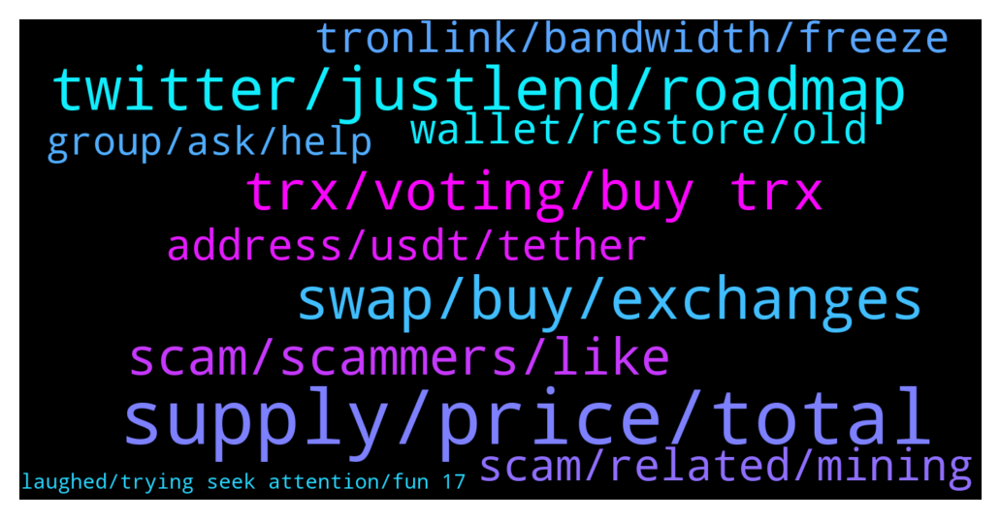

# **@tronnetworkEN**
 ## Analysis for **2022-01-10** - **2022-01-11**.

---

## 📊 **Basic Stats**

**n_messages_sent**: 359

---

---

## 🔝 **Top keywords and related messages**

1. **supply, price, total**

    @Carlos_TRX --- *All graphs market are in red, not only TRX* **--->** [TG Discussion](https://t.me/tronnetworkEN/3821704)

    @Q0610 --- *Should have been selling then, wouldn't be here in this mess right now. I should add that if I sold then I would be buying now lol* **--->** [TG Discussion](https://t.me/tronnetworkEN/3821764)

    @agentpiki --- *Go to tronscan.org  Check out the charts. Your question will be answered with reading* **--->** [TG Discussion](https://t.me/tronnetworkEN/3823123)

    @Rapiero --- *So if will be burn then the price will automatically go up as the total suppy will be decreased?😅👁🤨* **--->** [TG Discussion](https://t.me/tronnetworkEN/3822079)

    @turbo_tutone --- *i know a dude who says it goes 1.2 according to fibonacci...but i dont know...its all manipulated...but i think i must fly over its last time ath which was 0.3 i guess.* **--->** [TG Discussion](https://t.me/tronnetworkEN/3821609)

    @Waheedalam868 --- *In binance ath of tron 75$. Will it be reach even 1$ in near future* **--->** [TG Discussion](https://t.me/tronnetworkEN/3823378)

2. **twitter, justlend, roadmap**

    @Waheedalam868 --- *Is there any roadmap of tron* **--->** [TG Discussion](https://t.me/tronnetworkEN/3823351)

    @Andreasilvano1 --- *What is wrong with , tron* **--->** [TG Discussion](https://t.me/tronnetworkEN/3823773)

    @Bo --- *what is the support for tron?* **--->** [TG Discussion](https://t.me/tronnetworkEN/3823560)

    @PiterSpain --- *🔥APENFT & Tron Gamefi Hackathon Workshop is coming！  Learn Gamefi tech development on Tron by watching this workshop with DoraHacks Tutor: Max Shapiro from Cadenza Time：Jan 12, 2022 10pm（UTC+8）  Live here：https://youtu.be/83oxzInGI7k  https://twitter.com/apenftorg/status/1480766083976278024* **--->** [TG Discussion](https://t.me/tronnetworkEN/3823319)

    @simon866 --- *Update by votes can be seen on tronscan, other updates are best seen on media such as Twitter and here pinned 👍* **--->** [TG Discussion](https://t.me/tronnetworkEN/3823359)

    @Carlos_TRX --- *You cannot follow a roadmap, the future of TRON is directed by the votes of the users in the SRs who are the ones who propose new projects and improvements in the ecosystem.* **--->** [TG Discussion](https://t.me/tronnetworkEN/3823367)

3. **swap, buy, exchanges**

    @eeeeeeeee8 --- *Which exchange can be used to buy* **--->** [TG Discussion](https://t.me/tronnetworkEN/3823802)

    @Turiddu171 --- *I have plenty of bandwidth and energy in Klever wallet. Does that help with swap?* **--->** [TG Discussion](https://t.me/tronnetworkEN/3822457)

    @Carlos_TRX --- *sure , why not? what problem do you have in buy in exchanges ?* **--->** [TG Discussion](https://t.me/tronnetworkEN/3823799)

    @DmG_90 --- *Nothing to worry about, its just about the swap in BTT* **--->** [TG Discussion](https://t.me/tronnetworkEN/3823188)

    @agentpiki --- *Check coinmarketcap.com  Check price difference.  Centralized exchanges doing auto swaps for their users.* **--->** [TG Discussion](https://t.me/tronnetworkEN/3822437)

    @agentpiki --- *Your best bet is to move your BTTOLD to tronlink and swap manually.  Or if you don't want to use resources then you might want to look for centralized exchanges which have not yet adopted the new BTT.* **--->** [TG Discussion](https://t.me/tronnetworkEN/3822454)

4. **trx, voting, buy trx**

    @MilNoslen --- *Loooool they better Fing list TRX* **--->** [TG Discussion](https://t.me/tronnetworkEN/3820203)

    @Calon_Crypto --- *When will TRX maintenance be completed?* **--->** [TG Discussion](https://t.me/tronnetworkEN/3822493)

    @Guy --- *Now that Justin moved on, what's the plan for TRX?* **--->** [TG Discussion](https://t.me/tronnetworkEN/3820421)

    @eeeeeeeee8 --- *Thanks, I would like to know if Mexicans can buy TRX* **--->** [TG Discussion](https://t.me/tronnetworkEN/3823798)

    @JW9779 --- *Have faith, TRX will get there* **--->** [TG Discussion](https://t.me/tronnetworkEN/3821624)

    @NawedAnjumkhan007 --- *There is no godfather of trx now... we should shift now* **--->** [TG Discussion](https://t.me/tronnetworkEN/3820432)

5. **scam, scammers, like**

    @Magnavox_Business --- *He blocked me. I can't see the tag; or he doesn't have username.* **--->** [TG Discussion](https://t.me/tronnetworkEN/3821315)

    @Chethan --- *admin please ban tron guardian he is doing scam* **--->** [TG Discussion](https://t.me/tronnetworkEN/3821156)

    @فيراس --- *Keep wondering... Do they really gain any profit? The scam busines 😕* **--->** [TG Discussion](https://t.me/tronnetworkEN/3821407)

    @agentpiki --- *Because you got scammed  Why crying here? that scam is not related to us* **--->** [TG Discussion](https://t.me/tronnetworkEN/3821174)

    @turbo_tutone --- *haha lots of spammers and scammers around today...* **--->** [TG Discussion](https://t.me/tronnetworkEN/3821562)

    @turbo_tutone --- *these are cruel scammers! with no conscience* **--->** [TG Discussion](https://t.me/tronnetworkEN/3821527)

6. **scam, related, mining**

    @ⴱⴻⵏⵉ oⵓⵍⵉⵛⵀⴻⴽ --- *Is 7mine site legit or not?* **--->** [TG Discussion](https://t.me/tronnetworkEN/3819634)

    @Sagar --- *can anyone explain about tron mining app* **--->** [TG Discussion](https://t.me/tronnetworkEN/3820988)

    @Ny202020 --- *Be careful of Tron mining scam.... beware....☺️* **--->** [TG Discussion](https://t.me/tronnetworkEN/3823312)

    @agentpiki --- *Not related to official tron.  Might be scam.* **--->** [TG Discussion](https://t.me/tronnetworkEN/3821073)

    @Carlos_TRX --- *Scam, TRON can not be mined* **--->** [TG Discussion](https://t.me/tronnetworkEN/3821018)

    @PiterSpain --- *there is no mining on TRON so stay away from that. If you have any problem with them ask them, they have nothing to do with us.* **--->** [TG Discussion](https://t.me/tronnetworkEN/3820130)

7. **address, usdt, tether**

    @Đỗ --- *@agentpiki hello. my friend transferred usdt to me. His address is a private address, so the transaction was made through a public address. TQNheVnmrtnJ2KRUuePBhJWQWhFmPjX7iH.  There was an error that caused me to automatically refund to that address. Can I get it back?* **--->** [TG Discussion](https://t.me/tronnetworkEN/3820302)

    @Siva --- *Sir i send usdt to wrong address  it possible to reback my usdts* **--->** [TG Discussion](https://t.me/tronnetworkEN/3820902)

    @Bo --- *on zelcore when i want transfer usdt tr20 i have a transaction refusee bu tether20* **--->** [TG Discussion](https://t.me/tronnetworkEN/3823542)

    @agentpiki --- *You sent your USDT to Smart contract. That is wrong. You should have sent USDT to individual wallet address.  For these kind of error, you need to contact tether support:   tether.to* **--->** [TG Discussion](https://t.me/tronnetworkEN/3820894)

    @geafk --- *Good afternoon, gentlemen, I apologize for the warnings. Unknowingly, I transferred my USDT (TRC20) to the address of the contract. How can I provide the data back. Is it possible?* **--->** [TG Discussion](https://t.me/tronnetworkEN/3819904)

    @Nambbii --- *Hi,  I have transferred the fund to USDT Contract address. Is there is possible to revert the funds back to my wallet?* **--->** [TG Discussion](https://t.me/tronnetworkEN/3823083)

8. **tronlink, bandwidth, freeze**

    @Bo --- *hello, the tron network has problem?* **--->** [TG Discussion](https://t.me/tronnetworkEN/3823533)

    @guelguelplayer --- *Will the tcr10 network continue to work?  because there is the Dlive Platform!* **--->** [TG Discussion](https://t.me/tronnetworkEN/3819890)

    @PiterSpain --- *TRC10 is a TRON token protocol, a kind of token. It is something that will always exist, what I mean is that it is not something that can be removed from TRON Network, it is a feature of TRON  Maybe you could reformulate your question 😅* **--->** [TG Discussion](https://t.me/tronnetworkEN/3819992)

    @KryptoRaz85 --- *Hey any ideas why i cant load the Tronpad Website with Tronlink Dapp Browser* **--->** [TG Discussion](https://t.me/tronnetworkEN/3823813)

    @turbo_tutone --- *you only need tronlink and you are ready to go* **--->** [TG Discussion](https://t.me/tronnetworkEN/3822149)

    @Gaziz --- *What is cold walled it needed to make transfer from tronlink to binance* **--->** [TG Discussion](https://t.me/tronnetworkEN/3819926)

9. **wallet, restore, old**

    @agentpiki --- *It doesn't matter if I look into hash. The funds will not come back  Did you click on something* **--->** [TG Discussion](https://t.me/tronnetworkEN/3820880)

    @یاک --- *It,s 3 h i did deposit but the site didnt get recive🥺🥺* **--->** [TG Discussion](https://t.me/tronnetworkEN/3823091)

    @jay888djw --- *Hi I have some old token on my ledget wallet, it showed total hold as 0. I undersand it is a display issue but, now my Ledger is broken. I have my recovery phase. Is that possible to  restore the wallet on an online /mobile wallet?Even if i restore it, the Tron ERC old token will not be displayed. The complicate bit is not only i want to restore my ledger wallet, I want to restore my old token to this new wallet which most likely does not support ERC TRX anymore.* **--->** [TG Discussion](https://t.me/tronnetworkEN/3822030)

    @eeeeeeeee8 --- *Yes sir, but I can't seem to log in to Cryptocurrency* **--->** [TG Discussion](https://t.me/tronnetworkEN/3823628)

    @xPommepote --- *Where do you deposit ? Contact the site directly. Also share the transaction hash here so we can check what is going on. Transactions are processed in less than 1 min* **--->** [TG Discussion](https://t.me/tronnetworkEN/3823119)

    @Himanshu --- *It has more potentail i belive if you are new and messed up you gonna put negative thought on that even its your fault. You know how to use without messing its way better than blockchain wallet.(blockchain suc*s)  P.S ( you is not you in this you its just you with random you)😅* **--->** [TG Discussion](https://t.me/tronnetworkEN/3821757)

10. **group, ask, help**

    @agentpiki --- *You are always asking for help since you are here. Nothing solved?!   If you are trolling for attention, I will mute you* **--->** [TG Discussion](https://t.me/tronnetworkEN/3820851)

    @Nima97074 --- *Hello, it is a group for Iranians* **--->** [TG Discussion](https://t.me/tronnetworkEN/3822742)

    @MilNoslen --- *If you have an issue, you ask in the group chat* **--->** [TG Discussion](https://t.me/tronnetworkEN/3821892)

    @xhng3 --- *Admen, what's the first two Korean words* **--->** [TG Discussion](https://t.me/tronnetworkEN/3820581)

    @agentpiki --- *@tronnetworkVIE  I think you are vietnamese. Go there you'll get better help* **--->** [TG Discussion](https://t.me/tronnetworkEN/3820354)

    @simon866 --- *We can only help if you tell us the issue? 🤷‍♂️* **--->** [TG Discussion](https://t.me/tronnetworkEN/3819570)

