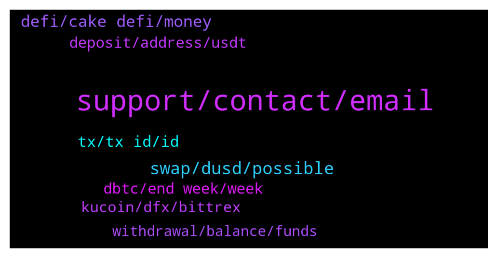

# **@CakeDeFi_EN**
 ## Analysis for **2022-01-11** - **2022-01-12**.

---

## 📊 **Basic Stats**

**n_messages_sent**: 299

---

---

## 🔝 **Top keywords and related messages**

1. **support, contact, email**

    @fabioandreatta --- *Yes we do! Reach out to our CS if you have found something, we have rewards of up to 30,000 USD* **--->** [TG Discussion](https://t.me/CakeDeFi_EN/163485)

    @gilldog --- *So true, "thanks for your feedback!Noted" - What a joke! It would take them a couple minutes to make a banner on top of the website. More profitable for them to have your BTC locked on their platform so they keep it shush and have the guts to reply that they told everyone 🤦👎 Lost a ton of trust on Cake after this one. I hope they will show that it was a genuine mistake and make it right for all of us* **--->** [TG Discussion](https://t.me/CakeDeFi_EN/163242)

    @Misko --- *he has already contacted me(the moderator) about the issue* **--->** [TG Discussion](https://t.me/CakeDeFi_EN/163104)

    @gilldog --- *Again, you need to be more transparent and put banners on top of the page. A Telegram announcement was not enough for something this big. Some people don't check telegram very often nor they continuously click on the withdrawal or deposit tab. You brag transparency all over yet this massive issue had very minimal exposure and it keeps being the same way despite the community complaining. Cake should issue a DFI reward to everyone for their lack of actions taken to inform the community of this. You need a better way to let everyone know. Heck some people still don't know* **--->** [TG Discussion](https://t.me/CakeDeFi_EN/163218)

    @BerndMack --- *there is a question on twitter in exactly this direction:  https://twitter.com/cakedefi/status/1480863995322060800* **--->** [TG Discussion](https://t.me/CakeDeFi_EN/163463)

    @Grinched --- *Thats great for the new members, less for the referral givers haha. Didn't know bout the sharing public my bad!* **--->** [TG Discussion](https://t.me/CakeDeFi_EN/163585)

2. **swap, dusd, possible**

    @Paulius --- *I have tried swaping DFI to BTC. On CakeDefi app.   And i get the message that swaps are only allowed to DFI. So i get rewards in DFI crypto currency, but can not swap DFI to other cryptos.* **--->** [TG Discussion](https://t.me/CakeDeFi_EN/163277)

    @Milad --- *Sorry I meant toke. It is not possible to swap anything onto dex. And it is not possible to send btc via dex* **--->** [TG Discussion](https://t.me/CakeDeFi_EN/163700)

    @fabioandreatta --- *You can use the DEX (light wallet) to swap, there are some services like dfx.swiss and Bitrue that are and always have been open during the period. Kucoin is still under maintenance* **--->** [TG Discussion](https://t.me/CakeDeFi_EN/163267)

    @DmgBautista --- *You'll need to buy DUSD with DFI and then convert a part of that DUSD into the token you wish. After that, just join a pair of DUSD-dToken in a LM pool. Rewards will be majority in DFI and a small part in DUSD as well as the other dToken in the pool, coming from fees* **--->** [TG Discussion](https://t.me/CakeDeFi_EN/163392)

    @syahirmustaffa --- *I dont have any of those. I only have huobi. How bout swapping DFI - BTC and then transfer to other wallet. Would that work?* **--->** [TG Discussion](https://t.me/CakeDeFi_EN/163869)

    @YunTao --- *Is it a good or bad time to have dusd now. ( planning to swap some of my dfi to dusd for dusd-dfi lm)* **--->** [TG Discussion](https://t.me/CakeDeFi_EN/163857)

3. **defi, cake defi, money**

    @SudhishAggarwal --- *I have account with cake defi How can I withdraw funds? Any charges to withdraw funds? I am india* **--->** [TG Discussion](https://t.me/CakeDeFi_EN/163370)

    @Ori --- *I just got email from Defi's cake which contains to immediately deposit my Defi account, I apologize profusely, at this time I don't have enough money, please forgive me.* **--->** [TG Discussion](https://t.me/CakeDeFi_EN/163315)

    @yeahright22 --- *hello, yes, the transaction i have on cakedefi, but not on defiscan.live :(* **--->** [TG Discussion](https://t.me/CakeDeFi_EN/163848)

    @chreeestho --- *Does anybody know how to withdraw dBTC from the cake defi mobile app? When it try to send it to my other wallets it just never goes through.* **--->** [TG Discussion](https://t.me/CakeDeFi_EN/163680)

    @Michael_Schredl --- *Welcome, Start your DeFi Journey Here: Cake  DeFi Services Simply Explained https://support.cakedefi.com/hc/en-us/articles/900003427506-Cake-Service-simply-explained* **--->** [TG Discussion](https://t.me/CakeDeFi_EN/163070)

    @fatihyilmaz22 --- *Hi, are there any problems while depositing and withdrawing money on cake defi with litecoins?* **--->** [TG Discussion](https://t.me/CakeDeFi_EN/163563)

4. **tx, tx id, id**

    @yeahright22 --- *hi, what about confirmed (paid out) DFI transaction, have tx ID, but the tx id does not exist for 4 hours. So after succesful withdrawal of DFI , no withdrawal 4 hours now?!* **--->** [TG Discussion](https://t.me/CakeDeFi_EN/163226)

    @yeahright22 --- *Admin what about tx ids of dfi withdrawals which seems to only completed on the site, but nothing appears on blockchain for 8 hours.So the dfi withdrawal is working only on "site" in reality is not?!* **--->** [TG Discussion](https://t.me/CakeDeFi_EN/163292)

    @ABIOLA SYLVESTER --- *When I tried to withdraw DFi so if I choose ethereum instead of a defi I get to see this* **--->** [TG Discussion](https://t.me/CakeDeFi_EN/163595)

    @Dan --- *Anyone else withdraw dfi and the website says tx went thru but it's not in your defi wallet?* **--->** [TG Discussion](https://t.me/CakeDeFi_EN/163376)

    @yeahright22 --- *Im not the only one who has this kind of error, sais completed, but not even exist on chain.Please forward it.Missing 10k$ for 10hours* **--->** [TG Discussion](https://t.me/CakeDeFi_EN/163440)

    @yeahright22 --- *hello, my DFI withdrawal 2 of them are missing for more than a day, it happens time to time, i wrote to support no answer yet, MISSING MY money, can someone say something?!* **--->** [TG Discussion](https://t.me/CakeDeFi_EN/163846)

5. **dbtc, end week, week**

    @Sebastian --- *You are right,  but nowbody told me, that the DeFi Line is death for dBTC* **--->** [TG Discussion](https://t.me/CakeDeFi_EN/163212)

    @Sebastian --- *How long does it take, that dBTC work?* **--->** [TG Discussion](https://t.me/CakeDeFi_EN/163207)

    @AivernT --- *They're not gonna care coz it's "defi" nobody's accountable lol* **--->** [TG Discussion](https://t.me/CakeDeFi_EN/163237)

    @Vincent --- *Hallo kann ich dbtc eigentlich auch an eine btc adresse senden?* **--->** [TG Discussion](https://t.me/CakeDeFi_EN/163407)

    @jezzkng --- *If DeFiChain solves the unbacked dBTC problem and the majority vote goes through, then Cake DeFi will immediately open up all dBTC channels again. We expect all our BTC channels to be up and running for all our bakers without restrictions by the end of this week.* **--->** [TG Discussion](https://t.me/CakeDeFi_EN/163706)

    @Michael_Schredl --- *After the dBTC issue on the DeFiChain is solved, I guess at the end of this week* **--->** [TG Discussion](https://t.me/CakeDeFi_EN/163319)

6. **deposit, address, usdt**

    @DmgBautista --- *I'll try and ask it someone on the backend can check. At Cake, any withdrawal equal or bigger than 10k$ is manually reviewed without exception  but if you inform that it was efectivelly withdraw, then it needs to be seen.   If you wish, you can also make a support ticket for the below email  https://cake.zendesk.com/hc/en-us/requests/new* **--->** [TG Discussion](https://t.me/CakeDeFi_EN/163443)

    @gilldog --- *It is awesome that you guys answer, but the issue is still there and people are still losing money over it which is frustrating. As mentioned before, lots of us have our deposit address already saved on other platforms. Most of us do not log into Cake every time to copy the deposit address one more time, making the positioning of the banner useless. I personally have received no email from cake regarding this. My account was active but no funds were in there yet so im guessing I was not on that address list. I have been doing quite a bit of research into cake, I had the BTC address already saved on the other platform where I keep my crypto. In the new year I finally felt confident, the address was already saved and I pressed the trigger. I AFTER logged into cake to check the deposit was succesfull. boom. was succesful and everything  was there. So THEN i go use it and only then i see the banner. Hope this is clear for everyone now. At this point didn't even start using cake and I find myself at loss of transaction fees and BTC I can't withdraw back unless i waste even more in BTC fees.* **--->** [TG Discussion](https://t.me/CakeDeFi_EN/163280)

    @t3mpus3rn4m3 --- *Hello👋 Does CakeDefi have a bug bounty program?* **--->** [TG Discussion](https://t.me/CakeDeFi_EN/163483)

    @Vincent --- *Any updates about deposit dbtc on cake?* **--->** [TG Discussion](https://t.me/CakeDeFi_EN/163247)

    @Frank --- *Hi there, any reason or delay in un freezing coins on staking-cake? One of my batches was frozen until 10.01.2022 (no auto renewal)…still not unfrozen yet. Thanks for hints* **--->** [TG Discussion](https://t.me/CakeDeFi_EN/163198)

    @mikelfilko --- *ETH withdrawal fee is in fact 0.015ETH instead of 0.0015, I have been misled by the information on the cake website. Please fix this @cake* **--->** [TG Discussion](https://t.me/CakeDeFi_EN/163153)

7. **kucoin, dfx, bittrex**

    @YSL --- *Dfi 🚀 on KuCoin.. thought many ll rush to exit but instead all rush to buy* **--->** [TG Discussion](https://t.me/CakeDeFi_EN/163732)

    @fabioandreatta --- *Have you tried dfx.swiss? Kucoin, Bitrue and Bittrex are other options* **--->** [TG Discussion](https://t.me/CakeDeFi_EN/163865)

    @syahirmustaffa --- *Hi, for some of us who do not have account with kucoin of any other exchanges that does DFI, what’s the best way to cash out our DFI?* **--->** [TG Discussion](https://t.me/CakeDeFi_EN/163862)

    @jordantelegram5 --- *Is Bitrue an exchange? Does it support TRC20 and/or BEP20?* **--->** [TG Discussion](https://t.me/CakeDeFi_EN/163692)

    @jordantelegram5 --- *Hi, does anyone have an exchange platform to recommend other than KuCoin or Bittrex to trade DFI? KuCoin DFI wallet is down and Bittrex does not support TRC20 neither DeFichain neither BEP-20* **--->** [TG Discussion](https://t.me/CakeDeFi_EN/163685)

    @Kassius84 --- *You may have a look at Bitrue or DFX.swiss* **--->** [TG Discussion](https://t.me/CakeDeFi_EN/163159)

