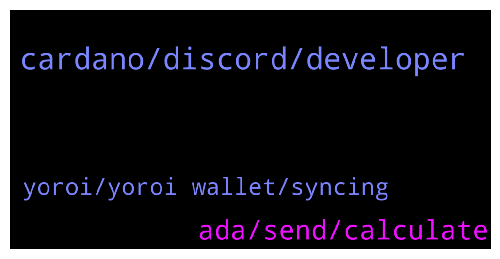

# **@Cardano**
 ## Analysis for **2022-01-11** - **2022-01-12**.

---

## 📊 **Basic Stats**

**n_messages_sent**: 65

---

---

## 🔝 **Top keywords and related messages**

1. **cardano, discord, developer**

    @GioLoop --- *Cardano is increasingly green and ready for recovery https://en.cryptonomist.ch/2022/01/12/cardano-green-ready-to-restart/?utm_source=CryptoMarketCap&utm_medium=app* **--->** [TG Discussion](https://t.me/Cardano/768381)

    @invivekworld --- *Thanks, can we stake cardano or its better to stake at binance?* **--->** [TG Discussion](https://t.me/Cardano/767946)

    @cryptocardano12 --- *when you write a smart contract on cardano do you use haskell* **--->** [TG Discussion](https://t.me/Cardano/768167)

    @CardanoGoldDragon --- *Cardano developer looking for the job?* **--->** [TG Discussion](https://t.me/Cardano/767809)

    @veriumfellow --- *Please vote for Ergo my Cardano friends https://twitter.com/nicehashmining/status/1480630789264093191?s=21* **--->** [TG Discussion](https://t.me/Cardano/767968)

    @jaypatelEarthling --- *@Iohkcharles  maybe Cardano can collaborate with IIT, India   https://www.hindustantimes.com/india-news/blockchainbased-digital-degrees-all-you-need-to-know-about-the-technology-101640677737420.html* **--->** [TG Discussion](https://t.me/Cardano/768216)

2. **ada, send, calculate**

    @lassikem --- *There is only ‘custom amount’ and ‘send all ada + tokens’* **--->** [TG Discussion](https://t.me/Cardano/768280)

    @mostudio --- *If you stake using one of the Ada wallets mentioned and add your ada to an official sundaeswap scooper pool, you will also receive sundae tokens.* **--->** [TG Discussion](https://t.me/Cardano/767986)

    @soup34 --- *Hi Can I send coins to my Used Addresses? Or do I always need to go to a new address?* **--->** [TG Discussion](https://t.me/Cardano/767980)

    @好好先生 --- *Does Ada have a group dedicated to publishing project progress information* **--->** [TG Discussion](https://t.me/Cardano/768199)

    @lassikem --- *…but it isn’t possible to select eg. 5 NFTs from 10 and send them?* **--->** [TG Discussion](https://t.me/Cardano/768284)

    @lassikem --- *So it’s safe to empty my wallet for a few hours then?* **--->** [TG Discussion](https://t.me/Cardano/768293)

3. **yoroi, yoroi wallet, syncing**

    @glitch04 --- *Going to assume this has to do with the Dapp permissions but you can check in the #support channel listed below* **--->** [TG Discussion](https://t.me/Cardano/768310)

    @EhmReally --- *Yoroi wallet auto disabled by browser because it wanted more permissions* **--->** [TG Discussion](https://t.me/Cardano/768308)

    @MarkMorenz --- *Anyone having issues with yoroi wallet* **--->** [TG Discussion](https://t.me/Cardano/767863)

    @drzmuhammed --- *Yoroi... for mobile Pc in chromebrowser extensions yoroi ccvault , nami , gero wallets  ☝light wallets  daedalus(node +wallet) needs 12gb ram and 30gb disk space and 2 core processor and high speed internet* **--->** [TG Discussion](https://t.me/Cardano/767772)

    @lassikem --- *It seems that Yoroi requires certain min amount of ada (related to other tokens such as NFTs) to perform transactions? If you have eg. 1000 NFTs and 50 ADA, you can’t do transactions.* **--->** [TG Discussion](https://t.me/Cardano/768312)

    @glitch04 --- *Did you check the error ?* **--->** [TG Discussion](https://t.me/Cardano/768319)

