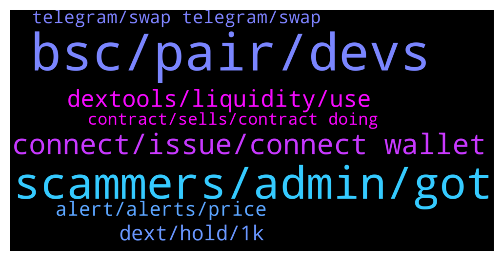

# **@DEXToolsCommunity**
 ## Analysis for **2022-01-10** - **2022-01-12**.

---

## 📊 **Basic Stats**

**n_messages_sent**: 242

---

---

## 🔝 **Top keywords and related messages**

1. **bsc, pair, devs**

    @napascual --- *Appreciate the feedback anyway, we will look into it* **--->** [TG Discussion](https://t.me/DEXToolsCommunity/323271)

    @gumbercules --- *Right now you can purchase for low fees on BSC* **--->** [TG Discussion](https://t.me/DEXToolsCommunity/324070)

    @stanes --- *Which launchpad are you talking about? We never had any...* **--->** [TG Discussion](https://t.me/DEXToolsCommunity/323382)

    @bastardganpunk --- *You can check holders on etherscan and bscscan* **--->** [TG Discussion](https://t.me/DEXToolsCommunity/323728)

    @rpoole69 --- *In general both desktop and mobile (without wifi), seems like all, but this one in particular /bsc/pair-explorer/0x4cb29498595a733c4b0d710e766bb89345ee945b* **--->** [TG Discussion](https://t.me/DEXToolsCommunity/323799)

    @napascual --- *Our bsc backend server has been restarted for maintenance and some pairs are updating* **--->** [TG Discussion](https://t.me/DEXToolsCommunity/323802)

2. **scammers, admin, got**

    @FredericDEXT --- *Dm @guillermorodriguez78 he is in charge of ads.* **--->** [TG Discussion](https://t.me/DEXToolsCommunity/323594)

    @IcWright --- *Which admin can I contact for marketing* **--->** [TG Discussion](https://t.me/DEXToolsCommunity/324209)

    @creatstep --- *Guys, there are so much scammers out there who trying to pretend you . My gosh 🤦‍♂️* **--->** [TG Discussion](https://t.me/DEXToolsCommunity/323599)

    @duehzk_ndbb_Crejd --- *I’ve got heaps of admin messages* **--->** [TG Discussion](https://t.me/DEXToolsCommunity/323379)

    @CryptoCrumbs --- *Got a few dms now from a couple people.* **--->** [TG Discussion](https://t.me/DEXToolsCommunity/323757)

    @abccccc77 --- *how can i contact customer service* **--->** [TG Discussion](https://t.me/DEXToolsCommunity/323864)

3. **connect, issue, connect wallet**

    @bonetky --- *Okay, because does not load since a few hours. I can load the rest of webpages* **--->** [TG Discussion](https://t.me/DEXToolsCommunity/323246)

    @AlexeiM84 --- *It’s a problem with mobile version or…?* **--->** [TG Discussion](https://t.me/DEXToolsCommunity/323520)

    @bonetky --- *Okay the solution was clear cookies and site data* **--->** [TG Discussion](https://t.me/DEXToolsCommunity/323249)

    @napascual --- *Nice, we're looking into that issue closely, we will be changing some cache policies soon to fix that* **--->** [TG Discussion](https://t.me/DEXToolsCommunity/323269)

    @bonetky --- *Yeah I tried lot of times, I guess this time my PC needed some harder 😂* **--->** [TG Discussion](https://t.me/DEXToolsCommunity/323256)

    @rpoole69 --- *It got me again this morning, then I remembered the issue and just wanted to remind you all* **--->** [TG Discussion](https://t.me/DEXToolsCommunity/324227)

4. **dextools, liquidity, use**

    @creatstep --- *Who should I dm to get promoted on dextools?* **--->** [TG Discussion](https://t.me/DEXToolsCommunity/323568)

    @bonetky --- *But Dextools runs very well always, todays was an exception* **--->** [TG Discussion](https://t.me/DEXToolsCommunity/323268)

    @bastardganpunk --- *For more info about the dextools functionality you can watch the video https://www.youtube.com/watch?v=WFQRJUnPwH8* **--->** [TG Discussion](https://t.me/DEXToolsCommunity/323788)

    @bastardganpunk --- *Check the video for learning how to use dextools 🙂 https://www.youtube.com/watch?v=WFQRJUnPwH8* **--->** [TG Discussion](https://t.me/DEXToolsCommunity/323497)

    @bastardganpunk --- *Thank you! If you want to learn more about how to use it, feel free to watch the video which explains the dextools app https://www.youtube.com/watch?v=WFQRJUnPwH8* **--->** [TG Discussion](https://t.me/DEXToolsCommunity/324088)

    @stanes --- *Hi, Dextools automatically index all the pairs once liquidity is added.* **--->** [TG Discussion](https://t.me/DEXToolsCommunity/323404)

5. **dext, hold, 1k**

    @zhengshui1977 --- *I don't have to pay a monthly fee for holding 1000 dexts, does that mean? thanks* **--->** [TG Discussion](https://t.me/DEXToolsCommunity/323438)

    @zhengshui1977 --- *What are the requirements for a standard member now? The homepage says to pay $100 in DEXT/monthly subscription, -or -1,000 DEXT/hold. It says yes in the app 1. Hold 1.000 DEXT in the wallet 2 - Transfer 278 DEXT from your current wallet to 0x469d342e4f3d9ffbedca2e2ca8ab268a6fe973c3* **--->** [TG Discussion](https://t.me/DEXToolsCommunity/323436)

    @Balarabe_muaz --- *I was asking the benefit of holding dext* **--->** [TG Discussion](https://t.me/DEXToolsCommunity/323321)

    @AlinCZ --- *guys do i need to do something else beside holding more than 1k DEXT tokens in my wallet to get the benefits of the Standard tier?  because i have more than 1k in my wallet but i still have only 10 favorite pairs* **--->** [TG Discussion](https://t.me/DEXToolsCommunity/323316)

    @zhengshui1977 --- *OK, thanks. This tool is pretty easy to use. If I only need to hold 1000, I am willing to buy it. I probably wouldn't consider it if it had to be paid monthly, thanks for the help* **--->** [TG Discussion](https://t.me/DEXToolsCommunity/323441)

    @zhengshui1977 --- *I already hold 1010 DEXT but I'm still on the free plan, what else do I need to do?* **--->** [TG Discussion](https://t.me/DEXToolsCommunity/323452)

6. **alert, alerts, price**

    @bastardganpunk --- *which alert exactly are you talking about? i’m getting alerts under 1$* **--->** [TG Discussion](https://t.me/DEXToolsCommunity/324221)

    @rpoole69 --- *Just an FYI, the price alert bug hasn't been corrected yet, unless you prefix the alert price with 0. (for amounts under 1$) it will not save, @bastardganpunk could you please let the devs know, thanks!* **--->** [TG Discussion](https://t.me/DEXToolsCommunity/324219)

    @stanes --- *Was reported few days ago: if you try to set the  alert without the 0 it doesn't save.* **--->** [TG Discussion](https://t.me/DEXToolsCommunity/324225)

    @DogecointotheMoon --- *please add % change price alerts!!* **--->** [TG Discussion](https://t.me/DEXToolsCommunity/323563)

    @bastardganpunk --- *No alerts on cro by now* **--->** [TG Discussion](https://t.me/DEXToolsCommunity/323775)

    @AbdoMelody --- *Any news for polygon alertes ?* **--->** [TG Discussion](https://t.me/DEXToolsCommunity/323544)

7. **telegram, swap telegram, swap**

    @tdm516 --- *@FredericDEXT Another Q for you, please. Right now the Telegram link on BINU's Dext page directs to telegram . org's homepage instead of BINU's telegram community chat. Can this be updated, please?* **--->** [TG Discussion](https://t.me/DEXToolsCommunity/323890)

    @bastardganpunk --- *You can add tipping bots in channels, but I’m wondering why someone would want to swap on telegram. Sounds very insecure to me* **--->** [TG Discussion](https://t.me/DEXToolsCommunity/323765)

    @grathius --- *Guys, is there some kind of bot/wallet/exchanger/swaper in telegram that works with bsc(dextools, pcs, poocoin, etc)? @bastardganpunk* **--->** [TG Discussion](https://t.me/DEXToolsCommunity/323722)

    @bastardganpunk --- *Sorry, we don’t have the option to swap on telegram* **--->** [TG Discussion](https://t.me/DEXToolsCommunity/323762)

    @grathius --- *I wrote a telegram bot that finds suitable tokens for purchase and wanted to automate the process* **--->** [TG Discussion](https://t.me/DEXToolsCommunity/323771)

    @bastardganpunk --- *it depends on the coin you want to buy. you should ask in the telegram channel of the coin you want to buy. every token can have a different tax.* **--->** [TG Discussion](https://t.me/DEXToolsCommunity/323538)

