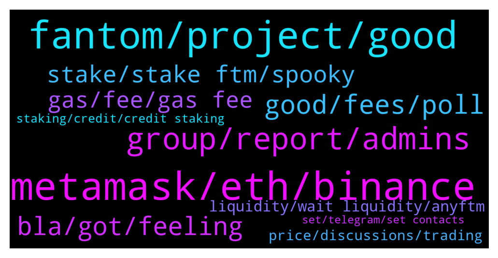

# **@Fantom_English**
 ## Analysis for **2022-01-11** - **2022-01-12**.

---

## 📊 **Basic Stats**

**n_messages_sent**: 387

---

---

## 🔝 **Top keywords and related messages**

1. **metamask, eth, binance**

    @Janevietani --- *1. where is you ftm now? 2. you can use metamask* **--->** [TG Discussion](https://t.me/Fantom_English/628996)

    @Joe --- *I have ftm on crypto.com is there a walk through to get ftm onto meta mask* **--->** [TG Discussion](https://t.me/Fantom_English/629125)

    @T --- *i need help my ftm shows on my metamask as eth on ftm opera mainnet* **--->** [TG Discussion](https://t.me/Fantom_English/629084)

    @Joe --- *Thank you  I will do this but I have some ftm ,how do I get this to meta mask* **--->** [TG Discussion](https://t.me/Fantom_English/629132)

    @beenuts --- *you can bridge from avax, bsc eth to ftm* **--->** [TG Discussion](https://t.me/Fantom_English/628091)

    @T --- *all i want to do is send it to biannce if i sent it as is will it work? and on what chain i must send?* **--->** [TG Discussion](https://t.me/Fantom_English/629111)

2. **fantom, project, good**

    @Sleepycloud71 --- *Where do I buy Fantom for Fantom Network? Ethereum sucks.* **--->** [TG Discussion](https://t.me/Fantom_English/627629)

    @pajamasfreak --- *Not, it is the main network name of fantom* **--->** [TG Discussion](https://t.me/Fantom_English/627713)

    @Janevietani --- *hello, i dont know a lot about launchpad but as i know there is FTMpad ( which you can contact them on TOMB discord/telegram ), Fantom starter ( https://t.me/fantomstarter ) , FantomOasis* **--->** [TG Discussion](https://t.me/Fantom_English/628775)

    @zendealer --- *Sorry for the noob question, but I'm new here.... I'm coming from the LUNA community and heard many good things about what Andre & Daniele are building on Fantom! 💪🏼)* **--->** [TG Discussion](https://t.me/Fantom_English/628073)

    @ColinClark --- *Anybody know which Fantom project has the best stablecoin rates please or is there a website that monitors such things* **--->** [TG Discussion](https://t.me/Fantom_English/628539)

    @Milkman Job --- *Why is fantom plummeting I'm scared* **--->** [TG Discussion](https://t.me/Fantom_English/629007)

3. **group, report, admins**

    @Sleepycloud71 --- *This group is LOADED with scammers. It's the worst I've seen. So far, just today... 23 of them have contacted me* **--->** [TG Discussion](https://t.me/Fantom_English/627801)

    @miragele --- *Hi jane think someone using your name and the photo you have on your account as admin ???* **--->** [TG Discussion](https://t.me/Fantom_English/628158)

    @BigBoyCryptoPants --- *wow i didnt get a DM from a scammer yet lol* **--->** [TG Discussion](https://t.me/Fantom_English/628800)

    @Janevietani --- *if you see one please educate them* **--->** [TG Discussion](https://t.me/Fantom_English/629079)

    @ourmaninamsterdam --- *Interesting, I went back to report and they had already blocked me. Must be monitoring this group somehow!* **--->** [TG Discussion](https://t.me/Fantom_English/627502)

    @ourmaninamsterdam --- *Sorry to hear it, was also tempted because it all looked pretty legit, lots of normal discussions, 80K members, very active… Pretty sophisticated scam!* **--->** [TG Discussion](https://t.me/Fantom_English/627527)

4. **good, fees, poll**

    @exten_vision --- *Hello! Tell me please: is it worth waiting for FTM above 4 this year?* **--->** [TG Discussion](https://t.me/Fantom_English/628138)

    @KosherBacon --- *I apologize if this is the wrong room to ask this in, I just this minute joined here.    Admittedly I haven't followed anything going on with FTM, but have a little because of SoulSwap, and I have been staking my daily harvest from them every day.  So, my question, and I'm not complaining, so far FTM has been great, and the fees are very low.  However, in the last week or so, the fees have gone up about 10X.    For weeks and weeks my transfers (two a day) were about 0.012-0.019FTM.  The fees have been rising and are today  0.130FTM.   Is there a reason everyone except me is aware of?  lol  Will they come back down, or is this rise something we will see for a while?  Or ...?   I'm really just curious since the they are still really low, very reasonable.  But when fees go up 10X in 10 days, and no signs of stopping, it has me curious.  Perhaps it has something more to do with SoulSwap's side, but that seems odd.  Any education on this would be appreciated, thanks.* **--->** [TG Discussion](https://t.me/Fantom_English/628048)

    @dominikbolena --- *Hey guys, are here some ftm / blockchain professionals?  I have a general question about ftm / tomb.  We all think, the demand and transactions on the Ftm blockchain will raise significantly.  So my question is: will in this case also the transaction cost and speed increase dramatically? Does ftm habe than a similar problem, like other chains?  Or is there any solution planned in such a case? Thanks for helping :)* **--->** [TG Discussion](https://t.me/Fantom_English/628661)

    @elizabeth --- *good que, ftx margin is active. ı think team work hard and any good news coming soon guys* **--->** [TG Discussion](https://t.me/Fantom_English/627568)

    @JollyJoka --- *i am brand new thinking about joining the FTM community* **--->** [TG Discussion](https://t.me/Fantom_English/628317)

    @bobzhuang --- *Omg.. We can see 3u for ftm again..* **--->** [TG Discussion](https://t.me/Fantom_English/628904)

5. **bla, got, feeling**

    @pajamasfreak --- *you can directly pm to me or other admins* **--->** [TG Discussion](https://t.me/Fantom_English/628523)

    @Eli --- *Ohw man I feel so stupid 🤦‍♂️* **--->** [TG Discussion](https://t.me/Fantom_English/627484)

    @Black_carat --- *Hopefully I didn't fell into that trap 😅* **--->** [TG Discussion](https://t.me/Fantom_English/628772)

    @zenkert --- *I will. Now that I know 👌👍* **--->** [TG Discussion](https://t.me/Fantom_English/629080)

    @Sleepycloud71 --- *That kind of freaked me out, because at that very second... I was eating pasta. 🤣🤣🤣* **--->** [TG Discussion](https://t.me/Fantom_English/627835)

    @aneesa_t --- *Feeling sleepy reading bla bla bla* **--->** [TG Discussion](https://t.me/Fantom_English/628154)

6. **stake, stake ftm, spooky**

    @LECH0N --- *Where do you guys stake your ftm?* **--->** [TG Discussion](https://t.me/Fantom_English/628590)

    @JollyJoka --- *i am trying to determine how to stake my FTM and what to go with but I see so many YT videos and options I am all over the place lol* **--->** [TG Discussion](https://t.me/Fantom_English/628321)

    @Chucky --- *Ok thank you. What's the site to stake?* **--->** [TG Discussion](https://t.me/Fantom_English/627706)

    @beenuts --- *spooky swap is what i used* **--->** [TG Discussion](https://t.me/Fantom_English/628090)

    @Captain --- *there are a lot spiritswap is one  spookyswap list goes on and on* **--->** [TG Discussion](https://t.me/Fantom_English/627710)

    @JacobBerry --- *Where can I stake my FTM ?* **--->** [TG Discussion](https://t.me/Fantom_English/628057)

7. **gas, fee, gas fee**

    @Infinite_Alpha --- *I do not want to pay 60 Ftm I wanted it on the FTM network initially?* **--->** [TG Discussion](https://t.me/Fantom_English/628488)

    @Johnnyfantom --- *The fees increase when the network is congested, they will reduce* **--->** [TG Discussion](https://t.me/Fantom_English/628070)

    @AuthenMe --- *Hi guys! can someone send me 0.5 ftm for fee i cant transfer it to exchange since my wallet doesnt have enought ftm. Please and thank you!* **--->** [TG Discussion](https://t.me/Fantom_English/628366)

    @dominikbolena --- *Ok thanks. What exactly is fast sync? And how far (percentage) could this reduce gas fees approximately? Thanks for helping :)* **--->** [TG Discussion](https://t.me/Fantom_English/628679)

    @Janevietani --- *team are working on fast sync which could help to reduce gas fee* **--->** [TG Discussion](https://t.me/Fantom_English/628666)

    @Janevietani --- *100 % sure there is an error if gas fee are 84 dollar* **--->** [TG Discussion](https://t.me/Fantom_English/628941)

8. **liquidity, wait liquidity, anyftm**

    @rockcryp --- *Hello, is it possible to provide more liquidity as i want to convert my ftm on erc20 to Ftm mainnet* **--->** [TG Discussion](https://t.me/Fantom_English/628450)

    @rockcryp --- *Hello and good morning, i am looking to convert my ftm from erc20 to Ftm mainnet but there is never enought liquidity in the market. Can the ftm network increase liquidity?* **--->** [TG Discussion](https://t.me/Fantom_English/628977)

    @Janevietani --- *when there is no liquidity, bridge you will give you anyFTM , you can wait until there is liquidity so you can swap anyFTM to FTM or if you dont wanna wait liquidity, you can bridge it back to erc20 FTM  check it on https://app.multichain.org/#/pool go to Pool -> FTM -> Remove -> anyFTM to FTM ( which one network that have liquidity )* **--->** [TG Discussion](https://t.me/Fantom_English/628793)

    @Infinite_Alpha --- *Should I just wait for the liquidity and keep it on the FTM network? If so how long would that take?* **--->** [TG Discussion](https://t.me/Fantom_English/628486)

    @Janevietani --- *you might get anyFTM. when there is no liquidity, bridge you will give you anyFTM , you can wait until there is liquidity so you can swap anyFTM to FTM or if you dont wanna wait liquidity, you can bridge it back to erc20 FTM  check it on https://app.multichain.org/#/pool go to Pool -> FTM -> Remove -> anyFTM to FTM ( which one network that have liquidity )* **--->** [TG Discussion](https://t.me/Fantom_English/628472)

    @crypticpork --- *how long will i have to wait for liquidity if you had to guess?* **--->** [TG Discussion](https://t.me/Fantom_English/628813)

9. **price, discussions, trading**

    @Johnnyfantom --- *You cannot, this is not a price chat, go to https://t.me/FantomMarines* **--->** [TG Discussion](https://t.me/Fantom_English/628634)

    @Johnnyfantom --- *Go ask in trading channel, no price talk here please* **--->** [TG Discussion](https://t.me/Fantom_English/628140)

    @beenuts --- *there is no capcha for me* **--->** [TG Discussion](https://t.me/Fantom_English/628009)

    @Catalin --- *is there an official group for price and trading discussions? as far as I can see we're not allowed to have such discussions here.* **--->** [TG Discussion](https://t.me/Fantom_English/627557)

    @Dugguets --- *No price there is some new?* **--->** [TG Discussion](https://t.me/Fantom_English/628435)

    @Janevietani --- *probably try ask it on trading group* **--->** [TG Discussion](https://t.me/Fantom_English/628568)

10. **staking, credit, credit staking**

    @beenuts --- *I also dont even know what credit staking is* **--->** [TG Discussion](https://t.me/Fantom_English/628100)

    @Math --- *Hi  Do you claim every rebase ?  I m staking to hec to but I don’t know if I have to reclaim each 8hours or not* **--->** [TG Discussion](https://t.me/Fantom_English/627827)

    @JollyJoka --- *Are there rules on the Tele about talking about alternative staking methods or?* **--->** [TG Discussion](https://t.me/Fantom_English/628328)

    @gocoin1 --- *anyone knows why staking tshare on tomb is not yielding any interest?* **--->** [TG Discussion](https://t.me/Fantom_English/627762)

    @pajamasfreak --- *yes, look at fwallet staking instructions below. Of course, using metamask* **--->** [TG Discussion](https://t.me/Fantom_English/628337)

    @Sleepycloud71 --- *There is nothing to claim. It's automatically added to your wallet. Just sit back and watch it grow.* **--->** [TG Discussion](https://t.me/Fantom_English/627833)

