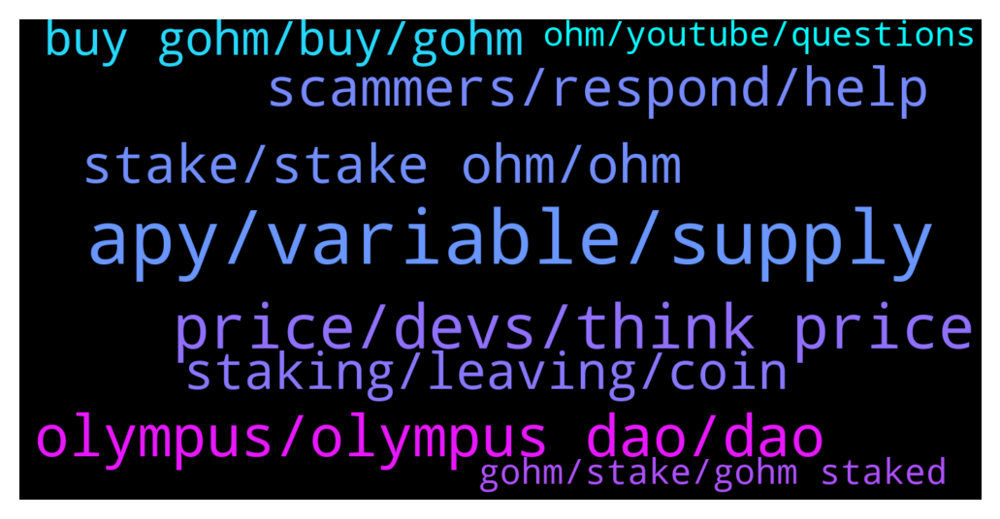

# **@OlympusTG**
 ## Analysis for **2022-01-11** - **2022-01-12**.

---

## 📊 **Basic Stats**

**n_messages_sent**: 1530

---

---

## 🔝 **Top keywords and related messages**

1. **apy, variable, supply**

    @Ap0l1o --- *With the vote of OIP 18 and 63, it has been determined that in order to have longevity, after a certain amount of staked tokens, the APY will reduce to a certain level - at this moment, we are headed towards the 1k APY zone, but if a lot of people unstake, the APY will increase* **--->** [TG Discussion](https://t.me/OlympusTG/146560)

    @emadbaig --- *Even if it goes 500% apy, i can get 0.4x in a month. How is it possible? Hope not a scam 😮‍💨* **--->** [TG Discussion](https://t.me/OlympusTG/147893)

    @K --- *Same thing, if someone manually calculates what he should get with that apy on that day, he would get to the same number as using the calculator, which got removed.  Apy is only for that day you check it. Calculator is only for that day you check it.  Hence just removing the calculator doesn‘t make sense.* **--->** [TG Discussion](https://t.me/OlympusTG/148817)

    @C --- *Variable ApY in Banks is not the same at all. USD is inflationary supply but only to a certain extent.* **--->** [TG Discussion](https://t.me/OlympusTG/148832)

    @Freedom_Now1 --- *I see, so that’s still true then. I was concerned because I heard that that isn’t true anymore and that %APY will just continue to drop now. I don’t agree with that and that would also lessen people’s incentive to stake* **--->** [TG Discussion](https://t.me/OlympusTG/146557)

    @WeN_mOoon --- *Thats confusing as hell 🤣whats OT?* **--->** [TG Discussion](https://t.me/OlympusTG/146427)

2. **price, devs, think price**

    @R --- *Wow, well that reflects with the price* **--->** [TG Discussion](https://t.me/OlympusTG/148322)

    @Great fudder --- *ok I need PRICE TO GO UP. I cant take this anymore. every day I am checking price and its dipping. every day, check price, bad price. I cant take this anymore, I have over invested, by a lot. it is what it is. but I need price to GO UP ALREADY. can devs DO SOMETHING* **--->** [TG Discussion](https://t.me/OlympusTG/146405)

    @js11440 --- *whats going on with price? anything strange happened??? why such dump?* **--->** [TG Discussion](https://t.me/OlympusTG/146206)

    @Ap0l1o --- *There, I fixed the price a bit :)* **--->** [TG Discussion](https://t.me/OlympusTG/146397)

    @Ap0l1o --- *nobody checked price for so long* **--->** [TG Discussion](https://t.me/OlympusTG/148137)

    @Ap0l1o --- *just messing with you fren, you can check the price as much as you want* **--->** [TG Discussion](https://t.me/OlympusTG/148149)

3. **olympus, olympus dao, dao**

    @Lisa1000000 --- *Does it makes sense to start with Olympus now as the price is down? (I am new...)* **--->** [TG Discussion](https://t.me/OlympusTG/147107)

    @web3clouds --- *I suppose this question was previously raised, but can someone explain why such a big project like olympus hasnt been listed in T1 cex until now?* **--->** [TG Discussion](https://t.me/OlympusTG/148857)

    @emadbaig --- *So buy gohm at traderjoe, and attach in olympus dao website?* **--->** [TG Discussion](https://t.me/OlympusTG/147872)

    @Winter_Chemistry --- *Can’t disagree. With Olympus u will win for sure.  Don’t bet against Olympus lol* **--->** [TG Discussion](https://t.me/OlympusTG/146035)

    @emadbaig --- *I am looking a project for passive income, to leave my effin job. Someone said strong and olympus, so weighing out* **--->** [TG Discussion](https://t.me/OlympusTG/147909)

    @Freedom_Now1 --- *The focus should be on longevity of the protocol, not your short term greed. Olympus Dao has the potential to be great, we don’t want it endangered just because of your greed. There are greedy people everywhere, but not a lot of Olympus DAOs everwhere* **--->** [TG Discussion](https://t.me/OlympusTG/147015)

4. **stake, stake ohm, ohm**

    @prashantmasih --- *Hi all, my staked ohm is not growing and rewards are not being added. Its staying the same* **--->** [TG Discussion](https://t.me/OlympusTG/148931)

    @crypto_dois --- *Which ohm do u have to buy to stake* **--->** [TG Discussion](https://t.me/OlympusTG/147159)

    @Sergio A --- *I stake 2 ohm now I have 6 but with the V2 don’t know* **--->** [TG Discussion](https://t.me/OlympusTG/147201)

    @masterwong123 --- *i staked 3 days and only got 1 ohm is it normale with that insane apy?* **--->** [TG Discussion](https://t.me/OlympusTG/148985)

    @Artyom --- *basically you borrow more OHM through Rari to stake?* **--->** [TG Discussion](https://t.me/OlympusTG/148194)

    @D_P0007 --- *i can get ohm from uniswap and stake directly on website correct?* **--->** [TG Discussion](https://t.me/OlympusTG/147743)

5. **scammers, respond, help**

    @Ap0l1o --- *by the time I respond, a spammer and a scammer appeared and you reported them both :D* **--->** [TG Discussion](https://t.me/OlympusTG/148927)

    @Ap0l1o --- *Hi, what can I help you with? Those in your DM’s are scammers btw.* **--->** [TG Discussion](https://t.me/OlympusTG/146329)

    @JKSuleyman --- *🙏🙏 I'll send you DM please. I'm marketing director of a project from Japan.* **--->** [TG Discussion](https://t.me/OlympusTG/147670)

    @Ap0l1o --- *I have seen many people getting scammed here and lost a lot of money* **--->** [TG Discussion](https://t.me/OlympusTG/146528)

    @Ap0l1o --- *okay, I hope you are not chatting with a scammer* **--->** [TG Discussion](https://t.me/OlympusTG/147063)

    @RichR7 --- *Beware of scammers trying to steal your money.* **--->** [TG Discussion](https://t.me/OlympusTG/148032)

6. **staking, leaving, coin**

    @Camaro1981 --- *Ok thanks everyone. I'm glad that I got my answers i needed. I'm leaving my money staked but I will save this message. In 1 month it is going to be down 70% for stakers from today.* **--->** [TG Discussion](https://t.me/OlympusTG/148325)

    @GK033 --- *Now is probably a better time becuase it is so oversold. I bought and staked about 2 months ago. Have been getting 4 figure apys but am down over 50% in my investment becuase price is so far down* **--->** [TG Discussion](https://t.me/OlympusTG/147898)

    @emadbaig --- *But are you using the returns or just leaving it all staked?* **--->** [TG Discussion](https://t.me/OlympusTG/147903)

    @vladdevelop --- *well, shoot I thought its completely stable and real investment  same as my security deposit in BoA just with bigger return* **--->** [TG Discussion](https://t.me/OlympusTG/148166)

    @Thomas --- *Good entry indeed for high yield compound staking* **--->** [TG Discussion](https://t.me/OlympusTG/147991)

    @allenkor --- *This is a great entry, chill and stake. Think long term* **--->** [TG Discussion](https://t.me/OlympusTG/148472)

7. **buy gohm, buy, gohm**

    @nfwaple --- *yes, or just buy gOHM directly* **--->** [TG Discussion](https://t.me/OlympusTG/147381)

    @Ryan --- *What’s the cheapest way to buy gOHM ??* **--->** [TG Discussion](https://t.me/OlympusTG/147030)

    @MC_NAVID --- *Cheapest way to buy gohm?  Trader joe?* **--->** [TG Discussion](https://t.me/OlympusTG/147582)

    @Ox2dav --- *Do I need to buy gohm? not clear how this work* **--->** [TG Discussion](https://t.me/OlympusTG/146179)

    @Ap0l1o --- *You can buy gOhm here @Ox2dav* **--->** [TG Discussion](https://t.me/OlympusTG/146196)

    @cdp279 --- *Eth - buy gohm on uniswap.* **--->** [TG Discussion](https://t.me/OlympusTG/146766)

8. **gohm, stake, gohm staked**

    @nfwaple --- *correct, no need to stake anywhere, gOHM is always in staked form, you can see your rebases in the stake page* **--->** [TG Discussion](https://t.me/OlympusTG/148175)

    @RichR7 --- *gOHM is the cheapest way because it's already staked. Just buy and hold.  gOHM is wrapped sOHM.* **--->** [TG Discussion](https://t.me/OlympusTG/147869)

    @RichR7 --- *gOHM is already staked(it's wrapped sOHM).  Simply buy gOHM on any blockchain supported and hold. You can hold gOHM on multiple chains.  Sell when you want to take profit.* **--->** [TG Discussion](https://t.me/OlympusTG/148028)

    @redoitt --- *So we don't need to touch our sOHM or gOHM in our wallets, no need to transfer it to the platform to stake? What about those like me who migrated to v2, do we now need to withdraw our gOHM from the platform back to our wallet? (although I noticed that after I migrated to v2 I now see my gOHM in my wallet but it is still also on the staking platform, like, how can it be in two places at the same time?) can you clarify please?* **--->** [TG Discussion](https://t.me/OlympusTG/148140)

    @Thomas --- *Most still use eth so then get confused by staking and then wrapping. So that's unattractive also for new buyers. Or can you just stake directly to gohm now on eth?* **--->** [TG Discussion](https://t.me/OlympusTG/147409)

    @Ap0l1o --- *You can stake it to gOhm, save on fees when you want to sell it, bridge it to other network* **--->** [TG Discussion](https://t.me/OlympusTG/146300)

