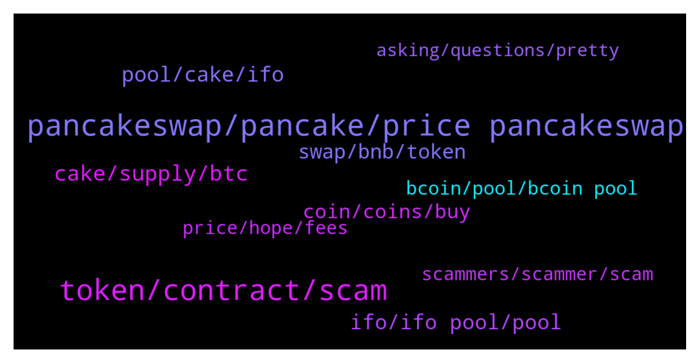

# **@PancakeSwap**
 ## Analysis for **2022-01-11** - **2022-01-12**.

---

## 📊 **Basic Stats**

**n_messages_sent**: 1416

---

---

## 🔝 **Top keywords and related messages**

1. **pancakeswap, pancake, price pancakeswap**

    @Ayilaran1 --- *This has happened many times, I tried to move my coins from wallets to wallets, I have created many wallets and deleted many wallets, yet this guy would go there and remove all the coins in droves as if there is no security at all. This was why I pleaded yesterday with pancakeswap community to help me get a secure way to transact without being exposed to the scammers. And today it's started again, pls I need to break free from them. Is there any way, I have flashed my mobile device twice.* **--->** [TG Discussion](https://t.me/PancakeSwap/2264113)

    @Union_777 --- *I asked, they told me that its your issue as this wallet belongs to pancakeswap: https://bscscan.com/address/0xbbe3e25a2a6ee9cda32609af2c14c812cb4d1b50#tokentxns* **--->** [TG Discussion](https://t.me/PancakeSwap/2265609)

    @CakeCompounder --- *So you scammed and you are trying to blame PancakeSwap?* **--->** [TG Discussion](https://t.me/PancakeSwap/2261730)

    @Union_777 --- *This is not pancakeswap wallet? Are you sure?* **--->** [TG Discussion](https://t.me/PancakeSwap/2265623)

    @Lietuvis78 --- *I'm sad. :( I trusted PancakeSwap ... I have another pool with another wallet, should I worry ??* **--->** [TG Discussion](https://t.me/PancakeSwap/2261718)

    @REVFINANCE --- *We mistakenly sent one of our tokens to PancakeSwap. Now buying and selling tokens is like a robot. How can I stop this?* **--->** [TG Discussion](https://t.me/PancakeSwap/2263206)

2. **token, contract, scam**

    @TomorrowlandForLife --- *You probably approved a scam contract that sent your tokens to another wallet as soon as they got in your wallet  Or you used a fake website* **--->** [TG Discussion](https://t.me/PancakeSwap/2264390)

    @SecuestPcs --- *Here you can check whether the token you bought is a scam. Paste the smart contract address! 👇👇👇👇👇 https://honeypot.rugdoc.io/* **--->** [TG Discussion](https://t.me/PancakeSwap/2263850)

    @Ceddi200 --- *1. check contract, source code  2. check function 3. check Tax, fee 4. check website, social media, Group etc make sure they're Legit 5. check Dev / owner wallet History. 6 Check LP lock  buy smaller amount then try sell  And more. This can give you some ideas.  Here you can check whether the token you bought is a scam. Paste the smart contract address! 👇👇👇👇👇 https://honeypot.rugdoc.io/* **--->** [TG Discussion](https://t.me/PancakeSwap/2262510)

    @Ceddi200 --- *Here you can check whether the token you bought is a scam. Paste the smart contract address! 👇👇👇👇👇 https://honeypot.rugdoc.io/* **--->** [TG Discussion](https://t.me/PancakeSwap/2262725)

    @ManBlyat --- *did you have smart contract ? let me check, i hope its not scam token* **--->** [TG Discussion](https://t.me/PancakeSwap/2266633)

    @HAITIENLK --- *you can provide 3 contract of token for us, to check.* **--->** [TG Discussion](https://t.me/PancakeSwap/2262763)

3. **cake, supply, btc**

    @Salman --- *CAKE price is around 10.90$ and current total circulating supply is 257 Million. One  year ago when the price was around 40$ it had  total circulating supply of around 92 million CAKE.   The total circulating supply of CAKE has increased from around 92 m to 257m in roughly one year time frame. I also noticed that devs of pancake are constantly selling CAKE( which you can check on BSC scan that the top wallets are selling continuously) If the circulating supply was still same as of last year which was 92m then (current market cap 2.8 divided by total circulating supply 92m 2,800,000,000/92,000,000 = 30.43$ . In short if they wouldn’t had increased the circulating supply then the price would still be around 30$ today.   Good projects always burn the supply instead of increasing it and selling it.* **--->** [TG Discussion](https://t.me/PancakeSwap/2261686)

    @Palendran --- *And will cake ever go again over 40$? Its possible?* **--->** [TG Discussion](https://t.me/PancakeSwap/2262806)

    @Jhonbist --- *The initial price of the cake is less than $1 so it's possible it could be as high as $500* **--->** [TG Discussion](https://t.me/PancakeSwap/2262278)

    @odinpodin --- *Why is the cake inflation just increasing? The price will just go to 0 at this rate.* **--->** [TG Discussion](https://t.me/PancakeSwap/2265960)

    @TapaTapppp --- *Yes i just created my first metamask wallet. And someone said that cake is going to 100 dollars. I dont know if it is true or whether this project is legit or a scam. So i came to telegram to ask* **--->** [TG Discussion](https://t.me/PancakeSwap/2261778)

    @hmmmm1236 --- **Not a financial advise* Cake has a good chance to hit 40$ in a year or 2, current price is ≈10.5. do your own study's and explores+* **--->** [TG Discussion](https://t.me/PancakeSwap/2261678)

4. **pool, cake, ifo**

    @locodanny --- *Humm I never took cake from the ifo pool. I believe they are not counting the rewards, which is unfair since it's a new count* **--->** [TG Discussion](https://t.me/PancakeSwap/2263251)

    @puneet1990 --- *My cake already stacked in ifo ...What I have to do now ?* **--->** [TG Discussion](https://t.me/PancakeSwap/2266213)

    @locodanny --- *I staked 7k Cake on the ifo pool, but my avg is 6700 Cake. Why ???!* **--->** [TG Discussion](https://t.me/PancakeSwap/2263244)

    @Kunyayo --- *Guys I still can't stake my cake for the IFO I'm almost crying* **--->** [TG Discussion](https://t.me/PancakeSwap/2264099)

    @Ceddi200 --- *Do you have your cake staked in IFO pool* **--->** [TG Discussion](https://t.me/PancakeSwap/2266439)

    @Rafiesmati --- *Hi when can I stake my cake for foryo ifo* **--->** [TG Discussion](https://t.me/PancakeSwap/2266429)

5. **ifo, ifo pool, pool**

    @HAITIENLK --- *today, after vote for next IFO, you can stake again, IFO pool will be counted again .  https://t.me/PancakeSwap/2260200* **--->** [TG Discussion](https://t.me/PancakeSwap/2262702)

    @Ceddi200 --- *If you want to participate In IFO, you stake in IFO pool* **--->** [TG Discussion](https://t.me/PancakeSwap/2266199)

    @HAITIENLK --- *will be updated soon, you can stake in ifo pool, it was counted* **--->** [TG Discussion](https://t.me/PancakeSwap/2265400)

    @Rafiesmati --- *Yes since a month it’s in IFO stake but do I need to do that in IFO page too* **--->** [TG Discussion](https://t.me/PancakeSwap/2266453)

    @HAITIENLK --- *if you staked ifo pool now, it's ok, you don't need unstake and stake again.* **--->** [TG Discussion](https://t.me/PancakeSwap/2263281)

    @HAITIENLK --- *remember fee unstake in 24h for IFO pool .* **--->** [TG Discussion](https://t.me/PancakeSwap/2263309)

6. **swap, bnb, token**

    @Valerio --- *It has gone up but when I try to change it in the swap it doesn’t allow me* **--->** [TG Discussion](https://t.me/PancakeSwap/2261883)

    @HAITIENLK --- *check for what issue? you lose money? swap issue? you didnt get token after swap?* **--->** [TG Discussion](https://t.me/PancakeSwap/2265584)

    @SecuestPcs --- *Because this is for approve, not for swap* **--->** [TG Discussion](https://t.me/PancakeSwap/2262640)

    @Dockters --- *expert Mode is allow user Swap token with receiver to different Address* **--->** [TG Discussion](https://t.me/PancakeSwap/2264779)

    @fk9diu9ccp --- *😂hi , I bought it  but can't swap too* **--->** [TG Discussion](https://t.me/PancakeSwap/2261631)

    @Jnkobn4ik --- *Hello any admins can help me I cant swap token* **--->** [TG Discussion](https://t.me/PancakeSwap/2266840)

7. **coin, coins, buy**

    @Ceddi200 --- *CoinGecko provides a trustworthy solution to help you decide where to invest and which exchanges you feel comfortable using.  Doesn’t mean you cannot buy a scam coin or bad coin* **--->** [TG Discussion](https://t.me/PancakeSwap/2262737)

    @MKhames0 --- *I can't sell my coins on shit coin call DISNEY* **--->** [TG Discussion](https://t.me/PancakeSwap/2262369)

    @MKhames0 --- *How I can know that coin can't sell before I buy it?  Any idea* **--->** [TG Discussion](https://t.me/PancakeSwap/2262382)

    @carvinge --- *I bought another coin, but my balance is 0.* **--->** [TG Discussion](https://t.me/PancakeSwap/2263024)

    @Duskkey --- *Good to know, I’ll invest in something else then!* **--->** [TG Discussion](https://t.me/PancakeSwap/2264096)

    @Dshukla9761 --- *Now i buy Firstdog coin but my buy time coin number is 37089826724 but show my wallet 134000000000* **--->** [TG Discussion](https://t.me/PancakeSwap/2265191)

8. **bcoin, pool, bcoin pool**

    @Juljan20 --- *Admin whu dont show bcoin surup pool???!!!* **--->** [TG Discussion](https://t.me/PancakeSwap/2266287)

    @ninahaus --- *We're checking BCOIN pool, thanks for your patience!* **--->** [TG Discussion](https://t.me/PancakeSwap/2265908)

    @HAITIENLK --- *We're checking BCOIN pool, thanks for your patience!* **--->** [TG Discussion](https://t.me/PancakeSwap/2265979)

    @forc3r --- *Bcs moonboys needs pump here, now & immediately* **--->** [TG Discussion](https://t.me/PancakeSwap/2265342)

    @Filoucrypto --- *i cannot unstake my cake from bcoin pool now 🤬* **--->** [TG Discussion](https://t.me/PancakeSwap/2266218)

    @leyyolei --- *Bcoin pool not yet deployed ?* **--->** [TG Discussion](https://t.me/PancakeSwap/2266214)

9. **scammers, scammer, scam**

    @VCharLess --- *Dude people getting scammed as of right now..jeeez* **--->** [TG Discussion](https://t.me/PancakeSwap/2264049)

    @Raulseu --- *This scam, they just blowing my phone* **--->** [TG Discussion](https://t.me/PancakeSwap/2262912)

    @Chandana1437 --- *That's a scammer! Check username and you'll know. Block them immediately* **--->** [TG Discussion](https://t.me/PancakeSwap/2266885)

    @ManBlyat --- *they're scammer sir, just report and block* **--->** [TG Discussion](https://t.me/PancakeSwap/2265712)

    @daviBrandaoo --- *"I got scammed by a lady today, can someone please help me getting things easier"* **--->** [TG Discussion](https://t.me/PancakeSwap/2262116)

    @vladpronin --- *I see you’re new here. Don’t answer to ppl that DMing you, they’re all scammers, beware* **--->** [TG Discussion](https://t.me/PancakeSwap/2261770)

10. **price, hope, fees**

    @najjaka --- *i hope its not much at least* **--->** [TG Discussion](https://t.me/PancakeSwap/2261812)

    @QV_zz --- *nothing optimistic about them - if u read the tool tip its a estimate based on the previous 7 days trading volume* **--->** [TG Discussion](https://t.me/PancakeSwap/2265280)

    @Vishaljain2 --- *Have Patience the price will grow* **--->** [TG Discussion](https://t.me/PancakeSwap/2264387)

    @Михаил --- *the impact on the price is too high* **--->** [TG Discussion](https://t.me/PancakeSwap/2266500)

    @DeFive07 --- *Last chance to buy in dip, price is going to pump hard from this lvl after brkout..🤯🤯 next target $16 dollar…* **--->** [TG Discussion](https://t.me/PancakeSwap/2263009)

    @TomorrowlandForLife --- *There's nothing anybody can do about price* **--->** [TG Discussion](https://t.me/PancakeSwap/2264307)

