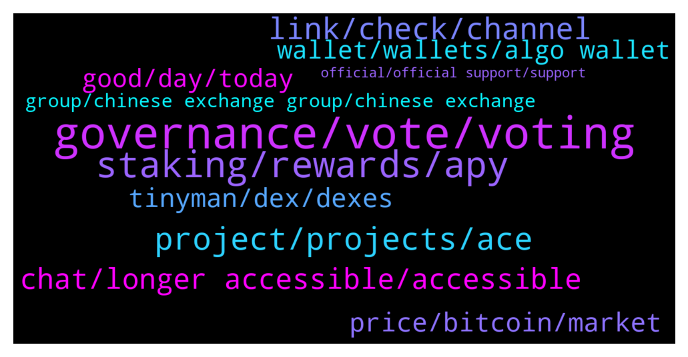

# **@algorand**
 ## Analysis for **2022-01-11** - **2022-01-12**.

---

## 📊 **Basic Stats**

**n_messages_sent**: 280

---

---

## 🔝 **Top keywords and related messages**

1. **governance, vote, voting**

    @MackDenver --- *So how do you think we should progress going forward? The governance was added to the Algorand ecosystem to move a more decentralized model* **--->** [TG Discussion](https://t.me/algorand/331753)

    @abovyanv --- *isn't it weird for you that someone made some decisions for you and giving to you options A and B for voting. And this is freedom and Decentralization?  Does this remind you of politics, where we have two presidential candidates and we need to choose one of them... think about it* **--->** [TG Discussion](https://t.me/algorand/331943)

    @NightAlgorand --- *Are you refer to the participation rewards? it was changed for the governance reward. https://algorand.foundation/news/algorand-governance-rewards-period-2 for more information* **--->** [TG Discussion](https://t.me/algorand/331847)

    @MackDenver --- *Hello Vladimir, Everything about the governance and governance related information is available in our website. Here is the details about the governance rewards system: https://algorand.foundation/news/algorand-governance-rewards-period-2* **--->** [TG Discussion](https://t.me/algorand/331577)

    @abovyanv --- *there shoud be option C - dont make any changes* **--->** [TG Discussion](https://t.me/algorand/331761)

    @abovyanv --- *I know, but what about this new governance changes... - i didn't vote about it* **--->** [TG Discussion](https://t.me/algorand/331583)

2. **staking, rewards, apy**

    @mikamika1987 --- *Hi, where can we stake Algo for best rewards* **--->** [TG Discussion](https://t.me/algorand/331588)

    @KENVO749 --- *Why has it been 11 days since the end of phase 1 on December 31, 2021, and still has not received the reward? Is the project a scam?* **--->** [TG Discussion](https://t.me/algorand/331656)

    @max219912 --- *Hey can anyone tell me where to store algo for staking ?* **--->** [TG Discussion](https://t.me/algorand/331930)

    @alicancelik88 --- *GM guys, may i kindly ask, whats the best possible way to stake algo? Im doing it currently at Binance, but APYs are pretty low..* **--->** [TG Discussion](https://t.me/algorand/331554)

    @Pablo_cast --- *Pos coins are created at start* **--->** [TG Discussion](https://t.me/algorand/331750)

    @MackDenver --- *No, it won't be ok. If you do so, you will not get your rewards.* **--->** [TG Discussion](https://t.me/algorand/331990)

3. **project, projects, ace**

    @teknomachine --- *this are use cases, I asked if is there any project implementing Algorand* **--->** [TG Discussion](https://t.me/algorand/331812)

    @abovyanv --- *can you give me links about roadmap?* **--->** [TG Discussion](https://t.me/algorand/331783)

    @NightAlgorand --- *You can check out https://www.algorand.com/ecosystem on the projects on Algorand* **--->** [TG Discussion](https://t.me/algorand/331805)

    @NightAlgorand --- *check out this link for all project built on Algorand https://www.algorand.com/ecosystem/use-cases* **--->** [TG Discussion](https://t.me/algorand/331811)

    @Jahpivo --- *Im interested in a nft Projekt on algorand... who can I talk to ?* **--->** [TG Discussion](https://t.me/algorand/331503)

    @Ultimate_Gigachad --- *The ACE program! Algorand Centers for Excellence!* **--->** [TG Discussion](https://t.me/algorand/332043)

4. **link, check, channel**

    @NightAlgorand --- *Hi there, you can go here @algorand_price to have that discussion 🙂* **--->** [TG Discussion](https://t.me/algorand/331556)

    @b4seun --- *Same here house... I need u guy to put us through newbies ....  Thanks in a advance* **--->** [TG Discussion](https://t.me/algorand/332021)

    @NightAlgorand --- *Hi Happy 🙂, you can check it here https://arcc.one* **--->** [TG Discussion](https://t.me/algorand/331515)

    @NightAlgorand --- *Hi there, you can follow our twitter here 🙂 https://twitter.com/AlgoFoundation* **--->** [TG Discussion](https://t.me/algorand/331929)

    @NightAlgorand --- *Hi there 🙂 Here you go https://t.me/AlgorandFoundationCN* **--->** [TG Discussion](https://t.me/algorand/331927)

    @NightAlgorand --- *Hi there 🙂 You can check on our announcement channel and visit our website https://www.algorand.com/resources* **--->** [TG Discussion](https://t.me/algorand/331910)

5. **chat, longer accessible, accessible**

    @teknomachine --- *it feels like this chat is populated by bots with pretty girls as profile but not much info discussed* **--->** [TG Discussion](https://t.me/algorand/331804)

    @Shane --- *That chat is no longer accessible  message pops up when we click the link.* **--->** [TG Discussion](https://t.me/algorand/331558)

    @littlemix55 --- *maybe the admin set it to invite only?* **--->** [TG Discussion](https://t.me/algorand/331565)

    @MackDenver --- *Please report them and delete the chat* **--->** [TG Discussion](https://t.me/algorand/332038)

    @MackDenver --- *Please block it and delete the chat* **--->** [TG Discussion](https://t.me/algorand/332019)

    @NightAlgorand --- *Usually the "That chat is no longer accessible" message pop out if you have been banned from the group. 🙂* **--->** [TG Discussion](https://t.me/algorand/331562)

6. **tinyman, dex, dexes**

    @MackDenver --- *Tinyman is currently in the repair phase. You will need to wait for it to be fixed* **--->** [TG Discussion](https://t.me/algorand/332009)

    @MackDenver --- *Hi there, There is already tinyman DEX and other DEXes will be available soon.* **--->** [TG Discussion](https://t.me/algorand/331602)

    @Annonymousme --- *Please since tinyman has issues, where can i swap algorand asa* **--->** [TG Discussion](https://t.me/algorand/331567)

    @Nibba --- *Is There any Dex On Algorand otherthan Tinyman???* **--->** [TG Discussion](https://t.me/algorand/331982)

    @huliganas79 --- *Hi guys. When Algo will have dex?* **--->** [TG Discussion](https://t.me/algorand/331601)

    @huliganas79 --- *But tinyman got hacked and it's not operating currently?* **--->** [TG Discussion](https://t.me/algorand/331603)

7. **price, bitcoin, market**

    @Tanuj --- *Friends,  I have recently bought 3100 Algo. What should be the realistic price prediction if keeping long term like 2025* **--->** [TG Discussion](https://t.me/algorand/331613)

    @Althea003 --- *Bitcoin market is not good these days, will you continue to buy?* **--->** [TG Discussion](https://t.me/algorand/331674)

    @KAPIBAYSIDE --- *Who else prices compare if you don't mind me asking?* **--->** [TG Discussion](https://t.me/algorand/331483)

    @I-M-T --- *any other algorand group recommended? (price/trading?)* **--->** [TG Discussion](https://t.me/algorand/331935)

    @pamelacurry --- *Hello here fam? How is the market* **--->** [TG Discussion](https://t.me/algorand/332004)

    @Hele_beger --- *Wise persons know the best time to buy, hold and trade is when there is high volatility 🧏‍♀* **--->** [TG Discussion](https://t.me/algorand/331692)

8. **good, day, today**

    @na --- *Hello everyone, today is another beautiful day* **--->** [TG Discussion](https://t.me/algorand/331653)

    @Irene --- *good afternoon. Friends, how are you doing today?* **--->** [TG Discussion](https://t.me/algorand/331549)

    @teknomachine --- *are you so unfriendly because you don t like questions?* **--->** [TG Discussion](https://t.me/algorand/331827)

    @MackDenver --- *Hi Helen, I'm glad to hear it.* **--->** [TG Discussion](https://t.me/algorand/331998)

    @MackDenver --- *Hello na Le, Have a great day.* **--->** [TG Discussion](https://t.me/algorand/331654)

    @Irene --- *Good evening, friends. It's me who just finished dinner🤣* **--->** [TG Discussion](https://t.me/algorand/331624)

9. **wallet, wallets, algo wallet**

    @KENVO749 --- *Here is my wallet address: VYYBORB7TB6RZV2C2XAL2LOZN3QLZBSEFAAVRO7GD7LGCF5SXXDCWTSEU4 I choose Option B* **--->** [TG Discussion](https://t.me/algorand/331668)

    @Happy --- *How to buy micro tesla in algo wallet?* **--->** [TG Discussion](https://t.me/algorand/331512)

    @la_c0sa_n0stra --- *How to setup and Roland wallet* **--->** [TG Discussion](https://t.me/algorand/331476)

    @mioumitsou --- *What other wallets are supported and have a web app?* **--->** [TG Discussion](https://t.me/algorand/331634)

    @MackDenver --- *If I get any new info about these wallets, I will share it with you.* **--->** [TG Discussion](https://t.me/algorand/331953)

    @MackDenver --- *You can view the coins/wallets on explorer.* **--->** [TG Discussion](https://t.me/algorand/331756)

10. **group, chinese exchange group, chinese exchange**

    @Dillon Anna --- *Who can tell me what group this is* **--->** [TG Discussion](https://t.me/algorand/332067)

    @Jewman --- *Is this the official algo group? There are so many* **--->** [TG Discussion](https://t.me/algorand/331831)

    @格局 --- *Is there a Chinese exchange group?* **--->** [TG Discussion](https://t.me/algorand/331920)

    @Alice --- *Who can tell me what group this is* **--->** [TG Discussion](https://t.me/algorand/332075)

    @NightAlgorand --- *Yes, it is. This is the official Algorand group* **--->** [TG Discussion](https://t.me/algorand/331832)

    @MackDenver --- *No, there is no German group atm.* **--->** [TG Discussion](https://t.me/algorand/331649)

