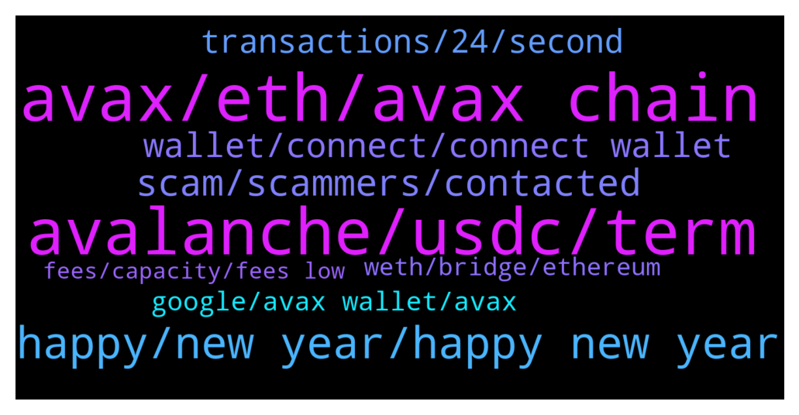

# **@avalancheavax**
 ## Analysis for **2022-01-11** - **2022-01-12**.

---

## 📊 **Basic Stats**

**n_messages_sent**: 187

---

---

## 🔝 **Top keywords and related messages**

1. **avax, eth, avax chain**

    @X_Sanx --- *What's the fastest way to flip my money on avax* **--->** [TG Discussion](https://t.me/avalancheavax/321469)

    @Nicolas_A --- *You select Avax as output currency* **--->** [TG Discussion](https://t.me/avalancheavax/321919)

    @Georgedonnelly --- *Maybe! It’s an NFT space game with planets, ships and commanders* **--->** [TG Discussion](https://t.me/avalancheavax/321759)

    @M --- *Whats the next project on Avalaunch?* **--->** [TG Discussion](https://t.me/avalancheavax/321564)

    @M --- *Where do u guys stake AVAX?* **--->** [TG Discussion](https://t.me/avalancheavax/321824)

    @Wina789 --- *How to buy avax in dex?* **--->** [TG Discussion](https://t.me/avalancheavax/321914)

2. **avalanche, usdc, term**

    @Khyathi_Jinka --- *Hey i want to list my token on the exchange which supports avalanche can any one provide me the list* **--->** [TG Discussion](https://t.me/avalancheavax/321874)

    @GH90909090 --- *Any of you guys know how to generate a CV transaction sheet for the Avalanche network? Thanks ...* **--->** [TG Discussion](https://t.me/avalancheavax/321506)

    @Xrpshiller --- *Hey guys looking for advice.  I mistakenly sent CRV to a SPELL contract on the Avalanche chain. Is there any way to get it back?* **--->** [TG Discussion](https://t.me/avalancheavax/321714)

    @PatrickSutton --- *Ava Labs' John Wu joining CNBC at 2:40 p.m. ET (~1:25 from now) to talk crypto markets, development in the space, and what to watch for:  https://twitter.com/John1wu/status/1480603287841869825?s=20* **--->** [TG Discussion](https://t.me/avalancheavax/321451)

    @AlexanderThe_Great --- *I'm trying to create a variable cap asset but I'm running into issue with the docs* **--->** [TG Discussion](https://t.me/avalancheavax/321855)

    @Nicolas_A --- *Crypto com uses USDC. It’s still quite new* **--->** [TG Discussion](https://t.me/avalancheavax/321597)

3. **happy, new year, happy new year**

    @huygvd --- *Why don’t you just try it* **--->** [TG Discussion](https://t.me/avalancheavax/321641)

    @santaaaaaaaaaaaaaaaaaaaa --- *please guys, how do you overcome such tragic events?* **--->** [TG Discussion](https://t.me/avalancheavax/321629)

    @oathtobarbatos --- *Please respect other people, it's okay to ask simple questions* **--->** [TG Discussion](https://t.me/avalancheavax/321654)

    @oathtobarbatos --- *Maybe helping other people here, you know* **--->** [TG Discussion](https://t.me/avalancheavax/321486)

    @huygvd --- *I respect him  But did you even read what he wrote* **--->** [TG Discussion](https://t.me/avalancheavax/321658)

    @oathtobarbatos --- *Yeah, I did and, it's okay 😄* **--->** [TG Discussion](https://t.me/avalancheavax/321660)

4. **scam, scammers, contacted**

    @oathtobarbatos --- *Yes. It's a scam, be careful with that. Report it if possible!* **--->** [TG Discussion](https://t.me/avalancheavax/321731)

    @Bullseyefomo77 --- *So many scammers contacted me lol* **--->** [TG Discussion](https://t.me/avalancheavax/321669)

    @diov0 --- *anyone programs in solidity? i have a code that aparently is a bot, and i wondering what it really does, since feels like a scam* **--->** [TG Discussion](https://t.me/avalancheavax/321493)

    @santaaaaaaaaaaaaaaaaaaaa --- *oh my god why so many scammers, please dont try to scam me in dm, im already broke and in debt! why did i receive 7 scammy dm in 3 minutes* **--->** [TG Discussion](https://t.me/avalancheavax/321624)

    @Nicolas_A --- *What are you talking about ? If you got contacted by some fake admin telling you to link your wallet its a scammer* **--->** [TG Discussion](https://t.me/avalancheavax/321608)

    @Reza_DAOLaunch --- *are you still giving away grants?* **--->** [TG Discussion](https://t.me/avalancheavax/321877)

5. **wallet, connect, connect wallet**

    @Aziz_2025 --- *Why can't I link the wallet from the phone* **--->** [TG Discussion](https://t.me/avalancheavax/321601)

    @Astron --- *checked the website and left. As ı remember website asked for wallet connect but ı commected with empty wallet so ı guess it is okey right?* **--->** [TG Discussion](https://t.me/avalancheavax/321811)

    @nobodyinthere --- *Link? No need to connect wallet in test version, right?* **--->** [TG Discussion](https://t.me/avalancheavax/321766)

    @Astron --- *Not my original one, commected with empty one which ım not using already* **--->** [TG Discussion](https://t.me/avalancheavax/321815)

    @oathtobarbatos --- *uhh, you shouldn't connect your wallet* **--->** [TG Discussion](https://t.me/avalancheavax/321813)

    @Aziz_2025 --- *I want to connect my wallet to the avalanche platform from phone* **--->** [TG Discussion](https://t.me/avalancheavax/321610)

6. **transactions, 24, second**

    @JimWelder --- *Shouldn't it be the same? Shouldn't they have 2000tps on avg for a 24 hr period?* **--->** [TG Discussion](https://t.me/avalancheavax/321891)

    @Nicolas_A --- *“In the last 24 hours on average the network processed 8 transactions per second” which is around 700k transactions in total over the last 24 hours* **--->** [TG Discussion](https://t.me/avalancheavax/321899)

    @Nicolas_A --- *8 transactions per second on a 24 hour basis is almost 700 000 transactions* **--->** [TG Discussion](https://t.me/avalancheavax/321895)

    @Nicolas_A --- *What the network has been processing not the max it can handle* **--->** [TG Discussion](https://t.me/avalancheavax/321889)

    @offorjp --- *That's the average in the last 24hrs  Not the max tps* **--->** [TG Discussion](https://t.me/avalancheavax/321888)

    @JimWelder --- *Solana seems like it has faster transaction times 2000tps https://solanabeach.io/ vs avascan reporting 8tps.* **--->** [TG Discussion](https://t.me/avalancheavax/321821)

7. **google, avax wallet, avax**

    @Alp --- *When you search as "Avax Wallet" on Google evrytime different scammer web pages appearing with Google Advertisement at the first line. They are imitating the official avax wallet page. If you enter the page, they are stealing your 24 mnemomic phase key.  How they can give the Google ads? Why dont the Avalance team talk with Google to prevent scamming from there. Lots of people are losing the keys and funds. Please be careful.* **--->** [TG Discussion](https://t.me/avalancheavax/321452)

    @juancisneros1 --- *Is it normal to receive messages from AVAX support team? Or is it scam? I’m new here* **--->** [TG Discussion](https://t.me/avalancheavax/321593)

    @Astron --- *he asked for when did ı bought the avax etc. And blocked me erased the chat. What kind of information he needs to scam me ?* **--->** [TG Discussion](https://t.me/avalancheavax/321804)

    @Astron --- *Hey there, avx support bot messaged me and ask me when did you buy these coins is it normal?* **--->** [TG Discussion](https://t.me/avalancheavax/321798)

    @Alp --- *The problem is Google. They can not take the scammers adds. Google is making the advertisement of the robbers. If nobody uses the official ways to complain they will continue. Talk with the Google and explain the situation. How many people are giving Avax Wallet adds? Most of them are scammers.* **--->** [TG Discussion](https://t.me/avalancheavax/321460)

    @Alp --- *It is really strange. Yesterday i have search so many times as Avax Wallet. The web pages at the first line is everytime changing. They are uaung different names. I have made so many complaints to Google when i saw them. After my complaints the pages are dissapeared. They were the same person i think. There must be an official way. They can be found. This is crime.* **--->** [TG Discussion](https://t.me/avalancheavax/321456)

8. **weth, bridge, ethereum**

    @Nicolas_A --- *Yes bridge.avax.network you will receive WETH* **--->** [TG Discussion](https://t.me/avalancheavax/321648)

    @jimmyjomlia --- *i mean bridge back to ethereum newtowtk* **--->** [TG Discussion](https://t.me/avalancheavax/321637)

    @jimmyjomlia --- *whats not clear..I want to bridge my weth.e from avlanche to ethereum. Is that possible?* **--->** [TG Discussion](https://t.me/avalancheavax/321640)

    @jimmyjomlia --- *can i bridge weth.e to ethereum?* **--->** [TG Discussion](https://t.me/avalancheavax/321635)

    @Nicolas_A --- *There is no ETH only WETH.e* **--->** [TG Discussion](https://t.me/avalancheavax/321918)

    @oathtobarbatos --- *Yeah, you can transfer the wrapped version of ETH (WETH) across the bridge, I guess* **--->** [TG Discussion](https://t.me/avalancheavax/321650)

9. **fees, capacity, fees low**

    @CryptoBloc365 --- *Thanks! Fees seems low for the last 24h.* **--->** [TG Discussion](https://t.me/avalancheavax/321786)

    @Nicolas_A --- *I mean currently the issue is more state growth until new pruning is deployed that capacity. Fees are great imo at the moment. Anyway I'm far from the expert on the subject so take what I say with a grain of salt ^^'* **--->** [TG Discussion](https://t.me/avalancheavax/321710)

    @Nicolas_A --- *If the fees are too low you can easily spam the network. Need to find a good compromise between cost and current capacity* **--->** [TG Discussion](https://t.me/avalancheavax/321707)

    @nobodyinthere --- *Those fee goes to miner. Nothing are free.* **--->** [TG Discussion](https://t.me/avalancheavax/321704)

    @MaestroKongrio --- *very cheap txs mean people will missue the network for sure* **--->** [TG Discussion](https://t.me/avalancheavax/321702)

