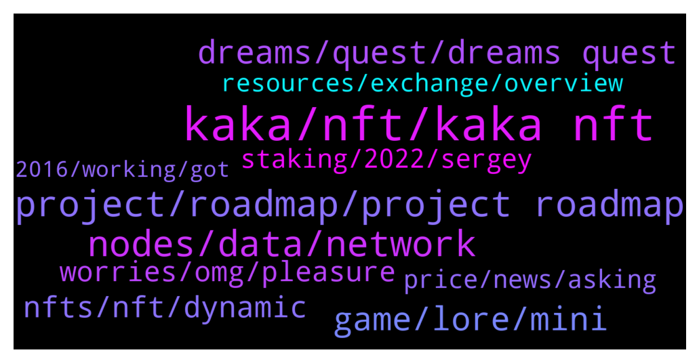

# **@chainlinkofficial**
 ## Analysis for **2022-01-11** - **2022-01-12**.

---

## 📊 **Basic Stats**

**n_messages_sent**: 237

---

---

## 🔝 **Top keywords and related messages**

1. **kaka, nft, kaka nft**

    @Joypokkamol --- *In just a few moments, we will have a Community Q&A with KAKA NFT World who recently announced that it integrates Chainlink VRF to power a fair and transparent gameplay https://kakanft.medium.com/kaka-nft-world-integrates-chainlink-vrf-to-power-a-fair-and-transparent-gameplay-4f304b88edca.* **--->** [TG Discussion](https://t.me/chainlinkofficial/363403)

    @Joypokkamol --- *It was really nice to hear about KAKA NFT World.* **--->** [TG Discussion](https://t.me/chainlinkofficial/363469)

    @kakanft001 --- *Troland game is another highlight of KAKA Why does Troland stand out? We list a few as follows：* **--->** [TG Discussion](https://t.me/chainlinkofficial/363422)

    @kakanft001 --- *Cross-chain Operability: KAKA applied cross-chain technology for users to transfer their assets and play games between several public chains such as BSC and OKExchain. It enables the liquidity of users’ assets.* **--->** [TG Discussion](https://t.me/chainlinkofficial/363424)

    @kakanft001 --- *Deflation Mechanism KAKA has a deflation mechanism where 20% NFT cards are burned through each round of the game. The supply of cards in circulation decreases along with the battles.Therefore each card value will increase.* **--->** [TG Discussion](https://t.me/chainlinkofficial/363425)

    @kakanft001 --- *e, Discount bonuses so could enjoy discounts from NFTs, mystery boxes etc from KAKA official and other collaborating platforms. f, Exclusive customized NFTs with a minimum platform points from purchases. g, Multi-chain metaverse experience h, Virtual character persona like receiving customized KAKA Metaverse virtual persona and personal space.* **--->** [TG Discussion](https://t.me/chainlinkofficial/363420)

2. **project, roadmap, project roadmap**

    @SteveGoodCEO --- *We shared an updated roadmap plans on Medium so that people know our revised plans and how we plan to execute* **--->** [TG Discussion](https://t.me/chainlinkofficial/362927)

    @Linkederic --- *What specifically are you interested in?* **--->** [TG Discussion](https://t.me/chainlinkofficial/363156)

    @SteveGoodCEO --- *long roadmap, just have to deliver top quality. thats the aim* **--->** [TG Discussion](https://t.me/chainlinkofficial/362914)

    @SteveGoodCEO --- *Well that a great question about the roadmap. we have a bunch of things going on* **--->** [TG Discussion](https://t.me/chainlinkofficial/362835)

    @marcromeron --- *What’s next on your project’s roadmap?* **--->** [TG Discussion](https://t.me/chainlinkofficial/362833)

    @Joypokkamol --- *What’s next on your project’s roadmap that we may expect in the near future?* **--->** [TG Discussion](https://t.me/chainlinkofficial/363451)

3. **nodes, data, network**

    @itsmelodika --- *Hi friends,  Chainlink Blockchain Developer Carnival🎡 is coming up in 10 days, it's a fun virtual event that will include Trivia, Coding Contests, Speedrunning, and more!   If you'd like to join, register here:  https://chainlinkcommunity.typeform.com/dev-carnival* **--->** [TG Discussion](https://t.me/chainlinkofficial/362996)

    @RomainSwitzerland --- *Hi Lotto, You can find all official updates from Chainlink here* **--->** [TG Discussion](https://t.me/chainlinkofficial/362680)

    @SteveGoodCEO --- *Also we are using Chainlink weather* **--->** [TG Discussion](https://t.me/chainlinkofficial/362809)

    @Linkederic --- *Chainlink is not available on Pulsechain at this time. The team typically doesn’t provide timelines for integration targets, but the plan is to make Chainlink available on all leading smart contract platforms.  Feel free to fill out the “request price feed” form on this site https://data.chain.link* **--->** [TG Discussion](https://t.me/chainlinkofficial/362692)

    @JuneOvat --- *Hello everyone, any clues on where I can get data on chainlink nodes presently running on Solana, or price feeds on Solana?* **--->** [TG Discussion](https://t.me/chainlinkofficial/362732)

    @hexlotto --- *Hi people nice to meet you all, is there any official updates for Chainlink support for PulseChain?* **--->** [TG Discussion](https://t.me/chainlinkofficial/362675)

4. **game, lore, mini**

    @SteveGoodCEO --- *but honestly our first mini game is targetted for test-net users who are white listed in April/May timeframe. We are going as fast as we can. lots of graphics and assets and music/sound to create along with all the code* **--->** [TG Discussion](https://t.me/chainlinkofficial/362903)

    @SteveGoodCEO --- *The lore (or all of the backstory and history and mythology) is just so exciting that I cant wait until we start releasing some of it* **--->** [TG Discussion](https://t.me/chainlinkofficial/362787)

    @SteveGoodCEO --- *And of course the main game is all in development too but this is a much longer process which is why mini games and lore are important* **--->** [TG Discussion](https://t.me/chainlinkofficial/362855)

    @SteveGoodCEO --- *and they are driving all of the game lore and mythology right now* **--->** [TG Discussion](https://t.me/chainlinkofficial/362851)

    @SteveGoodCEO --- *First off we are building a mini-game right now which is part of that RPG video that we will share in a min* **--->** [TG Discussion](https://t.me/chainlinkofficial/362838)

    @SteveGoodCEO --- *and meanwhile we are also developing the game Lore. We have just brought 2 Hollywood producers onto our team. Yes the real deal* **--->** [TG Discussion](https://t.me/chainlinkofficial/362849)

5. **dreams, quest, dreams quest**

    @SteveGoodCEO --- *and that the dreamsverse is our version of those dreams. You will see characters and ideas youve seen in your dreams. things are gonna look really familiar to you* **--->** [TG Discussion](https://t.me/chainlinkofficial/362862)

    @marcromeron --- *Dreams Quest✨ OFFICIAL-LINKS: 🌐 Website: https://dreams.quest/  🟨 BinanceNFT Marketplace: https://www.binance.com/en/nft/shopWindow?reSale=&tradeType=&currency=&amountFrom=&amountTo=&keyword=&orderBy=list_time&orderType=-1&isBack=1&uid=11966331&order=list_time%40-1  🎞 Cinematic Teaser: https://www.youtube.com/watch?v=4pg_ukd_gDk  🐦 Twitter: https://twitter.com/DreamsQuestNFT  💬 TG Discussions: https://t.me/dreamsquesttavern  📢 TG Announcements: https://t.me/dreamsquestnftann  📺 Youtube: https://www.youtube.com/c/DreamsQuestOfficial/  📚 Facebook: https://www.facebook.com/DreamsQuestNFT  📸 Instagram: https://www.instagram.com/dreamsquestnft/  👽 Reddit: https://www.reddit.com/r/dreamsquestnft/  👾 Discord: https://discord.gg/dreamsquest  🗞 Medium: https://dreamsquestnft.medium.com/  🗂 Linkedin: https://www.linkedin.com/company/dreamsquest/  📜 LitePaper: https://overview.dreams.quest/  ✅ Audit: https://audits.solidgrp.io/dreams-quest/  Dreams Quest✨ LP-LINK:   :1781_knight: Dreams Quest Loyalty Program: https://dreams.quest/loyalty-program   Dreams Quest✨ MARKETS-LINKS:   🧤KuCoin: https://trade.kucoin.com/DREAMS-USDT   🥞 PanCake Swap: https://pancakeswap.finance/swap?outputCurrency=0x54523d5fb56803bac758e8b10b321748a77ae9e9* **--->** [TG Discussion](https://t.me/chainlinkofficial/362895)

    @marcromeron --- *but it sounds great to be involved in this REAL dream* **--->** [TG Discussion](https://t.me/chainlinkofficial/362866)

    @SteveGoodCEO --- *the dreams have launched already :)* **--->** [TG Discussion](https://t.me/chainlinkofficial/362896)

    @SteveGoodCEO --- *and the more you play, the more it will awaken you and you will start to remember things. its always ashame when we wake up from a dream and cant remember. but now you will start to remember as you are in the dreams verse, really a multi-verse of many cool places to explore and experience things you should know but cant remember* **--->** [TG Discussion](https://t.me/chainlinkofficial/362865)

    @marcromeron --- *it was very interesting to know more about Dreams Quest.* **--->** [TG Discussion](https://t.me/chainlinkofficial/362921)

6. **nfts, nft, dynamic**

    @Linkederic --- *Chainlink is not a blockchain, so you wouldn't launch an nft marketplace "on Chainlink"  Relevant articles: https://blog.chain.link/what-is-chainlink/  https://blog.chain.link/blockchains-oracles-similarities-differences-synergies/* **--->** [TG Discussion](https://t.me/chainlinkofficial/363163)

    @BilliCasper --- *Is getting nfts possible with chainlink* **--->** [TG Discussion](https://t.me/chainlinkofficial/363367)

    @CeeZ --- *As eth nft market place, link marketplace? Link-xxx as erc-xxx ?  The smart contract allows nfts on eth. Will link support link-nft?* **--->** [TG Discussion](https://t.me/chainlinkofficial/363160)

    @CeeZ --- *Does the chainlink network support NFT's (soon(?))* **--->** [TG Discussion](https://t.me/chainlinkofficial/363143)

    @Sylvarantt --- *Do you mean developing NFTs by utilizing Chainlink? Actually yes, they are called dynamic NFTs  https://blog.chain.link/create-dynamic-nfts-using-chainlink-oracles/* **--->** [TG Discussion](https://t.me/chainlinkofficial/363372)

    @Linkederic --- *That said, Chainlink can be used to generate NFTs that rely on external data, or even dynamic NFTs that update based on changing real world data! as in this https://twitter.com/Smart_Contract/status/1480727778496598021* **--->** [TG Discussion](https://t.me/chainlinkofficial/363164)

7. **worries, omg, pleasure**

    @SteveGoodCEO --- *OMG seriously its a pleasure. my time is best spent when i can speak to the community* **--->** [TG Discussion](https://t.me/chainlinkofficial/362922)

    @SteveGoodCEO --- *OMG me too! I am as anxious as our community!* **--->** [TG Discussion](https://t.me/chainlinkofficial/362792)

    @ibdemir --- *Ok. You don't know anything. Thank you. Good day to you without knowing anything.* **--->** [TG Discussion](https://t.me/chainlinkofficial/363536)

    @kakanft001 --- *thanks for listening! Have a wonderful day everyone!* **--->** [TG Discussion](https://t.me/chainlinkofficial/363471)

    @Kâtre --- *thank you for the answer ❤️joy* **--->** [TG Discussion](https://t.me/chainlinkofficial/363387)

    @marcromeron --- *well... thank you very much @SteveGoodCEO for your precious time!!!* **--->** [TG Discussion](https://t.me/chainlinkofficial/362920)

8. **staking, 2022, sergey**

    @Eve --- *So does that have anything to do with staking* **--->** [TG Discussion](https://t.me/chainlinkofficial/362667)

    @aminpm --- *Hello when staking ?  I hold on ledger* **--->** [TG Discussion](https://t.me/chainlinkofficial/362436)

    @camel_donuts --- *are there any decent responses to that medium blog re: issues with proposed chainlink staking* **--->** [TG Discussion](https://t.me/chainlinkofficial/363109)

    @Nmadhan1234 --- *Where can we find staking reward details of chain link and when it is coming . Anyone* **--->** [TG Discussion](https://t.me/chainlinkofficial/362427)

    @Both --- *Hi gUys, can someone please explain : I 'd like to farm Link on AAVE but it says APY 0% ..??? Could you please enlight me ? thanks* **--->** [TG Discussion](https://t.me/chainlinkofficial/362706)

    @Linkederic --- *Staking is not yet live. This article provides an overview of explicit staking from the Chainlink 2.0 Whitepaper. This presentation by Sergey discusses staking and the difference between implicit and explicit staking, while in this other presentation Sergey announced the team is planning to implement some form of staking in 2022.  As a rule the team doesn’t offer exact timelines for development targets.   No details relating to returns etc have been confirmed.* **--->** [TG Discussion](https://t.me/chainlinkofficial/363206)

9. **price, news, asking**

    @ibdemir --- *If ask you why the price is same with the level of BTC 40k and 43.6k, it is understandable. But I am not asking. I am just talking about what is the reason. I am asking, any delayed things on the road map? Today any bad news are you heard. I am asking this.* **--->** [TG Discussion](https://t.me/chainlinkofficial/363532)

    @Kâtre --- *Hi. Is there any price channel ?* **--->** [TG Discussion](https://t.me/chainlinkofficial/363384)

    @Linkederic --- *Any speculation on price movements in any capacity is prohibited. If you're interested in current news relating to Chainlink, check out Twitter.com/chainlink and the community operated news site http://chainlinktoday.com/* **--->** [TG Discussion](https://t.me/chainlinkofficial/363531)

    @ibdemir --- *What is happening? Why going down? Any Reason?* **--->** [TG Discussion](https://t.me/chainlinkofficial/363523)

    @ibdemir --- *I didn't asked you. I am not talking about the price* **--->** [TG Discussion](https://t.me/chainlinkofficial/363529)

    @Shogun187 --- *No price or market discussion here 👍* **--->** [TG Discussion](https://t.me/chainlinkofficial/363527)

10. **resources, exchange, overview**

    @Borosniper77 --- *Hi all gonna start looking into CL  anyone recommend the cheapest exchange for this and the best hardware wallet for CL.  Whats the cheapest network to send CL from off the exchange.* **--->** [TG Discussion](https://t.me/chainlinkofficial/362456)

    @marcromeron --- *Welcome new members to the Official Chainlink Telegram Community!  Please review the pinned post for our community rules and resources.   Be aware that price/trading discussion is strictly prohibited.  New to Chainlink? Check out these resources:  - What is Chainlink? - Chainlink 2.0 Whitepaper Overview - The Community Factsheet - Explicit Staking in Chainlink 2.0  - 77 Smart Contract Use Cases Enabled By Chainlink  - The Ultimate Chainlink Deep Dive: Completing The God Protocols: A Comprehensive Overview of Chainlink in 2021   ‼️Remember: We will not PM you first. We will never ask for your passwords, keys, or funds for any reason. We don’t have special deals to offer you and there is not now nor will there ever be a Chainlink airdrop. See this article to learn how to avoid the most common scams.* **--->** [TG Discussion](https://t.me/chainlinkofficial/363491)

    @Linkederic --- *‼️Remember: We will not PM you first. We will never ask for your passwords, keys, or funds for any reason. We don’t have special deals to offer you and there is not now nor will there ever be a Chainlink airdrop. See this article to learn how to avoid the most common scams.* **--->** [TG Discussion](https://t.me/chainlinkofficial/363208)

    @Linkederic --- *Welcome new members to the Official Chainlink Telegram Community!  Please review the pinned post for our community rules and resources.   Be aware that price/trading discussion is strictly prohibited.  New to Chainlink? Check out these resources:  - What is Chainlink? - Chainlink 2.0 Whitepaper Overview - The Community Factsheet - Explicit Staking in Chainlink 2.0  - 77 Smart Contract Use Cases Enabled By Chainlink  - The Ultimate Chainlink Deep Dive: Completing The God Protocols: A Comprehensive Overview of Chainlink in 2021   ‼️Remember: We will not PM you first. We will never ask for your passwords, keys, or funds for any reason. We don’t have special deals to offer you and there is not now nor will there ever be a Chainlink airdrop. See this article to learn how to avoid the most common scams.* **--->** [TG Discussion](https://t.me/chainlinkofficial/363097)

    @dmtrsflaco --- *A bot customer support DM me by commenting on this ^ smart scam* **--->** [TG Discussion](https://t.me/chainlinkofficial/362465)

    @BrapreetLadysMan --- *We do not talk about exchanges or listing in this group. Many people use ledger and trezor wallets commonly but you will need to DYOR. Welcome to the community!* **--->** [TG Discussion](https://t.me/chainlinkofficial/362470)

