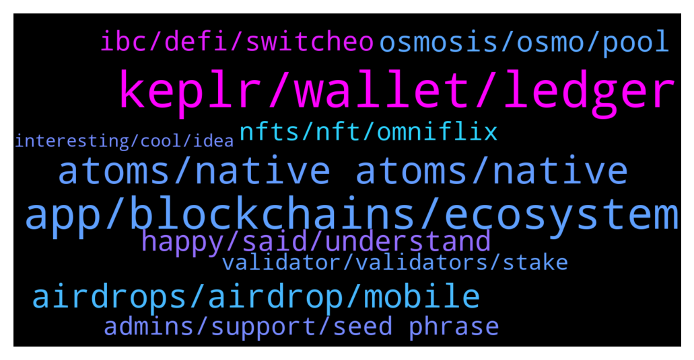

# **@cosmosproject**
 ## Analysis for **2022-01-11** - **2022-01-12**.

---

## 📊 **Basic Stats**

**n_messages_sent**: 417

---

---

## 🔝 **Top keywords and related messages**

1. **keplr, wallet, ledger**

    @kenpole --- *Is there a way to add custom tokens to keplr?* **--->** [TG Discussion](https://t.me/cosmosproject/472598)

    @RobertTHEwhale --- *Sold some airdrops....converted to atom.  Sent atom to ledger and yeah nothing is showing up* **--->** [TG Discussion](https://t.me/cosmosproject/472287)

    @Jrm900 --- *i have installed keplr, how can i send from binance to keplr? what should i send? someone explain me? i want to buy osmosis* **--->** [TG Discussion](https://t.me/cosmosproject/472907)

    @RobertTHEwhale --- *When u send atom from osmosis wallet to ledger...how long does it usually take? Been like 3 hours for me still waiting* **--->** [TG Discussion](https://t.me/cosmosproject/472277)

    @fvxs6 --- *Hello, how can I use keplr wallet to pledge ATOM through COSMOS validator to qualify for air ticket* **--->** [TG Discussion](https://t.me/cosmosproject/472996)

    @MLH822020 --- *in assets I had EEUR and then I withdrew it* **--->** [TG Discussion](https://t.me/cosmosproject/472836)

2. **app, blockchains, ecosystem**

    @👑AmirMohammad👑 --- *Hello How may I application for Modrating cosmos Persian community ?* **--->** [TG Discussion](https://t.me/cosmosproject/471937)

    @ZoltanAtom --- *You may check the whole cosmos app&services&tokens from Cosmos official website ;  https://cosmos.network/ecosystem/apps* **--->** [TG Discussion](https://t.me/cosmosproject/473133)

    @Rod --- *Hey guys, has anyone been connecting to terra via the cosmos app? I am currently unable to connect to Terra via the Cosmos app after the extension update. The connection from the Terra app is a different address.* **--->** [TG Discussion](https://t.me/cosmosproject/472824)

    @AtomJazz --- *Correct yes, they all have their own tokens. Cosmos is a network of interconnected application specific blockchains. Some cool usecases coming for ATOM on those platforms also, it will be used as a collateral for Agoric stablecoin for example, it will be the main LP pair on Junoswap etc. It's all interconnected in Cosmos* **--->** [TG Discussion](https://t.me/cosmosproject/472633)

    @Andre --- *Hi, am looking to speak with an expert on cosmos for a consultancy piece of work. DM me* **--->** [TG Discussion](https://t.me/cosmosproject/472693)

    @ZoltanAtom --- *There are 15+ entities employing over 300 core devs behind Cosmos and Cosmos Hub specifically with over 2000 devs in the broader ecosystem.  There is no such website which shows all the list of teams,core developers and others.  When you will start to spend some time with Cosmos and keep in touch with community, you get your all answers.* **--->** [TG Discussion](https://t.me/cosmosproject/472462)

3. **atoms, native atoms, native**

    @xbv1587 --- *What is easiest way to buy small number of atom? like 1$ or so.* **--->** [TG Discussion](https://t.me/cosmosproject/472398)

    @Martin --- *Can someone please explain what is the “nemo” for, and why Is required to transfer Atom (not for other blockchains)?* **--->** [TG Discussion](https://t.me/cosmosproject/473094)

    @Chalo --- *Why cant you buy merch with atom/crypto? :/* **--->** [TG Discussion](https://t.me/cosmosproject/472033)

    @Hele_beger --- *The launch of Evmos has made Atom unfazed by the broader market correction* **--->** [TG Discussion](https://t.me/cosmosproject/472347)

    @ZoltanAtom --- *Hey there,  Memo is kinda reference code that you need to fill up if you send your Atom from non-custodial wallet to Any exchanges. In this way exchange understand which account to send Atom.  But if you send Atom from exchange to non-custodial wallet, you do not need any memo.* **--->** [TG Discussion](https://t.me/cosmosproject/473096)

    @ZoltanAtom --- *Most likely ratio is related with how many staked atom you have. Join community channel ;  https://t.me/CosmosAirdrops* **--->** [TG Discussion](https://t.me/cosmosproject/472151)

4. **airdrops, airdrop, mobile**

    @WolfmanKnows --- *anyone know what happed with the #HODLdrop'? Sentinel will soon be conducing a custom airdrop for $DVPN & $ATOM . https://twitter.com/Sentinel_co/status/1445270066044547073* **--->** [TG Discussion](https://t.me/cosmosproject/472775)

    @Cordtus --- *All airdrops are different. How you qualify and how many you qualify for are decided by the person or group administrating that particular drop.* **--->** [TG Discussion](https://t.me/cosmosproject/472663)

    @cryptogmz77 --- *ok, but is there a Official Cosmos Airdrops or not?* **--->** [TG Discussion](https://t.me/cosmosproject/473062)

    @cryptogmz77 --- *is the  Cosmos Network Airdrops  group official?* **--->** [TG Discussion](https://t.me/cosmosproject/473053)

    @JonathanCrt --- *Hey guys have been staking Atom for the better half of a year but never checked any airdrops! Is there an overview somewhere to see the airdrops?* **--->** [TG Discussion](https://t.me/cosmosproject/472721)

    @jquinn13 --- *Is there any airdrops upcoming atom staking?* **--->** [TG Discussion](https://t.me/cosmosproject/472932)

5. **osmosis, osmo, pool**

    @Zlatanragnar --- *hi! which is the best pool on osmosis? maybe the one that not soffer impermanent loss?* **--->** [TG Discussion](https://t.me/cosmosproject/472332)

    @RobertTHEwhale --- *Send it while i was ok osmosis.zone* **--->** [TG Discussion](https://t.me/cosmosproject/472285)

    @TicoJohnny --- *Epoch is in 8 hours, you get osmosis rewards once a day at a specific time* **--->** [TG Discussion](https://t.me/cosmosproject/472853)

    @Jund0 --- *Why am I banned from Osmos tg I never even said a word there* **--->** [TG Discussion](https://t.me/cosmosproject/472310)

    @ZoltanAtom --- *Please join to Osmosis channel and admins will help you. (If someone DM to you,block and report it immediately! Be aware of scammers. ⚠️⚠️)  https://t.me/osmosis_chat* **--->** [TG Discussion](https://t.me/cosmosproject/472837)

    @ZoltanAtom --- *If it’s about Osmosis,please join ;  https://t.me/osmosis_chat* **--->** [TG Discussion](https://t.me/cosmosproject/473088)

6. **happy, said, understand**

    @AtomJazz --- *Yeah so much is happening it's hard to keep up hehe* **--->** [TG Discussion](https://t.me/cosmosproject/472607)

    @Isbyb --- *Добрый день,   русско- говорящие люди присутствуют* **--->** [TG Discussion](https://t.me/cosmosproject/472350)

    @Jadorenapnee --- *Happy to be here with everyone 👌🏼* **--->** [TG Discussion](https://t.me/cosmosproject/473018)

    @H77_ZSD --- *Hello Zoltan, I don't understand your question 😊* **--->** [TG Discussion](https://t.me/cosmosproject/472225)

    @Gnolang --- *Your like a hydra moderating this chat 👍* **--->** [TG Discussion](https://t.me/cosmosproject/472446)

    @AtomJazz --- *Hey, sorry but I don't understand a word you just said. This is English group only 😁* **--->** [TG Discussion](https://t.me/cosmosproject/472352)

7. **ibc, defi, switcheo**

    @ZoltanAtom --- *Hello, great news. Will you implement to #IBC directly at mainnet or later ?* **--->** [TG Discussion](https://t.me/cosmosproject/472224)

    @AtomJazz --- *You can only find projects on Map of zones that have already enabled IBC and are transferring packets throughout Interchain* **--->** [TG Discussion](https://t.me/cosmosproject/472621)

    @Jwinnerr --- *Defi + ibc + collateralized debt positions + EVM* **--->** [TG Discussion](https://t.me/cosmosproject/472650)

    @TicoJohnny --- *Yes or Integrate the IBC protocol, a lot of this is set up with Starport* **--->** [TG Discussion](https://t.me/cosmosproject/472767)

    @AtomJazz --- *With IBC which is the most exciting part* **--->** [TG Discussion](https://t.me/cosmosproject/472270)

    @Crypto_V1 --- *Yeah, and Switcheo already successfully developed the ZIL Bridge on Zillliqa.   Connect IBC compatible networks to other chains via Switcheo and Polynetwork to expand the overall ecosystem!  ⚛* **--->** [TG Discussion](https://t.me/cosmosproject/472652)

8. **nfts, nft, omniflix**

    @cronoscontinuum --- *What is the best marketplace to sell NFTs currently? I like Uptick but are there others that are fullt developed?* **--->** [TG Discussion](https://t.me/cosmosproject/471951)

    @tmpchg --- *A thought that I had related to NFT’s and even though I didn’t specify it in the thread, the thought why I had it was introducing ingame items life. Imagine a unique armor set you found in Diablo or something else ageing with your player 😂* **--->** [TG Discussion](https://t.me/cosmosproject/472064)

    @TicoJohnny --- *I do think the value of NFTs in a resurgence of the art-scene is great.* **--->** [TG Discussion](https://t.me/cosmosproject/472043)

    @Cordtus --- *Will NFT finally destroy the personal tv/movie piracy server I spent my hours perfecting :( maybe* **--->** [TG Discussion](https://t.me/cosmosproject/472048)

    @Hazisarkany --- *Focking badass NFTs from @SCRTBullRun !!!* **--->** [TG Discussion](https://t.me/cosmosproject/472734)

    @Hodler --- *Stargaze is doing legit work right? 😏* **--->** [TG Discussion](https://t.me/cosmosproject/472013)

9. **admins, support, seed phrase**

    @nathan488 --- *It’s a shame the scammers/bots seem to target me in this chat, everytime I message I end up getting a DM from “Cosmo Support”* **--->** [TG Discussion](https://t.me/cosmosproject/472893)

    @AtomJazz --- *Never 😃. Block and report immidiately* **--->** [TG Discussion](https://t.me/cosmosproject/473207)

    @AtomJazz --- *Block all DMs "trying to to help"* **--->** [TG Discussion](https://t.me/cosmosproject/472911)

    @Martin --- *I already received some private messages asking me that to “suppor me with the issue” lol* **--->** [TG Discussion](https://t.me/cosmosproject/473140)

    @Cordtus --- *Ignore scam DM and come on back if any more questions* **--->** [TG Discussion](https://t.me/cosmosproject/471976)

    @ZoltanAtom --- *report and block that channel immediately!* **--->** [TG Discussion](https://t.me/cosmosproject/473061)

10. **validator, validators, stake**

    @catdotfish --- *A validator is a node that puts a stake into play in order to be extracted as a proposer node and, in any case, validates the generated blocks. This task is of fundamental importance for the blockchain itself as without the validators it could not exist. It is also vital to understand how important it is for validators to do their job properly. If in fact, a validator was to start validating wrong transactions, or worse it was to team up with others to alter the history of the blockchain, it would be a disaster. For this reason within Cosmos, there is a system of slashing the stake.  Validators are extracted based on the number of tokens they have. In order for the whole blockchain to work, it is, therefore, necessary that there is a sufficient amount of tokens always staked. If this was not the case, in fact, the blockchain would stop because it would not be possible to determine the proposers of the blocks. However, if you had to use only the tokens owned by the validators themselves, no one would want to cover this task. You have to think that a validator often supports investment in terms of hardware (server, internet connection, etc.) and the time needed to install everything. If he were to buy tokens, the validation work would be poorly convenient in economic terms, if not even inconvenient at all. To solve this problem, Cosmos has introduced the possibility for all those who own some ATOMs to become a delegator.   A delegator is any Atom owner who lends his tokens to increase a validator’s stake, in return for a reward. The process by which a delegator lends its Atom to a validator is called staking or bonding or delegating. Inside any blockchain created with Cosmos, in case you have tokens of that blockchain, you can lend your tokens to one of the validators to increase his stake and make him be advantaged in the extraction for the role of the proposer of a block. This loan is repaid by the validator with the division among all its delegators of the gain that it receives after the generation of the block and the validation of the blocks generated by the other validators.  To encourage Atom owners to stake their tokens, Cosmos has also introduced an inflation system so that if the number of ATOM staked are less than 2/3 of the fully circulating ATOM supply, their value drops by up to 20% per year.   By doing so, no ATOM owner has the advantage of keeping them without delegating them, but, on the contrary, by placing them within a stake, they have the possibility of increasing their token amount and therefore also the value of their investment.  In the event that a validator suffers a slash of its stake, delegators will also lose part of their assets. On the other hand, if the validator does its job correctly, they will receive a reward proportional to their commitment to the validator. It should be noted that, very often, validators retain a share of the reward (a commission) before distributing the proceeds of the work to their delegators.* **--->** [TG Discussion](https://t.me/cosmosproject/472958)

    @AtomJazz --- *I recommend restaking to another validator* **--->** [TG Discussion](https://t.me/cosmosproject/472414)

    @Nobodyone2002 --- *Good morning which is the best validator?* **--->** [TG Discussion](https://t.me/cosmosproject/473165)

    @zakimanian --- *running a validator gets more expensive because of things like MEV* **--->** [TG Discussion](https://t.me/cosmosproject/473155)

    @MrCoinnaisseur --- *Downtime slashing I have not seen on other chains as well. In general it is "easy" to keep the validator online enough to avoid this. Some offer refunds if downtime slashing occurs, but imho it is more important to make sure it just won't happen* **--->** [TG Discussion](https://t.me/cosmosproject/472965)

    @catdotfish --- *slashing by 5 occurred only one in 3 years of mainnet and was because the validator was brand new and not used to this   we can fairly say that as Cosmos Hub has the most experienced validator set, downtime slashed are rare as well* **--->** [TG Discussion](https://t.me/cosmosproject/472962)

