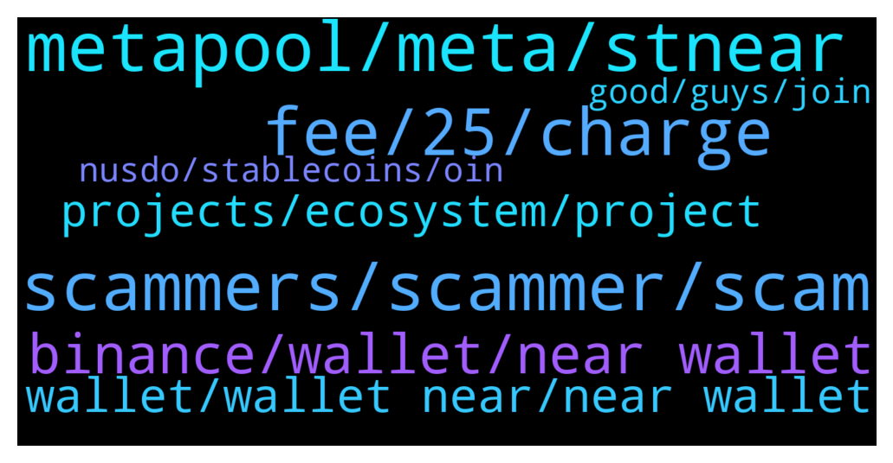

# **@cryptonear**
 ## Analysis for **2022-01-11** - **2022-01-12**.

---

## 📊 **Basic Stats**

**n_messages_sent**: 523

---

---

## 🔝 **Top keywords and related messages**

1. **metapool, meta, stnear**

    @GeorgePro1 --- *1. MetaPool (https://metapool.app/dapp/mainnet/meta/#)  distributes the tokens proportionally to the validators, so no worries which validator to choose. 2. You still get ~11% APY on your $NEAR, and withdraw NEAR whenever you want without waiting (with fee). 3. On top of that you get MetaPools $META token payed out daily 4. You get stNear which can be used on other DeFi applications such as app.ref.finance* **--->** [TG Discussion](https://t.me/cryptonear/282390)

    @HODL_R --- *What’s the APY of $meta token that they pay* **--->** [TG Discussion](https://t.me/cryptonear/282400)

    @iamkemoo --- *Unfortunately you don't get $META rewards, when you use your stNEAR in DeFi.* **--->** [TG Discussion](https://t.me/cryptonear/282288)

    @iamkemoo --- *there is no catch, this is a way that get customers and their $meta token distributed.* **--->** [TG Discussion](https://t.me/cryptonear/282398)

    @HODL_R --- *if metapool pays 11% APY plus META tokens, what’s the catch, compared to just staking it myself on NEAR wallet* **--->** [TG Discussion](https://t.me/cryptonear/282394)

    @iamkemoo --- *You can stake you stNEAR on DeFi protocols such as Ref Finance (https://app.ref.finance/), or use OIN Finance (https://near.oin.finance/) to mint $nUSDO and stake the $nUSDO to get $META and $OIN tokens as rewards.* **--->** [TG Discussion](https://t.me/cryptonear/283205)

2. **scammers, scammer, scam**

    @cuongdcc --- *guys, this is scam group, please beware and report: https://t.me/NearProtoc0l* **--->** [TG Discussion](https://t.me/cryptonear/283399)

    @Wojak_near --- *Hey guys anyone knows "youminter "on near chain? Is it a scam project? That said they would distribute their tokens on 20th Dec 2021 after bocachica IDO, but nothing happened,  if you ask them for the reason, you will be banned from their telegram* **--->** [TG Discussion](https://t.me/cryptonear/281830)

    @gilangdesu69 --- *Pls banned scammer sir, @HelmyFarchan she is scammer* **--->** [TG Discussion](https://t.me/cryptonear/281909)

    @SultanOfStock --- *guys be careful @cryotodev appears to be scammer* **--->** [TG Discussion](https://t.me/cryptonear/282668)

    @iamkemoo --- *Hey is talking about https://near-event.com/near/index.html. his wife lost money by sending $NEAR to that platfrom. As I told you via DM, this is not our website and we recommend to always check the domain. Our offical domain is near.org. Again, I'm sorry for your wife losses and please take care of your assets in the near future.* **--->** [TG Discussion](https://t.me/cryptonear/283436)

    @kv9990 --- *It's scam. Please block and report ✌️* **--->** [TG Discussion](https://t.me/cryptonear/283483)

3. **fee, 25, charge**

    @supersaiyan_goku --- *actually it does, everytime you connect to wallet It charge a small amout of Near* **--->** [TG Discussion](https://t.me/cryptonear/283307)

    @TheGo1denBull --- *It shows the minimum price as your about to send an asset out of your wallet. It updates quickly as well. It can depend of the amount as well.* **--->** [TG Discussion](https://t.me/cryptonear/282697)

    @kv9990 --- *It's 0.001 NEAR =)) that's 10 cents when it goes $100, and can be recovered back when you delete access key =))* **--->** [TG Discussion](https://t.me/cryptonear/283321)

    @nino706 --- *I see everytime i connect dapp, it will cost fee. Not sure it is 0.25 or not. But if the Near price go much high about 100, the fee will very much* **--->** [TG Discussion](https://t.me/cryptonear/283318)

    @larry_lang --- *nope, it's giving the site permission to spend up to 0.25, but it wont charge 0.25N* **--->** [TG Discussion](https://t.me/cryptonear/283290)

    @Kripto_Raptor --- *you can claim one here as well. it' doesn't ask for any storage fee https://narwallets.com/* **--->** [TG Discussion](https://t.me/cryptonear/282774)

4. **binance, wallet, near wallet**

    @hey --- *Yes from the near wallet to binance* **--->** [TG Discussion](https://t.me/cryptonear/282178)

    @phongcaca0711 --- *i don't know if it is distributed in binance wallet or near wallet* **--->** [TG Discussion](https://t.me/cryptonear/283071)

    @hey --- *So i lost 0.08 near for a transaction? But binance fee was 0.01 near* **--->** [TG Discussion](https://t.me/cryptonear/282188)

    @Hnefatafl --- *Is it recommended wallet? I'm sorry for now only on Binance cex, gonna move* **--->** [TG Discussion](https://t.me/cryptonear/282763)

    @hey --- *Ok found lol i was wrong website. Other question... I send us a test 0.2 near from binance to near. Wallet to. Activate my wallet but now i have only 0.13 near in my wallet* **--->** [TG Discussion](https://t.me/cryptonear/282183)

    @rahulgoel007 --- *CMC is responsible for the distribution Check with them* **--->** [TG Discussion](https://t.me/cryptonear/283069)

5. **wallet, wallet near, near wallet**

    @iforbusiness2 --- *we have only web wallet https://wallet.near.org/* **--->** [TG Discussion](https://t.me/cryptonear/283190)

    @TheGo1denBull --- *https://wallet.near.org/buy to buy NEAR from certain avenues. Idk why email isn't working to create the wallet.* **--->** [TG Discussion](https://t.me/cryptonear/282752)

    @Go_finder --- *Hi Horus.. Please what's the best way to create wallet on Near Protocol?* **--->** [TG Discussion](https://t.me/cryptonear/282647)

    @Chimborazu --- *hello, I am trying to create my near wallet but I'm missing the first 0.1 near, could someone help me please?* **--->** [TG Discussion](https://t.me/cryptonear/282916)

    @JaydenBo --- *I have a near phase but I can't recover my wallet why?* **--->** [TG Discussion](https://t.me/cryptonear/281963)

    @hey --- *Hmm how i can't send money from near wallet? We have a app as a wallet?* **--->** [TG Discussion](https://t.me/cryptonear/282173)

6. **projects, ecosystem, project**

    @TheeCritic --- *I have been researching NEAR and it seems pretty awesome. Thought I would join your community and see what is happening?* **--->** [TG Discussion](https://t.me/cryptonear/282499)

    @TheeCritic --- *As a US person :( what is the best on-ramp for NEAR? What is the next project delivery you guys are excited about?* **--->** [TG Discussion](https://t.me/cryptonear/282504)

    @fxretro --- *Catchup with the latest news in the ecocystem https://twitter.com/risengrind_near/status/1480633295390056459* **--->** [TG Discussion](https://t.me/cryptonear/281809)

    @iamkemoo --- *to many projects TBH.. but i think metaverse will be huge on NEAR. check out what these guys are doing https://www.mtvrs.app/* **--->** [TG Discussion](https://t.me/cryptonear/282506)

    @iamkemoo --- *Do you know about https://awesomenear.com/categories/nft/? You can check most of the project launched on NEAR there. As I said, I think Gaming/Metaverse will be a huge sector on Near.* **--->** [TG Discussion](https://t.me/cryptonear/282522)

    @iforbusiness2 --- *Great! you can have look on all the defi ecosystem in NEARverse to find more opportunities https://awesomenear.com/categories/defi/* **--->** [TG Discussion](https://t.me/cryptonear/283208)

7. **good, guys, join**

    @larry_lang --- *Hehe hi guys=]] wish u all a good day^^* **--->** [TG Discussion](https://t.me/cryptonear/282877)

    @larry_lang --- *@@ hehe maybe we can join force and make a protest =]]]* **--->** [TG Discussion](https://t.me/cryptonear/282314)

    @bailey_12 --- *Hey guys, sorry for being this late but  https://twitter.com/BaileyVu12/status/1481259950559338497  JOIN WITH ME NOWWW* **--->** [TG Discussion](https://t.me/cryptonear/283362)

    @FritzWagner --- *Have a good rest chief ;)* **--->** [TG Discussion](https://t.me/cryptonear/282908)

    @iamkemoo --- *Welcome buddy, great to have you here! 🙌 Dont hesitate to ask, when you have questions.* **--->** [TG Discussion](https://t.me/cryptonear/282501)

    @FritzWagner --- *Welcome to another shift having fun, helping others, and building community* **--->** [TG Discussion](https://t.me/cryptonear/281954)

