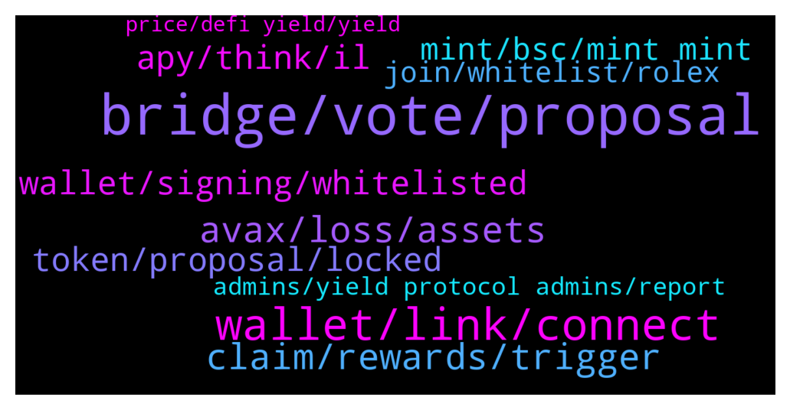

# **@dypfinance**
 ## Analysis for **2022-01-11** - **2022-01-12**.

---

## 📊 **Basic Stats**

**n_messages_sent**: 243

---

---

## 🔝 **Top keywords and related messages**

1. **bridge, vote, proposal**

    @timdyp --- *We need your vote regarding the #iDYP Bridge Launch. Bellow you will find the #iDYP Bridge proposal details and the reasons why the decision should belong to our community👇 https://gov.dyp.finance/proposals/15* **--->** [TG Discussion](https://t.me/dypfinance/238836)

    @timdyp --- *We love to listen to our community so the Governance proposal for the launch of the iDYP Bridge is now available multi-chain for all the users.  Binance Smart Chain Proposal https://gov-bsc.dyp.finance/proposals/7  Ethereum Chain Proposal https://gov.dyp.finance/proposals/15  Avalanche Chain Proposal https://gov-avax.dyp.finance/proposals/3  At the end of the vote, we will sum up all the votes across all the chains. Don't forget, that we need your vote regarding the #iDYP Bridge Launch!* **--->** [TG Discussion](https://t.me/dypfinance/238889)

    @tamtamkanto --- *What are the plans for the bridge if the vote is approved? Will the bridge be available immediately?* **--->** [TG Discussion](https://t.me/dypfinance/238881)

    @DhoniMSD516 --- *The team will sum up all the votes across all the chains. Please cast your vote   Binance Smart Chain Proposal https://gov-bsc.dyp.finance/proposals/7  Ethereum Chain Proposal https://gov.dyp.finance/proposals/15  Avalanche Chain Proposal https://gov-avax.dyp.finance/proposals/3* **--->** [TG Discussion](https://t.me/dypfinance/239040)

    @iamJubi --- *We love to listen to our community so the Governance proposal for the launch of the iDYP Bridge is now available multi-chain for all the users.  Binance Smart Chain Proposal https://gov-bsc.dyp.finance/proposals/7  Ethereum Chain Proposal https://gov.dyp.finance/proposals/15  Avalanche Chain Proposal https://gov-avax.dyp.finance/proposals/3  At the end of the vote, we will sum up all the votes across all the chains. Don't forget, that we need your vote regarding the #iDYP Bridge Launch!* **--->** [TG Discussion](https://t.me/dypfinance/238946)

    @captain_protein --- *And sometimes turkeys vote for Christmas* **--->** [TG Discussion](https://t.me/dypfinance/239093)

2. **wallet, link, connect**

    @timdyp --- *Clear your cookie & cache and try again.* **--->** [TG Discussion](https://t.me/dypfinance/238534)

    @bogdantzr --- *Is asking me to log in in certain link* **--->** [TG Discussion](https://t.me/dypfinance/238704)

    @Snakedancer --- *Connect wallet does not work for me* **--->** [TG Discussion](https://t.me/dypfinance/238525)

    @DhoniMSD516 --- *Yes for this I explained please read here https://t.me/dypfinance/231546* **--->** [TG Discussion](https://t.me/dypfinance/238957)

    @bogdantzr --- *She was asking me to deposit 0.5 eth in the wallet in order for the wallet to connect* **--->** [TG Discussion](https://t.me/dypfinance/238710)

    @bogdantzr --- *The connect wallet button from the website is not working ?* **--->** [TG Discussion](https://t.me/dypfinance/238677)

3. **avax, loss, assets**

    @Craig --- *I understand that and the loss is not the reason for my post. I'm simply trying to learn more about IL and what market indicators I'm looking for to gauge it's impact.* **--->** [TG Discussion](https://t.me/dypfinance/238628)

    @Craig --- *The AVAX price has dropped 25% since i provided my LP which equates to 1/4 of 1x. Reading your numbers I could expect to lose 25% of my assets in a year with a 5x UP or DOWN, and yet I've lost 18% in a month with only 1/4 of 1x drop in asset value. I don't follow.* **--->** [TG Discussion](https://t.me/dypfinance/238584)

    @WatermelonNoia --- *I dont think it will ever catch based on the AVAX component alone, as when you join the LP your AVAX stake is split up to purchase some DYP. You'll need DYP to increase to offset the IL you have experienced and comparing it to purely AVAX alone.  Please consider the payouts you get, as they close the gap between your initial investment, and any IL.  Profit or loss (@ a point in time) = initial capital - IL + payouts received.* **--->** [TG Discussion](https://t.me/dypfinance/238639)

    @Craig --- *I'm using the total value of all assets from the stats page. The total value is $4235. The value of my 57.477 AVAX on today's market would be $4832. So the total value of my liquidity is 12% less than the value of the 57.477 AVAX (today's pricing. Not the price when I began) at this point after one month and a 25% drop of the AVAX price. Trying to understand how those numbers work.* **--->** [TG Discussion](https://t.me/dypfinance/238589)

    @jstby --- *When price down we enter LP to reduce IL?* **--->** [TG Discussion](https://t.me/dypfinance/238631)

    @Craig --- *Maybe I'm not being clear; the market improves so the LP improves. But if the market is improving then the value of the AVAX is also going up independent of the pool, so how does that close the 18% loss gap?* **--->** [TG Discussion](https://t.me/dypfinance/238576)

4. **claim, rewards, trigger**

    @v1ruzz --- *So you mean they need to be claimed everyday or they are lost is it* **--->** [TG Discussion](https://t.me/dypfinance/238960)

    @DhoniMSD516 --- *Hey the WBNB rewards will be shown when claim trigger happened so just hover on Claim and see time for next rewards and if it says feel free to claim trigger the claim* **--->** [TG Discussion](https://t.me/dypfinance/239062)

    @ringLeader96 --- *Where can we see the last trigger claim for a pool? I feel like I haven’t gotten rewards for both the ETH 30, and AVAX 30* **--->** [TG Discussion](https://t.me/dypfinance/238965)

    @shinigamikami --- *@DhoniMSD516 can you check the eth farm 90 days, have observed something twice but wanted to be sure. The previous to the last claim was over 2 days ago yet when the last claim happened only one day reward was paid, I’m certain the claim happened more than 48hrs before this last one* **--->** [TG Discussion](https://t.me/dypfinance/239012)

    @DhoniMSD516 --- *Hey you can hover on Claim on Desktop and it shows time for next rewards or in blockchain you can check in corresponding contract transactions* **--->** [TG Discussion](https://t.me/dypfinance/238967)

    @DhoniMSD516 --- *The last claim trigger was 6 days ago, you can execute the claim now you get all 6 days rewards else you can wait if not in hurry, as ETH fees are high no one triggered claim* **--->** [TG Discussion](https://t.me/dypfinance/238666)

5. **wallet, signing, whitelisted**

    @herbie1996 --- *my dyp is locked do I need to buy more to just place in my wallet* **--->** [TG Discussion](https://t.me/dypfinance/238529)

    @DhoniMSD516 --- *Actually we removed that DYP hold requirement, just signing on website is enough for now* **--->** [TG Discussion](https://t.me/dypfinance/238750)

    @WatermelonNoia --- *Did you find out if our DYP held in contract (instead of in a wallet) will suffice getting whitelisted?* **--->** [TG Discussion](https://t.me/dypfinance/238748)

    @WatermelonNoia --- *Does signing the message with one address gets you whitelisted across all chains that address exists on?* **--->** [TG Discussion](https://t.me/dypfinance/238743)

    @timdyp --- *Hey, you don't need to hold DYP. Just join the whitelist by signing a message https://dyp.finance/whitelist* **--->** [TG Discussion](https://t.me/dypfinance/238564)

    @Richcal --- *So what's the point of a whitelist?* **--->** [TG Discussion](https://t.me/dypfinance/238978)

6. **apy, think, il**

    @Disguy125 --- *I'm curious what the apy is adjust to?   Would the team be will to airdrop locked LP wallets compensation to help minaret the 85%IL in iDYP.* **--->** [TG Discussion](https://t.me/dypfinance/239123)

    @Disguy125 --- *Imagine the apy went up to 5000% or something lol* **--->** [TG Discussion](https://t.me/dypfinance/239129)

    @justrealty123 --- *apys legit? not to hate but its kinda crazy* **--->** [TG Discussion](https://t.me/dypfinance/238823)

    @captain_protein --- *An increase in APY may help to offset that, of course, but is the answer just to wait and see?* **--->** [TG Discussion](https://t.me/dypfinance/239110)

    @shinigamikami --- *You can’t be getting $4 usd daily with the current apy @DhoniMSD516 check his pool too thanks* **--->** [TG Discussion](https://t.me/dypfinance/239021)

    @Cryptomommi --- *Not spreading FUD. But I entered with $5000 WBNB pool Nov 26th and now my entire position is only worth $1,200....significant Impermanent Loss but that's the risk you take with DeFi liquidity protocols.* **--->** [TG Discussion](https://t.me/dypfinance/238606)

7. **token, proposal, locked**

    @WatermelonNoia --- *I think there should be a gDYP token that has no monetary value but is linked to any DYP held anywhere (wallet, contract etc) by an individual.  This enables your community to fully utilise DYP for its purpose of generating wealth in the ecosystem and having access to governance token for DAO actions.  I for one have all my DYP locked in contracts. I want to vote, and yes could buy more DYP or claim some (taxable event) but this would be insignificant compared to what i currently hold if available as a gDYP as suggested.  Community - would we vote on this if this was made into a proposal?   What is the communities view on this?  @timdyp* **--->** [TG Discussion](https://t.me/dypfinance/238917)

    @herbie1996 --- *Mate this is a brilliant idea! As I have loads locked up. More than I could afford to buy right now from my bank to vote on major dyp moves. This is something I’d get behind! 👍🏼✅* **--->** [TG Discussion](https://t.me/dypfinance/238943)

    @tollymolly12 --- *Hello mate, are you willing to get your token trending on dextools? I do have the knowledge of getting a token to trend on CMC ( COIN MARKET CAP) and also on dextools which would really bring in a lot of investors and real organic members who will love to perform in all the project activity  kindly let me know if you’re interested.* **--->** [TG Discussion](https://t.me/dypfinance/238935)

    @Nji_jalen --- *Would be happy if soon DYP have feature lending and borrowing* **--->** [TG Discussion](https://t.me/dypfinance/238910)

    @hemanrock --- *Thanks for your suggestion. We are also having some giveaway https://t.me/dypannouncements/826* **--->** [TG Discussion](https://t.me/dypfinance/238880)

    @trader_broi --- *Dyp should coduct a meme contest in Twitter... So it will be also a promo* **--->** [TG Discussion](https://t.me/dypfinance/238758)

8. **mint, bsc, mint mint**

    @Tem9o9 --- *My question is if I need to mint, can I mint NFT on BSC although my DYP balance is on erc20* **--->** [TG Discussion](https://t.me/dypfinance/238794)

    @Richcal --- *can we mint more than 1?* **--->** [TG Discussion](https://t.me/dypfinance/238982)

    @Richcal --- *if i sign my address and then i forgot to mint it or cant mint on these day, what will happen?* **--->** [TG Discussion](https://t.me/dypfinance/238622)

    @Richcal --- *why to mint cat nfts we must be registered our address first? and what sign means?* **--->** [TG Discussion](https://t.me/dypfinance/238619)

    @DhoniMSD516 --- *If you are whitelisted you get guaranteed mint, else you need to do in public in fcfs* **--->** [TG Discussion](https://t.me/dypfinance/238979)

    @Snakedancer --- *On BSC and still not working* **--->** [TG Discussion](https://t.me/dypfinance/238533)

9. **join, whitelist, rolex**

    @timdyp --- *🔥Join Cats and Watches Society #NFTs Whitelist 🎉One Brand New Rolex Daytona Ceramic 116500LN worth $40k Giveaway  To win the watch: ✅Join dyp.finance/whitelist ✅Mint one #NFT once available ✅Like & Retweet this post ✅Join discord.gg/dypcaws ✅Tag 3 friends  👉https://twitter.com/dypfinance/status/1480623073208549380* **--->** [TG Discussion](https://t.me/dypfinance/238523)

    @timdyp --- *The watch is ready to be shipped! 🔥👀* **--->** [TG Discussion](https://t.me/dypfinance/238530)

    @timdyp --- *Good morning #DYPians😼  Don't forget to join the whitelist for our upcoming #NFTs collection https://dyp.finance/whitelist  👉https://twitter.com/dypfinance/status/1480822527354101760* **--->** [TG Discussion](https://t.me/dypfinance/238688)

    @iamJubi --- *🔥Join Cats and Watches Society #NFTs Whitelist 🎉One Brand New Rolex Daytona Ceramic 116500LN worth $40k Giveaway  To win the watch: ✅Join dyp.finance/whitelist ✅Mint one #NFT once available ✅Like & Retweet this post ✅Join discord.gg/dypcaws ✅Tag 3 friends  👉https://twitter.com/dypfinance/status/1480623073208549380* **--->** [TG Discussion](https://t.me/dypfinance/238975)

    @DhoniMSD516 --- *🔥Join Cats and Watches Society #NFTs Whitelist 🎉One Brand New Rolex Daytona Ceramic 116500LN worth $40k Giveaway  To win the watch: ✅Join dyp.finance/whitelist ✅Mint one #NFT once available ✅Like & Retweet this post ✅Join discord.gg/dypcaws ✅Tag 3 friends  👉https://twitter.com/dypfinance/status/1480623073208549380* **--->** [TG Discussion](https://t.me/dypfinance/238725)

    @timdyp --- *And don't forget to join our giveaway for the Rolex Daytona https://twitter.com/dypfinance/status/1480623073208549380?s=20* **--->** [TG Discussion](https://t.me/dypfinance/238565)

10. **admins, yield protocol admins, report**

    @timdyp --- *DEFI YIELD PROTOCOL ADMINS WILL NEVER DM YOU FIRST, NOR WILL THEY ASK YOU FOR MONEY. PLEASE BEWARE OF SCAMS, AND BLOCK/REPORT SUSPICIOUS ACCOUNTS.* **--->** [TG Discussion](https://t.me/dypfinance/238839)

    @DhoniMSD516 --- *Whoever message you first with admin name or profile photo are scammers* **--->** [TG Discussion](https://t.me/dypfinance/238718)

    @DhoniMSD516 --- *Yes he/she is scammer impersonating one of our admins, we admins will NEVER DM you first* **--->** [TG Discussion](https://t.me/dypfinance/238714)

    @timdyp --- *Please block and report! Again, our admins will never DM!* **--->** [TG Discussion](https://t.me/dypfinance/238707)

    @timdyp --- *@bogdantzr this is a scammer!  DEFI YIELD PROTOCOL ADMINS WILL NEVER DM YOU FIRST, NOR WILL THEY ASK YOU FOR MONEY. PLEASE BEWARE OF SCAMS, AND BLOCK/REPORT SUSPICIOUS ACCOUNTS.* **--->** [TG Discussion](https://t.me/dypfinance/238698)

    @DhoniMSD516 --- *❗️ BEWARE OF SCAMMERS ❗️  ❌Admins will NOT take the initiative to message you privately to solve problems. Never give your private keys to anyone, send tokens to addresses that they offer, or click on any links that they provide. ❌Don’t share confidential personal information in private chats, and don't make transactions of any kind at all.  ❗️ Be cautious of anyone who claims to be an admin! ❗️ DeFi Yield Protocol admins are @DhoniMSD516, @Tekkol, @timdyp, @iamJubi, @kleopatrad, and @hemanrock !* **--->** [TG Discussion](https://t.me/dypfinance/238717)

