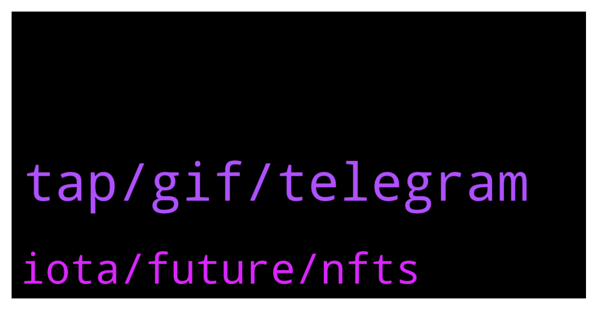

# **@iotatangle**
 ## Analysis for **2022-01-11** - **2022-01-12**.

---

## 📊 **Basic Stats**

**n_messages_sent**: 40

---

---

## 🔝 **Top keywords and related messages**

1. **tap, gif, telegram**

    @Marie --- *So this is not the real group?* **--->** [TG Discussion](https://t.me/iotatangle/306497)

    @Fold11 --- *Can u get some shit by clicking just photos some user sent u?* **--->** [TG Discussion](https://t.me/iotatangle/306473)

    @蛋蛋 --- *Is there a Chinese exchange group?* **--->** [TG Discussion](https://t.me/iotatangle/306493)

    @N1ghtBl00d --- *this is a community group sir. not official💪🏽* **--->** [TG Discussion](https://t.me/iotatangle/306494)

    @Fold11 --- *As u need to dl them first to get them visible u know* **--->** [TG Discussion](https://t.me/iotatangle/306474)

    @everyday_burns_a_hole_in_my_soul --- *Only gifs if it comes to telegramm* **--->** [TG Discussion](https://t.me/iotatangle/306476)

2. **iota, future, nfts**

    @Warrior_Sakdalista_PH --- *What does the currency of that number, is it IOTA?* **--->** [TG Discussion](https://t.me/iotatangle/306511)

    @Tahmis --- *IOTA will be widely adopted in the future I believe* **--->** [TG Discussion](https://t.me/iotatangle/306610)

    @Serhat --- *Hey everyone, I've just joined the group and I'm new for İota, what do you think of the future of IOTA* **--->** [TG Discussion](https://t.me/iotatangle/306609)

    @Warrior_Sakdalista_PH --- *Wow, good thing. iota has nft now. I always preferred xem than iota, and then it changed. 👍* **--->** [TG Discussion](https://t.me/iotatangle/306516)

    @Tahmis --- *There is the small i at the end. So it's IOTA. Divide it by 1 million and you get it to more familiar number* **--->** [TG Discussion](https://t.me/iotatangle/306513)

    @Warrior_Sakdalista_PH --- *Hello guys, is there any data about the total staking of IOTA in Firefly? For ASMB and SMR, thanks (if any)* **--->** [TG Discussion](https://t.me/iotatangle/306505)

