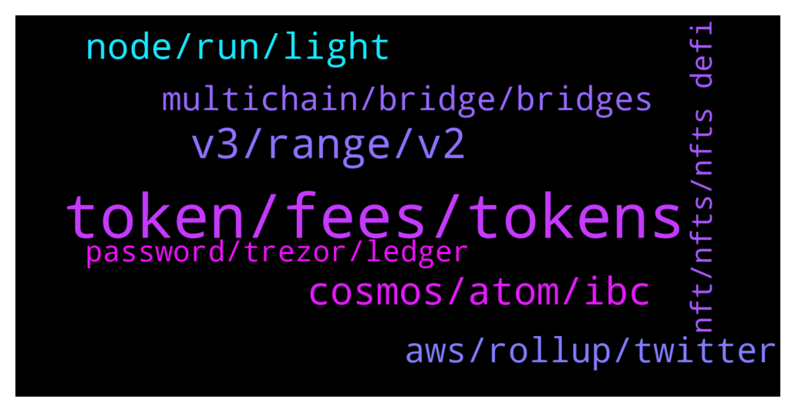

# **@lobsters_chat**
 ## Analysis for **2022-01-11** - **2022-01-12**.

---

## 📊 **Basic Stats**

**n_messages_sent**: 357

---

---

## 🔝 **Top keywords and related messages**

1. **token, fees, tokens**

    @samkazemian --- *Also this is wrong & fails to understand a more subtle elegance to Curve than just fee revenue. The majority of curve liquidity is to enforce stability, not to generate fees. FRAX pays many many many times more in bribes to CVX/veCRV holders per cycle than the next largest bribers, MIM. Just this past week alone, we paid ~$7.5m in total bribes compared to about ~$1.5m for MIM. I think it is important to highlight that stablecoin projects use Curve gauges as a "stability mechanism" of sorts. That idea is very under appreciated. And they pay for using that mechanism with huge bribes that increase the APY for both veCRV and vlCVX holders. They essentially "rent" stability at the prevailing market rate literally set by Curve because it is the industry leader in stablecoin liquidity coordination. Curve is more a coordination marketplace for stablecoins than a DEX. The DEX is more a byproduct of the coordination happening on Curve's platform. It is extremely elegant and highly lucrative for CVX+veCRV holders.* **--->** [TG Discussion](https://t.me/lobsters_chat/314456)

    @juju1234534 --- *In the hypothetical case of MIM being as decentralized as FRAX, would there be any benefit to using FRAX for your stables as a user over MIM? (What aspects make a stable coin a good stable coin from the perspective of users (=holders)? Naively I would prefer to use MIM since it’s over collateralized whilst FRAX is under collateralized (so less safe with regards to peg) @samkazemian* **--->** [TG Discussion](https://t.me/lobsters_chat/314454)

    @ivangbi --- *It’s a centralized kyc lending service wtf did u expect cat ://* **--->** [TG Discussion](https://t.me/lobsters_chat/314909)

    @RobAnon --- *USDC is a 6 decimal token* **--->** [TG Discussion](https://t.me/lobsters_chat/314438)

    @hugeshoe --- *Why do we need a pro version of fees.wtf* **--->** [TG Discussion](https://t.me/lobsters_chat/314863)

    @AngelaGilhotra --- *How do I query token prices from a v3 pool contract?  I can get the pool state from slot0 and simply query token0Price and token1Price, but i keep getting funny values eg., for the DAI/USDC pool, this is what my fetch is returning* **--->** [TG Discussion](https://t.me/lobsters_chat/314421)

2. **v3, range, v2**

    @statelayer --- *but honestly pool2 on uniswap v2 + v3 works well* **--->** [TG Discussion](https://t.me/lobsters_chat/314808)

    @AngelaGilhotra --- *yes, oh boi, i think this was the error all along. i’ll try making the changes in the script again and try v3 Pool contract - since that’s essentially what I want* **--->** [TG Discussion](https://t.me/lobsters_chat/314442)

    @statelayer --- *i wish uniswap v2 was on polygon* **--->** [TG Discussion](https://t.me/lobsters_chat/314776)

    @statelayer --- *zef was making a turn-v3-full-range-into-erc20-LP thingie, we might use it for sudo pool2* **--->** [TG Discussion](https://t.me/lobsters_chat/314807)

    @danrobinson010 --- *And people use v2 rather than full-range v3 because it’s currently easier to implement liquidity mining for the former?* **--->** [TG Discussion](https://t.me/lobsters_chat/314793)

    @statelayer --- *instead of uniswap.org which routes through v3 + v2* **--->** [TG Discussion](https://t.me/lobsters_chat/314788)

3. **cosmos, atom, ibc**

    @Siimmoonn --- *ATOM can currently be used for governance + staking with validators. New zones in cosmos can incentivize current validators of the Cosmos HUB to also secure their chain/zone. This could have an impact on the price of ATOM but in general the ATOM token is isolated from things happening on zones like secret network or sifchain. Please correct me if I  have missed any new development on ATOM utility* **--->** [TG Discussion](https://t.me/lobsters_chat/314553)

    @sir_integra_hellsing --- *UST is Terra. Terra doesn't use IBC, just uses the Cosmos SDK. Kinda like how Binance Chain works (not BSC, the one before that, the BEP2 one)* **--->** [TG Discussion](https://t.me/lobsters_chat/314539)

    @Siimmoonn --- *Also to split a few hairs: IBC is part of Cosmos SDK.* **--->** [TG Discussion](https://t.me/lobsters_chat/314543)

    @robzerizi --- *running on provenance blockchain, which seems to be yet another cosmos sdk based bc* **--->** [TG Discussion](https://t.me/lobsters_chat/314972)

    @PmRiviere --- *Does Cosmos directly profit from usage of their tech or public good?* **--->** [TG Discussion](https://t.me/lobsters_chat/314973)

    @ivangbi --- *Atom plebs, what’s the shill here?* **--->** [TG Discussion](https://t.me/lobsters_chat/314509)

4. **node, run, light**

    @anisopteran --- *and light clients are inherently not trustless* **--->** [TG Discussion](https://t.me/lobsters_chat/314722)

    @obaidoteth --- *Moxie talks about how node services like Infura don't provide cryptographic proofs that the outputs they provide are correct. How hard would it be to build a node service that does provide authenticated responses?* **--->** [TG Discussion](https://t.me/lobsters_chat/314719)

    @anisopteran --- *if that's the case, then the argument "you can't run this on a mobile client" seems pretty uninformed* **--->** [TG Discussion](https://t.me/lobsters_chat/314747)

    @zhongfu --- *ah I thought you meant something like geth in light client mode* **--->** [TG Discussion](https://t.me/lobsters_chat/314744)

    @anisopteran --- *i was just talking about in their current implementation. metamask is essentially a light client* **--->** [TG Discussion](https://t.me/lobsters_chat/314743)

    @obaidoteth --- *Only way is through light clients on the user's side ig* **--->** [TG Discussion](https://t.me/lobsters_chat/314721)

5. **aws, rollup, twitter**

    @RobAnon --- *Also have a ton of groups and articles just sitting in my "Rob's Solidity Dump" channel that I can offload* **--->** [TG Discussion](https://t.me/lobsters_chat/314614)

    @KeyedDepartment --- *i can set up a github so people can submit PRs if that would interest you* **--->** [TG Discussion](https://t.me/lobsters_chat/314611)

    @farm42 --- *Just spotted a new awesome curated dev list - check out based.builders twitter.com/officer_cia/status/1480882722751062018* **--->** [TG Discussion](https://t.me/lobsters_chat/314588)

    @JellyF --- *Any desent free AWS (ec2, s3, vpc) tutorials online, pls?* **--->** [TG Discussion](https://t.me/lobsters_chat/314514)

    @sir_integra_hellsing --- *depends on what you need the tutorial for, honestly.* **--->** [TG Discussion](https://t.me/lobsters_chat/314516)

    @jpwjs --- *can one get a link to this TG?* **--->** [TG Discussion](https://t.me/lobsters_chat/314617)

6. **multichain, bridge, bridges**

    @philippzentner --- *Connext, Hop, C-Bridge do care a lot about decentralization, to name a few. I’d take a look at their approaches.* **--->** [TG Discussion](https://t.me/lobsters_chat/314573)

    @tesslerc --- *99.999% of the bridges are centralized, so..* **--->** [TG Discussion](https://t.me/lobsters_chat/314572)

    @andrecronje --- *I echo this. But, all those bridges need existing assets, they can't create new assets* **--->** [TG Discussion](https://t.me/lobsters_chat/314575)

    @mogglet --- *Multichain Router + liquidity Pool is the 1st mover in decentralized the bridge in practical use! Not sure why “some” bridges says otherwise* **--->** [TG Discussion](https://t.me/lobsters_chat/314581)

    @tesslerc --- *What are the limitations here? Like, I assume you can't properly combine deterministic and probabilistic chains.  How is TPS limited when you braid together many chains?* **--->** [TG Discussion](https://t.me/lobsters_chat/314565)

    @arncarr --- *If I want to bridge to fantom, can I still use anyswap or do I need to use multichain?* **--->** [TG Discussion](https://t.me/lobsters_chat/314853)

7. **password, trezor, ledger**

    @sabot73 --- *The solution to this is use the Profiles feature in brave and set up a different profile that you use for each identity* **--->** [TG Discussion](https://t.me/lobsters_chat/314730)

    @etartakovsky --- *trezor has problems with ERC721 support, among other things. Ledger had problems with working with metamask in general for a long while. I wasn't able to mint with Trezor because of the ERC721 problem, minted with plain metamask instead, bad opsec.* **--->** [TG Discussion](https://t.me/lobsters_chat/314405)

    @vincentrinot --- *Any ideas? Sit on my hands and wait for looksrare, keep fighting to find my accounts on me ledger, workaround for trezor (earlier version of MM didnt help)* **--->** [TG Discussion](https://t.me/lobsters_chat/314404)

    @vincentrinot --- *But i cant do it this way on ledger i cant hit enter on the passwrod thing unless i type a character* **--->** [TG Discussion](https://t.me/lobsters_chat/314391)

    @vincentrinot --- *yeah im not sure how it ended up getting set up this way and i have too many assets to just migrate everything over 1-2-3... But i have a password and the password is no password* **--->** [TG Discussion](https://t.me/lobsters_chat/314388)

    @vincentrinot --- *Was anyone able to claim looksrare on trezor? I went as far as loading my seed into a fresh ledger but the password on trezor (which isnt a password... and i never set it up that way, fuckign annoying) isnt letting me find my accounts on the ledger* **--->** [TG Discussion](https://t.me/lobsters_chat/314386)

