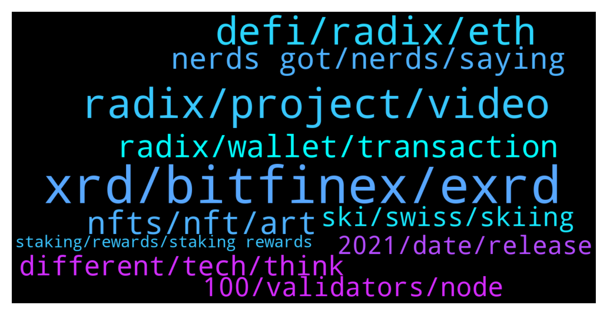

# **@radix_dlt**
 ## Analysis for **2022-01-11** - **2022-01-12**.

---

## 📊 **Basic Stats**

**n_messages_sent**: 689

---

---

## 🔝 **Top keywords and related messages**

1. **xrd, bitfinex, exrd**

    @ledtdg --- *Ti avoid to spend too much money in commissions i buy on binance and then transfer on Bitfinex* **--->** [TG Discussion](https://t.me/radix_dlt/337904)

    @Cpt_Charles --- *He simply read out the marketcap and fully diluted marketcap of exrd, which is 1:1 swappable with XRD. The marketcap is 2bn and not 100m as he said 🙃* **--->** [TG Discussion](https://t.me/radix_dlt/337809)

    @Radstakes --- *Ok, if you have crypto already I would recommend trading for something cheap to transact with like XLM. You can send this to Bitfinex and then trade for USD and then XRD* **--->** [TG Discussion](https://t.me/radix_dlt/338075)

    @ashley_tele --- *you need to conver either via instapass (requires KYC) or on bitfinex (does not need KYC but not available in all jurisdictions - can avoid with a VPN)* **--->** [TG Discussion](https://t.me/radix_dlt/338184)

    @TheCodeisTheLaw --- *Only the native coin XRD is supported for staking, eXRD is the wrapped version of XRD on the Ethereum blockchain.* **--->** [TG Discussion](https://t.me/radix_dlt/338145)

    @PeterFATAss --- *I know but I guess Kucoin will not list XRD aby time soon or maybe never* **--->** [TG Discussion](https://t.me/radix_dlt/337765)

2. **radix, project, video**

    @RadixMonk --- *I cant figure out if Peter is a radix bull or bear* **--->** [TG Discussion](https://t.me/radix_dlt/337667)

    @Cebcorp --- *Ok, but Radix is less centralicez than BSC? How many nodes Radix have?* **--->** [TG Discussion](https://t.me/radix_dlt/337562)

    @RadixMonk --- *I remember once he was saying how X project is better than radix or something??* **--->** [TG Discussion](https://t.me/radix_dlt/337671)

    @Maxximus8 --- *Radix need more exposure especially in social media* **--->** [TG Discussion](https://t.me/radix_dlt/338218)

    @PeterFATAss --- *What is the best  YT video about Radix to show a friend* **--->** [TG Discussion](https://t.me/radix_dlt/338345)

    @Speedyindian08 --- *I loved the CES. Good to meet the radix team.* **--->** [TG Discussion](https://t.me/radix_dlt/338195)

3. **defi, radix, eth**

    @Cebcorp --- *Hi! I have questions. I think Radix is a good project, because is different, but is it very very disruptive? I mean there are billions of $ in DeFi now. How much value implies the use of Radix? Appears it is true is more quickly to build DeFi with Radix, but it doesnt appear more secure nowdays (fundamental for DeFi). And with the incentives/Royalties for developers will be enough for atract more developers?? I dont want hurt but resolve my doubts.* **--->** [TG Discussion](https://t.me/radix_dlt/337523)

    @Jazzer9F --- *In the 2nd installment of a four-part series the CEO of Radix Piers Ridyard and CPO Matthew Hine discuss why the Radix Engine is a game-changer for DeFi, and why the Ethereum Virtual Machine cant carry DeFi any further. 🚀  https://www.youtube.com/watch?v=fdG-JVT6bsc* **--->** [TG Discussion](https://t.me/radix_dlt/338475)

    @Jazzer9F --- *In a follow-up to our recent blog article detailing the problems with smart contracts, CEO of Radix Piers Ridyard and Head of Product Matthew Hine discuss how Radix will revolutionize DeFi programming & development. 🚀  https://www.youtube.com/watch?v=d-EM8tkz7gI* **--->** [TG Discussion](https://t.me/radix_dlt/337547)

    @PeterFATAss --- *Yes, insurance. Imo it's make more sense than any other defi business model* **--->** [TG Discussion](https://t.me/radix_dlt/337711)

    @mx471 --- *I read that example a lot but the difference with Radix is that Radix won't be anywhere near the same league. It is de facto the only network capable of global DeFi as of 2023. This is not VHS vs. Betamax.* **--->** [TG Discussion](https://t.me/radix_dlt/338423)

    @BlAzAk --- *I do not agree. IMO, ofc tech speaks for itself but if you can't find the tech it's a problem. Objective is not to convince that Radix is the best. Objective is to say "Radix exists, DYOR"* **--->** [TG Discussion](https://t.me/radix_dlt/337829)

4. **nfts, nft, art**

    @Cpt_Charles --- *I normally don't buy NFTs, but I got FOMO seeing so many every day lol* **--->** [TG Discussion](https://t.me/radix_dlt/337396)

    @Kafkafrate --- *I would say NFTs are DeFi, just because now mostly art is popular with these NFTs, doesn't mean The broader use cases for NFTs are silly. I actually think NFTs are actually having a potential for a huge chunk from this Defi marketcap because are more practical, or more use cases.* **--->** [TG Discussion](https://t.me/radix_dlt/338447)

    @MarcoID --- *Me too. I think that NFT are 99% a bubble and I have never bought NFTs before, but these ones are addictive. Cheap, beautiful, funny.* **--->** [TG Discussion](https://t.me/radix_dlt/337407)

    @Cpt_Charles --- *So far I haven't fallen for any other NFTs yet tho 💪* **--->** [TG Discussion](https://t.me/radix_dlt/337409)

    @M5M400 --- *I see it this way: I can't rant over NFT idiocy without haven taken part :P* **--->** [TG Discussion](https://t.me/radix_dlt/337410)

    @ITProfligate --- *Turners going on sale as NFTs starting for £700.00, British Museum* **--->** [TG Discussion](https://t.me/radix_dlt/337924)

5. **radix, wallet, transaction**

    @PeterFATAss --- *Under these definitions Radix might be a security (because of staking rewards)* **--->** [TG Discussion](https://t.me/radix_dlt/337749)

    @matias_cobi --- *Hi, after buying Radix on Ascendex Exchange, it was sent afterwards to my ledger wallet. What I have to do to get it deposited to my Radix Olymmpia desktop wallet for staking? The Radix wallet seems not compatible with erc20 standard. Thank you.* **--->** [TG Discussion](https://t.me/radix_dlt/338143)

    @Jacob_XRD --- *For the Olympia mainnet, Radix uses an unsharded, simple form of Cerberus as its consensus protocol. Unsharded Cerberus draws heavily from the “HotStuff” consensus protocol. HotStuff has been mathematically proven to have strong guarantees of safety and liveness, and it is also used by the Facebook-led Diem crypto network.  One of the primary attack vectors of any DLT network is known as a Sybil attack. Unsharded Cerberus has a threshold of “2f+1” (~33.3%) of stake in order for an attacker to start adversely affecting the safety or liveness of the network. This is the same as any other “BFT-style” consensus protocol, such as Tendermint, used in networks such as Cosmos and Terra. (Even in the extremely unlikely case of a successful Sybil attack, the attacker couldn’t access the funds in your account).   From this article on Radix Knowledge Base:  https://learn.radixdlt.com/article/are-my-funds-safe-on-radix* **--->** [TG Discussion](https://t.me/radix_dlt/338247)

    @Shang En --- *Sorry but what is radc? Is it a new coin?* **--->** [TG Discussion](https://t.me/radix_dlt/337435)

    @Leander88 --- *is there any web3 wallet for radix network ?* **--->** [TG Discussion](https://t.me/radix_dlt/338168)

    @SHERAPINE VVIP --- *How much is act radix supply?* **--->** [TG Discussion](https://t.me/radix_dlt/337558)

6. **nerds got, nerds, saying**

    @PeterFATAss --- *I can only insult if it's true, right* **--->** [TG Discussion](https://t.me/radix_dlt/337659)

    @PeterFATAss --- *True. I was just thinking like a user* **--->** [TG Discussion](https://t.me/radix_dlt/337730)

    @chublay --- *damn.. why people are so rude...* **--->** [TG Discussion](https://t.me/radix_dlt/337691)

    @Shang En --- *Still don’t know bro I’m stupid* **--->** [TG Discussion](https://t.me/radix_dlt/337437)

    @sonotopia --- *That is so insulting, really great attitude, very mature.* **--->** [TG Discussion](https://t.me/radix_dlt/337655)

    @saeglopur10 --- *What you're saying doesn't really contradict what I'm saying* **--->** [TG Discussion](https://t.me/radix_dlt/338481)

7. **different, tech, think**

    @aj4269 --- *The retail does not understand technology, they understand hype, dogecube creates that hype needed on the social media. It's cringe for many but to be honest it works.* **--->** [TG Discussion](https://t.me/radix_dlt/337649)

    @Taco_Bell_London --- *Agree, that's why we are here. Just cannot forget there are competitors out there who focus more on adoption by banks than superior tech. Best tech does not always win (VHS vs Betamax)* **--->** [TG Discussion](https://t.me/radix_dlt/337722)

    @aj4269 --- *I don't think the average consumer will even realise the underlying mechanism of what's happening. You need to reach that level of sophistication to reach mass adoption.* **--->** [TG Discussion](https://t.me/radix_dlt/337709)

    @aj4269 --- *The internet didn't reach mass adoption till we had dial up connections.* **--->** [TG Discussion](https://t.me/radix_dlt/337710)

    @PeterFATAss --- *I also think this space will get more serious in the next 2 years as we get more regulation. That's why I was never in any fomo mindset because it was never the right environment for serious players. This will change dramatically. But I think there are several business models for mass market usage like insurance or lending* **--->** [TG Discussion](https://t.me/radix_dlt/337737)

    @ITProfligate --- *I’m pleased that these sorts of things are begining to be discussed more. I can see that there is also the healthy provocation by @PeterFATAss (funny name in the end). As to memes, I just think it adds to the sense that people can come and go, discuss, exchange. It is the artificial world of telegram where people ‘get to know’ each other in a pleasant way. But the other hope is that some very bright and motivated people will join and champion brilliant project ideas. There are a lot of different strands at the moment, balls in the air. The basic idea is that a project that looks attractive to devs is at a different stage of evolution to one that really attracts large numbers of users. My guess is that this is less true in web3 than other areas, but I’m sure those boundaries have been tested elsewhere, e.g. what was a MS beta tester? Or competitions to sell different chocolates? Coming to the ideas of ‘ordinary consumer’ and “real world” place there are two basic points that come to mind. There is knowledge asymetry, there will have to evolve a means to mediate between detail and comfortable fitting product. Something that NFTs do in their own limited context. Then there is the question of real world place. My assumption is that large groups of consummers will gradually adjust to this different dimension to dealing with what ever crypto will by then represent to them. I think of it like this. There is a jouney from A, through B to C. Coming back to A people ask about C and they also ask about the journey, B. The car took many decades to become really popular. People jump in the car and arrive. “What was the journey like?” “Oh, you know it was great.” Or OK, or terrible. Some people hate car journeys, that’s OK. But decades ago no one could have thought like this and no one would have just “jumped in the car”. Crypto: there’s a lot that will change and it is a different dimension to life, just as roads and cars have been compared to decades ago. We are seeing it gradually unfold.* **--->** [TG Discussion](https://t.me/radix_dlt/337845)

8. **ski, swiss, skiing**

    @Cpt_Charles --- *Went to Switserland twice (Veysonazz and Fischeralp), but mostly go to Austria to ski. 10 bucks for a beer on the swiss mountain is a bit too much ahah* **--->** [TG Discussion](https://t.me/radix_dlt/337609)

    @Cpt_Charles --- *Life goal: get dropped off with a helicopter in fresh, untouched pow, high up in the mountains and then ski to the bottom 👀* **--->** [TG Discussion](https://t.me/radix_dlt/337604)

    @Lms123456 --- *First time i skiing was 2019 really enjoyed it. Although definitely need more lessons 😂* **--->** [TG Discussion](https://t.me/radix_dlt/337606)

    @sonotopia --- *i swapped skiing for kitesurfing. no skilifts no tickets, just wind and water and waves. both is very fun though.* **--->** [TG Discussion](https://t.me/radix_dlt/337610)

    @swiss_fondue --- *Half Day ski pass where I am today (Gstaad) is 70$ . It hurts . Zermatt is around 85-90   But I heard it’s worse in the US, it can be super expensive* **--->** [TG Discussion](https://t.me/radix_dlt/337619)

    @swiss_fondue --- *Come to Zermatt bro. It’s really not that expensive and imo it’s the best spot 🚁* **--->** [TG Discussion](https://t.me/radix_dlt/337607)

9. **100, validators, node**

    @CaptainMooseInc --- *There it is everyone! We have officially overtaken the Hashfield Technology validator node and climbed back into the Top 100! Give us a few days and we’ll be in the high 70s! We are earning reward emissions again! Big thanks everyone!  https://twitter.com/xrdscan/status/1480641863296114699?s=21* **--->** [TG Discussion](https://t.me/radix_dlt/337451)

    @AT --- *Well, I'll take a look at the stability of the validator for half a year, and maybe if one of the almost 30 validators that I'm currently using will brake, then I'll think about changing it :) In the meantime, the current validators are working, I see no reason to change them (passing again 2 weeks of the unstake cycle).* **--->** [TG Discussion](https://t.me/radix_dlt/337459)

    @aus87 --- *Thanks, missed that one.  I figured with it using so many fewer nodes it couldn't have been* **--->** [TG Discussion](https://t.me/radix_dlt/338127)

    @CaptainMooseInc --- *Fully understand. We love the other validators and their data. We also understand it’s difficult for people to want to give up their staking rewards by moving validators once they’ve settled in. We created our utility token to be able to “subscribe” to our services with either holding the token OR staking with us, so everyone gets an opportunity to join in regardless of their preferred method.   But I will say that anyone who needs to be able to track their gained emissions for tax reporting purposes will really want to check out our export feature for emissions tracking on their wallets. You will need to be Elite level for that, but even if you don’t want to do that now, you can register and verify your address with our tracker and we will collect the data regardless until you decide later whether or not you want to use it. Check us out: https://xrdscan.medium.com/* **--->** [TG Discussion](https://t.me/radix_dlt/337464)

    @Radstakes --- *You should probably unstake. Given their total stake, I don't think they will be entering the top 100 anytime soon. It will take around 2 weeks to unstake and then you can restake to other validators in the top 100* **--->** [TG Discussion](https://t.me/radix_dlt/337476)

    @ahsimon --- *Actually, Hashfield is still in top 100.  I think it was fisher node that got ejected from top 100* **--->** [TG Discussion](https://t.me/radix_dlt/337453)

10. **2021, date, release**

    @hr15allstar --- *Can you please confirm that the initial eta release date for API refactor was Dec 2021?* **--->** [TG Discussion](https://t.me/radix_dlt/338204)

    @Magal36 --- *watch the November roundtable. Matt has said to expect more towards eoy, but they will give a more exact timeline this quarter* **--->** [TG Discussion](https://t.me/radix_dlt/337858)

    @JuelzCrypto --- *hi is there a roadmap for 2022* **--->** [TG Discussion](https://t.me/radix_dlt/337849)

    @crypt_punk --- *can we see in future anything like this?* **--->** [TG Discussion](https://t.me/radix_dlt/337486)

    @Jacob_XRD --- *And we are still very early in the roadmap!* **--->** [TG Discussion](https://t.me/radix_dlt/338221)

    @Jacob_XRD --- *We have not announced any timelines, however the wallet is constantly being worked on, and will have improvements and new capabilities as the network is built.* **--->** [TG Discussion](https://t.me/radix_dlt/338262)

