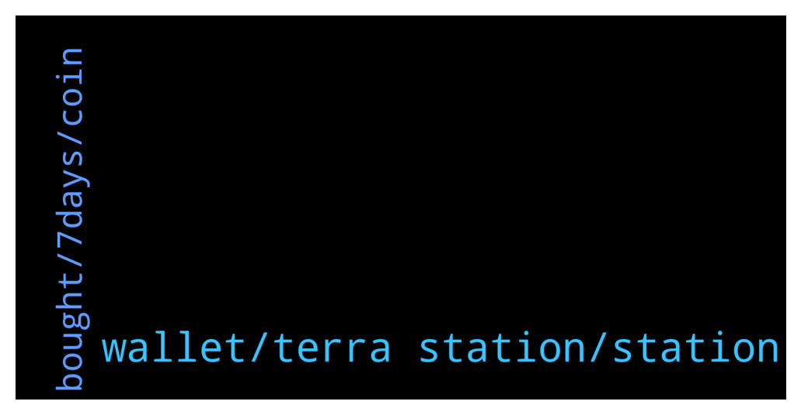

# **@terralunachat_officially**
 ## Analysis for **2022-01-11** - **2022-01-12**.

---

## 📊 **Basic Stats**

**n_messages_sent**: 31

---

---

## 🔝 **Top keywords and related messages**

1. **wallet, terra station, station**

    @Mayginn --- *Yes, but accumulated rewards and airdrops may be lost if you create another separate wallet, you don’t have to create any other wallet you can easily monitor all margins and market flows from your wallet simply use the ledger to validate on terra station using the link in the group to proceed.* **--->** [TG Discussion](https://t.me/terralunachat_officially/23327)

    @Sydney999 --- *I'm using Ledger. Is it better to change to normal Terra station wallet to get all new features? Do I need to create a new wallet then, with password, recovery phrase? Thanx for your help.* **--->** [TG Discussion](https://t.me/terralunachat_officially/23318)

    @Lossless_Joint --- *Hello admin What if we forget memo while sending from terra to binance?* **--->** [TG Discussion](https://t.me/terralunachat_officially/23305)

    @efee82 --- *Hello ı send ust from kukoin to terra wallet . But ım waitn 40 minute . What is the problem . Can you help me admin ?* **--->** [TG Discussion](https://t.me/terralunachat_officially/23399)

    @Lossless_Joint --- *Hello does anyone know what to do if you forget memo while sending Ust from terra to binance ?* **--->** [TG Discussion](https://t.me/terralunachat_officially/23358)

    @Botero --- *Hello is there a site like TIN or Debank for the Terra protocol thank you for a return* **--->** [TG Discussion](https://t.me/terralunachat_officially/23442)

2. **bought, 7days, coin**

    @Mayginn --- *I’m holding up my luna buy more at this time is the best* **--->** [TG Discussion](https://t.me/terralunachat_officially/23329)

    @Nadia --- *The market is terrible today. Why?* **--->** [TG Discussion](https://t.me/terralunachat_officially/23315)

    @Sydney999 --- *Panic selling makes it worse. also holiday time, some people may not be trading. Lower volumes. Manipulation by whales and institutions, to scare us to SELL. after you sell, coin goes up! ☹️ Stay cool. if you feel too stressed, chill out, take a break come back in a few days. STOP checking every few minutes!!! 🤔* **--->** [TG Discussion](https://t.me/terralunachat_officially/23324)

    @Sydney999 --- *DoWon is very clever man. I don't understand all this liquidity stuff. I trust him. When people use UST and burn, then less Luna. Makes price go up, because supply is less, after burn. HODL...* **--->** [TG Discussion](https://t.me/terralunachat_officially/23337)

    @Sydney999 --- *Exactly. I bought more before, but market is still down. no more money. So it's HODL... 😅* **--->** [TG Discussion](https://t.me/terralunachat_officially/23332)

    @Sydney999 --- *2021 many institutions came into crypto, bought BTC and other altcoins. That means when stock market goes down or crash, like from FED news to raise interest rates, market crashed. LUNA is still above $60. I bought more when cheap. if no more money to buy, then HODL.* **--->** [TG Discussion](https://t.me/terralunachat_officially/23326)

