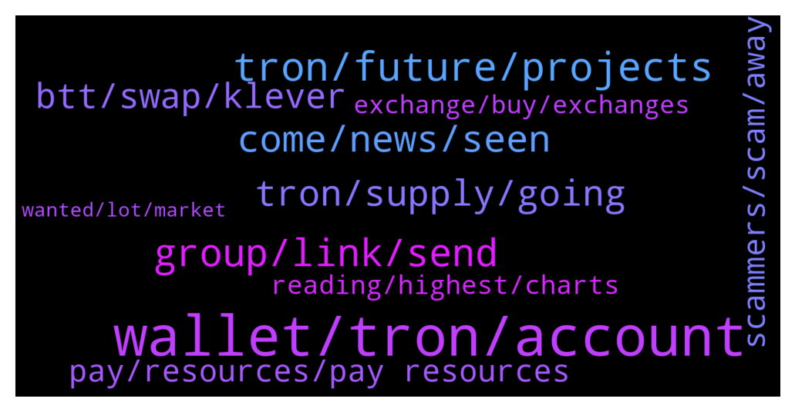

# **@tronnetworkEN**
 ## Analysis for **2022-01-11** - **2022-01-12**.

---

## 📊 **Basic Stats**

**n_messages_sent**: 278

---

---

## 🔝 **Top keywords and related messages**

1. **wallet, tron, account**

    @Pawanrangila --- *Not receive my tron wallet but withdraw confirm by deffect app Tron Transaction Hash c375d6bf78150222ebdafd631a05eed0d4d7caa07dba8ec7a515e1abd823540c* **--->** [TG Discussion](https://t.me/tronnetworkEN/3825158)

    @Taiwo --- *So, the Tron link app is a scam right?* **--->** [TG Discussion](https://t.me/tronnetworkEN/3825001)

    @Claudio_ziks --- *Hello.... I thought holders of TRX, WINK, SUN OR BTT were to continuously receive Apenft airdrop every month, but I ve'nt been receiving and I hold all four of the mentioned crypto  Admin, response pls* **--->** [TG Discussion](https://t.me/tronnetworkEN/3821890)

    @BackOfDark --- *hi, how can i get free tron* **--->** [TG Discussion](https://t.me/tronnetworkEN/3824043)

    @jay888djw --- *Hi I have some old token on my ledget wallet, it showed total hold as 0. I undersand it is a display issue but, now my Ledger is broken. I have my recovery phase. Is that possible to  restore the wallet on an online /mobile wallet?Even if i restore it, the Tron ERC old token will not be displayed. The complicate bit is not only i want to restore my ledger wallet, I want to restore my old token to this new wallet which most likely does not support ERC TRX anymore.* **--->** [TG Discussion](https://t.me/tronnetworkEN/3822030)

    @Martin --- *How can I withdraw from my tron account* **--->** [TG Discussion](https://t.me/tronnetworkEN/3824094)

2. **tron, future, projects**

    @Waheedalam868 --- *Is there any roadmap of tron* **--->** [TG Discussion](https://t.me/tronnetworkEN/3823351)

    @Carlos_TRX --- *You cannot follow a roadmap, the future of TRON is directed by the votes of the users in the SRs who are the ones who propose new projects and improvements in the ecosystem.* **--->** [TG Discussion](https://t.me/tronnetworkEN/3823367)

    @PiterSpain --- *It's obvious, TRON is not a mineable algorithm* **--->** [TG Discussion](https://t.me/tronnetworkEN/3824287)

    @Andreasilvano1 --- *What is wrong with , tron* **--->** [TG Discussion](https://t.me/tronnetworkEN/3823773)

    @Mathew --- *Please does  anyone here know about Tron volt?* **--->** [TG Discussion](https://t.me/tronnetworkEN/3825439)

    @NulledNews --- *I would like to ask a question about purchasing the tron* **--->** [TG Discussion](https://t.me/tronnetworkEN/3824026)

3. **group, link, send**

    @alisaghi94 --- *Right in that group, I was learning Chinese.* **--->** [TG Discussion](https://t.me/tronnetworkEN/3824871)

    @Turiddu171 --- *Ok I will check that out.* **--->** [TG Discussion](https://t.me/tronnetworkEN/3822451)

    @eeeeeeeee8 --- *Is there an American who can answer for me? I would appreciate it!* **--->** [TG Discussion](https://t.me/tronnetworkEN/3823630)

    @Mishandihan --- *Ok can i send a link?* **--->** [TG Discussion](https://t.me/tronnetworkEN/3825939)

    @Brazz_1 --- *Greetings. Admin can I send a link to the TRX group here?* **--->** [TG Discussion](https://t.me/tronnetworkEN/3823805)

    @MilNoslen --- *If you have an issue, you ask in the group chat* **--->** [TG Discussion](https://t.me/tronnetworkEN/3821892)

4. **come, news, seen**

    @Pablo_oss --- *Do you think it will come true?🥲* **--->** [TG Discussion](https://t.me/tronnetworkEN/3823731)

    @Pablo_oss --- *I do not think these naps will have any effect😂* **--->** [TG Discussion](https://t.me/tronnetworkEN/3823754)

    @coinguy555 --- *Actually will give u entertainment 👻* **--->** [TG Discussion](https://t.me/tronnetworkEN/3823757)

    @xPommepote --- *No but I know the rules 🤷🏼‍♂️* **--->** [TG Discussion](https://t.me/tronnetworkEN/3823818)

    @xPommepote --- *Well burn every transaction in fact* **--->** [TG Discussion](https://t.me/tronnetworkEN/3822075)

    @Pablo_oss --- *He has been making fun of me for 17 months🤦😂* **--->** [TG Discussion](https://t.me/tronnetworkEN/3823759)

5. **tron, supply, going**

    @MadEyeMoody --- *When can we see Tron going up as btc is also going up but Trx is sleeping!!!* **--->** [TG Discussion](https://t.me/tronnetworkEN/3824098)

    @Helanela --- *Am new to the market  Hope is not that late to buy tron (trx)* **--->** [TG Discussion](https://t.me/tronnetworkEN/3825057)

    @Waheedalam868 --- *In binance ath of tron 75$. Will it be reach even 1$ in near future* **--->** [TG Discussion](https://t.me/tronnetworkEN/3823378)

    @Riasan01 --- *Do tron still burn trx coins , or what is done to grow the demand and coin price ?* **--->** [TG Discussion](https://t.me/tronnetworkEN/3823121)

    @Samsonioc --- *I mean total supply not circulating supply* **--->** [TG Discussion](https://t.me/tronnetworkEN/3822853)

    @agentpiki --- *It haw the total supply as well as circulating supply* **--->** [TG Discussion](https://t.me/tronnetworkEN/3822855)

6. **btt, swap, klever**

    @Turiddu171 --- *I have plenty of bandwidth and energy in Klever wallet. Does that help with swap?* **--->** [TG Discussion](https://t.me/tronnetworkEN/3822457)

    @DmG_90 --- *Nothing to worry about, its just about the swap in BTT* **--->** [TG Discussion](https://t.me/tronnetworkEN/3823188)

    @Carlos_TRX --- *your BTT is in TRON network, so you have to know if the exchange did the swap to send the "new" BTT* **--->** [TG Discussion](https://t.me/tronnetworkEN/3825477)

    @Carlos_TRX --- *yes BTT is BTT, OLDBTT is OLDBTT. easy to understand the redenomination* **--->** [TG Discussion](https://t.me/tronnetworkEN/3823887)

    @agentpiki --- *Your best bet is to move your BTTOLD to tronlink and swap manually.  Or if you don't want to use resources then you might want to look for centralized exchanges which have not yet adopted the new BTT.* **--->** [TG Discussion](https://t.me/tronnetworkEN/3822454)

    @agentpiki --- *Yes, but you need bandwidth and energy to do it manually.  Manual swap via bt.io (BTTC)* **--->** [TG Discussion](https://t.me/tronnetworkEN/3822456)

7. **scammers, scam, away**

    @Davoud53 --- *Hello, i got scammed last week. Do you know if web sites like aquaedgerecouptech are trustable ?* **--->** [TG Discussion](https://t.me/tronnetworkEN/3824072)

    @Joe --- *99% of liquidity mining platforms are scams* **--->** [TG Discussion](https://t.me/tronnetworkEN/3824292)

    @Mishandihan --- *This site is trying to deceive the people by using your name, but I need to know clearly that's why* **--->** [TG Discussion](https://t.me/tronnetworkEN/3825943)

    @simon866 --- *I just told you it's a scam so best to stay away from it 👍* **--->** [TG Discussion](https://t.me/tronnetworkEN/3825946)

    @Magnavox_Business --- *Please don't reply to him. He is a scammer.* **--->** [TG Discussion](https://t.me/tronnetworkEN/3823897)

    @PiterSpain --- *Both sound like the perfect scam, stay away* **--->** [TG Discussion](https://t.me/tronnetworkEN/3822316)

8. **pay, resources, pay resources**

    @goblinex --- *was trying to stake trx to gain energy for a smart contract in nile testnet and got error . is any problem wrong with nile or my contract* **--->** [TG Discussion](https://t.me/tronnetworkEN/3825859)

    @agentpiki --- *FAILED  You said you have TRX already. Go try again* **--->** [TG Discussion](https://t.me/tronnetworkEN/3825161)

    @Calon_Crypto --- *When will TRX maintenance be completed?* **--->** [TG Discussion](https://t.me/tronnetworkEN/3822493)

    @agentpiki --- *You have trx right? Go swap it again.* **--->** [TG Discussion](https://t.me/tronnetworkEN/3825730)

    @Fabs_trx --- *You got 0 trx on your wallet. Can’t pay the gas fees* **--->** [TG Discussion](https://t.me/tronnetworkEN/3825163)

    @coinguy555 --- *Better pay all my trx loan then* **--->** [TG Discussion](https://t.me/tronnetworkEN/3823738)

9. **reading, highest, charts**

    @MilNoslen --- *Huh, no. Ranges between 6-9% at most* **--->** [TG Discussion](https://t.me/tronnetworkEN/3824808)

    @agentpiki --- *Go to tronscan.org  Check out the charts. Your question will be answered with reading* **--->** [TG Discussion](https://t.me/tronnetworkEN/3823123)

    @Netflix_available_dexters --- *@xPommepote @Carlos_TRX is tronlink showing true that estimated apy for staking is 30-40%* **--->** [TG Discussion](https://t.me/tronnetworkEN/3824804)

    @roand_07 --- *Approx how many TRX should someone stake to get a reward of at least 5 trx/day?* **--->** [TG Discussion](https://t.me/tronnetworkEN/3825043)

    @ThakurAri --- *Very good, chart is also available..👍* **--->** [TG Discussion](https://t.me/tronnetworkEN/3822205)

    @Claudio_ziks --- *Even without reading the article, I still met the criteria...I hold more than the minimum listed in the article....i guess i'l send a mail  Thanks* **--->** [TG Discussion](https://t.me/tronnetworkEN/3821923)

10. **exchange, buy, exchanges**

    @eeeeeeeee8 --- *Which exchange can be used to buy* **--->** [TG Discussion](https://t.me/tronnetworkEN/3823802)

    @Carlos_TRX --- *sure , why not? what problem do you have in buy in exchanges ?* **--->** [TG Discussion](https://t.me/tronnetworkEN/3823799)

    @eeeeeeeee8 --- *Because I don't know if Mexico has a ban on which exchanges* **--->** [TG Discussion](https://t.me/tronnetworkEN/3823809)

    @Samsonioc --- *What does that HV to do with exchanges* **--->** [TG Discussion](https://t.me/tronnetworkEN/3823846)

    @NawedAnjumkhan007 --- *It is available on every major exchanges. Buy it from there..and its in good dip also* **--->** [TG Discussion](https://t.me/tronnetworkEN/3824801)

    @eeeeeeeee8 --- *Yes, I understand, but I don't know what exchange I can buy it on.* **--->** [TG Discussion](https://t.me/tronnetworkEN/3823620)

