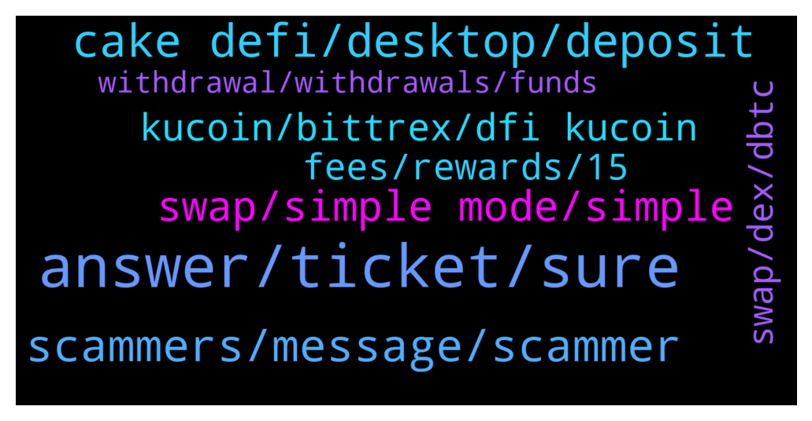

# **@CakeDeFi_EN**
 ## Analysis for **2022-01-12** - **2022-01-13**.

---

## 📊 **Basic Stats**

**n_messages_sent**: 346

---

---

## 🔝 **Top keywords and related messages**

1. **answer, ticket, sure**

    @BlurBil --- *I already fill the required fields* **--->** [TG Discussion](https://t.me/CakeDeFi_EN/163834)

    @BerndMack --- *!Support can help, just write them.* **--->** [TG Discussion](https://t.me/CakeDeFi_EN/164007)

    @Reggie --- *Ohh I'm not sure about that ask one of the admins ,it will eventually reflect* **--->** [TG Discussion](https://t.me/CakeDeFi_EN/164108)

    @jojo122292 --- *Yes i have and its completed* **--->** [TG Discussion](https://t.me/CakeDeFi_EN/163921)

    @yeahright22 --- *i already did, but no answer for 1 day, that is why i have some fear, can i give u the ticket nr to speed up the process?!* **--->** [TG Discussion](https://t.me/CakeDeFi_EN/163852)

    @fabioandreatta --- *You can just contact our Support and they will fix that for you* **--->** [TG Discussion](https://t.me/CakeDeFi_EN/163849)

2. **cake defi, desktop, deposit**

    @mm_phoenix --- *CAKE DeFi – Countries NOT available https://support.cakedefi.com/hc/en-us/articles/360040335072-Which-countries-are-currently-not-able-to-use-the-Cake-Services-* **--->** [TG Discussion](https://t.me/CakeDeFi_EN/164354)

    @fatihyilmaz22 --- *Hi, are there any problems while depositing and withdrawing money on cake defi with litecoins?* **--->** [TG Discussion](https://t.me/CakeDeFi_EN/163563)

    @ykoh1797 --- *I mean is there a way to deposit crypto into cake directly haha, I didn't mean to transfer fiat* **--->** [TG Discussion](https://t.me/CakeDeFi_EN/164344)

    @JesulobaMV --- *What exactly is cake defi profile, profitability, primary profit - Is it an exchange, NFT portal?  How do I withdraw from cake defi, when I want to and what's the commission rate(s) on withdrawal.  Thanks.* **--->** [TG Discussion](https://t.me/CakeDeFi_EN/164189)

    @ykoh1797 --- *is there a way to deposit into cake Defi directly? I can't seem to see an option for that* **--->** [TG Discussion](https://t.me/CakeDeFi_EN/164339)

    @mm_phoenix --- *cakedefi does not have an account where you can deposit USD or EUR. Only crypto* **--->** [TG Discussion](https://t.me/CakeDeFi_EN/164342)

3. **scammers, message, scammer**

    @BerndMack --- *The content of your messages does not fit the channel. This is about Cake, not about the scammers who are everywhere. Be careful here and pay attention to the message I forwarded. 🙏* **--->** [TG Discussion](https://t.me/CakeDeFi_EN/164164)

    @Jan-Niklas --- *Whenever I ask smth here, i have 3 fakes texting me.* **--->** [TG Discussion](https://t.me/CakeDeFi_EN/163805)

    @Javier --- *It is. Thank you. By the way, I was contacted presumably by a scammer because of this issue* **--->** [TG Discussion](https://t.me/CakeDeFi_EN/164237)

    @WonderML --- *why is there someone calling me and sending me message? I just want a reply here. Do not call me* **--->** [TG Discussion](https://t.me/CakeDeFi_EN/164115)

    @zcpmv --- *Same, I even pick their phone calls* **--->** [TG Discussion](https://t.me/CakeDeFi_EN/163583)

    @zachgax --- *Treat anyone who messages you first claiming to be from Cake a scammer* **--->** [TG Discussion](https://t.me/CakeDeFi_EN/164151)

4. **swap, simple mode, simple**

    @Siva --- *I only have DFI at the moment. But it will not allow me to swap my DFI for BTC to enter the pool.* **--->** [TG Discussion](https://t.me/CakeDeFi_EN/164419)

    @Siva --- *I tried this and keep getting an error message saying swaps are only allowed to DFI.* **--->** [TG Discussion](https://t.me/CakeDeFi_EN/164436)

    @Siva --- *Simple mode only wants BTC. It won’t let me just use DFI.* **--->** [TG Discussion](https://t.me/CakeDeFi_EN/164414)

    @fabioandreatta --- *swaps may take up to 24 hours to complete* **--->** [TG Discussion](https://t.me/CakeDeFi_EN/163753)

    @AStron6 --- *You can  do simple mode when adding liquidity, unless it got turned off again* **--->** [TG Discussion](https://t.me/CakeDeFi_EN/164410)

    @Marvin --- *In Germany swapping DFI to BTC still isn‘t working. I deleted the cache in the chrome browser and logged out and in, but it does not work. What do I have to do?* **--->** [TG Discussion](https://t.me/CakeDeFi_EN/164098)

5. **kucoin, bittrex, dfi kucoin**

    @Reggie --- *Kucoin Deposits and withdrawals are back online 🔥* **--->** [TG Discussion](https://t.me/CakeDeFi_EN/164099)

    @fabioandreatta --- *Have you tried dfx.swiss? Kucoin, Bitrue and Bittrex are other options* **--->** [TG Discussion](https://t.me/CakeDeFi_EN/163865)

    @Kassius84 --- *Some People confirmed that their withdrawals from KuCoinwere fine and the DFI deposits were successful at Cake DeFi* **--->** [TG Discussion](https://t.me/CakeDeFi_EN/163993)

    @YSL --- *Dfi 🚀 on KuCoin.. thought many ll rush to exit but instead all rush to buy* **--->** [TG Discussion](https://t.me/CakeDeFi_EN/163732)

    @prasenjitbarua --- *Is DFI Transfer between Kucoin and Cake defi running smoothly? @admin ?* **--->** [TG Discussion](https://t.me/CakeDeFi_EN/163991)

    @Dan --- *Excuse my lack of experience 🤣 but can anyone tell me if withdraws work ATM from cake to defichain app using dfi token? Seen alot about everything not working and know kucoin was down lastime I looked?* **--->** [TG Discussion](https://t.me/CakeDeFi_EN/163944)

6. **fees, rewards, 15**

    @fabioandreatta --- *Yes we do! Reach out to our CS if you have found something, we have rewards of up to 30,000 USD* **--->** [TG Discussion](https://t.me/CakeDeFi_EN/163485)

    @Stephan --- *quick question regarding rebate of staking fees: for 36 months of freezing I get 75% rebate of staking fees, how does this look like for 5 and 10 years? There is no information regarding that as far as I can see* **--->** [TG Discussion](https://t.me/CakeDeFi_EN/164473)

    @Grinched --- *30$ free and u can also do and earn quiz for another 5$. They will be locked for 180 days. And u will get it after u deposit.   Aahw too bad :) hope u still get the bonus!* **--->** [TG Discussion](https://t.me/CakeDeFi_EN/163568)

    @JonD26 --- *Cool. Thanks for clarification. Just also, that 15% fee on the rewards you mentioned before, does that happen as-we-go or will it be taken in the future if withdrawing?* **--->** [TG Discussion](https://t.me/CakeDeFi_EN/164367)

    @JonD26 --- *Are all fees still the same?* **--->** [TG Discussion](https://t.me/CakeDeFi_EN/164320)

    @mm_phoenix --- *cake takes 15% of the rewards you get. Withdrawal fees are seperated https://support.cakedefi.com/hc/en-us/articles/360035886591-What-is-the-withdrawal-fee-for-Cake-* **--->** [TG Discussion](https://t.me/CakeDeFi_EN/164369)

7. **swap, dex, dbtc**

    @Milad --- *Sorry I meant toke. It is not possible to swap anything onto dex. And it is not possible to send btc via dex* **--->** [TG Discussion](https://t.me/CakeDeFi_EN/163700)

    @DmgBautista --- *With DFI, you cannot join the LM pool. My best advice, place a swap from DFI into dBTC. CAKE will place the swap under your name in the defichain dex, no need for you to send your coins there. However, it may be a bit slower than sending to dex, making the swap and return to Cake. However, more userfriendly :)* **--->** [TG Discussion](https://t.me/CakeDeFi_EN/164421)

    @DmgBautista --- *If you have BTC, you can enter LM, you can use simple mode and Cake will split your BTC in half. Half will be wrapped into dBTC and the other half turned into DFI, and the the pool is filled with that entry :)* **--->** [TG Discussion](https://t.me/CakeDeFi_EN/164416)

    @DmgBautista --- *You can therefore place te swap request and as soon and finished, you'll receive BTC in ypur Cake account. After that, just use therefore normal mode (since you'll have both coin pairs after turning half your DFI into BTC) and join the pool :)* **--->** [TG Discussion](https://t.me/CakeDeFi_EN/164435)

    @jfdsxr --- *Can is swap my Dusd on defi cake for DFI tokens? And then send them to an exchange?* **--->** [TG Discussion](https://t.me/CakeDeFi_EN/163602)

    @Siva --- *Is it possible to swap DFI for dbtc on cake or should I do that with the Defichain wallet?* **--->** [TG Discussion](https://t.me/CakeDeFi_EN/164411)

