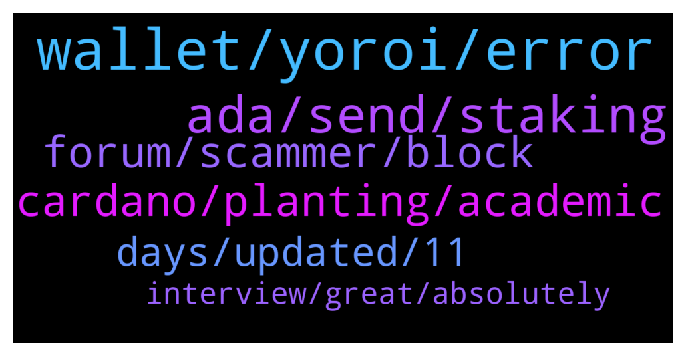

# **@Cardano**
 ## Analysis for **2022-01-12** - **2022-01-13**.

---

## 📊 **Basic Stats**

**n_messages_sent**: 116

---

---

## 🔝 **Top keywords and related messages**

1. **wallet, yoroi, error**

    @EhmReally --- *Yoroi wallet auto disabled by browser because it wanted more permissions* **--->** [TG Discussion](https://t.me/Cardano/768308)

    @glitch04 --- *Wallet will need additional permissions that it previously did not have so that it will be able to connect to future dapps* **--->** [TG Discussion](https://t.me/Cardano/768471)

    @AB’z --- *Yeah I have reinstalled it and now my wallet won’t connect* **--->** [TG Discussion](https://t.me/Cardano/768542)

    @alban77 --- *any idea about this crash?  Yoroi crashed ATTENTION:  If you want to inspect logs, you can download them here. Logs do not contain sensitive information, and it would be helpful to attach them to problem reports to help the team investigate the issue you are experiencing.  For more help, you can contact support* **--->** [TG Discussion](https://t.me/Cardano/768588)

    @glitch04 --- *Going to assume this has to do with the Dapp permissions but you can check in the #support channel listed below* **--->** [TG Discussion](https://t.me/Cardano/768310)

    @lassikem --- *So it’s safe to empty my wallet for a few hours then?* **--->** [TG Discussion](https://t.me/Cardano/768293)

2. **ada, send, staking**

    @好好先生 --- *Does Ada have a group dedicated to publishing project progress information* **--->** [TG Discussion](https://t.me/Cardano/768199)

    @lassikem --- *There is only ‘custom amount’ and ‘send all ada + tokens’* **--->** [TG Discussion](https://t.me/Cardano/768280)

    @lassikem --- *It seems that Yoroi requires certain min amount of ada (related to other tokens such as NFTs) to perform transactions? If you have eg. 1000 NFTs and 50 ADA, you can’t do transactions.* **--->** [TG Discussion](https://t.me/Cardano/768312)

    @Anviant --- *Ada admins, Why can't people write SoIana? Lol* **--->** [TG Discussion](https://t.me/Cardano/768753)

    @jaymeyer --- *Hi I need help for staking* **--->** [TG Discussion](https://t.me/Cardano/768584)

    @alban77 --- *go and delegate to one of these pools: https://adapools.org/* **--->** [TG Discussion](https://t.me/Cardano/768589)

3. **cardano, planting, academic**

    @cryptocardano12 --- *when you write a smart contract on cardano do you use haskell* **--->** [TG Discussion](https://t.me/Cardano/768167)

    @Morpheus369 --- *don't get why you need a degree to improve cardano* **--->** [TG Discussion](https://t.me/Cardano/768772)

    @glitch04 --- *Veritree will be used to track the planting progress and recorded on the Cardano blockchain* **--->** [TG Discussion](https://t.me/Cardano/768534)

    @r0ckmak3r --- *Where can I find a top 30 list of Cardano projects by market cap and their contracts?* **--->** [TG Discussion](https://t.me/Cardano/768379)

    @jaypatelEarthling --- *@Iohkcharles  maybe Cardano can collaborate with IIT, India   https://www.hindustantimes.com/india-news/blockchainbased-digital-degrees-all-you-need-to-know-about-the-technology-101640677737420.html* **--->** [TG Discussion](https://t.me/Cardano/768216)

    @sugehndadak --- *can you share cardano launcpad ecosystem* **--->** [TG Discussion](https://t.me/Cardano/768556)

4. **forum, scammer, block**

    @AB’z --- *Yeah it opened a dm first thn there is a link for the forum.* **--->** [TG Discussion](https://t.me/Cardano/768569)

    @AB’z --- *No I clicked on it and it opened a dm and then asked me to verify on some forum* **--->** [TG Discussion](https://t.me/Cardano/768563)

    @glitch04 --- *Should link you to the forum* **--->** [TG Discussion](https://t.me/Cardano/768567)

    @Мишель --- *Btw I asked that and about 4 account contacted me by private message* **--->** [TG Discussion](https://t.me/Cardano/768706)

    @Simo --- *hello any price discussion group? thanks* **--->** [TG Discussion](https://t.me/Cardano/768689)

    @glitch04 --- *If it's talking to you in a dm no* **--->** [TG Discussion](https://t.me/Cardano/768561)

5. **days, updated, 11**

    @Grip9 --- *it should take 3 month! so show us all a proof in 3 month that its realy happening.  do you take the challenge to proof its real?* **--->** [TG Discussion](https://t.me/Cardano/768549)

    @glitch04 --- *It just was funded like a few days ago you expect them to be planted already?* **--->** [TG Discussion](https://t.me/Cardano/768536)

    @AndreyKarra --- *When the heck the voting on Fund 7 begins?  It was 13 now it says 20th... What is going on?* **--->** [TG Discussion](https://t.me/Cardano/768631)

    @glitch04 --- *The following is an update that was posted:  Due to an unusually large number of potentially invalid CA proposal reviews, we’ve taken the decision to delay the Fund 7 community vote on submitted proposals, originally scheduled for Thursday the 13th of January at 11 AM UTC. The vote will now take place on Thursday the 20th of January at 11 AM UTC.  This allows us to conduct a flash assessment round with the help of Veteran Community Advisors. We appreciate this may cause some trouble and apologize for any inconvenience.  Read more: https://mailchi.mp/iohk/fund-7-vote  You can stay updated by joining @ProjectCatalystChat* **--->** [TG Discussion](https://t.me/Cardano/768652)

    @Мишель --- *It's been too many these last few days for me !* **--->** [TG Discussion](https://t.me/Cardano/768712)

    @glitch04 --- *Just because you assume it takes 3 months does not make that how long the process takes and its only been around 3 days since funding..* **--->** [TG Discussion](https://t.me/Cardano/768551)

6. **interview, great, absolutely**

    @Scott --- *Fantastic interview! Well worth a watch.* **--->** [TG Discussion](https://t.me/Cardano/768097)

    @erictaneric --- *the second sentence got me well 🤣* **--->** [TG Discussion](https://t.me/Cardano/768590)

    @Apath00 --- *That was great... Check this one out also https://twitter.com/CardanoConvo/status/1480952160997232650?s=20* **--->** [TG Discussion](https://t.me/Cardano/768138)

    @AB’z --- *Guys is Charlie the bot real?* **--->** [TG Discussion](https://t.me/Cardano/768559)

    @santiloopz --- *Yeah, great interview and great reminder why we bet on this project to begin with* **--->** [TG Discussion](https://t.me/Cardano/768392)

    @HollywoodViperRT10 --- *Absolutely , The best overall Charles interview by far.* **--->** [TG Discussion](https://t.me/Cardano/768258)

