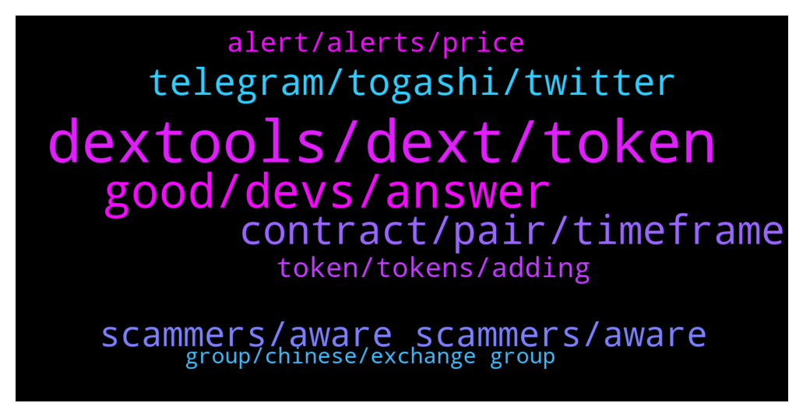

# **@DEXToolsCommunity**
 ## Analysis for **2022-01-11** - **2022-01-13**.

---

## 📊 **Basic Stats**

**n_messages_sent**: 210

---

---

## 🔝 **Top keywords and related messages**

1. **dextools, dext, token**

    @creatstep --- *Who should I dm to get promoted on dextools?* **--->** [TG Discussion](https://t.me/DEXToolsCommunity/323568)

    @Yokamox --- *How to submit request for update regarding my token ( Jacy ) in dextools?* **--->** [TG Discussion](https://t.me/DEXToolsCommunity/324451)

    @Bantio Kuete --- *How to download the application I did not see the procedure in the application Aidé my please* **--->** [TG Discussion](https://t.me/DEXToolsCommunity/323786)

    @GhosTMan96QuelloVeroDal2014 --- *Friend , do you have any other Dextools communities? I don't understand when you talk🥺🥺* **--->** [TG Discussion](https://t.me/DEXToolsCommunity/324364)

    @rambo_dev --- *why is dextools becoming so fucking trash nowadays, from bad to worst, tokens launched for more than 30 mins and dextools still says liquidity is not added. past few days transactions even jammed and not moving. Totally unreliable. If this continues, dextool is going down the drain. Compare to poocoin that never once had any issue.* **--->** [TG Discussion](https://t.me/DEXToolsCommunity/324283)

    @Okay8788 --- *The number of free and premium DexTools users is different from the number of holders* **--->** [TG Discussion](https://t.me/DEXToolsCommunity/323732)

2. **good, devs, answer**

    @JoeyDieleman --- *You say the CMC data is different.* **--->** [TG Discussion](https://t.me/DEXToolsCommunity/324471)

    @Yokamox --- *But for example the links are not there like CMC* **--->** [TG Discussion](https://t.me/DEXToolsCommunity/324458)

    @Haski1988 --- *does that work even if we are not yet listed on cmc or cg? if so, can you give me a guide?  * **--->** [TG Discussion](https://t.me/DEXToolsCommunity/323814)

    @cactusjimm --- *Hi, did the dev's come back on this one?* **--->** [TG Discussion](https://t.me/DEXToolsCommunity/323774)

    @growmore00 --- *When will u realse on CEX* **--->** [TG Discussion](https://t.me/DEXToolsCommunity/324045)

    @gumbercules --- *Right now you can purchase for low fees on BSC* **--->** [TG Discussion](https://t.me/DEXToolsCommunity/324070)

3. **contract, pair, timeframe**

    @stanes --- *Same with this one, contract is doing 4 sells.* **--->** [TG Discussion](https://t.me/DEXToolsCommunity/323679)

    @stanes --- *Thanks, for so this one you can see that the contract is indeed doing 4 different sell for one tx.* **--->** [TG Discussion](https://t.me/DEXToolsCommunity/323676)

    @ATX_987 --- *Are you having issues? At least on of your pairs is about 3 hours behind right now (0xb2ba36ee6ba6113a914f3e8812a0df094dec5994)* **--->** [TG Discussion](https://t.me/DEXToolsCommunity/324546)

    @napascual --- *Our bsc backend server has been restarted for maintenance and some pairs are updating* **--->** [TG Discussion](https://t.me/DEXToolsCommunity/323802)

    @Yokamox --- *Differences regarding the page of the contract pair?* **--->** [TG Discussion](https://t.me/DEXToolsCommunity/324467)

    @stanes --- *Can you give me the pair address having this issue please?* **--->** [TG Discussion](https://t.me/DEXToolsCommunity/323672)

4. **telegram, togashi, twitter**

    @tdm516 --- *@FredericDEXT Another Q for you, please. Right now the Telegram link on BINU's Dext page directs to telegram . org's homepage instead of BINU's telegram community chat. Can this be updated, please?* **--->** [TG Discussion](https://t.me/DEXToolsCommunity/323890)

    @bastardganpunk --- *You can add tipping bots in channels, but I’m wondering why someone would want to swap on telegram. Sounds very insecure to me* **--->** [TG Discussion](https://t.me/DEXToolsCommunity/323765)

    @grathius --- *Guys, is there some kind of bot/wallet/exchanger/swaper in telegram that works with bsc(dextools, pcs, poocoin, etc)? @bastardganpunk* **--->** [TG Discussion](https://t.me/DEXToolsCommunity/323722)

    @zamolian --- *Well, how is it normal to access togashi and when you give twitter or telegram appears dext Țools on the togashi page!* **--->** [TG Discussion](https://t.me/DEXToolsCommunity/324434)

    @zamolian --- *it is the togashi currency and when you press twitter or telegram it directs you to this channel* **--->** [TG Discussion](https://t.me/DEXToolsCommunity/324424)

    @CryptoCrumbs --- *I think my message got deleted haha* **--->** [TG Discussion](https://t.me/DEXToolsCommunity/323749)

5. **scammers, aware scammers, aware**

    @FredericDEXT --- *Dm @guillermorodriguez78 he is in charge of ads.* **--->** [TG Discussion](https://t.me/DEXToolsCommunity/323594)

    @creatstep --- *Guys, there are so much scammers out there who trying to pretend you . My gosh 🤦‍♂️* **--->** [TG Discussion](https://t.me/DEXToolsCommunity/323599)

    @CryptoCrumbs --- *Got a few dms now from a couple people.* **--->** [TG Discussion](https://t.me/DEXToolsCommunity/323757)

    @napascual --- *Dm @guillermorodriguez78, be aware of scammers, admins NEVER dm first* **--->** [TG Discussion](https://t.me/DEXToolsCommunity/323569)

    @CryptoCrumbs --- *Cheers mate, before I continue. Is @napascualli one of yours? He just DM'd me* **--->** [TG Discussion](https://t.me/DEXToolsCommunity/323752)

    @stanes --- *Please DM @guillermorodriguez78 he is the person-in-charge.  Be aware of scammers, HE WILL NEVER DM YOU FIRST.* **--->** [TG Discussion](https://t.me/DEXToolsCommunity/324440)

6. **alert, alerts, price**

    @bastardganpunk --- *which alert exactly are you talking about? i’m getting alerts under 1$* **--->** [TG Discussion](https://t.me/DEXToolsCommunity/324221)

    @rpoole69 --- *Just an FYI, the price alert bug hasn't been corrected yet, unless you prefix the alert price with 0. (for amounts under 1$) it will not save, @bastardganpunk could you please let the devs know, thanks!* **--->** [TG Discussion](https://t.me/DEXToolsCommunity/324219)

    @stanes --- *Was reported few days ago: if you try to set the  alert without the 0 it doesn't save.* **--->** [TG Discussion](https://t.me/DEXToolsCommunity/324225)

    @bastardganpunk --- *No alerts on cro by now* **--->** [TG Discussion](https://t.me/DEXToolsCommunity/323775)

    @DogecointotheMoon --- *please add % change price alerts!!* **--->** [TG Discussion](https://t.me/DEXToolsCommunity/323563)

    @AbdoMelody --- *Any news for polygon alertes ?* **--->** [TG Discussion](https://t.me/DEXToolsCommunity/323544)

7. **token, tokens, adding**

    @Toota2010 --- *Hi guys need help with some promising tokens presale* **--->** [TG Discussion](https://t.me/DEXToolsCommunity/324051)

    @whyalwaysus --- *Hi guys, how can we add infos about our token (website, telegram, twitter...) ?* **--->** [TG Discussion](https://t.me/DEXToolsCommunity/323902)

    @gumbercules --- *What chain/token are you looking at or is it just a general delay across the board?* **--->** [TG Discussion](https://t.me/DEXToolsCommunity/323798)

    @stanes --- *He didn't buy the right token.* **--->** [TG Discussion](https://t.me/DEXToolsCommunity/323933)

    @bastardganpunk --- *Token list automatically when adding liquidity to the Tokenpair. You don’t need to do anything except adding socials on cg or cmc and the blockchainexplorer* **--->** [TG Discussion](https://t.me/DEXToolsCommunity/323813)

    @carlosandre258 --- *Good evening! Liquidity is open for some kind of token improvements, can someone explain it to me please?* **--->** [TG Discussion](https://t.me/DEXToolsCommunity/324307)

