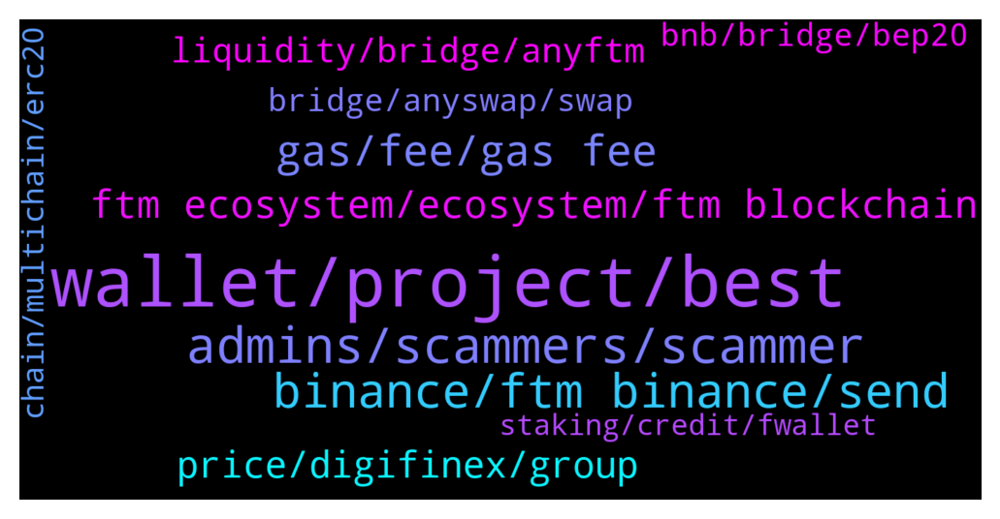

# **@Fantom_English**
 ## Analysis for **2022-01-12** - **2022-01-13**.

---

## 📊 **Basic Stats**

**n_messages_sent**: 538

---

---

## 🔝 **Top keywords and related messages**

1. **wallet, project, best**

    @SL7676 --- *anybody here that can help me with ledger and metamask on fantom?* **--->** [TG Discussion](https://t.me/Fantom_English/630000)

    @Janevietani --- *hello, i dont know a lot about launchpad but as i know there is FTMpad ( which you can contact them on TOMB discord/telegram ), Fantom starter ( https://t.me/fantomstarter ) , FantomOasis* **--->** [TG Discussion](https://t.me/Fantom_English/628775)

    @Fjody --- *Fantom Marines This is a community driven channel.  Fantom altcoin shilling/"discussion" will be banned.  Reddit: https://www.reddit.com/r/FantomFoundation/ Website: https://www.fantom.foundation/ https://t.me/FantomMarines* **--->** [TG Discussion](https://t.me/Fantom_English/630128)

    @Mcjig --- *Where to buy Fantom Mainnet Opera on Exchange: • Binance (Non US) : https://www.binance.com/  • Bitfinex : https://www.bitfinex.com/  • Bybit : https://www.bybit.com/  • ChangeNOW : https://changenow.io/  • Coinex : https://www.coinex.com/  • Coinspot : https://www.coinspot.com.au/  • Gate.io : https://www.gate.io/  • Hotbit : https://www.hotbit.io/  • Huobi : https://www.huobi.com/  • Kucoin : https://www.kucoin.com/  • Mexc : https://www.mexc.com/  • Okex : https://www.okex.com/  • Probit : https://www.probit.com/  • Simpleswap : https://simpleswap.io/* **--->** [TG Discussion](https://t.me/Fantom_English/629257)

    @Barna --- *hi does anyone know if  there are any fantom wallet with similar or better fiat on ramp features? https://www.dharma.io/* **--->** [TG Discussion](https://t.me/Fantom_English/628216)

    @Janevietani --- *as i know you need buy beet on Beethoven DEX https://beets.fi/#/* **--->** [TG Discussion](https://t.me/Fantom_English/629935)

2. **admins, scammers, scammer**

    @pajamasfreak --- *you can directly pm to me or other admins* **--->** [TG Discussion](https://t.me/Fantom_English/628523)

    @Joe --- *Please if anyone gets direct message tell them to fuk off* **--->** [TG Discussion](https://t.me/Fantom_English/629164)

    @Ridehi --- *Just ask a random question pretending to be new here and see them come at ya* **--->** [TG Discussion](https://t.me/Fantom_English/629991)

    @miragele --- *Hi jane think someone using your name and the photo you have on your account as admin ???* **--->** [TG Discussion](https://t.me/Fantom_English/628158)

    @Johnnyfantom --- *All of us admins have had their accounts copied, just remember admins will never DM you first* **--->** [TG Discussion](https://t.me/Fantom_English/628159)

    @Ridehi --- *I want legitimate and honest scammer to pm me* **--->** [TG Discussion](https://t.me/Fantom_English/629967)

3. **binance, ftm binance, send**

    @Crypto --- *Hi I wanted to transfer my FTM from binance and is has an error message stating FTM network withdrawal suspended. Can anyone let me know how long with will be for? Many thanks 🙏* **--->** [TG Discussion](https://t.me/Fantom_English/629631)

    @Joe --- *I have sent bnb to my address and it went through fine to meta mask  The ftm from Binance  to meta , is this possible  No scammers please* **--->** [TG Discussion](https://t.me/Fantom_English/629229)

    @Joe --- *I just realized a problem how do I connect my meta to Binance* **--->** [TG Discussion](https://t.me/Fantom_English/629194)

    @BigBoyCryptoPants --- *binance withdrawels suspended for FTM mainent* **--->** [TG Discussion](https://t.me/Fantom_English/629377)

    @Joe --- *Just trying to send ftm directly from Binance to metamask ,it’s processing  Will it work ?* **--->** [TG Discussion](https://t.me/Fantom_English/629158)

    @Filippocacchioli --- *Hi admin,  Last night I accidentally sent my FTM, that I had on the BSC network to the general Fantom token address on BSC  instead of sending them on my Binance FTM address    Can I recover my FTM in some way? Tks* **--->** [TG Discussion](https://t.me/Fantom_English/629795)

4. **gas, fee, gas fee**

    @cripto_panas --- *Hi there, which website has a good faucet to get some FTM in order to pay some gas??? Cheers* **--->** [TG Discussion](https://t.me/Fantom_English/630155)

    @MAHA123456789 --- *Hi everyone, how I can know price ftm at here, what should I write?* **--->** [TG Discussion](https://t.me/Fantom_English/628633)

    @Infinite_Alpha --- *I do not want to pay 60 Ftm I wanted it on the FTM network initially?* **--->** [TG Discussion](https://t.me/Fantom_English/628488)

    @cmoney6969 --- *Need gas fee to claim my FTM* **--->** [TG Discussion](https://t.me/Fantom_English/628041)

    @cmoney6969 --- *Nvm I was able to reduce my gas fee to claim it. All good!!* **--->** [TG Discussion](https://t.me/Fantom_English/628044)

    @cryptoshepherd --- *But dont have ftm to pay gas fees plz help me* **--->** [TG Discussion](https://t.me/Fantom_English/629322)

5. **ftm ecosystem, ecosystem, ftm blockchain**

    @Joe --- *How is ftm doing so well with no way of getting ftm to there ecosystem* **--->** [TG Discussion](https://t.me/Fantom_English/629246)

    @Kevarti --- *What about the ftm give away* **--->** [TG Discussion](https://t.me/Fantom_English/629210)

    @exten_vision --- *Hello! Tell me please: is it worth waiting for FTM above 4 this year?* **--->** [TG Discussion](https://t.me/Fantom_English/628138)

    @Mcjig --- *well their wallet shows 1 mil ftm. so hopefully not much longer* **--->** [TG Discussion](https://t.me/Fantom_English/629399)

    @dominikbolena --- *Hey guys, are here some ftm / blockchain professionals?  I have a general question about ftm / tomb.  We all think, the demand and transactions on the Ftm blockchain will raise significantly.  So my question is: will in this case also the transaction cost and speed increase dramatically? Does ftm habe than a similar problem, like other chains?  Or is there any solution planned in such a case? Thanks for helping :)* **--->** [TG Discussion](https://t.me/Fantom_English/628661)

    @MKarpushko --- *ahh thats what it was. On spooky there is a 20-30 us dollla difference but on curve fUSDT to MIM or USDC there is only a 1 dolla difference* **--->** [TG Discussion](https://t.me/Fantom_English/628732)

6. **price, digifinex, group**

    @Krypto_Mo --- *Where is the price discuss group* **--->** [TG Discussion](https://t.me/Fantom_English/630010)

    @lalelilulos --- *Hey! Is there a trader/price group ?* **--->** [TG Discussion](https://t.me/Fantom_English/629517)

    @Johnnyfantom --- *You cannot, this is not a price chat, go to https://t.me/FantomMarines* **--->** [TG Discussion](https://t.me/Fantom_English/628634)

    @Mcjig --- *[Forwarded from jane] Price discussion and FA/TA trading:  • Chat.fantom.network Discord • @fantomtrading  FTM ecosystem projects and discussion: • projects.fantom.network • https://discuss.fantom.digital/d/30-all-in-one-guide-for-fantom-newcomers • @FantomLoungeOfficial • @Fantomine • @ftm_nft  ❌NO SHILL OR ASK FINANCIAL ADVICE!❌* **--->** [TG Discussion](https://t.me/Fantom_English/629518)

    @Johnnyfantom --- *Yeah just checked, that is what it is, plus this is not a price chat* **--->** [TG Discussion](https://t.me/Fantom_English/628731)

    @Janevietani --- *for price discussion that have moon, pump, dumo, long and short take it to price discussions* **--->** [TG Discussion](https://t.me/Fantom_English/628495)

7. **liquidity, bridge, anyftm**

    @rockcryp --- *Hello, is it possible to provide more liquidity as i want to convert my ftm on erc20 to Ftm mainnet* **--->** [TG Discussion](https://t.me/Fantom_English/628450)

    @Janevietani --- *bridge it now, spookyswap have 270k FTM liquidity* **--->** [TG Discussion](https://t.me/Fantom_English/629834)

    @nortontop --- *Hey does anyone know where I can bridge my eFTM over to opera network. Spooky swap has no liquidity* **--->** [TG Discussion](https://t.me/Fantom_English/629828)

    @Mcjig --- *you will get anyFTM. when there is no liquidity , you can wait until there is liquidity so you can swap anyFTM to FTM or if you dont wanna wait for liquidity, you can bridge it back to erc20 FTM  check it on https://app.multichain.org/#/pool go to Pool -> FTM -> Remove -> anyFTM to FTM ( which one network that have liquidity )* **--->** [TG Discussion](https://t.me/Fantom_English/629572)

    @Janevietani --- *when there is no liquidity, bridge you will give you anyFTM , you can wait until there is liquidity so you can swap anyFTM to FTM or if you dont wanna wait liquidity, you can bridge it back to erc20 FTM  check it on https://app.multichain.org/#/pool go to Pool -> FTM -> Remove -> anyFTM to FTM ( which one network that have liquidity )* **--->** [TG Discussion](https://t.me/Fantom_English/628793)

    @Janevietani --- *you might get anyFTM. when there is no liquidity, bridge you will give you anyFTM , you can wait until there is liquidity so you can swap anyFTM to FTM or if you dont wanna wait liquidity, you can bridge it back to erc20 FTM  check it on https://app.multichain.org/#/pool go to Pool -> FTM -> Remove -> anyFTM to FTM ( which one network that have liquidity )* **--->** [TG Discussion](https://t.me/Fantom_English/628472)

8. **bnb, bridge, bep20**

    @dgamble88 --- *hi whats the best way to swap eth for ftm ?* **--->** [TG Discussion](https://t.me/Fantom_English/628089)

    @beenuts --- *you can bridge from avax, bsc eth to ftm* **--->** [TG Discussion](https://t.me/Fantom_English/628091)

    @Janevietani --- *Helpful tip:   if you want a cheaper alternative than bridging ftm and paying eth gas From binance(US) ,crypto.com or kucoin, get BNB and withdraw as BNB BEP20, then use https://spookyswap.finance/bridge To bridge BNB BEP20 to BNB Fantom Then use spookyswap to swap BNB Fantom to FTM  You will need ftm gas for transaction. Use the faucet https://www.mentasuave01-tools.com/* **--->** [TG Discussion](https://t.me/Fantom_English/629131)

    @Mcjig --- *Helpful tip: if you want a cheaper alternative than bridging ftm and paying eth gas From binance or kucoin, get bnb and withdraw as bep20, then use https://swap.spiritswap.finance/#/bridge To bridge bnb bep20 to bnb fantom. Then use spiritswap to swap bnb to ftm spiritswap bridge will also send you 0.4 ftm for gas when bridging (edited)* **--->** [TG Discussion](https://t.me/Fantom_English/629265)

    @Mcjig --- *Everyone, understand when sending ftm or any other token to and from a exchange. You have erc20  (eth network) You have bep2 and bep20 (binance network) You have mainnet (opera) (ftm network)   These 3 networks are not compatible with each other   YOU have to use one of our bridges to send tokens from FTM network to a different network.   THIS also inludes all tokens other than FTM including usdc,btc,eth, etc.....   You cannot send ftm mainnet to a erc20 or a bsc address without a bridge* **--->** [TG Discussion](https://t.me/Fantom_English/629522)

    @cryptoshepherd --- *Then convert BNB in ftm mainnet to ftm* **--->** [TG Discussion](https://t.me/Fantom_English/629381)

9. **bridge, anyswap, swap**

    @M --- *So i want to bridge my btcb or wbtc on avax to fantom, is anyswap the only bridge to do this? It does seem so? I cant find any other btc bridges to fantom* **--->** [TG Discussion](https://t.me/Fantom_English/630064)

    @crypticpork --- *hello so i bridged some fantom over using anyswap and it sent me anyFTM and now i dont how to swap it* **--->** [TG Discussion](https://t.me/Fantom_English/628785)

    @Infinite_Alpha --- *Can some please assist, sent erc20 fantom to spiritswap bridge and never recieved ??* **--->** [TG Discussion](https://t.me/Fantom_English/628468)

    @Naranjado --- *Where can I get the BnB contract on the Fantom chain?* **--->** [TG Discussion](https://t.me/Fantom_English/629506)

    @imperialEric --- *Hello folks, I have try to use sushiswap on Fantom blockchain with metamask. All work but I have an issue with the fee, for swap 0.1 FTM they ask me 84957648.6155 FTM fee .. someone can help me ?* **--->** [TG Discussion](https://t.me/Fantom_English/629790)

    @M --- *Hi is there any place where you can swap your btc to fantom? The pool in anyswap has been empty for weeks now to bridge to fantom. Are there any other ways besides selling the brc for stables since the fees on that are pretty high* **--->** [TG Discussion](https://t.me/Fantom_English/630062)

10. **chain, multichain, erc20**

    @Mcjig --- *you might want to see if they sent erc20 chain. heard some complaints they will send wrong chain* **--->** [TG Discussion](https://t.me/Fantom_English/629431)

    @Janevietani --- *yes, it will use same address* **--->** [TG Discussion](https://t.me/Fantom_English/628866)

    @T --- *all i want to do is send it to biannce if i sent it as is will it work? and on what chain i must send?* **--->** [TG Discussion](https://t.me/Fantom_English/629111)

    @Madmandan --- *Hi guys, what is the best way to get USDC from fantom chain to Kucoin?* **--->** [TG Discussion](https://t.me/Fantom_English/628255)

    @Mcjig --- *yes.but you have to send erc20 to kucoin* **--->** [TG Discussion](https://t.me/Fantom_English/629261)

    @Madmandan --- *anyway looks like it's mostly a limitation by kucoin for only accepting erc20 and some other barely usable chains for stablecoins* **--->** [TG Discussion](https://t.me/Fantom_English/628273)

