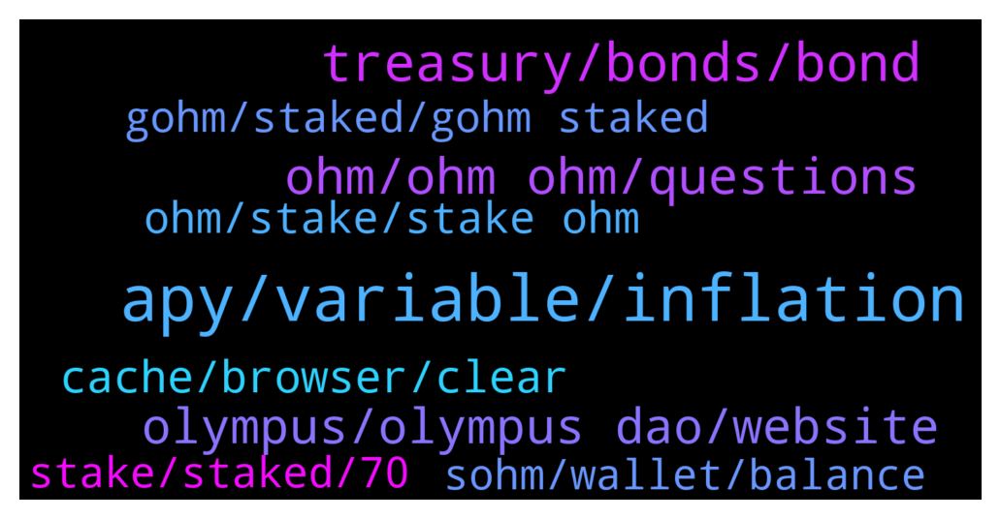

# **@OlympusTG**
 ## Analysis for **2022-01-12** - **2022-01-13**.

---

## 📊 **Basic Stats**

**n_messages_sent**: 1047

---

---

## 🔝 **Top keywords and related messages**

1. **apy, variable, inflation**

    @nfwaple --- *the APY is correct, the APY is reflected in the number of OHM you get a year assuming APY stays* **--->** [TG Discussion](https://t.me/OlympusTG/148798)

    @emadbaig --- *Even if it goes 500% apy, i can get 0.4x in a month. How is it possible? Hope not a scam 😮‍💨* **--->** [TG Discussion](https://t.me/OlympusTG/147893)

    @K --- *Same thing, if someone manually calculates what he should get with that apy on that day, he would get to the same number as using the calculator, which got removed.  Apy is only for that day you check it. Calculator is only for that day you check it.  Hence just removing the calculator doesn‘t make sense.* **--->** [TG Discussion](https://t.me/OlympusTG/148817)

    @C --- *Variable ApY in Banks is not the same at all. USD is inflationary supply but only to a certain extent.* **--->** [TG Discussion](https://t.me/OlympusTG/148832)

    @Metanone --- *I’m comparing to other similar projects without giving names. APY goes up when price goes down. Anyway I’m still buying the dip… 🍀🤘🏼* **--->** [TG Discussion](https://t.me/OlympusTG/148484)

    @K --- *There is no calculator but apy is still showing and promising people stuff they won‘t get* **--->** [TG Discussion](https://t.me/OlympusTG/148797)

2. **treasury, bonds, bond**

    @Shane (4,4) (🍉,🍉) --- *While I agree with what you were saying about treasury.....I would say if the market maker gets gohm on a couple of good CEXs then you may regret this post....😂😂😂  This is what I am waiting on because at this point we need price appreciation....not more bonds and more minting just so the treasury gets richer.....NFA....just my opinion....😂😂😂* **--->** [TG Discussion](https://t.me/OlympusTG/148332)

    @Shane (4,4) (🍉,🍉) --- *the price was down like 28% in 24 hours....how did that help the 3,3?  Not trolling just asking.....I understand the treasury is making money but how is that helping stakers with the bleed off in price?* **--->** [TG Discussion](https://t.me/OlympusTG/148271)

    @C --- *Not a good argument. We are trying to replace bank not be them.* **--->** [TG Discussion](https://t.me/OlympusTG/148876)

    @Camaro1981 --- *Question. I was on discord and alot of people were saying don't buy bonds unless you have 10k to put in. Anyone's thoughts on that. I've never bonded into a project just staked and left it.* **--->** [TG Discussion](https://t.me/OlympusTG/148399)

    @Camaro1981 --- *Keep the treasury up at the cost of stakers is the truth. But again when someone says the truth noone has anything to say* **--->** [TG Discussion](https://t.me/OlympusTG/148255)

    @nfwaple --- *the treasury making money and people buying and selling are two separate issues, the problem is people don't bother to look further* **--->** [TG Discussion](https://t.me/OlympusTG/148277)

3. **ohm, ohm ohm, questions**

    @allenkor --- *Anyone that asks wen moon, wen airdrops and wen lambo shouldn’t be in ohm. Think long term* **--->** [TG Discussion](https://t.me/OlympusTG/148704)

    @Freedom_Now1 --- *Nice to see OHM moving up* **--->** [TG Discussion](https://t.me/OlympusTG/148808)

    @Leny --- *is a g-ohm the same price a a ohm ie approx 200 usd* **--->** [TG Discussion](https://t.me/OlympusTG/149790)

    @Hele_beger --- *I was going through Ohm's page and I saw a trend on borrowing Ohm to create more Ohm* **--->** [TG Discussion](https://t.me/OlympusTG/149431)

    @Ap0l1o --- *Probably because there the Ohm is V1* **--->** [TG Discussion](https://t.me/OlympusTG/147849)

    @Shane (4,4) (🍉,🍉) --- *but isn't OHM still just ERC20?* **--->** [TG Discussion](https://t.me/OlympusTG/148353)

4. **olympus, olympus dao, website**

    @Drugsmatt --- *is an Olympus fork! So same "ponzenomics" dude* **--->** [TG Discussion](https://t.me/OlympusTG/149543)

    @web3clouds --- *I suppose this question was previously raised, but can someone explain why such a big project like olympus hasnt been listed in T1 cex until now?* **--->** [TG Discussion](https://t.me/OlympusTG/148857)

    @Rah --- *What was the apy of Olympus when it first came out? Thanks* **--->** [TG Discussion](https://t.me/OlympusTG/149616)

    @emadbaig --- *I am looking a project for passive income, to leave my effin job. Someone said strong and olympus, so weighing out* **--->** [TG Discussion](https://t.me/OlympusTG/147909)

    @Ap0l1o --- *Most of them entered the forks, took profits and left. Some came back to Olympus, others did not* **--->** [TG Discussion](https://t.me/OlympusTG/148775)

    @Ap0l1o --- *I am not saying that the forks are good or bad, time will show that, but Olympus is building something beautiful and those that stay with it will be rewarded some day, sooner or later* **--->** [TG Discussion](https://t.me/OlympusTG/148768)

5. **cache, browser, clear**

    @Ap0l1o --- *try clear cache +  reload* **--->** [TG Discussion](https://t.me/OlympusTG/148910)

    @Bracin --- *Please help I’m having same issue right now and I tried clearing my cache too* **--->** [TG Discussion](https://t.me/OlympusTG/149515)

    @nfwaple --- *clear browser cache and try again* **--->** [TG Discussion](https://t.me/OlympusTG/148972)

    @nfwaple --- *if you're not sure best google it, how to clear cache using xxx browser* **--->** [TG Discussion](https://t.me/OlympusTG/149513)

    @nfwaple --- *go to your browser, settings, then if there is a search bar in settings, search cache* **--->** [TG Discussion](https://t.me/OlympusTG/149512)

    @cdp279 --- *Just try clear cache, refresh reconnect.* **--->** [TG Discussion](https://t.me/OlympusTG/149178)

6. **ohm, stake, stake ohm**

    @Artyom --- *basically you borrow more OHM through Rari to stake?* **--->** [TG Discussion](https://t.me/OlympusTG/148194)

    @Shane (4,4) (🍉,🍉) --- *yeah if it is ohm the cex needs to integrate staking....If someone were inclined to stake the OHM themselves they would probably not be buying it from a CEX* **--->** [TG Discussion](https://t.me/OlympusTG/148347)

    @nfwaple --- *actually there have been cexes that listed OHM like gate, people do actually buy there and withdraw to stake* **--->** [TG Discussion](https://t.me/OlympusTG/148350)

    @prashantmasih --- *Hi all, my staked ohm is not growing and rewards are not being added. Its staying the same* **--->** [TG Discussion](https://t.me/OlympusTG/148931)

    @nfwaple --- *either the cex needs to integrate staking, or people need to learn how to withdraw OHM from cex and stake* **--->** [TG Discussion](https://t.me/OlympusTG/148342)

    @safuking --- *any tutorial on how to buy ohm on matic and stake on official page after buying ?* **--->** [TG Discussion](https://t.me/OlympusTG/149911)

7. **gohm, staked, gohm staked**

    @nfwaple --- *you can buy gOHM on other chain, gOHM gets the same APY as staking OHM* **--->** [TG Discussion](https://t.me/OlympusTG/149393)

    @RichR7 --- *gOHM is the cheapest way because it's already staked. Just buy and hold.  gOHM is wrapped sOHM.* **--->** [TG Discussion](https://t.me/OlympusTG/147869)

    @nfwaple --- *it doesn't mean gOHM won't be listed on cexes in the future tho IMO* **--->** [TG Discussion](https://t.me/OlympusTG/148355)

    @Shane (4,4) (🍉,🍉) --- *that's why I was certain they would list gOHM.....staked and cross chain* **--->** [TG Discussion](https://t.me/OlympusTG/148356)

    @nfwaple --- *correct, no need to stake anywhere, gOHM is always in staked form, you can see your rebases in the stake page* **--->** [TG Discussion](https://t.me/OlympusTG/148175)

    @nfwaple --- *it's going to be OHM, the proposal already passed, GSR facilitating OHM listing, not gOHM* **--->** [TG Discussion](https://t.me/OlympusTG/148336)

8. **stake, staked, 70**

    @Camaro1981 --- *Ok thanks everyone. I'm glad that I got my answers i needed. I'm leaving my money staked but I will save this message. In 1 month it is going to be down 70% for stakers from today.* **--->** [TG Discussion](https://t.me/OlympusTG/148325)

    @samboan --- *Like the stake button is not showing* **--->** [TG Discussion](https://t.me/OlympusTG/149519)

    @Eli --- *I have phantom set up but my funds are ether and bnb and am staked through ether contract, gotta start going away from ether* **--->** [TG Discussion](https://t.me/OlympusTG/149412)

    @nfwaple --- *I see, please give the stake page a few seconds, it might take time to load* **--->** [TG Discussion](https://t.me/OlympusTG/149574)

    @emadbaig --- *But are you using the returns or just leaving it all staked?* **--->** [TG Discussion](https://t.me/OlympusTG/147903)

    @nfwaple --- *And I am pretty sure even if you don't claim, they just sit there continue to stake, so no urgency as well* **--->** [TG Discussion](https://t.me/OlympusTG/148405)

