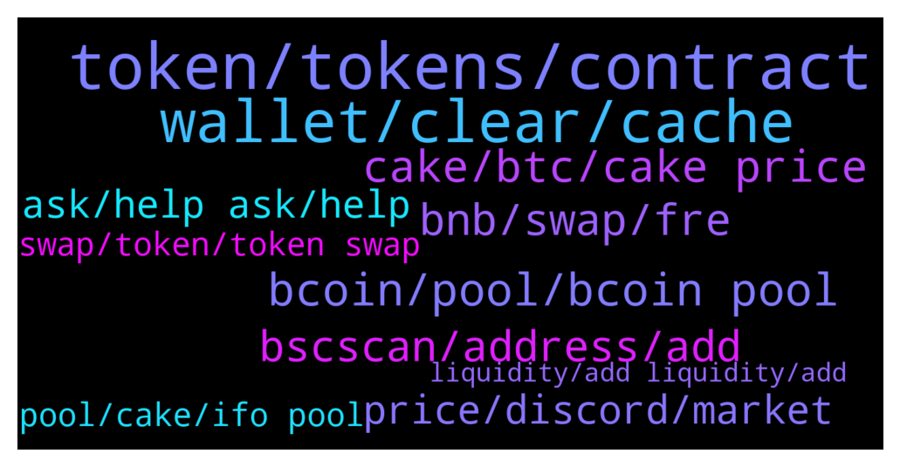

# **@PancakeSwap**
 ## Analysis for **2022-01-12** - **2022-01-13**.

---

## 📊 **Basic Stats**

**n_messages_sent**: 1571

---

---

## 🔝 **Top keywords and related messages**

1. **token, tokens, contract**

    @HAITIENLK --- *the new token? sometime it's not show, you can try other wallet.* **--->** [TG Discussion](https://t.me/PancakeSwap/2268666)

    @TomorrowlandForLife --- *You probably approved a scam contract that sent your tokens to another wallet as soon as they got in your wallet  Or you used a fake website* **--->** [TG Discussion](https://t.me/PancakeSwap/2264390)

    @vvmdov --- *Tried to sell but didn't sign it because of changed my mind* **--->** [TG Discussion](https://t.me/PancakeSwap/2267192)

    @SecuestPcs --- *Did you check token contract on https://honeypot.rugdoc.io/ ?* **--->** [TG Discussion](https://t.me/PancakeSwap/2267067)

    @Glavch16 --- *"We have received reports that people are unable to sell this token. Exercise caution while trading and DYOR. " That's thing coinmarketcap noticed* **--->** [TG Discussion](https://t.me/PancakeSwap/2266921)

    @BOASTER FRIDAY --- *They token has been added since before transaction was occur successfully* **--->** [TG Discussion](https://t.me/PancakeSwap/2268451)

2. **wallet, clear, cache**

    @Kaner sokmen --- *Can someone help me with my ticket its been almost a month now and i cant move my ETH to my other wallet. at first it was cause of a time limit and now because of maint. issue.* **--->** [TG Discussion](https://t.me/PancakeSwap/2267378)

    @eddd1111 --- *No it doesn't work  On my wallet and web site* **--->** [TG Discussion](https://t.me/PancakeSwap/2268806)

    @Union_777 --- *Please check transaction from this wallet https://bscscan.com/address/0x39e7de3a0763c4ea50a236e248772d9f2bbefddf* **--->** [TG Discussion](https://t.me/PancakeSwap/2265580)

    @isadawah --- *I think you have a security issue on your page. Because i promise i dont find any reason in the log.* **--->** [TG Discussion](https://t.me/PancakeSwap/2264427)

    @MayaArtAndDesign --- *Sorry about that. Maybe, you have a keylogger, virus etc on your device then. Good luck.* **--->** [TG Discussion](https://t.me/PancakeSwap/2264462)

    @T A Y E --- *I think there’s an error on trust wallet. It changed 1 of my holding quantities from 4600 to jus 46* **--->** [TG Discussion](https://t.me/PancakeSwap/2264914)

3. **bcoin, pool, bcoin pool**

    @forc3r --- *Bcs moonboys needs pump here, now & immediately* **--->** [TG Discussion](https://t.me/PancakeSwap/2265342)

    @ninahaus --- *We're checking BCOIN pool, thanks for your patience!* **--->** [TG Discussion](https://t.me/PancakeSwap/2265908)

    @HAITIENLK --- *We're checking BCOIN pool, thanks for your patience!* **--->** [TG Discussion](https://t.me/PancakeSwap/2265979)

    @Juljan20 --- *Admin whu dont show bcoin surup pool???!!!* **--->** [TG Discussion](https://t.me/PancakeSwap/2266287)

    @LeoBarbieri00 --- *When bcoin pool is valid ?* **--->** [TG Discussion](https://t.me/PancakeSwap/2266120)

    @leyyolei --- *Bcoin pool not yet deployed ?* **--->** [TG Discussion](https://t.me/PancakeSwap/2266214)

4. **cake, btc, cake price**

    @vladpronin --- *14,25 Cake per block (every 3 sec)   285 Cakes each minute* **--->** [TG Discussion](https://t.me/PancakeSwap/2265499)

    @Patwarboys --- *It is not pegged with Btc...is it any rule to rise with Btc.. it rise from 0.2$ to 44$ in just 6 month...have ever Btc done this? Btc and Cake are both different things...* **--->** [TG Discussion](https://t.me/PancakeSwap/2265103)

    @Canada2148 --- *Guys what's your future outlook for cake price in 1 year* **--->** [TG Discussion](https://t.me/PancakeSwap/2269412)

    @SonuGamer --- *How much allocation for 100 cakes* **--->** [TG Discussion](https://t.me/PancakeSwap/2268309)

    @notmishaal --- *I heard that it has. Wanted yo confirm as cake isn't performing well. It didn't even hit ATH when BTC went to $69K.* **--->** [TG Discussion](https://t.me/PancakeSwap/2265101)

    @Crypt0Coiner --- *Why are pple Fuding on cake* **--->** [TG Discussion](https://t.me/PancakeSwap/2265339)

5. **bnb, swap, fre**

    @xandercakes --- *No, cause 0.06 FRE is equal to 1 BNB according to your example* **--->** [TG Discussion](https://t.me/PancakeSwap/2267790)

    @jaskymillz --- *Please what’s the minimum amount of bnb you must have in wallet before you can make a swap* **--->** [TG Discussion](https://t.me/PancakeSwap/2269419)

    @BroSomeone --- *When your adding liquidity for a token and it says(example not actual thing)  0.06FRE=1BNB If I swap 0.06 FRE will I actually get 1 bnb?* **--->** [TG Discussion](https://t.me/PancakeSwap/2267786)

    @BroSomeone --- *Buy is that actually how I find out how much I'd get if you swapped fre for bnb?* **--->** [TG Discussion](https://t.me/PancakeSwap/2267797)

    @Chris --- *Is it just me? I just want to swap bnb to charge... gonna cost me 1 bnb just to swap* **--->** [TG Discussion](https://t.me/PancakeSwap/2269056)

    @Chris --- *Just to swap bnb to dshare .....* **--->** [TG Discussion](https://t.me/PancakeSwap/2268893)

6. **bscscan, address, add**

    @Filoucrypto --- *Do you know how we can see a honeyspot token wheb we look at the contract on bscscan ? I dont really know analyse contracts but if someone know how to reper a scam with analyse contract that could be good to know* **--->** [TG Discussion](https://t.me/PancakeSwap/2266619)

    @alodia00 --- *Just for clarification about point 3, it is not a problem to manually add contracts from bscscan in pancakeswap and approve them right?* **--->** [TG Discussion](https://t.me/PancakeSwap/2268777)

    @HAITIENLK --- *you can see it on bscscan.com bro. you need add token, follow thiss https://t.me/PancakeSwap/2268744* **--->** [TG Discussion](https://t.me/PancakeSwap/2268760)

    @alexsoh1 --- *Always need to check BscScan error  Don’t anyhow retry  The same applies to all projects on all blockchains* **--->** [TG Discussion](https://t.me/PancakeSwap/2266000)

    @EvlVega --- *every one you add gives a warning like "anyone can create a bsc contract..please ensure this is the correct contract address"* **--->** [TG Discussion](https://t.me/PancakeSwap/2269698)

    @Damian --- *I checked on bscscan and it says I should have received 19418 coins but I got 194* **--->** [TG Discussion](https://t.me/PancakeSwap/2264704)

7. **price, discord, market**

    @<UNK> --- *How to solve the price impact is too high, I want to sell at once* **--->** [TG Discussion](https://t.me/PancakeSwap/2269128)

    @CakeCompounder --- *We don’t discuss price in here.   Price discussion is in the discord group* **--->** [TG Discussion](https://t.me/PancakeSwap/2264410)

    @Vishaljain2 --- *Have Patience the price will grow* **--->** [TG Discussion](https://t.me/PancakeSwap/2264387)

    @Patwarboys --- *I am happy even a 5$.. i buy more... don't cry..* **--->** [TG Discussion](https://t.me/PancakeSwap/2265148)

    @TomorrowlandForLife --- *There's nothing anybody can do about price* **--->** [TG Discussion](https://t.me/PancakeSwap/2264307)

    @TomorrowlandForLife --- *I've told you many times NO price talks here* **--->** [TG Discussion](https://t.me/PancakeSwap/2267305)

8. **ask, help ask, help**

    @Михаил --- *you can help me privately. please* **--->** [TG Discussion](https://t.me/PancakeSwap/2266577)

    @QV_zz --- *if you need help. ask here* **--->** [TG Discussion](https://t.me/PancakeSwap/2268614)

    @DeFive07 --- *Give me answer what I am asking don’t share me article ..😓😓* **--->** [TG Discussion](https://t.me/PancakeSwap/2264425)

    @TomorrowlandForLife --- *I'm sorry, I don't understand What do you want to do exactly?* **--->** [TG Discussion](https://t.me/PancakeSwap/2267306)

    @Coco --- *Then what I have to do* **--->** [TG Discussion](https://t.me/PancakeSwap/2269177)

    @SecuestPcs --- *Please explain your issue in detail and as clearly as possible - we can’t read your mind.* **--->** [TG Discussion](https://t.me/PancakeSwap/2269934)

9. **swap, token, token swap**

    @Danny0TG --- *Hello admin please I need assistance on how to swap my Bep20 tokens* **--->** [TG Discussion](https://t.me/PancakeSwap/2269487)

    @HAITIENLK --- *pls check token you swap mate. and follow this https://t.me/PancakeSwap/2265828* **--->** [TG Discussion](https://t.me/PancakeSwap/2265831)

    @HAITIENLK --- *You need ask team of that token about condition to swap.* **--->** [TG Discussion](https://t.me/PancakeSwap/2268549)

    @Dockters --- *expert Mode is allow user Swap token with receiver to different Address* **--->** [TG Discussion](https://t.me/PancakeSwap/2264779)

    @HAITIENLK --- *if you swap succesful, token is transfered to your wallet, you need add contract address of that token to show* **--->** [TG Discussion](https://t.me/PancakeSwap/2268718)

    @HAITIENLK --- *check for what issue? you lose money? swap issue? you didnt get token after swap?* **--->** [TG Discussion](https://t.me/PancakeSwap/2265584)

10. **pool, cake, ifo pool**

    @King2850 --- *Hello good time I had a question, can we use the same amount of cake that we put in ifo. Stake in the pools section without leaving ifo?* **--->** [TG Discussion](https://t.me/PancakeSwap/2268210)

    @Aosh1ma --- *stake cake to ifo pool or send some yellow cute stickers* **--->** [TG Discussion](https://t.me/PancakeSwap/2268301)

    @Surendra111 --- *Ok I bought few cakes and staked in ifo cake pool. So on 18th Jan I have to stake them to this new ifo.. is this the correct process? Till 18th I can keep them in ifo cake pool..* **--->** [TG Discussion](https://t.me/PancakeSwap/2265435)

    @fomoebit --- *· If you are currently staking in the IFO CAKE Pool, keep your CAKE staked and the calculation will start automatically after the start block.* **--->** [TG Discussion](https://t.me/PancakeSwap/2267921)

    @Shinnanigans --- *Your mad because you clearly don't understand, you stake and loose 0 cake, it just calculates average balance of cake held till the ifo, then your allowed to commit up to the amount you staked in the ifo pool on average.... you need a chill pill though. So quick to anger.* **--->** [TG Discussion](https://t.me/PancakeSwap/2266435)

    @Claude --- *Hi everyone, just a question : we have to unstake (ifo pool) your cake just before the start of ifo to participate ? Or it's automatic ? Thank you* **--->** [TG Discussion](https://t.me/PancakeSwap/2269825)

