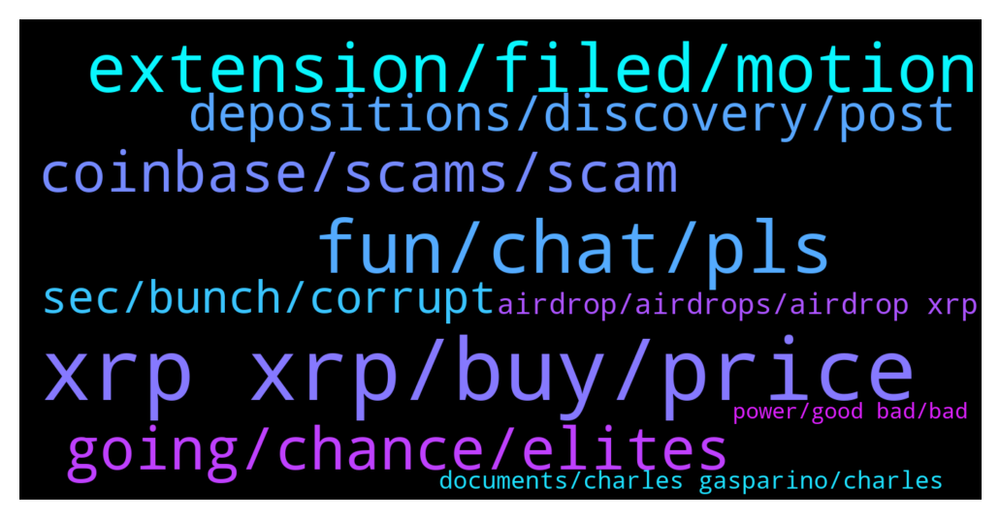

# **@Ripple**
 ## Analysis for **2022-01-12** - **2022-01-13**.

---

## 📊 **Basic Stats**

**n_messages_sent**: 195

---

---

## 🔝 **Top keywords and related messages**

1. **xrp xrp, buy, price**

    @syzzzxrp --- *I sold my car, jewellery and condo for XRP.* **--->** [TG Discussion](https://t.me/Ripple/3038944)

    @fmtrealestate --- *Have 7k before, sold it to buy other coin* **--->** [TG Discussion](https://t.me/Ripple/3038936)

    @ibrahimda35 --- *I was about to sell my xrp for etherum* **--->** [TG Discussion](https://t.me/Ripple/3038839)

    @richcryto --- *I’ve sold my Ethereum for Xrp today .* **--->** [TG Discussion](https://t.me/Ripple/3038832)

    @Milo992 --- *But how it's connected to xrp* **--->** [TG Discussion](https://t.me/Ripple/3039043)

    @Milo992 --- *Yes, so xrp it's good to free people or not* **--->** [TG Discussion](https://t.me/Ripple/3039047)

2. **fun, chat, pls**

    @specialpatrolgroup --- *Lucky I don’t either ! 😹* **--->** [TG Discussion](https://t.me/Ripple/3038907)

    @JesusJames --- *Haha he is in Xlm chat now and no one to global over there* **--->** [TG Discussion](https://t.me/Ripple/3038909)

    @specialpatrolgroup --- *To meet the groups rules. Sort it pls* **--->** [TG Discussion](https://t.me/Ripple/3038982)

    @H_idden_b --- *What do you want with my profile image* **--->** [TG Discussion](https://t.me/Ripple/3038978)

    @Lacike --- *Hmmm maybe they are friend now 😂😂😂😂😂* **--->** [TG Discussion](https://t.me/Ripple/3039274)

    @Blooper1 --- *It's been fun this group doesn't do anything for me enjoy I'm out* **--->** [TG Discussion](https://t.me/Ripple/3039497)

3. **extension, filed, motion**

    @GULUacityinUganda --- *jeremy hogan reckoned it was filed jointly by both parties (they agreed to the extension)* **--->** [TG Discussion](https://t.me/Ripple/3039074)

    @EML1993 --- *Relax, a motion to extend discovery is allegedly going to be filed according to the reporter. It’s not clear who will file the motion.  Is it the sec, or ripple, or both of them? And assuming they file the motion, the judge still needs to rule whether or not to grant the motion to extend. At any rate, let’s wait and see if a motion to extend is really going to be filed at all.* **--->** [TG Discussion](https://t.me/Ripple/3039066)

    @EML1993 --- *Yes, he is of the view that it will be filed jointly but not yet certain. We have to wait and see if a motion is indeed going to be filed at all.* **--->** [TG Discussion](https://t.me/Ripple/3039075)

    @jarilitmanen1 --- *Have they officially announced an extension.* **--->** [TG Discussion](https://t.me/Ripple/3039116)

    @EML1993 --- *At least they agreed also that the extension, if granted, will not “impact any other deadline in the case.”* **--->** [TG Discussion](https://t.me/Ripple/3039178)

    @Voltaire123 --- *True it is extended. Oh boy i dont like it* **--->** [TG Discussion](https://t.me/Ripple/3039359)

4. **going, chance, elites**

    @Nico --- *I hope so we do our best in Holland💪 peace brother* **--->** [TG Discussion](https://t.me/Ripple/3039039)

    @Riiggo --- *The elites will get taken down 😉* **--->** [TG Discussion](https://t.me/Ripple/3039038)

    @Rami --- *I'm worried about where I'm going* **--->** [TG Discussion](https://t.me/Ripple/3039624)

    @Josefa29 --- *No .... I do not know. Do they come lower?* **--->** [TG Discussion](https://t.me/Ripple/3039029)

    @Nico --- *Yeah men so would we be happy when we are the only millionaires and still the elites on top?* **--->** [TG Discussion](https://t.me/Ripple/3039037)

    @Nico --- *Patience my friend, you know economic collapse is coming ?* **--->** [TG Discussion](https://t.me/Ripple/3039028)

5. **coinbase, scams, scam**

    @Jake_ripple_XRP --- *I've only heard good things about Coinbase... and Coinbase Pro... only that fees are high... but they seem trustworthy... IMO* **--->** [TG Discussion](https://t.me/Ripple/3039397)

    @DeltaOMI --- *Yes coinbase have a history of being scammers they are us government in diguise* **--->** [TG Discussion](https://t.me/Ripple/3039386)

    @DeltaOMI --- *No they are scammers dont use them* **--->** [TG Discussion](https://t.me/Ripple/3039382)

    @specialpatrolgroup --- *Me too! Good scam idea… I am in desperate need of feeding my 15 cats left to me from my dying mama. Please sir send crypto so the gods bless you and your mighty offspring.* **--->** [TG Discussion](https://t.me/Ripple/3038915)

    @specialpatrolgroup --- *You posted a scam link (you are lucky you are not banned for it). You fell for a scam - users here are warned if it constantly. Do not post links to scams.* **--->** [TG Discussion](https://t.me/Ripple/3038900)

    @specialpatrolgroup --- *There was none. Only scams claim this.* **--->** [TG Discussion](https://t.me/Ripple/3038862)

6. **depositions, discovery, post**

    @DeltaOMI --- *They have fake people on twitter* **--->** [TG Discussion](https://t.me/Ripple/3039451)

    @JustNNM --- *If the depositions cannot be finished on time what do we expect. Remember fact discovery could bring in key elements in these depositions.* **--->** [TG Discussion](https://t.me/Ripple/3039233)

    @jarilitmanen1 --- *It’s only officially when John deaton Tweets it.  Don’t trust anyone else* **--->** [TG Discussion](https://t.me/Ripple/3039198)

    @JustNNM --- *No, there is nothing official at all. We dont even know if the “source story” is anything but a rumor at the moment.* **--->** [TG Discussion](https://t.me/Ripple/3039121)

    @Ambivert_Brenyah --- *This is horrible news really. Expert discovery started when? September?!* **--->** [TG Discussion](https://t.me/Ripple/3039014)

    @GULUacityinUganda --- *That is true. We will find out more soon* **--->** [TG Discussion](https://t.me/Ripple/3039076)

7. **sec, bunch, corrupt**

    @Jake_ripple_XRP --- *If those SEC internal memos are allowed in court... I would anticipate a move to work toward a settlement of some sort... IMO* **--->** [TG Discussion](https://t.me/Ripple/3039417)

    @ShaLtran --- *Both parties agreed to this, so it's not only the SEC.* **--->** [TG Discussion](https://t.me/Ripple/3039273)

    @Lacike --- *I Can t comment this,,,because of covid what a fu,,,,,,,, ,,,,,,, the sec is* **--->** [TG Discussion](https://t.me/Ripple/3039263)

    @Ogbuka Peter --- *This is only sec not both?* **--->** [TG Discussion](https://t.me/Ripple/3039190)

    @tilizs --- *Sec are a bunch of corrupt clowns. Half of them hold or have held xrp. Make it make sense. This is all fixed.* **--->** [TG Discussion](https://t.me/Ripple/3039345)

    @Sanbanc --- *what a corrupt bunch @#$%^&*   they are fucking  SEC* **--->** [TG Discussion](https://t.me/Ripple/3039070)

8. **airdrop, airdrops, airdrop xrp**

    @gandalftasaray --- *Guys it’s not possible to be eligible for the $solo airdrop If I had my xrp into nexo during snapshot? 🙈 i had a lot but wrong place…* **--->** [TG Discussion](https://t.me/Ripple/3039107)

    @leo_o_nardis --- *hello, do you know when we will receive the coins from this last airdrop we had from xrp?  thanks* **--->** [TG Discussion](https://t.me/Ripple/3038842)

    @CryBdo --- *Hi people, where can we ask questions about future xrp airdrops?* **--->** [TG Discussion](https://t.me/Ripple/3039102)

    @Tinkabellagal --- *On twitter or the telegram airdrop group Xrpl airdrops* **--->** [TG Discussion](https://t.me/Ripple/3039105)

    @CryBdo --- *The airdrop on the 15th of this month, for example.* **--->** [TG Discussion](https://t.me/Ripple/3039104)

    @zzzaaarrrrrrrrrrrrr --- *have you seen this SOLO airdrop ratio? 0.005, what a pathetic joke* **--->** [TG Discussion](https://t.me/Ripple/3039095)

9. **documents, charles gasparino, charles**

    @Tinkabellagal --- *The Only Official Ripple YouTube Channel  https://m.youtube.com/c/Ripplepay/videos* **--->** [TG Discussion](https://t.me/Ripple/3039113)

    @EML1993 --- *In other words a favorable ruling for Ripple/Xrp is expected this week. At least regarding the DPP (Deliberative Process Privilege).* **--->** [TG Discussion](https://t.me/Ripple/3039374)

    @EML1993 --- *The odds that Ripple will get most of those internal documents from Sec are 9 out of 10- Jeremy Hogan.* **--->** [TG Discussion](https://t.me/Ripple/3039371)

    @EML1993 --- *SCOOP: ……Ripple believes judge this week could rule on its motion to get internal SEC documents re the commission's discussions of #XRP- Charles Gasparino* **--->** [TG Discussion](https://t.me/Ripple/3039364)

    @EML1993 --- *BREAKING: Ripple's legal team sees value in the covid-related delay of the SEC's #XRP case. They want to grill witnesses for the entire 7-hour deposition limit in person as opposed to via zoom, where it's less effective. More details at 345pm w LizClaman on FoxBusiness- Charles Gasparino.* **--->** [TG Discussion](https://t.me/Ripple/3039362)

    @EML1993 --- *In other news Ripple CEO Brad Garlinghouse has hit the coveted 589k followers in Twitter. Lol.* **--->** [TG Discussion](https://t.me/Ripple/3039422)

10. **power, good bad, bad**

    @Tinkabellagal --- *Sorry to hear that Discussion in @SOLOGENICxGoSOLO* **--->** [TG Discussion](https://t.me/Ripple/3039109)

    @Riiggo --- *Depends who is in power that how it will be used can be good can be bad for us.......only time will tell* **--->** [TG Discussion](https://t.me/Ripple/3039050)

    @Riiggo --- *There plan is to divide the people because as one we are the power* **--->** [TG Discussion](https://t.me/Ripple/3039044)

    @Nico --- *Yeah I know one world order, but as free people we cant fall* **--->** [TG Discussion](https://t.me/Ripple/3039041)

    @Petjuuuh --- *Heres 10 good reasons for me its olso 1 to 10 reasons good to bad* **--->** [TG Discussion](https://t.me/Ripple/3038868)

    @Aleks_xArtx --- *Why we still not grow like others?* **--->** [TG Discussion](https://t.me/Ripple/3038790)

