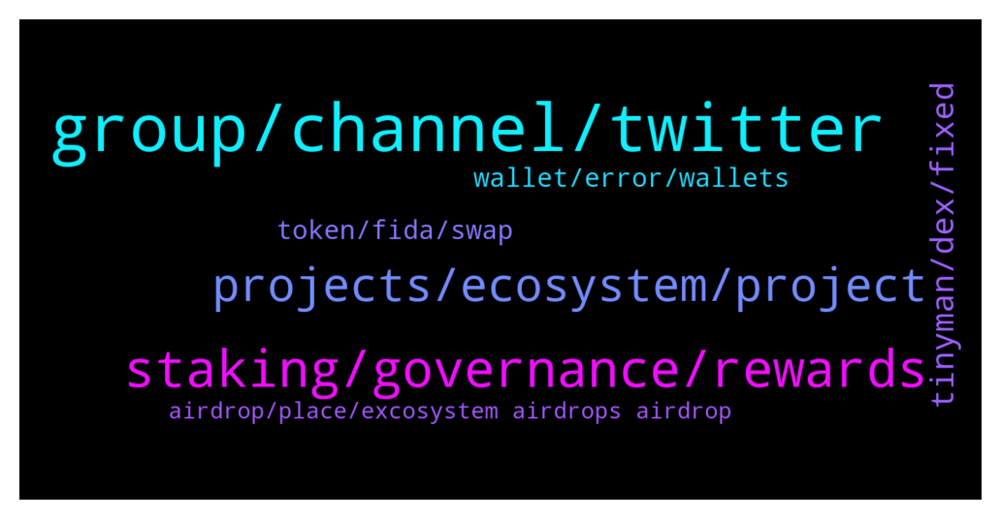

# **@algorand**
 ## Analysis for **2022-01-12** - **2022-01-13**.

---

## 📊 **Basic Stats**

**n_messages_sent**: 211

---

---

## 🔝 **Top keywords and related messages**

1. **group, channel, twitter**

    @teknomachine --- *it feels like this chat is populated by bots with pretty girls as profile but not much info discussed* **--->** [TG Discussion](https://t.me/algorand/331804)

    @gribabas999 --- *Girls with beautiful pics in group are financial  advisers who dm people? Sometimes asking for seed phrase? Am I getting it right?* **--->** [TG Discussion](https://t.me/algorand/332213)

    @Jewman --- *Is this the official algo group? There are so many* **--->** [TG Discussion](https://t.me/algorand/331831)

    @I-M-T --- *any other algorand group recommended? (price/trading?)* **--->** [TG Discussion](https://t.me/algorand/331935)

    @n --- *thanks! immediately got two impersonators of you dm me haha* **--->** [TG Discussion](https://t.me/algorand/332037)

    @Dillon Anna --- *Who can tell me what group this is* **--->** [TG Discussion](https://t.me/algorand/332067)

2. **staking, governance, rewards**

    @iamaturtle123 --- *Hi guys, programmer here new to the Blockchain. I am thinking of creating a tax preparation app for yieldly where I put in an address and it spits out a list of interactions with the yieldly staking app along with the price of yieldly on the day of the transaction. My question is how should I query the blockchain? It looks like the algo explorer api would do what I want, but I also see that is deprecated and frowned upon. Would I have to run my own algo node to do this, or is there another api I should use?* **--->** [TG Discussion](https://t.me/algorand/332161)

    @NightAlgorand --- *Are you refer to the participation rewards? it was changed for the governance reward. https://algorand.foundation/news/algorand-governance-rewards-period-2 for more information* **--->** [TG Discussion](https://t.me/algorand/331847)

    @abovyanv --- *isn't it weird for you that someone made some decisions for you and giving to you options A and B for voting. And this is freedom and Decentralization?  Does this remind you of politics, where we have two presidential candidates and we need to choose one of them... think about it* **--->** [TG Discussion](https://t.me/algorand/331943)

    @max219912 --- *Hey can anyone tell me where to store algo for staking ?* **--->** [TG Discussion](https://t.me/algorand/331930)

    @NightAlgorand --- *I believe you are talking governance? We have just released our Governance period 2. It will finish on Feb. Check out the details here https://algorand.foundation/news/algorand-governance-rewards-period-2* **--->** [TG Discussion](https://t.me/algorand/331841)

    @MackDenver --- *Hey R,  Yes, the staking rewards has dropped. Check it out here: https://algoexplorer.io/rewards-calculator* **--->** [TG Discussion](https://t.me/algorand/332191)

3. **projects, ecosystem, project**

    @teknomachine --- *this are use cases, I asked if is there any project implementing Algorand* **--->** [TG Discussion](https://t.me/algorand/331812)

    @Kytelegramm --- *What are the defi projects running on algorand so far* **--->** [TG Discussion](https://t.me/algorand/332246)

    @NightAlgorand --- *check out this link for all project built on Algorand https://www.algorand.com/ecosystem/use-cases* **--->** [TG Discussion](https://t.me/algorand/331811)

    @NightAlgorand --- *You can check out https://www.algorand.com/ecosystem on the projects on Algorand* **--->** [TG Discussion](https://t.me/algorand/331805)

    @teknomachine --- *are there any project on Algorand?* **--->** [TG Discussion](https://t.me/algorand/331803)

    @patrick_crypto --- *of course - TONS of projects - good grief man -  you didn’t even click on the link - clearly. here’s another site that points to various projects... https://1circle.io/en/ecosystem-overview/* **--->** [TG Discussion](https://t.me/algorand/331816)

4. **tinyman, dex, fixed**

    @MackDenver --- *Tinyman is currently in the repair phase. You will need to wait for it to be fixed* **--->** [TG Discussion](https://t.me/algorand/332009)

    @jason11169 --- *what dexes can we use on algo now tinyman has no liquidity?* **--->** [TG Discussion](https://t.me/algorand/332283)

    @noxx88 --- *Hi is there an alternstive to tinymam as its down at the moment?* **--->** [TG Discussion](https://t.me/algorand/332124)

    @Nibba --- *Is There any Dex On Algorand otherthan Tinyman???* **--->** [TG Discussion](https://t.me/algorand/331982)

    @MackDenver --- *There is Timyman however, Tinyman is currently in the repair phase. You will need to wait for it to be fixed. A few other DEXs are already in the works* **--->** [TG Discussion](https://t.me/algorand/332046)

    @MackDenver --- *Other DEXes are being worked on and will be live soon.* **--->** [TG Discussion](https://t.me/algorand/331983)

5. **token, fida, swap**

    @noxx88 --- *wtf so my tokens are blocked* **--->** [TG Discussion](https://t.me/algorand/332129)

    @splatter --- *I want it a link where to swap my Algorand token* **--->** [TG Discussion](https://t.me/algorand/332008)

    @NightAlgorand --- *Hi there 🙂 We have not released any plan of burning tokens yet.* **--->** [TG Discussion](https://t.me/algorand/332181)

    @splatter --- *Painful where can I swap my Akita inu token* **--->** [TG Discussion](https://t.me/algorand/332020)

    @splatter --- *Yes I have it but is not working I thought my token is gone* **--->** [TG Discussion](https://t.me/algorand/332010)

    @Luzz41 --- *You can check out the swapper on algo world explorer if you want to swap ASA for ASA* **--->** [TG Discussion](https://t.me/algorand/332135)

6. **wallet, error, wallets**

    @MackDenver --- *Hey @MMulder432, I'm not sure about it but its Algorand is decentralized anyone can create wallets at anytime.* **--->** [TG Discussion](https://t.me/algorand/331950)

    @NightAlgorand --- *Hi there 🙂 Yes, currently is 0.67% And we don't have an official recommendation other than Algo Wallet 🙂* **--->** [TG Discussion](https://t.me/algorand/332142)

    @NightAlgorand --- *Please check your wallet, the distribution should be until Jan 5* **--->** [TG Discussion](https://t.me/algorand/332311)

    @NightAlgorand --- *The wallet is in Algorand network 🙂* **--->** [TG Discussion](https://t.me/algorand/332166)

    @splatter --- *Asking me to connect my wallet* **--->** [TG Discussion](https://t.me/algorand/332018)

    @MackDenver --- *If I get any new info about these wallets, I will share it with you.* **--->** [TG Discussion](https://t.me/algorand/331953)

7. **airdrop, place, excosystem airdrops airdrop**

    @exploreBlock --- *Hi community, I m a Algo hodler .. I would like to know where can find the information related to Algo excosystem airdrops* **--->** [TG Discussion](https://t.me/algorand/332103)

    @Paulmoses7 --- *Is there any airdrop going on or coming up?* **--->** [TG Discussion](https://t.me/algorand/332056)

    @MackDenver --- *This is not the right place to talk about BTT airdrop.* **--->** [TG Discussion](https://t.me/algorand/332272)

    @mcmaxims --- *You can have a chance for an airdrop if you apply (and get selected) as an early Algoverse testnet User for the upcoming marketplace/dex* **--->** [TG Discussion](https://t.me/algorand/332107)

    @NightAlgorand --- *There is no exact one place to learn about airdrop but you can speak to all the project in their own socials to find out.* **--->** [TG Discussion](https://t.me/algorand/332106)

    @NightAlgorand --- *There is no airdrop running currently, if there is any new campaigns, we would let you guys know via announcement* **--->** [TG Discussion](https://t.me/algorand/332059)

