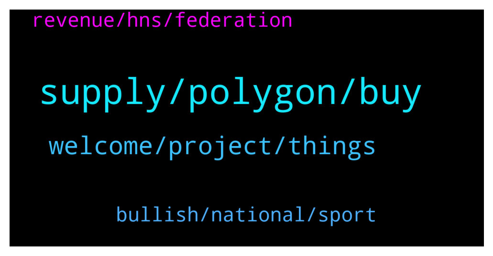

# **@ampnetapxchat**
 ## Analysis for **2022-01-08** - **2022-01-13**.

---

## 📊 **Basic Stats**

**n_messages_sent**: 139

---

---

## 🔝 **Top keywords and related messages**

1. **supply, polygon, buy**

    @<UNK> --- *This is due to the fact that AAPX unlocks linearly and sites like CMC or CoinGecko have "unlock date" which we cannot use, cuz appx is unlocking every moment instead of a set date  But anyone can check circ. supply/max supply here -  https://claim.ampnet.io/app/dist/index.html* **--->** [TG Discussion](https://t.me/ampnetapxchat/36149)

    @North --- *I really hope so. There are no details on how it benefits AAPX holders yet though which is unfortunate, but at least we have a great partner and some exposure now* **--->** [TG Discussion](https://t.me/ampnetapxchat/36339)

    @<UNK> --- *Sorry that was automatic, use this link to claim tokens 😅 https://claim.ampnet.io/app/dist/index.html* **--->** [TG Discussion](https://t.me/ampnetapxchat/36172)

    @<UNK> --- *Hey @MarcusVieiraCosta, yes there will be, just fill up this form and you'll be compensated   https://docs.google.com/forms/d/e/1FAIpQLSf4GCX62RAfb0oZvGNPzNynTdHFlvoIw9KZqA0o1VOkEwG_Kw/viewform* **--->** [TG Discussion](https://t.me/ampnetapxchat/36133)

    @whimofnature --- *is it possible to set the circulating supply to the max supply? this would teleport AAPX from rank 13098 to ~770. it would be exposed to more people and when they realize the coin has only a market cap of <10M$ with this technology they will buy AAPX.* **--->** [TG Discussion](https://t.me/ampnetapxchat/36159)

    @Hydayashi --- *Stop selling people...let it grow. This guys will make it in the end. Mark my words.* **--->** [TG Discussion](https://t.me/ampnetapxchat/36294)

2. **welcome, project, things**

    @mislavjavor --- *Yes - details still being panned out, don’t want to rush with announcement* **--->** [TG Discussion](https://t.me/ampnetapxchat/36388)

    @matejmz --- *@IncogSen you might like this too 😆* **--->** [TG Discussion](https://t.me/ampnetapxchat/36219)

    @Troop --- *Hi @jakovtradingmentor! Thanks for taking care of us! Welcome! 😊* **--->** [TG Discussion](https://t.me/ampnetapxchat/36423)

    @tradingjo98 --- *Maybe you wanna tell us some things about you?* **--->** [TG Discussion](https://t.me/ampnetapxchat/36422)

    @tradingjo98 --- *let‘s wait for the AMA :)* **--->** [TG Discussion](https://t.me/ampnetapxchat/36344)

    @Hydayashi --- *We are all ears and eyes 😁* **--->** [TG Discussion](https://t.me/ampnetapxchat/36273)

3. **bullish, national, sport**

    @tradingjo98 --- *partnership with a national football team, oh god this must be kinda bullish* **--->** [TG Discussion](https://t.me/ampnetapxchat/36338)

    @mislavjavor --- *Yes - players will directly marekt* **--->** [TG Discussion](https://t.me/ampnetapxchat/36385)

    @Cy --- *Great... but could you say The Croatian National Selection :D That would be a lot clearer for non croatians ˆˆˆ* **--->** [TG Discussion](https://t.me/ampnetapxchat/36304)

    @matejmz --- *It could be also e-sport 😅* **--->** [TG Discussion](https://t.me/ampnetapxchat/36098)

    @AvanaLu --- *Hey mate, congrats. How easy is it for a football club to create their fan/loyalty token on AMPnet? I know many clubs are exploring possibilities.* **--->** [TG Discussion](https://t.me/ampnetapxchat/36397)

    @mislavjavor --- *The idea is to be the better version of this - but also extend it beyond sports teams.* **--->** [TG Discussion](https://t.me/ampnetapxchat/36396)

4. **revenue, hns, federation**

    @mislavjavor --- *If you culd clarify what you mean by sharing revenue I could elaborate. AMPnet charges a fee to all its clients, that is our revenue model, the fee is used to buyback aapx tokens and put them to the treasury* **--->** [TG Discussion](https://t.me/ampnetapxchat/36380)

    @Cy --- *what will Biznisport do in this partnership ? I believe they were already involved on previous deals with ampnet.* **--->** [TG Discussion](https://t.me/ampnetapxchat/36377)

    @mislavjavor --- *When there is a chargeable event on AMPnet* **--->** [TG Discussion](https://t.me/ampnetapxchat/36374)

    @mislavjavor --- *As always, there will be buybacks - the revenue for those, however, will not be coming only from the successfull collection of funds to the campaign, but also continuously - since AMPnet has several other fees included in the loyalty token business model. As for visibility - AMPnet has been assigned as the main sponsor for the HNS-CFF season and will be featured prominently on all football federation materials.* **--->** [TG Discussion](https://t.me/ampnetapxchat/36371)

    @Cy --- *how long will the partnership last ? (visuals on HNS materials) ? Does it have a cost for Ampnet ? Is it linked to any restrictions ?* **--->** [TG Discussion](https://t.me/ampnetapxchat/36390)

    @North --- *Ok but how do AAPX holders benefit from the VATRENI token use of the AmpNet protocol? Do we share in the revenues or is this only recognised through buybacks?* **--->** [TG Discussion](https://t.me/ampnetapxchat/36378)

