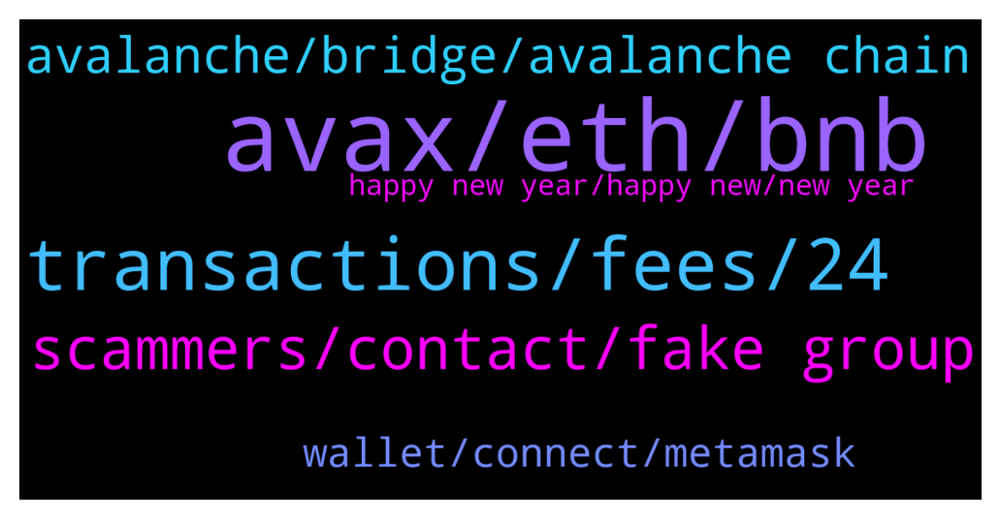

# **@avalancheavax**
 ## Analysis for **2022-01-12** - **2022-01-13**.

---

## 📊 **Basic Stats**

**n_messages_sent**: 158

---

---

## 🔝 **Top keywords and related messages**

1. **avax, eth, bnb**

    @AlmanT10 --- *ETH is gone from the ETH side no record on the AVAX side* **--->** [TG Discussion](https://t.me/avalancheavax/321972)

    @Bluevicky --- *Pleaze admin does avax has an app* **--->** [TG Discussion](https://t.me/avalancheavax/322067)

    @Nicolas_A --- *You select Avax as output currency* **--->** [TG Discussion](https://t.me/avalancheavax/321919)

    @AlmanT10 --- *ETH to Avax Via  bridge.avax.network* **--->** [TG Discussion](https://t.me/avalancheavax/321970)

    @oathtobarbatos --- *Use a DEX (Trader Joe, for example) they allow you to trade BNB to AVAX directly* **--->** [TG Discussion](https://t.me/avalancheavax/321986)

    @Arunabha --- *Can Anyone help? transferred 0.39AVAX from binance to metamask and set Metamask in avax network also. Its showing value in Etherium when avax network is chosen i.e.  0.39ETH  and avax zero.* **--->** [TG Discussion](https://t.me/avalancheavax/322018)

2. **transactions, fees, 24**

    @alexbwork --- *Maybe make sense but I'm not very experienced how it works but how the poly or other blockchains works with those fees ?* **--->** [TG Discussion](https://t.me/avalancheavax/321703)

    @JimWelder --- *Solana seems like it has faster transaction times 2000tps https://solanabeach.io/ vs avascan reporting 8tps.* **--->** [TG Discussion](https://t.me/avalancheavax/321821)

    @JimWelder --- *Shouldn't it be the same? Shouldn't they have 2000tps on avg for a 24 hr period?* **--->** [TG Discussion](https://t.me/avalancheavax/321891)

    @JimWelder --- *That's makes sense to me, how does avalanche get to 2000tps in tests is this a fully bottlenecked system?* **--->** [TG Discussion](https://t.me/avalancheavax/321900)

    @alexbwork --- *Are AVAX team planning to make fees in future like 0.0001$ or so at poly, aurora  ?* **--->** [TG Discussion](https://t.me/avalancheavax/321698)

    @Nicolas_A --- *You simulate a load of 2000 transactions per second. It did 4500 TPS a few years ago in test. Would probably be more today with better code. Figures were for the X chain also* **--->** [TG Discussion](https://t.me/avalancheavax/321903)

3. **scammers, contact, fake group**

    @jenkk --- *Will you just ignore the scammers make a fake group and pretend they are you and run an airdrop there?* **--->** [TG Discussion](https://t.me/avalancheavax/321997)

    @oathtobarbatos --- *Yes. It's a scam, be careful with that. Report it if possible!* **--->** [TG Discussion](https://t.me/avalancheavax/321731)

    @Droogiz --- *Hello the other Avalanche (Avax) -Official group is a Fake group? Is a Scam?* **--->** [TG Discussion](https://t.me/avalancheavax/321729)

    @Reza_DAOLaunch --- *are you still giving away grants?* **--->** [TG Discussion](https://t.me/avalancheavax/321877)

    @G --- *Idk why you guys just let the scammer run a community under the same name* **--->** [TG Discussion](https://t.me/avalancheavax/321947)

    @TroubaDroid --- *A person can goto settings and disable anyone being able to add you to scamgroups.* **--->** [TG Discussion](https://t.me/avalancheavax/322003)

4. **avalanche, bridge, avalanche chain**

    @PatrickSutton --- *ICYMI - John Wu talked Avalanche and the Avalanche Bridge's success on Bloomberg TV yesterday following a JP Morgan report on 2022 being the year of blockchain bridges. Check it out:  https://twitter.com/_PatrickSutton/status/1481283041381302272?s=20* **--->** [TG Discussion](https://t.me/avalancheavax/321902)

    @Khyathi_Jinka --- *Hey i want to list my token on the exchange which supports avalanche can any one provide me the list* **--->** [TG Discussion](https://t.me/avalancheavax/321874)

    @Nicolas_A --- *You bridge the WETH to Avalanche* **--->** [TG Discussion](https://t.me/avalancheavax/321978)

    @Xrpshiller --- *Hey guys looking for advice.  I mistakenly sent CRV to a SPELL contract on the Avalanche chain. Is there any way to get it back?* **--->** [TG Discussion](https://t.me/avalancheavax/321714)

    @BinanceApe --- *Is there an alt coin group (reliable) where people discuss avalanche projects?* **--->** [TG Discussion](https://t.me/avalancheavax/322006)

    @Matt2367 --- *anybody know where i can get the contract address for bnb on avalanche chain?* **--->** [TG Discussion](https://t.me/avalancheavax/321985)

5. **wallet, connect, metamask**

    @Dante --- *Hello Is there an admin in this group . My swap from metamask still pending for a while.* **--->** [TG Discussion](https://t.me/avalancheavax/321940)

    @The1Truth --- *was looking for that address bc its not popping up in my metmak* **--->** [TG Discussion](https://t.me/avalancheavax/321922)

    @Astron --- *checked the website and left. As ı remember website asked for wallet connect but ı commected with empty wallet so ı guess it is okey right?* **--->** [TG Discussion](https://t.me/avalancheavax/321811)

    @oathtobarbatos --- *Restart your Metamask account (It won't change your balance)* **--->** [TG Discussion](https://t.me/avalancheavax/322021)

    @nobodyinthere --- *Link? No need to connect wallet in test version, right?* **--->** [TG Discussion](https://t.me/avalancheavax/321766)

    @Nicolas_A --- *Try to reset it: Metamask settings > advanced > reset* **--->** [TG Discussion](https://t.me/avalancheavax/321945)

6. **happy new year, happy new, new year**

    @Nicolas_A --- *Happy new year :) What's the lgo ?* **--->** [TG Discussion](https://t.me/avalancheavax/321883)

    @PatrickSutton --- *At this point, we're closer than anyone else 🙂* **--->** [TG Discussion](https://t.me/avalancheavax/321905)

    @Ninjagaiden19 --- *Happy new year mate and everyone else.* **--->** [TG Discussion](https://t.me/avalancheavax/321882)

    @offorjp --- *There's a job to be done  😂😂😂* **--->** [TG Discussion](https://t.me/avalancheavax/321756)

    @scottishlion22 --- *Evening all, happy new year from Scotland, could you please point me in the direction of the head devs pls?* **--->** [TG Discussion](https://t.me/avalancheavax/321754)

