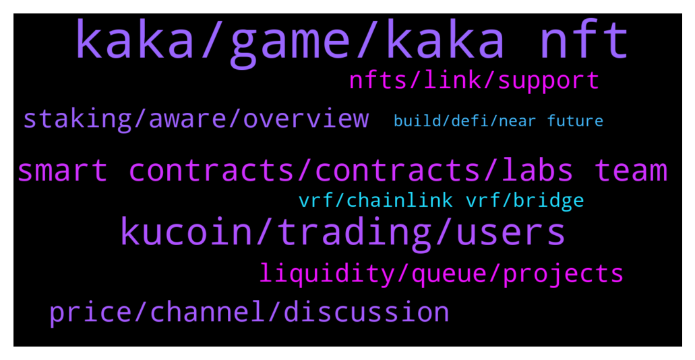

# **@chainlinkofficial**
 ## Analysis for **2022-01-12** - **2022-01-13**.

---

## 📊 **Basic Stats**

**n_messages_sent**: 212

---

---

## 🔝 **Top keywords and related messages**

1. **kaka, game, kaka nft**

    @Linkederic --- *What specifically are you interested in?* **--->** [TG Discussion](https://t.me/chainlinkofficial/363156)

    @Joypokkamol --- *Hi everyone, please be ready in 20 minutes! https://twitter.com/sojoypokkamol/status/1480568837611433987?s=20* **--->** [TG Discussion](https://t.me/chainlinkofficial/363398)

    @Joypokkamol --- *Hi everyone, please be ready in 10 minutes! https://twitter.com/sojoypokkamol/status/1480843681930305536?s=20* **--->** [TG Discussion](https://t.me/chainlinkofficial/363969)

    @Bruce_OpenSwap --- *Thank you again for having me here today, and we look forward to seeing you guys in our community!* **--->** [TG Discussion](https://t.me/chainlinkofficial/364046)

    @Joypokkamol --- *Let’s go into an exciting part…* **--->** [TG Discussion](https://t.me/chainlinkofficial/363450)

    @kakanft001 --- *Feel free to ask me anything about KAKA!☺️* **--->** [TG Discussion](https://t.me/chainlinkofficial/363466)

2. **kucoin, trading, users**

    @marcromeron --- *Our Community want to know about the near future of Kucoin. What’s next on your KuCoin’s roadmap?* **--->** [TG Discussion](https://t.me/chainlinkofficial/363886)

    @Johnny_LYU_KuCoin --- *As the number of KuCoin users keep surging, our trading demand also grows at a exponential speed. Therefore, KuCoin needs a high-quality price reference data to our P2P markets, and we chose Chainlink Price Feeds as a perfect data solution. The partnership with Chainlink, the industry-leading decentralized oracle network, will empower us to access accurate and tamper-proof exchange rates between various fiat currencies and cryptocurrencies. At the same time, our users can trade more confidently and securely at KuCoin under market volatilities. We have first introduced INR/USD and USDT/USD Chainlink Price Feeds, and more will be introduced in the future, please stay tuned.* **--->** [TG Discussion](https://t.me/chainlinkofficial/363867)

    @Johnny_LYU_KuCoin --- *KuCoin is a world-leading crypto exchange launched in September 2017. Today, it has become a top 5 global exchange with a diversified category of crypto products, covering Spot trading, Margin trading, P2P fiat trading, Futures trading, Staking, and Lending services, etc.* **--->** [TG Discussion](https://t.me/chainlinkofficial/363846)

    @Johnny_LYU_KuCoin --- *In 2021, Forbes Advisor named KuCoin as one of the Best Crypto Exchanges, and our platform recently exceeded 10 Million users under exponential growth over the course of the year. 2021 is a great year for KuCoin and all KuCoin users.* **--->** [TG Discussion](https://t.me/chainlinkofficial/363849)

    @Johnny_LYU_KuCoin --- *KuCoin Trading Bot, one of our most popular products among global users, is another free-to-use trading tool to help investors gain profits. They automatically execute trading strategies based on pre-set parameters. KuCoin now supports 5 trading bot strategies: Infinity Grid, Spot Grid, DCA, Futures Grid, and Smart Rebalance. If you have never created one before, you can choose to simply copy others’ settings to try out first. Over 4 million KuCoin bots have been created. To better understand, we have attached the profit ranking list below, as you can see, the top user has achieved 9,874.34% profit in return.* **--->** [TG Discussion](https://t.me/chainlinkofficial/363880)

    @Johnny_LYU_KuCoin --- *Great question! As KuCoiners know, KuCoin is also called ‘People’s Exchange’. We provide diversified products and trading options for all levels of crypto investors. Sometimes, we also make the trading tools entertaining and interactive, like a game.* **--->** [TG Discussion](https://t.me/chainlinkofficial/363873)

3. **smart contracts, contracts, labs team**

    @BrapreetLadysMan --- *Gm all chainlink family hope ur staying well from omnicrom* **--->** [TG Discussion](https://t.me/chainlinkofficial/363613)

    @Rahi2002 --- *hi can i get chainlink roadmap* **--->** [TG Discussion](https://t.me/chainlinkofficial/363909)

    @marcromeron --- *Chainlink is a decentralized network of oracles that enables smart contracts to securely interact with real-world data and services that exist outside of blockchain networks. We're not a Parachain.* **--->** [TG Discussion](https://t.me/chainlinkofficial/363936)

    @BlazeBRT --- *Is chainlink going for polkadot auction* **--->** [TG Discussion](https://t.me/chainlinkofficial/363934)

    @marcromeron --- *Thanks for your trust in Chainlink.* **--->** [TG Discussion](https://t.me/chainlinkofficial/363870)

    @BlazeBRT --- *I know you are not parachain i am just asking because on dotmarketcap in project announcement section there's chainlink also present* **--->** [TG Discussion](https://t.me/chainlinkofficial/363940)

4. **price, channel, discussion**

    @ibdemir --- *If ask you why the price is same with the level of BTC 40k and 43.6k, it is understandable. But I am not asking. I am just talking about what is the reason. I am asking, any delayed things on the road map? Today any bad news are you heard. I am asking this.* **--->** [TG Discussion](https://t.me/chainlinkofficial/363532)

    @Linkederic --- *Any speculation on price movements in any capacity is prohibited. If you're interested in current news relating to Chainlink, check out Twitter.com/chainlink and the community operated news site http://chainlinktoday.com/* **--->** [TG Discussion](https://t.me/chainlinkofficial/363531)

    @Ölüsü 16cm --- *Hi. Is there any price channel ?* **--->** [TG Discussion](https://t.me/chainlinkofficial/363384)

    @Linkederic --- *Price discussion is not permitted in this channel* **--->** [TG Discussion](https://t.me/chainlinkofficial/363924)

    @Linkederic --- *The premium price, market, and trading discussion is prohibited in this channel* **--->** [TG Discussion](https://t.me/chainlinkofficial/363158)

    @PolivodaTatiana --- *No price discussions allowed in this channel* **--->** [TG Discussion](https://t.me/chainlinkofficial/363757)

5. **staking, aware, overview**

    @Sylvarantt --- *You can find some groups by searching Telegram for "Chainlink Community" but be aware that they are not operated or endorsed by the Chainlink team or admins of this chat.* **--->** [TG Discussion](https://t.me/chainlinkofficial/363371)

    @camel_donuts --- *are there any decent responses to that medium blog re: issues with proposed chainlink staking* **--->** [TG Discussion](https://t.me/chainlinkofficial/363109)

    @Small Boy --- *Hi everyone! Is there merchant group of Link available? Thank you for your answer* **--->** [TG Discussion](https://t.me/chainlinkofficial/363366)

    @Kickthetrend --- *Is there any official platform to stake LINK?* **--->** [TG Discussion](https://t.me/chainlinkofficial/363925)

    @Linkederic --- *There were some tweet threads from notable community members ChainlinkGod and TheCryptoOracle as well which I found informative:  https://twitter.com/Crypto___Oracle/status/1389483937630621696?s=20* **--->** [TG Discussion](https://t.me/chainlinkofficial/363114)

    @Joypokkamol --- *You can find some groups by searching Telegram for "Chainlink Community" but be aware that they are not operated or endorsed by the Chainlink team or admins of this chat. Thank you for your understanding.* **--->** [TG Discussion](https://t.me/chainlinkofficial/363385)

6. **liquidity, queue, projects**

    @Abed --- *well, team expenses are redeemed by dumping link token on the market and there's no equal demand.* **--->** [TG Discussion](https://t.me/chainlinkofficial/363552)

    @Bruce_OpenSwap --- *In this day and age, they can either find VC’s capital, which is not super easy, or sell their project tokens, which is not exactly a good move for various reasons.   The OpenSwap Booster Queue is applicable for projects seeking to raise additional funding without the risk of market price impacts.* **--->** [TG Discussion](https://t.me/chainlinkofficial/364023)

    @Bruce_OpenSwap --- *And, of course, the (less exciting) Pegged Queue - Which is designed to allow projects to stabilize stablecoin with a target peg.* **--->** [TG Discussion](https://t.me/chainlinkofficial/364004)

    @Bruce_OpenSwap --- *5. Bond Marketplace - At OpenSwap, we also enable projects to take back control of their token liquidity with a LP purchase program by offering LP holders a discount on vested project tokens in exchange for LP tokens. By owning the LP tokens, the project teams can be rest assured that liquidity stays in the AMM pool, unlike traditional farming approaches where liquidity gets removed once the reward tokens dry up.* **--->** [TG Discussion](https://t.me/chainlinkofficial/363995)

    @Bruce_OpenSwap --- *4. Our fourth key offering is - Liquidity as a Service (LaaS). OpenSwap is building up a network of stablecoin partners to offer up liquidity as a service for early stage projects who often face the challenge of securing funds to provide the liquidity for their project tokens. By offering fixed yields for stablecoin holders, project teams would only be required to provide project tokens for the AMM pairs while stablecoin fixed yield seekers contribute the other side of the pair. This offering will enable projects to utilise their funds towards BUIDLing their projects.* **--->** [TG Discussion](https://t.me/chainlinkofficial/363994)

    @Bruce_OpenSwap --- *1. On-chain Private Sales Offering - which is a service enabled by our OpenSwap Booster Queue, a technology that allows projects to facilitate private sale rounds, and providing an end-to-end on-chain solution including token purchase, vesting schedules, and secondary market for vested tokens.   The OpenSwap Booster Queue is applicable for projects seeking additional funding without the risk of market price impacts. Projects may choose to whitelist the offering and offer guaranteed buybacks to participants to instill even more confidence in the project during unstable market conditions.* **--->** [TG Discussion](https://t.me/chainlinkofficial/363986)

7. **nfts, link, support**

    @Linkederic --- *Chainlink is not a blockchain, so you wouldn't launch an nft marketplace "on Chainlink"  Relevant articles: https://blog.chain.link/what-is-chainlink/  https://blog.chain.link/blockchains-oracles-similarities-differences-synergies/* **--->** [TG Discussion](https://t.me/chainlinkofficial/363163)

    @BilliCasper --- *Is getting nfts possible with chainlink* **--->** [TG Discussion](https://t.me/chainlinkofficial/363367)

    @CeeZ --- *Does the chainlink network support NFT's (soon(?))* **--->** [TG Discussion](https://t.me/chainlinkofficial/363143)

    @CeeZ --- *As eth nft market place, link marketplace? Link-xxx as erc-xxx ?  The smart contract allows nfts on eth. Will link support link-nft?* **--->** [TG Discussion](https://t.me/chainlinkofficial/363160)

    @Linkederic --- *That said, Chainlink can be used to generate NFTs that rely on external data, or even dynamic NFTs that update based on changing real world data! as in this https://twitter.com/Smart_Contract/status/1480727778496598021* **--->** [TG Discussion](https://t.me/chainlinkofficial/363164)

    @BrapreetLadysMan --- *About Chainlink NFT support I just remember the tweet from the Sports Ball player* **--->** [TG Discussion](https://t.me/chainlinkofficial/363154)

8. **vrf, chainlink vrf, bridge**

    @Joypokkamol --- *In just a few moments, we will have a Community Q&A with OpenSwap who recently announced that it integrates Chainlink VRF to Ensure Fair Randomness for OpenSwap’s Bridge Troll NFTs https://twitter.com/chainlink/status/1478352303832944651?s=20* **--->** [TG Discussion](https://t.me/chainlinkofficial/363971)

    @Joypokkamol --- *In just a few moments, we will have a Community Q&A with KAKA NFT World who recently announced that it integrates Chainlink VRF to power a fair and transparent gameplay https://kakanft.medium.com/kaka-nft-world-integrates-chainlink-vrf-to-power-a-fair-and-transparent-gameplay-4f304b88edca.* **--->** [TG Discussion](https://t.me/chainlinkofficial/363403)

    @Bruce_OpenSwap --- *After careful consideration, our team decided to go with Chainlink VRF because it is supported by your time-tested oracle infrastructures and secured through generation and on-chain verification of cryptographic proofs. With your VRF, our participants are provided with automated and publicly verifiable assurance  on-chain that our Bridge Trolls generated are truly random.* **--->** [TG Discussion](https://t.me/chainlinkofficial/364011)

    @kakanft001 --- *KAKA has integrated Chainlink Verifiable Random Function (VRF) on the Binance Smart Chain mainnet.* **--->** [TG Discussion](https://t.me/chainlinkofficial/363433)

    @Joypokkamol --- *It is fascinating to see KAKA NFT World Integrates Chainlink VRF* **--->** [TG Discussion](https://t.me/chainlinkofficial/363429)

    @kakanft001 --- *By integrating the industry-leading decentralized oracle network, we now have access to a tamper-proof and auditable source of randomness needed to generate results of all lucky draws that ensure the fairness of the gameplay in every event.* **--->** [TG Discussion](https://t.me/chainlinkofficial/363434)

9. **build, defi, near future**

    @Bruce_OpenSwap --- *In the near future, we will be dabbling into DeFi 2.0 in particular liquidity as a service (LaaS). Our first move would be our latest Booster Queue which we will be rolling out very soon. A big problem in the IDO space is that a project might run out of resources before they can finish the development of their potentially brilliant protocol.* **--->** [TG Discussion](https://t.me/chainlinkofficial/364022)

    @Bruce_OpenSwap --- *So yeah, we have a few things planned for as our upcoming milestones.   We are expanding to other chains to provide our services to DeFi users there. We are holding a governance poll deciding which chain we should deploy on next with the choices being Polygon, Fantom, and Avalanche. Regardless of the outcome, I’m sure it’s going to be exciting.* **--->** [TG Discussion](https://t.me/chainlinkofficial/364020)

    @Bruce_OpenSwap --- *On top of our base-layer technologies, our key offerings includes the following:-* **--->** [TG Discussion](https://t.me/chainlinkofficial/363985)

    @Bruce_OpenSwap --- *At the core, my team’s strength is technology, however, we’ve been aiming to build up a community of talent that crosses boundaries of technology, finance, marketing, and more through the many partnerships we have developed and continue to build. We hope to attract more developers and contributors to our team through participation events such as hackathons that ultimately build up the DeFi community.* **--->** [TG Discussion](https://t.me/chainlinkofficial/363975)

    @Joypokkamol --- *What’s next on your project’s roadmap that we may expect in the near future?* **--->** [TG Discussion](https://t.me/chainlinkofficial/364018)

