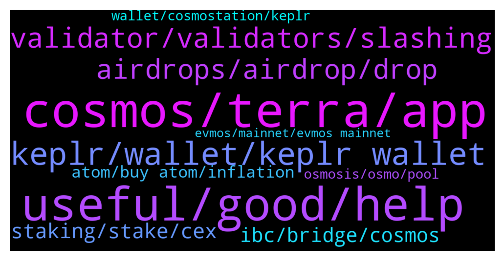

# **@cosmosproject**
 ## Analysis for **2022-01-12** - **2022-01-13**.

---

## 📊 **Basic Stats**

**n_messages_sent**: 497

---

---

## 🔝 **Top keywords and related messages**

1. **cosmos, terra, app**

    @Karokinex --- *Sorry on ledger wallet every token has an app to manage your address. With Luna you can have an address as part of Cosmos  and also on the Terra. So im able to have 2 address for luna one on cosmos the other on terra. SO i have some ust on the Terra address in cosmos and i have ot earning interest on anchor protocol. So today is not allowimg me to connect that address no more it allows me to view it but no transaction can be made only by connecting it. So when i try to connect the wallet is asking me for the terra app on ledger and not the cosmos which is the one i want to deal with.* **--->** [TG Discussion](https://t.me/cosmosproject/473294)

    @ZoltanAtom --- *You may check the whole cosmos app&services&tokens from Cosmos official website ;  https://cosmos.network/ecosystem/apps* **--->** [TG Discussion](https://t.me/cosmosproject/473133)

    @JCFishing --- *Why would you ask a cosmos public forum to see if it’s good to buy cosmos now?  It’s like going to a car dealership asking is this car a good buy now?   People are nice here, that’s why they don’t say wether to buy or not.  if you do not know this project, stay away.  If you do then do waht’s best for yourself.  In other chat, they will tell you to buy 39, 89, 149 or 589…..here we ask you to dyor.* **--->** [TG Discussion](https://t.me/cosmosproject/473567)

    @Rod --- *Hey guys, has anyone been connecting to terra via the cosmos app? I am currently unable to connect to Terra via the Cosmos app after the extension update. The connection from the Terra app is a different address.* **--->** [TG Discussion](https://t.me/cosmosproject/472824)

    @jasonmillingen --- *Hi @ZoltanAtom is there a benefit of one over the other, Kepler v Cosmostation?  Fairly new here, but loving the project...* **--->** [TG Discussion](https://t.me/cosmosproject/473862)

    @Capt_Morgan --- *Ok will do. Good to be here at this moment. Great times for cosmos.* **--->** [TG Discussion](https://t.me/cosmosproject/472606)

2. **useful, good, help**

    @Jadorenapnee --- *Happy to be here with everyone 👌🏼* **--->** [TG Discussion](https://t.me/cosmosproject/473018)

    @AtomJazz --- *Yeah so much is happening it's hard to keep up hehe* **--->** [TG Discussion](https://t.me/cosmosproject/472607)

    @AtomJazz --- *I have no idea what you're talking about tbh 😃* **--->** [TG Discussion](https://t.me/cosmosproject/473300)

    @AtomJazz --- *Maybe this article will help you https://medium.com/osmosis-community-support-dao/transferring-ust-from-osmosis-to-terrastation-ffa0df3dc435* **--->** [TG Discussion](https://t.me/cosmosproject/473222)

    @hu_baghdad --- *Of course friend.  I’m not totally beginner but some times others thoughts help too😁* **--->** [TG Discussion](https://t.me/cosmosproject/473564)

    @ZoltanAtom --- *Hey! All good what about ?* **--->** [TG Discussion](https://t.me/cosmosproject/473073)

3. **keplr, wallet, keplr wallet**

    @kenpole --- *Is there a way to add custom tokens to keplr?* **--->** [TG Discussion](https://t.me/cosmosproject/472598)

    @JD_Lorax --- *Yes, you can securely connect Keplr to Ledger.   https://keplr.crunch.help/getting-started/connecting-ledger* **--->** [TG Discussion](https://t.me/cosmosproject/473476)

    @Luiss984 --- *And can I connect keplr to sign transaction with the ledger nano s?* **--->** [TG Discussion](https://t.me/cosmosproject/473474)

    @Santo --- *Unfortunately I'm a newbie and I haven't experience with keplr. It's a wallet?* **--->** [TG Discussion](https://t.me/cosmosproject/473198)

    @AtomJazz --- *You need to connect your Keplr wallet with https://juno.omniflix.co/ website* **--->** [TG Discussion](https://t.me/cosmosproject/473331)

    @Jrm900 --- *i have installed keplr, how can i send from binance to keplr? what should i send? someone explain me? i want to buy osmosis* **--->** [TG Discussion](https://t.me/cosmosproject/472907)

4. **validator, validators, slashing**

    @catdotfish --- *A validator is a node that puts a stake into play in order to be extracted as a proposer node and, in any case, validates the generated blocks. This task is of fundamental importance for the blockchain itself as without the validators it could not exist. It is also vital to understand how important it is for validators to do their job properly. If in fact, a validator was to start validating wrong transactions, or worse it was to team up with others to alter the history of the blockchain, it would be a disaster. For this reason within Cosmos, there is a system of slashing the stake.  Validators are extracted based on the number of tokens they have. In order for the whole blockchain to work, it is, therefore, necessary that there is a sufficient amount of tokens always staked. If this was not the case, in fact, the blockchain would stop because it would not be possible to determine the proposers of the blocks. However, if you had to use only the tokens owned by the validators themselves, no one would want to cover this task. You have to think that a validator often supports investment in terms of hardware (server, internet connection, etc.) and the time needed to install everything. If he were to buy tokens, the validation work would be poorly convenient in economic terms, if not even inconvenient at all. To solve this problem, Cosmos has introduced the possibility for all those who own some ATOMs to become a delegator.   A delegator is any Atom owner who lends his tokens to increase a validator’s stake, in return for a reward. The process by which a delegator lends its Atom to a validator is called staking or bonding or delegating. Inside any blockchain created with Cosmos, in case you have tokens of that blockchain, you can lend your tokens to one of the validators to increase his stake and make him be advantaged in the extraction for the role of the proposer of a block. This loan is repaid by the validator with the division among all its delegators of the gain that it receives after the generation of the block and the validation of the blocks generated by the other validators.  To encourage Atom owners to stake their tokens, Cosmos has also introduced an inflation system so that if the number of ATOM staked are less than 2/3 of the fully circulating ATOM supply, their value drops by up to 20% per year.   By doing so, no ATOM owner has the advantage of keeping them without delegating them, but, on the contrary, by placing them within a stake, they have the possibility of increasing their token amount and therefore also the value of their investment.  In the event that a validator suffers a slash of its stake, delegators will also lose part of their assets. On the other hand, if the validator does its job correctly, they will receive a reward proportional to their commitment to the validator. It should be noted that, very often, validators retain a share of the reward (a commission) before distributing the proceeds of the work to their delegators.* **--->** [TG Discussion](https://t.me/cosmosproject/472958)

    @JD_Lorax --- *A few things to consider when choosing a validator:   Commission: This is the % of earned rewards that go to the validator  Self-bonded rate: This is the % of the stake that belongs to the validator. Think of this as "skin in the game."  Network participation: It's best to support validators who are active in governance and actively contribute to the ecosystem.* **--->** [TG Discussion](https://t.me/cosmosproject/473413)

    @Nobodyone2002 --- *Good morning which is the best validator?* **--->** [TG Discussion](https://t.me/cosmosproject/473165)

    @hempshox420 --- *no risks so. they can only put commision to 100% then i can retire my funds and choose a new validator* **--->** [TG Discussion](https://t.me/cosmosproject/473412)

    @Cordtus --- *They can only do this if they have 100% as their max commission which is set before initializing that validator node.* **--->** [TG Discussion](https://t.me/cosmosproject/473438)

    @Lee_CryptoNFT --- *yeah, it would be like metamask running multiple validators as well, interesting combination* **--->** [TG Discussion](https://t.me/cosmosproject/473292)

5. **airdrops, airdrop, drop**

    @WolfmanKnows --- *anyone know what happed with the #HODLdrop'? Sentinel will soon be conducing a custom airdrop for $DVPN & $ATOM . https://twitter.com/Sentinel_co/status/1445270066044547073* **--->** [TG Discussion](https://t.me/cosmosproject/472775)

    @Cordtus --- *All airdrops are different. How you qualify and how many you qualify for are decided by the person or group administrating that particular drop.* **--->** [TG Discussion](https://t.me/cosmosproject/472663)

    @TicoJohnny --- *Ultimately, it's your decision to do what you want with your wallet. If your risk tolerance allows it then do it, each developers know the multiple methods in which they can airdrop and it's literally up to each sovereign chain to do it how they want to.* **--->** [TG Discussion](https://t.me/cosmosproject/473623)

    @TicoJohnny --- *There's at this point dozens if not hundreds of dev teams, they're all witnessing what is happening and how things are being done, each airdrop seems to be getting smarter but there have been a few exceptions* **--->** [TG Discussion](https://t.me/cosmosproject/473618)

    @TicoJohnny --- *Well, i'm not sure what to say to be honest, I don't have control over each user's security tolerances and it's up to each project how they airdrop* **--->** [TG Discussion](https://t.me/cosmosproject/473613)

    @Gabriele21R --- *I'm too late I know hope I will get some future airdrop..* **--->** [TG Discussion](https://t.me/cosmosproject/473244)

6. **staking, stake, cex**

    @supyoshi --- *Where can I see apy for staking? From kepr I can t see it :/* **--->** [TG Discussion](https://t.me/cosmosproject/473279)

    @Flo (Don't pm) --- *Is there a instructions paper for staking onchain. I'm beginner* **--->** [TG Discussion](https://t.me/cosmosproject/472923)

    @JaxYeo --- *Oh is staking has epoch as well? I thought only LP pool works with epoch* **--->** [TG Discussion](https://t.me/cosmosproject/472854)

    @hempshox420 --- *do i have any risk to stake my cosmos? and how can i find a reliable validator?* **--->** [TG Discussion](https://t.me/cosmosproject/473404)

    @Mani --- *Hi all, How to stake Cosmos ?* **--->** [TG Discussion](https://t.me/cosmosproject/472846)

    @AtomJazz --- *Staking as well yeah but only on Osmosis. On other cosmos chains you get staking rewards after every block* **--->** [TG Discussion](https://t.me/cosmosproject/472855)

7. **ibc, bridge, cosmos**

    @AtomJazz --- *You can only find projects on Map of zones that have already enabled IBC and are transferring packets throughout Interchain* **--->** [TG Discussion](https://t.me/cosmosproject/472621)

    @Indonesiabatiknft --- *Is Oasis Network stick w/ IBC network ?* **--->** [TG Discussion](https://t.me/cosmosproject/472745)

    @Freedom --- *Something that I am trying to wrap my head around, is there a simple way to quantify composability?  For example, are there "composability properties" available between say applications on Solana that are not and can not be available between app specific blockchains on Cosmos through IBC?   I am curious to better understand how far IBC composability can go when compared to the composability between applications on an L1 like Solana.* **--->** [TG Discussion](https://t.me/cosmosproject/473725)

    @明 --- *I used the IBC from terra to cosmos* **--->** [TG Discussion](https://t.me/cosmosproject/473701)

    @AtomJazz --- *Correct yes, they all have their own tokens. Cosmos is a network of interconnected application specific blockchains. Some cool usecases coming for ATOM on those platforms also, it will be used as a collateral for Agoric stablecoin for example, it will be the main LP pair on Junoswap etc. It's all interconnected in Cosmos* **--->** [TG Discussion](https://t.me/cosmosproject/472633)

    @AtomJazz --- *It works exactly the same as Ethereum. It basically is Ethereum but instead of PoW it uses Tendermint core for its consensus mechanism* **--->** [TG Discussion](https://t.me/cosmosproject/473764)

8. **atom, buy atom, inflation**

    @Lambo2025 --- *$ATOM is ready to fly high, recently it is rated as A class asset by a decentralised cryptoassets rating platform evai. io ✅* **--->** [TG Discussion](https://t.me/cosmosproject/473670)

    @focused0101 --- *damn, well guys are waiting $ATOM for $60 🤤 https://www.youtube.com/watch?v=JuNRPV436-o* **--->** [TG Discussion](https://t.me/cosmosproject/473586)

    @bleh10 --- *Hello guys, im looking for an advice, i have some eth that I want to sell to buy some atom... but im worried if I wait till eth go up to what it was before this dip (to like 4k) it would be too late to buy atom since its very bullish, any thoughts?* **--->** [TG Discussion](https://t.me/cosmosproject/473808)

    @charliechachang --- *ATOM perpetuals just listed on Drift Protocol!  https://twitter.com/DriftProtocol/status/1481057978866454529* **--->** [TG Discussion](https://t.me/cosmosproject/472705)

    @JCFishing --- *The best advice I can give you if you did you research and feel this is the right project for investment.  DCA into Atom.  This way, it’s much safer.* **--->** [TG Discussion](https://t.me/cosmosproject/473578)

    @beyoond_14 --- *guys,is it good time to buy ATOM?))* **--->** [TG Discussion](https://t.me/cosmosproject/472630)

9. **wallet, cosmostation, keplr**

    @Lee_CryptoNFT --- *so most people use keplr as their wallet, but instead one could use cosmostation wallet* **--->** [TG Discussion](https://t.me/cosmosproject/473284)

    @AtomJazz --- *All you need is a Cosmos specialized wallet. Keplr or Cosmostation are two recommended wallets.* **--->** [TG Discussion](https://t.me/cosmosproject/472925)

    @AtomJazz --- *Keplr wallet or Cosmostation wallet are recommended. Both are ok* **--->** [TG Discussion](https://t.me/cosmosproject/473344)

    @anonym21 --- *Hello team, I’m trying to add Desmos wallet on Cosmostation with PK. I restored it but there is nothing. On keplr, I can see the amount tho* **--->** [TG Discussion](https://t.me/cosmosproject/473903)

    @JasonOfArgonaut --- *Keplr or cosmostation are the only recommended two atm i believe* **--->** [TG Discussion](https://t.me/cosmosproject/473469)

    @JaxYeo --- *You can do it on cosmostation or keplr wallet* **--->** [TG Discussion](https://t.me/cosmosproject/472847)

10. **osmosis, osmo, pool**

    @TicoJohnny --- *Is this in Terra or osmosis? You can try asking here: https://t.me/TerraLunaChat* **--->** [TG Discussion](https://t.me/cosmosproject/473444)

    @Cordtus --- *Osmosis, gravity dex, sifchain, soon juno swap* **--->** [TG Discussion](https://t.me/cosmosproject/473463)

    @cryptogainz2 --- *is Osmosis safe to deposit on?* **--->** [TG Discussion](https://t.me/cosmosproject/473637)

    @jquinn13 --- *Is there a native stable coin for osmosis* **--->** [TG Discussion](https://t.me/cosmosproject/473512)

    @Cordtus --- *Akash is hosting Osmosis dex.... That's one more real use than any other I've heard of.* **--->** [TG Discussion](https://t.me/cosmosproject/473143)

    @ZoltanAtom --- *If it’s about Osmosis,please join ;  https://t.me/osmosis_chat* **--->** [TG Discussion](https://t.me/cosmosproject/473088)

