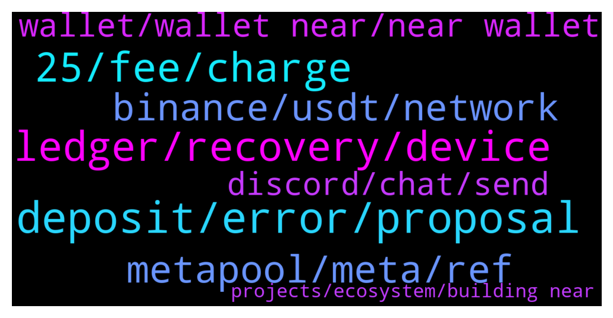

# **@cryptonear**
 ## Analysis for **2022-01-12** - **2022-01-13**.

---

## 📊 **Basic Stats**

**n_messages_sent**: 521

---

---

## 🔝 **Top keywords and related messages**

1. **deposit, error, proposal**

    @kv9990 --- *Try here =) https://app.ref.finance/  Check your deposit here. https://app.ref.finance/deposit* **--->** [TG Discussion](https://t.me/cryptonear/283375)

    @Lucaseki --- *I don't understand what is serve to deposit? but I Wrap NEAR, then it worked.* **--->** [TG Discussion](https://t.me/cryptonear/283382)

    @elgranfed --- *hi all! how long it takes for the funds I sent to my new account (through funding  address) to arrive, it's been like 10 minutes and still the status is "awaiting deposit". I sent the 1.1 near from kucoin* **--->** [TG Discussion](https://t.me/cryptonear/283008)

    @larry_lang --- *heyy there^^ sometimes the CEXs can put your withdraw onhold for a while, but it should be through in about 1 hour or less, and after 1 hour if the fund still doesnt go through then i think u should contact Kucoin for further assistance=)))* **--->** [TG Discussion](https://t.me/cryptonear/283026)

    @Gokubaba --- *Actually few hours ago only i staked everything in wallet and left 0.15 near thinking it would cover tons of transactions tbh. 😅 Now it will be a 52 hours wait if i withdraw* **--->** [TG Discussion](https://t.me/cryptonear/283585)

    @NEARverse_xd --- *Deposit near in ref finance. It will converted to wnear automatically* **--->** [TG Discussion](https://t.me/cryptonear/283372)

2. **ledger, recovery, device**

    @HODL_R --- *if I have the 24 word recovery phrase for my Lesger, will I be able to recover my NEAR assets for sure even if the Ledger device is lost or stolen,  is there a way to test this practically? Can I safely have 2 copies of the NEAR wallet secured by the same Ledger at the same time on 2 different machines to test this* **--->** [TG Discussion](https://t.me/cryptonear/283515)

    @Kripto_Raptor --- *but to integrate that ledgers keys into another device (ledger kinda thing) may require expertise* **--->** [TG Discussion](https://t.me/cryptonear/283525)

    @Kripto_Raptor --- *every data stored on the blockchain same with your ledger 😊, if you have that matching key you dont need that specific ledger device* **--->** [TG Discussion](https://t.me/cryptonear/283523)

    @Kripto_Raptor --- *but since the recovery option with Ledger requires you to connect your ledger device and sign it there https://wallet.near.org/sign-in-ledger as you can clearly see here* **--->** [TG Discussion](https://t.me/cryptonear/283542)

    @Kripto_Raptor --- *feel free to try it(try claiming two different wallets with same ledger) this might work* **--->** [TG Discussion](https://t.me/cryptonear/283521)

    @HODL_R --- *Is it safe to plug my Ledger into the wall socket or a phone charger to use the “Recovery Check” app that Ledger offers, I’m paranoid about keeping it plugged into my laptop with Ledger Live open* **--->** [TG Discussion](https://t.me/cryptonear/283526)

3. **25, fee, charge**

    @supersaiyan_goku --- *actually it does, everytime you connect to wallet It charge a small amout of Near* **--->** [TG Discussion](https://t.me/cryptonear/283307)

    @nino706 --- *I see everytime i connect dapp, it will cost fee. Not sure it is 0.25 or not. But if the Near price go much high about 100, the fee will very much* **--->** [TG Discussion](https://t.me/cryptonear/283318)

    @larry_lang --- *nope, it's giving the site permission to spend up to 0.25, but it wont charge 0.25N* **--->** [TG Discussion](https://t.me/cryptonear/283290)

    @a1sunny --- *Ops... Instead of earning.🙈   When i connecting my wallet to this website they charging me 0.25 Near as a networkfee...* **--->** [TG Discussion](https://t.me/cryptonear/284223)

    @nino706 --- *Hello, everytime i log in again, it cost me 0.25 near. And if I use other computer connect to some dapp, it also cost 0.25 near. Is that right?* **--->** [TG Discussion](https://t.me/cryptonear/283283)

    @larry_lang --- *but they wont take 0.25 per connection* **--->** [TG Discussion](https://t.me/cryptonear/284225)

4. **metapool, meta, ref**

    @GeorgePro1 --- *1. MetaPool (https://metapool.app/dapp/mainnet/meta/#)  distributes the tokens proportionally to the validators, so no worries which validator to choose. 2. You still get ~11% APY on your $NEAR, and withdraw NEAR whenever you want without waiting (with fee). 3. On top of that you get MetaPools $META token payed out daily 4. You get stNear which can be used on other DeFi applications such as app.ref.finance* **--->** [TG Discussion](https://t.me/cryptonear/284041)

    @iamkemoo --- *You can stake you stNEAR on DeFi protocols such as Ref Finance (https://app.ref.finance/), or use OIN Finance (https://near.oin.finance/) to mint $nUSDO and stake the $nUSDO to get $META and $OIN tokens as rewards.* **--->** [TG Discussion](https://t.me/cryptonear/283205)

    @kv9990 --- *You'll need to stake minimum 1 $NEAR on metapool* **--->** [TG Discussion](https://t.me/cryptonear/284151)

    @rhinohq8992 --- *why the liquid unstake fee on metapool increasing ?* **--->** [TG Discussion](https://t.me/cryptonear/284281)

    @FritzWagner --- *If you are going to stake some Near take a look on Metapool.app* **--->** [TG Discussion](https://t.me/cryptonear/282750)

    @rob0008 --- *What’s the best way to make gains on stNear holdings ?  I have it on metapool .  What’s the best plays for defi gains with near ?* **--->** [TG Discussion](https://t.me/cryptonear/283204)

5. **binance, usdt, network**

    @phongcaca0711 --- *i don't know if it is distributed in binance wallet or near wallet* **--->** [TG Discussion](https://t.me/cryptonear/283071)

    @marcNear --- *coinbase pays out my winnings and not binance 😄🤷‍♂️* **--->** [TG Discussion](https://t.me/cryptonear/282968)

    @masstahcoiner --- *i bought near on binance  must move to ref finance =)  cannot becouse of binance stupidity agian* **--->** [TG Discussion](https://t.me/cryptonear/284312)

    @masstahcoiner --- *it's happening weekly/monthly  and as reputation of binance exchange and l33t near team  i am sure you have some communication with binance dev support team* **--->** [TG Discussion](https://t.me/cryptonear/284328)

    @FaisalRobbiR --- *My near gift from binance is invalid , solved?* **--->** [TG Discussion](https://t.me/cryptonear/283791)

    @iamkemoo --- *Yeah, but that's up to you. Only we as a community make presure by opening a lot of tickets on Binance. But we as Near have nothing to do with the technical problem which Binance has.* **--->** [TG Discussion](https://t.me/cryptonear/284327)

6. **wallet, wallet near, near wallet**

    @Gokubaba --- *I will remember it from now onwards😅.  Not much sure on what is the minimum requirements for near wallet.  As last time i checked transaction fees on near were less than a cent around 0.0001 near* **--->** [TG Discussion](https://t.me/cryptonear/283588)

    @iforbusiness2 --- *we have only web wallet https://wallet.near.org/* **--->** [TG Discussion](https://t.me/cryptonear/283190)

    @Raju550 --- *Is near have any apk wallet* **--->** [TG Discussion](https://t.me/cryptonear/283187)

    @TheGo1denBull --- *Can you add more Near in your wallet and see if it works?* **--->** [TG Discussion](https://t.me/cryptonear/283579)

    @a1sunny --- *And does near also have mobile wallet?* **--->** [TG Discussion](https://t.me/cryptonear/284159)

    @TheGo1denBull --- *https://wallet.near.org/buy to buy NEAR from certain avenues. Idk why email isn't working to create the wallet.* **--->** [TG Discussion](https://t.me/cryptonear/282752)

7. **discord, chat, send**

    @TheGo1denBull --- *That person isn't in our chat anyway.* **--->** [TG Discussion](https://t.me/cryptonear/282674)

    @larry_lang --- *may i ask what is adm?* **--->** [TG Discussion](https://t.me/cryptonear/284148)

    @bailey_12 --- *Hey guys, sorry for being this late but  https://twitter.com/BaileyVu12/status/1481259950559338497  JOIN WITH ME NOWWW* **--->** [TG Discussion](https://t.me/cryptonear/283362)

    @vlhai --- *konichiwa, a Japanese chat on discord, we have one: https://discord.gg/hq8ZQFmH* **--->** [TG Discussion](https://t.me/cryptonear/283869)

    @larry_lang --- *hmm u can feel free to ask about it here or send a DM to one of the mods here^^* **--->** [TG Discussion](https://t.me/cryptonear/284211)

    @Kripto_Raptor --- *Hey James you can DM me* **--->** [TG Discussion](https://t.me/cryptonear/284195)

